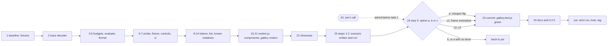

# ghost signal v0.2 implementation plan

> **For agentic workers:** REQUIRED SUB-SKILL: Use superpowers:subagent-driven-development (recommended) or superpowers:executing-plans to implement this plan task-by-task. Steps use checkbox (`- [ ]`) syntax for tracking.

**Goal:** take `/Volumes/T7/ghost-signal` from v0.1.0 to a green `feat/v0.2` at version `0.2.0`: hybrid motion (space eases on the compositor, signal stays stepped) and a feel harness that fails ci on jank, ready for joe to look at and tag.

**Architecture:** measurement lands first. a standalone baseline script proves what a github runner can hold, then the harness is built as pure node modules (`src/feel/trace.js`, `budgets.js`, `evaluate.js`, `format.js`) under unit tests, then an in-page probe and a playwright fixture that only use what a test hands them. with the harness green on planted controls, the known violations get fixed (hover transitions, flare, mosh, toast stack, decode width, gallery load shift), then `src/motion.js` and `src/motion.css` add the spatial half, and the gallery scenario goes green under the harness. everything stays plain es modules and css with zero runtime dependencies.

**Tech Stack:** node 26.5 locally (ci runs node 24), `node:test`, `@playwright/test` 1.58.2 with its chromium 145.0.7632.6 headless shell (`chromium_headless_shell-1208`, already installed), the chrome devtools protocol through `page.context().newCDPSession(page)`, docker `node:24` for linux loops, ffmpeg 8.0.1 at `/opt/homebrew/bin/ffmpeg` for the showcase, `gh` for ci runs.

**Spec:** `/Volumes/T7/ghost-signal/docs/superpowers/specs/2026-09-24-ghost-signal-v0.2-design.md` (approved 2026-09-24 with every open-question default). the executor reads the spec and this plan together.

**Scope:** this repo, branch `feat/v0.2` (head `23fe5e0`), from the approved spec through the `0.2.0` version bump. the tag is joe's (spec 15 step 9). seance is out of scope (spec 12 and 15 step 10 are a separate plan).

**Before task 1:** decision d1 (below, "joe's call before execution") goes to joe first. tasks 1 to 22 don't depend on it and may run while he decides; task 23 step 3 onward and task 24 wait for his answer.

## global constraints

every task's requirements include this section.

- the repo is `/Volumes/T7/ghost-signal`, branch `feat/v0.2`. draft pr https://github.com/StressTestor/ghost-signal/pull/3 runs ci on every push.
- push only with `git push origin feat/v0.2`, plain, never `--force`, and only when a task needs ci on ubuntu. never push anything else, never touch `main`, never merge, never tag, never edit the pr.
- stage by explicit path. never `git add -A` or `git add .`.
- scratch goes under `/Volumes/T7/ghost-signal/.superpowers/sdd/2026-09-24-ghost-signal-v0.2/` (git-ignored through `.superpowers/`). nothing under it is ever committed.
- commits are conventional: `type(scope): description`, lowercase, imperative, no period. the body says why. every commit ends with the trailer `Co-Authored-By: Claude Opus 5.5 <noreply@anthropic.com>`.
- `@playwright/test` stays pinned at `1.58.2`. never run `playwright install` under node 26 (its browser extraction hangs forever). the headless shell `chromium_headless_shell-1208` is installed locally. ci runs node 24.
- a bash command containing the word "sentinel" or the two characters `->` can be blocked by a PreToolUse hook. put such a command in a script file under the scratch dir and run the file.
- no mission control posts, no `~/.claude/mc-outbox.jsonl`, no subagents spawned from inside a task.
- copy, docs and failure text: lowercase headings, no em dashes, no exclamation points. comments may be deadpan ghost voice (this is joe's private project) but must state a true constraint.
- the gates before every commit, run from the repo root after staging (so `git diff --exit-code` compares fresh generator output against what is staged): `npm run gen && git diff --exit-code`, `npm test`, `npm run check`, `npm run e2e`, and `npm run feel` from task 6 on. every task leaves every gate green. that includes task 23: `test/feel/gallery.feel.js` is committed only once it passes under the option joe picked for d1, and task 24 runs only after task 23's commit. if d1 has no answer when task 22 is done, execution pauses there, every gate green, nothing red committed.
- a commit that changes what `ARCHITECTURE.md` describes (a directory or script in its tree, a command, a ci step, a key pattern) updates it in the same commit, last-updated line included. tasks 1, 2, 6, 7, 9, 15 and 22 carry that step explicitly; task 24 writes the prose that needs the whole release.
- nothing animates a property other than `transform` or `opacity` (spec 3.2). space is eased with `--gs-ease-*`, signal is stepped with `--gs-step-*` or `steps()`. one carrier per family per element. no overshoot: every cubic-bezier y stays inside 0..1.
- the m5 profile is 1470x956 css px, `deviceScaleFactor: 2`, 60hz. the feel budgets are `frame 16.7ms`, `input 50ms`, `task 50ms`, `answer 50ms`, `shift 0`, `settle 1000ms`, `runs 3`, `vsyncMiss 1.5`, properties `transform` and `opacity`. budgets only tighten. there is no loosening knob.
- zero runtime dependencies. no file under `src/feel/` imports `@playwright/test`.
- ghost signal keeps every generated file committed: `src/tokens.css`, `gen/*`, `src/icons.svg`, `src/icons.js`, `gallery/apps/probe/flavor.css`, `gallery/apps/probe/flavor.js`. edit `tokens.json` or a grid, never a generated file.

## what the planning spikes pinned

the spikes ran from scratch on 2026-09-24 against the pinned stack (chromium 145.0.7632.6 headless shell, dpr 2, 1470x956) and answered the api questions the spec leaves open. nothing from them is in the repo; task 1 turns the relevant ones into committed fixtures.

| question | answer | where it lands |
|---|---|---|
| where the gallery load shift comes from (spec p22, "first thing to try: fonts.ready") | not doto. first paint at 80ms shows empty sections, the deferred `gallery.js` module fills them at 131ms (faces grow 46 to 274px), the shift lands at 136ms, fonts are ready at 148ms. measured value 0.33 at the m5 profile (the spec's 0.43 was a different viewport). `html:not([data-gallery-ready]) body { visibility: hidden; }` removes it: zero `layout-shift` entries, with the positive control (the observer registered, the style present). first contentful paint moves to after `mountProbe` | task 14 |
| `bad-composite` reason bits | a transform web animation on an inline `span`: `compositeFailed: 1056` = bit 10 (transform cannot be accelerated on the target) + bit 5 (target has invalid compositing state). a `background-color` web animation reports `0` on chromium 145 (it composites background color), so the property check, not the composite check, is what catches it | task 7 `bad-composite.html`, task 2 decoder |
| does the trace carry a web animation's `id` | no. the `Animation` begin event carries `nodeName` (uppercase, like `SPAN id='inl'`), `nodeId`, and `displayName` (the css animation name, empty for web animations and transitions). so the family check reads the probe's capture, and the composite check attributes by `nodeName` plus `displayName` | tasks 2, 4 |
| thread and pid layout | `TracingStartedInBrowser.args.data.frames[]` with `isOutermostMainFrame: true` names the renderer `processId`. `RunTask` and `BeginMainThreadFrame` live on the renderer's `CrRendererMain` tid. `EventLatency` lives on the renderer's `Compositor` thread. `PipelineReporter` comes from both the browser pid and the renderer pid. trace.js filters `EventLatency`, `PipelineReporter` and `Animation` by renderer pid only, and `RunTask`, `BeginMainThreadFrame` and the child events by pid and main tid | task 2 |
| event shapes | `RunTask` is `ph: 'X'` with `dur` and `tdur` (µs). `BeginMainThreadFrame` is `ph: 'I'`. `Animation` is async (`ph` `b`, `n`, `e`) keyed by `id2.local`, the verdict arrives in an `n` event as `args.data.compositeFailed`. `EventLatency` is async `b`/`e` keyed by `id2.local`, type in `args.event_latency.event_type` (`MOUSE_PRESSED`, `MOUSE_RELEASED`). a fast `keyboard.press` produced no `KEY_PRESSED` latency in the spike, so `EventLatency` is corroboration only | task 2 |
| clock mapping | a `performance.mark` lands as `cat: 'blink.user_timing'`, `ph: 'I'`, with `args.data.startTime` (performance.now ms) beside `ts` (µs). the offset is `ts / 1000 - startTime`, read directly | task 2 |
| `performance.eventCounts` | `pointerdown`, `click` and `keydown` each go 0 to 1 across one `locator.click()` and one `keyboard.press()` | task 6 apparatus check |
| fixture size | the raw one-second trace is 506kb. filtered to the event names trace.js reads plus user timing and metadata it is 1101 events, 201kb | task 1 |
| video in the headless shell | `recordVideo` at 1470x956 writes webm (about 128kb per second of gallery). playwright's `ffmpeg-1011` is installed | task 22 |

## what the planning dry run proved

after writing, the code blocks of tasks 1 to 21 were applied to scratch copies of the repo (never the repo) and run on the m5: the fixture recorder and every `src/feel` unit test (50 green), the 15 harness controls in the feel project (15 green, each negative firing its own check on its own step, the self test seeing input, task and shift), tasks 8 to 20 over the existing suites (106 unit and 77 e2e green, `contrast ok`, `lint-motion` silent on all three sheets, swift and rust byte-identical), and the gallery work of tasks 14 and 21 (gallery specs green). the fixes that run found are already folded into the tasks below. after the plan review, tasks 1 to 7 were extracted from this revision into a fresh scratch tree and run again the same way (2026-09-25): the recorder wrote all three fixtures (the `reuse` one with three animations on one id), 55 `src/feel` unit tests and 19 harness tests green. task 23 step 3's option c1 code was applied on top and its unit tests and control passed too.

the gallery scenario (task 23) was then run in that scratch tree with `GS_FEEL_RUNS=1`, and a second pass on 2026-09-25 took its failures apart. four findings changed this plan:

1. most of the composite bit 6 failures were a decoder bug. chromium reuses an `Animation` event's `id2.local` as soon as the previous animation's `e` lands (a three-animation recording on chromium 145 used `0x1a` for all three), and task 2's first `compositeResults` merged every event under one id into one record, OR-ing the bits and keeping the latest node name. the toast slot's bit 6 bled into whatever drew the same id next: the view body and the tab indicator in `calm`, the `gs-face` glitches in `g1-light`. with a record opened on each `b` and closed on its `e`, those attributions vanish. task 2 now decodes that way and pins it on a recorded fixture.
2. one bit 6 was real. `enter()` left its finished `fill: none` animation attached to the slot, and when the restack transition started on the same slot, chromium 145 kept that transition on the main thread (bit 6: a web animation outranks a css transition in composite order, finished or not, until it's cancelled or collected). a scratch control reproduced it three runs in three, and cancelling the animation when it lands removes it, also three in three. tasks 15 and 16 now cancel on finish, task 7 plants the pattern as a negative control, and task 15 commits the positive one. with both fixes the scratch gallery reported "all composited" on all five entries, and `calm` and `still` passed.
3. the theme and glitch frames are the page's own cost. task 23's first draft read them as tracing overhead, from a flip timed four times inside one `evaluate` (3 to 5ms after the first, on warm style caches). timed the way a person flips, one click per fresh page with 300ms around it and nothing traced, the flip's style recalc alone costs 10.7 to 17.0ms. that is decision d1 below.
4. the frame check's `inside:` line named the wrong frame's work. `frameCosts` counts a task's cpu in the interval where the task starts, which is a hair before the `BeginMainThreadFrame` it emits, but picked the heavy children by clock range, so they came from the next interval. the bad-frame control printed the probe's own `loop` and `sweep` for a 30ms rAF burn, and its `toContain('burn')` passed only because the step is called "burn ten frames". task 2 now takes the children from inside the counted tasks (the control then prints `FunctionCall test/feel/pages/bad-frame.html:16 burn 30ms x1`), and task 7 asserts on that line. the draft's "forced from (inline):7117 raf" on the theme frames was the same misattribution.

## joe's call before execution (decision d1)

spec 8.5 says there is no loosening knob and 7.4 says an exemption is right only when the page is doing what it should. the gallery's theme and glitch switches break the 16.7ms frame budget on the m5 itself, with or without the trace, and no fix that keeps the steps and the budget is known. that call is joe's, and the numbers exist now, so it goes to him before task 1 instead of at task 23.

measured on the m5 on 2026-09-25 (chromium 145.0.7632.6 headless shell, 1470x956 @2x, the scratch tree with every task 1 to 21 change, the theme and glitch splits from task 23 step 3, and the two composite fixes). scripts under `.superpowers/sdd/2026-09-24-ghost-signal-v0.2/bit6/`:

| measurement | theme light | theme dark | glitch 2 | glitch 1 |
|---|---|---|---|---|
| style recalc forced right after the click, no probe, no trace (median of 5 fresh pages, `recalc.mjs`) | 15.3ms | 12.0ms | 16.2ms | 13.1ms |
| the same with the probe installed | 15.4ms | 12.6ms | 16.3ms | 13.6ms |
| the same with the probe and the full trace | 14.1ms | 10.8ms | 16.1ms | 13.1ms |
| the attribute set from `evaluate` with no input, 300ms apart (`evalflip.mjs`) | 16.7ms | 13.2ms | 12.5ms | 13.5ms |
| over-budget frames in the traced gallery scenario (main-thread cpu, `GS_FEEL_RUNS=1`, two passes over `g1-dark`, `g2-dark`, `g1-light`) | 17.3 to 23.8ms | 17.7 to 23.5ms | 17.1 to 20.2ms | 17.0 to 20.8ms |

a given flip lands under 16.7ms in one pass and over in the next often enough that the three-run median fails it anyway. the controls held too: a click that changes nothing (the `h2` heading, the theme button of the theme already set) reads 0.0 to 0.2ms through the same timer. the worst traced frame splits into one input task of 14.2ms (an `UpdateLayoutTree` of 10.7ms over 3730 elements, the pointer listeners, 1.8ms of layout and prepaint) and a 3.3ms paint, layerize and commit task. tracing and the probe move the recalc by about 1ms either way, so the traced 17 to 24ms is the flip plus its paint.

tried, and it didn't move the recalc (so nobody tries these again): `content-visibility: auto` on the 300 list rows or on every gallery section, removing `#motion-list` outright (303 elements), and trimming the trace to the gate categories (frames stayed at 17.9 to 24.4ms). devtools selector stats put selector matching at 0.9 to 1.1ms of a 14.6 to 19.7ms recalc, so nearly all of the cost is style resolution over every element. seance's `c` calm toggle flips the same `data-glitch` on `:root`, so every app with a big page hits this.

the options, and what tasks 23 and 24 do under each:

| option | what it means | task 23 | task 24 |
|---|---|---|---|
| a. a cheaper flip | cut what a whole-page restyle costs in ghost signal's css and components until the traced frame fits | task 23 step 3's option a paragraph: measure per element and per stylesheet what the recalc spends (a `disabled-by-default-blink.debug` selector-stats and element-count pass, then one lever at a time: the component stylesheets' custom property reads, the universal `::before`/`::after`/`::selection`/`::-webkit-scrollbar` rules, the inherited token count), each lever judged by step 3's recalc timer and the traced frame. success is the scenario green with no exemption. no lever is known today, so the step is time-boxed to one working session; if nothing gets every theme and glitch frame under 16.7ms three runs in a row, stop and go back to joe with the lever table | as written |
| b. trace-free measurement for recalc-bound frames | judge a frame whose trace cost is mostly `UpdateLayoutTree` by an untraced in-page timer instead of trace `tdur` | changes spec 7.7's frame source and 8.4's cpu-over-wall rule, so it needs the spec edit first. the numbers above say it doesn't reach green: untraced, the recalc alone is 10.7 to 17.0ms before the ~2ms of input dispatch and the ~3ms of paint. if joe picks it anyway, the step implements it, reruns, and comes back to joe with the untraced frames | waits for the result |
| c. joe's call on those steps | c1: a per-step frame exemption, `{ frame: false, why }`, with the same rules as `answer: false` (it needs a why, prints in every report, and fails the test when no run used it, so the day the flip fits the budget the exemption has to go). c2: the theme and glitch steps leave `gallery.feel.js` with the numbers recorded in the spec. c3: joe changes 8.5 | c1: task 23 step 3's c1 paragraph (probe, playwright, evaluate, format, their unit tests and a control), then the six theme and glitch steps carry it (four in the full set, two in the light set). c2: the scenario drops those six steps, and the commit body quotes joe. c3: whatever joe writes into 8.5 | c1: the readme's feel section documents `{ frame: false, why }`. c2, c3: the readme says which steps aren't held and why |

recommendation: c1 for 0.2.0, with option a as its own follow-up. c1 keeps joe's 16.7ms, makes the hitch visible in every report, and can only ratchet: an unused exemption fails, so it can't outlive the cost it names. option a is worth doing, but it's open-ended and every app's flip benefits from it, which makes it a release of its own. d1 is joe's call and nothing in task 23 step 3 onward runs until he makes it.



## deviations from the spec, decided up front

- `validateMotion` validates an explicit list, `SPATIAL_MOTION = ['enter', 'exit', 'view', 'shift', 'indicator', 'value']`, for whole-frame durations. spec 5.5 says "a motion key with an ease entry", which only catches `enter` and `exit` since `view`, `shift`, `indicator` and `value` have no same-named ease. the list is the intent the spec states in 5.1.
- `stackOffsets(heights, gap)` is exported from `src/components/toast.js`, not `motion.js`, and tested in `test/unit/toast.test.js`. the toast slots land (task 13) before `motion.js` exists (task 15), and the function is the toast's own geometry.
- the ambient exclusion in the probe is narrower than "the ambient `.gs-glitch` toggles": it drops `class` and `data-t` mutations on `[data-gs-ambient]` elements only, because a bypass toast's `glitchOnce` toggles the same class on its item and that one is an answer. `gs-face[data-frame]` counts as ambient only when the old or new value is `blink`. every `data-drawn` mutation is dropped (a mosaic sets it on each redraw, which only follows another mutation). everything inside `gs-wallpaper`, `gs-tape` and `[data-gs-ambient-source]` is dropped.
- the `still` mode check and every other check run on the probe's capture, and the probe records animations only while armed. shifts are recorded from install, so load shifts after first paint land in the `load` pseudo step.
- `bad-task.html` "must report task only" is read as "task, and no input or answer check", because the step is an event step. the 70ms task also sits inside one frame interval, so the frame check fires too, which is correct: the main thread did miss that frame.
- `feel.measure()` is async and resolves to `{ stop() }`, since arming the probe and starting a trace are both async.
- `feel.scenario` resolves to the array of reports (one per matrix entry) when everything passes, so a control test can assert on a passing report.
- the drawer controller's `play` takes an optional `height` and `from` per call (`play({ inner, followers, open, from, height })`), because a `gs-row`'s detail height varies per row. `drawer({ height })` still sets the default seance uses.
- `indicator` moves along one axis and stretches along the same axis: `axis: 'x'` writes `translateX(x) scaleX(w / 100)`, `axis: 'y'` writes `translateY(y) scaleY(h / 100)`. the cross-axis size comes from css, so a 3px accent bar stays 3px thick. its first placement uses `data-gs-still` plus one forced style read instead of waiting a frame, which gives the same no-slide-in result.
- the version bump also moves the six unit fixtures that pin `"ghostSignal": "^0.1"` to `"^0.2"`, and `flavor-bad-range.json` from `^0.2` to `^0.3` (its test asserts a range that excludes the installed version). spec 11 lists only the probe app; without these, `npm test` fails at the bump.
- task 1 writes its results into the spec as a new section 8.7, since they decide numbers the spec left open.
- the composite bit 6 fix has no task of its own. the plan review asked for one before task 23 to find the cause; the cause is found (the three findings above), so the fixes land in the tasks that write the code: the decoder in task 2, `enter` and `flip` cancelling on finish in tasks 15 and 16, the negative control in task 7 and the positive one in task 15. a separate task would rediscover what's already known and patch code two tasks after it was written.
- the one-carrier rule stays space against signal, as spec 3.2 writes it. two space animations on one element are caught by the composite check (bit 6), now attributed to the right element, and task 7's `bad-overlap` control proves the check sees it.
- `mode: 'calm'` gets the same guard spec 7.4 gives `still`: a calm run whose page isn't at `data-glitch="0"` when armed throws `GsFeelUnevaluable`, since its glitch 0 rules would otherwise pass on a page where they can't fire. the probe's `arm()` returns the apparatus snapshot, so visibility (spec 8.2 says "when arming"), reduced motion and the glitch level are all checked at arm time, not only after setup.
- the fixture waits until 600ms have passed since the warm-up's `Shift` before arming. chrome keeps `hadRecentInput` true for 500ms after a discrete input (spec 7.7), and without the gap a shift in the first step can be excused by the warm-up's own keypress.
- the probe records the animations already running when it arms (spec 7.5 wants their properties and families checked) but never counts them as an answer, and an animation found by the sweep only answers when it started after the input.
- the composite check has its own apparatus check: a run where the probe saw an animation start while armed and the trace holds no `Animation` event at all throws `GsFeelUnevaluable`, so a trace that lost `blink.animations` can't print "all composited".
- an unevaluable scenario attaches `feel-<scenario>-<matrix>.json` with `result: 'unevaluable'` next to the text (spec 7.9), and every report's runs carry their shifts, animations and answers, not only counts.
- `scripts/sync-ghost-signal.sh` also copies `tokens.json`, since `src/feel/budgets.js` reads the budgets from it and a vendored copy without it can't run the harness (spec 7.1 assumed `src/` was enough).
- the ci job's `timeout-minutes` goes from 20 to 40 (the step caps add up to 31 minutes plus setup), and both baseline steps get `continue-on-error: true`, since spec 8.6 calls them informational.
- the family check judges an animation's curve segment by segment, not its list of easings. spec 7.7 calls 'event eased' "a signal animation with a non-`steps()` easing"; read literally over `getKeyframes()` that fails `0:steps(3) 1:ease`, whose `ease` sits on the last keyframe and covers no segment, and a step-end transition, whose keyframes read `linear` under a `steps(1)` effect. what's enforced is spec 3.2's intent: a signal fails when any part of its curve eases, a space animation fails when any part of it steps, and a curve with both fails in either family. the rows behind it are in task 3.

## file structure

```
ghost-signal/
  tokens.json                         + motion enter exit view shift indicator value, hover 0ms,
                                        ease enter exit move, distance group, feel group
  package.json                        e2e = --project=chromium, feel, showcase scripts, version 0.2.0
  playwright.config.js                chromium, feel and showcase projects
  .github/workflows/ci.yml            feel baseline (informational), feel step, report artifacts, job cap 40
  .gitignore                          + gallery/showcase/
  ARCHITECTURE.md                     updated by every task that adds structure, finished in task 24
  scripts/
    sync-ghost-signal.sh              + copies tokens.json (the feel budgets)
    feel-baseline.js                  new: clean control n times, one json line of runner numbers
    record-feel-fixtures.js           new: dev script, records the chromium 145 fixture traces
    showcase-clips.sh                 new: webm recordings to mp4 clips and stills
    ghost-signal.js                   + lint-motion subcommand
    check-contrast.js                 + scans src/motion.css
    lib/tokens.js                     + distance, feel budgets table, deprecation note, validateMotion
    lib/contrast.js                   cssRules records enclosing at-rules as parents
    lib/motion-lint.js                new: the static twin of the property and family checks
  src/
    motion.css                        new: every spatial css rule, inside no-preference
    motion.js                         new: motionAllowed enter exit enterView flip drawer indicator
    base.css                          no transitions, press, overlay centering, data-leaving, toast
                                        slots, row clip, decode size holder, indicator base rules
    fx.css                            gs-event-* keyframes, flare and mosh rewrites
    gs.js                             moshOnce passes data-t (fxOnce and motionMs only if flagged)
    components/palette.js window.js toast.js row.js decode.js
    feel/
      errors.js                       GsFeelConfigError GsFeelUnevaluable GsFeelError
      budgets.js                      loadBudgets mergeBudgets and the pure rules
      trace.js                        trace events to renderer frames, tasks, composites, marks
      evaluate.js                     one run to violations, runs to a report (median logic)
      format.js                       report to the failure text
      probe.js                        in-page recorder, installProbe and PROBE_VERSION
      playwright.js                   withFeel feelFixture feelProject feelUse FEEL_PROFILES
      index.js                        re-exports the pure parts
  gallery/index.html gallery.js       motion.css, motion section, query params, load shift fix
  test/
    unit/feel-trace.test.js feel-budgets.test.js feel-evaluate.test.js feel-format.test.js
    unit/feel-probe.test.js feel-index.test.js
    unit/motion-lint.test.js motion.test.js toast.test.js
    unit/fixtures/feel/*.trace.json   click-70ms composite reuse, recorded by scripts/record-feel-fixtures.js
    unit/fixtures/motion-lint/*.css   one bad sheet per lint rule
    unit/fixtures/tokens-bad-motion.json
    e2e/motion.spec.js toast.spec.js  new. row.spec.js decode.spec.js gallery.spec.js grow
    e2e/pages/motion.html toast.html drawer.html
    feel/harness.spec.js              positive and negative controls, selfTest
    feel/gallery.feel.js              the real scenario
    feel/pages/*.html                 clean transform-no-shift bad-* (bad-overlap included) untrusted,
                                        enter-restack (the one control that loads ghost signal)
    showcase/motion.showcase.js       video walk of every motion at glitch 0, 1, 2
```

## shared names (use verbatim in every task)

| module | exports |
|---|---|
| `src/feel/errors.js` | `GsFeelConfigError`, `GsFeelUnevaluable`, `GsFeelError` (has `.report`) |
| `src/feel/budgets.js` | re-exports the three errors, `parseDuration(v)`, `loadBudgets(url?)`, `mergeBudgets(base, overrides)`, `isVsyncMiss(delta, interval, factor)`, `worstInteraction(entries)`, `isUnpromptedShift(shift, limit)`, `animatedProperties(record)`, `familyOf(record)`, `isStepped(record)`, `isEased(record)`, `BOOKKEEPING_KEYS` |
| `src/feel/trace.js` | `TRACE_CATEGORIES`, `COMPOSITE_IGNORED`, `rendererPid(events)`, `mainThread(events, pid)`, `topLevelTasks(events, pid, tid)`, `beginFrames(events, pid, tid)`, `childEvents(events, pid, tid)`, `compositeResults(events, pid)`, `decodeComposite(bits)`, `eventLatencies(events, pid)`, `userMarks(events, pid)`, `clockOffset(marks)`, `stepWindows(marks)`, `compositorDrops(events, pid)`, `summarizeTrace(events)`, `frameCosts(summary, start, end)` |
| `src/feel/evaluate.js` | `REPORT_VERSION`, `TIMING_CHECKS`, `DROPS_GATE`, `evaluateRun(budgets, run, { mode })`, `needsThirdRun(budgets, runs)`, `combineRuns(budgets, runs, meta)` |
| `src/feel/format.js` | `formatReport(report)` |
| `src/feel/probe.js` | `PROBE_VERSION`, `installProbe()` (owns `window.__gsFeel`) |
| `src/feel/playwright.js` | `FEEL_PROFILES`, `STEADY_MISSES`, `feelUse`, `feelProject(overrides)`, `feelFixture(options)`, `withFeel(test, options)` |
| `src/motion.js` | `parseMs(v)`, `parsePx(v)`, `offsetFor(side, distance)`, `retargetDuration(full, remaining)`, `drawerProgress(transformY, height, opening)`, `motionAllowed()`, `enter(el, opts)`, `exit(el, opts)`, `enterView(el, from)`, `flip(targets, mutate, opts)`, `drawer(opts)`, `indicator(container, opts)` |
| `src/components/toast.js` | `stackOffsets(heights, gap)`, `GsToast` |
| `scripts/lib/tokens.js` | adds `SPATIAL_MOTION`, `GsTokenError`, `wholeFrames(ms)`, `validateMotion(tokens)` |
| `scripts/lib/motion-lint.js` | `lintMotion(css, file)`, `expandGlobs(args)` |

the probe's samples object (returned by `window.__gsFeel.disarm()`) and the report object are defined once, in task 4 and task 6, and every later task uses those field names.

---
### task 1: baseline and fixtures

spec 15 step 1 and spec 8.6. the harness doesn't exist yet, so the baseline is a standalone script that launches chromium itself, runs the clean control 20 times at the m5 profile, and prints one json line. it runs on `ubuntu-latest` through the draft pr's ci and locally in docker. the fixture recorder writes the chromium 145 traces the task 2 unit tests read.

**Files:**
- Create: `test/feel/pages/clean.html`
- Create: `scripts/feel-baseline.js`
- Create: `scripts/record-feel-fixtures.js`
- Create: `test/unit/fixtures/feel/click-70ms.trace.json`, `test/unit/fixtures/feel/composite.trace.json`, `test/unit/fixtures/feel/reuse.trace.json` (generated by the recorder, committed)
- Modify: `.github/workflows/ci.yml` (informational baseline step and artifact, job cap)
- Modify: `ARCHITECTURE.md` (the two scripts, the baseline ci step)
- Modify: `docs/superpowers/specs/2026-09-24-ghost-signal-v0.2-design.md` (new section 8.7 with the numbers)

**Interfaces:**
- Consumes: nothing from earlier tasks.
- Produces: `test/feel/pages/clean.html` exposing `window.cleanInsert()` and `window.cleanToasts(n)`, a `#toggle` button (the `t` key presses it too), a `#scroller` with a scroll-driven edge. fixture files shaped `{ "chromium": "<version>", "traceEvents": [ ... ] }`. spec 8.7 holds four decisions later tasks read: `STEADY_MISSES` (task 6), `DROPS_GATE` (task 4), the ci dpr (task 6), the `bad-composite` bits (task 7).

- [ ] **Step 1: write the clean control page**

`test/feel/pages/clean.html`. it has no ghost signal imports on purpose: it must hold still while the harness and the library change under it.

```html
<!doctype html>
<html lang="en" data-glitch="1">
<head>
  <meta charset="utf-8">
  <title>feel control: clean</title>
  <style>
    body { margin: 0; padding: 24px; font: 13px system-ui, sans-serif; background: #050505; color: #eef1f2; }
    button { font: inherit; padding: 4px 12px; background: #0c0c0d; color: inherit; border: 1px solid #2a2c2f; }
    #toggle[aria-pressed="true"] { border-color: #0ec224; }
    #list { position: relative; margin-top: 16px; }
    #list > div { height: 28px; line-height: 28px; border-bottom: 1px solid #1e1f21; }
    #scroller { position: relative; height: 200px; overflow-y: auto; margin-top: 16px; border: 1px solid #1e1f21; }
    #scroller p { margin: 0; height: 24px; }
    #scroller .edge {
      position: sticky; top: 0; height: 1px; background: #2a2c2f;
      animation: clean-spatial-edge linear both; animation-timeline: scroll(nearest); animation-range: 0 24px;
    }
    #toasts { position: fixed; right: 16px; bottom: 16px; width: 320px; height: 0; }
    #toasts > div {
      position: absolute; right: 0; bottom: 0; width: 100%; height: 36px; background: #151517;
      transition: transform 200ms cubic-bezier(0.16, 1, 0.3, 1);
    }
    @keyframes clean-spatial-edge { from { opacity: 0; } to { opacity: 1; } }
  </style>
</head>
<body>
  <button id="toggle" aria-pressed="false">toggle</button>
  <div id="scroller"><div class="edge"></div></div>
  <div id="list"></div>
  <div id="toasts"></div>
  <script>
    // the clean control. every interaction here is one the feel budgets allow, so a harness that
    // reports anything on this page is measuring itself (¬‿¬)
    const toggle = document.getElementById('toggle');
    toggle.addEventListener('click', () => toggle.setAttribute('aria-pressed', String(toggle.getAttribute('aria-pressed') !== 'true')));
    // a fast key press gets no event timing entry at all (spec p5), so the key step in the clean
    // control proves the probe's own trusted-keydown and eventCounts path carries a key step alone
    document.addEventListener('keydown', (e) => { if (e.key === 't') toggle.click(); });
    const list = document.getElementById('list');
    for (let i = 0; i < 30; i++) list.append(Object.assign(document.createElement('div'), { textContent: `row ${i}` }));
    const scroller = document.getElementById('scroller');
    for (let i = 0; i < 60; i++) scroller.append(Object.assign(document.createElement('p'), { textContent: `line ${i}` }));
    // flip: measure, insert, animate transform from the old offset to zero. no layout shift (spec p9)
    window.cleanInsert = () => {
      const rows = [...list.children];
      const before = rows.map((r) => r.getBoundingClientRect().top);
      const row = Object.assign(document.createElement('div'), { textContent: 'new row' });
      list.prepend(row);
      rows.forEach((r, i) => {
        const dy = before[i] - r.getBoundingClientRect().top;
        if (dy !== 0) r.animate([{ transform: `translateY(${dy}px)` }, { transform: 'translateY(0px)' }], { duration: 200, easing: 'cubic-bezier(0.16, 1, 0.3, 1)', id: 'gs-move:flip' });
      });
      row.animate([{ opacity: 0 }, { opacity: 1 }], { duration: 167, easing: 'cubic-bezier(0.16, 1, 0.3, 1)', id: 'gs-move:enter' });
    };
    // toasts on transform slots: layout positions never change, so arrivals can't shift (spec p10)
    const toasts = document.getElementById('toasts');
    const restack = () => {
      const slots = [...toasts.children];
      let offset = 0;
      for (let i = slots.length - 1; i >= 0; i--) {
        slots[i].style.transform = `translateY(${-offset}px)`;
        offset += 36 + 8;
      }
    };
    window.cleanToasts = (n) => {
      for (let i = 0; i < n; i++) {
        toasts.append(Object.assign(document.createElement('div'), { textContent: `toast ${i}` }));
        restack();
      }
    };
  </script>
</body>
</html>
```

- [ ] **Step 2: write the baseline script**

`scripts/feel-baseline.js`. it carries its own small trace reader because `src/feel/trace.js` lands in task 2; task 2's last step swaps it over.

```js
#!/usr/bin/env node
// the clean control, n times, at the m5 profile: frame cpu, tracing overhead, stalls, compositor
// drops and the calibration spread as one json line. it gates nothing. it tells the feel budgets
// what a machine can hold before anyone judges an app by them (spec 8.6) (¬‿¬)
import { spawn } from 'node:child_process';
import { mkdir, writeFile } from 'node:fs/promises';
import { fileURLToPath } from 'node:url';
import { chromium } from '@playwright/test';

const root = fileURLToPath(new URL('..', import.meta.url));
const arg = (name, fallback) => {
  const hit = process.argv.find((a) => a.startsWith(`--${name}=`));
  return hit === undefined ? fallback : hit.slice(name.length + 3);
};
const RUNS = Number(arg('runs', '20'));
const DPR = Number(arg('dpr', '2'));
const PORT = Number(arg('port', '4174'));
const VIEWPORT = { width: 1470, height: 956 };
const CATEGORIES = [
  'disabled-by-default-devtools.timeline',
  'disabled-by-default-devtools.timeline.frame',
  'devtools.timeline',
  'blink.animations',
  'blink.user_timing',
  'input',
];

function serve() {
  return new Promise((resolve, reject) => {
    const child = spawn(process.execPath, ['scripts/serve.js'], {
      cwd: root,
      env: { ...process.env, PORT: String(PORT) },
      stdio: ['ignore', 'pipe', 'inherit'],
    });
    child.once('error', reject);
    child.once('exit', (code) => reject(new Error(`serve.js exited with ${code} before it was ready`)));
    child.stdout.on('data', (d) => { if (String(d).includes('serving')) resolve(child); });
  });
}

const pct = (xs, p) => {
  if (xs.length === 0) return 0;
  const s = [...xs].sort((a, b) => a - b);
  return s[Math.min(s.length - 1, Math.round(p * (s.length - 1)))];
};
const r1 = (n) => Math.round(n * 10) / 10;

// page side: both run through page.evaluate, so they close over nothing
function steadyFrames(n) {
  return new Promise((resolve) => {
    const ts = [];
    const tick = (t) => {
      ts.push(t);
      if (ts.length <= n) { requestAnimationFrame(tick); return; }
      const d = ts.slice(1).map((v, i) => v - ts[i]);
      const interval = [...d].sort((a, b) => a - b)[Math.floor(d.length / 2)];
      resolve({ interval, misses: d.filter((x) => x > 1.5 * interval).length });
    };
    requestAnimationFrame(tick);
  });
}
function calibrate() {
  const t = performance.now();
  let x = 0;
  for (let i = 0; i < 5_000_000; i++) x = (x + i * 7) % 1_000_003;
  return { ms: performance.now() - t, x };
}

async function traced(page, drive) {
  const cdp = await page.context().newCDPSession(page);
  const events = [];
  cdp.on('Tracing.dataCollected', (e) => { for (const v of e.value) events.push(v); });
  await cdp.send('Tracing.start', { transferMode: 'ReportEvents', traceConfig: { includedCategories: CATEGORIES, excludedCategories: ['*'] } });
  const out = await drive();
  const done = new Promise((r) => cdp.once('Tracing.tracingComplete', r));
  await cdp.send('Tracing.end');
  await done;
  await cdp.detach();
  return { events, out };
}

function analyze(events, startName, endName) {
  const started = events.find((e) => e.name === 'TracingStartedInBrowser');
  const pid = (started?.args?.data?.frames ?? []).find((f) => f.isOutermostMainFrame === true)?.processId;
  const tid = events.find((e) => e.ph === 'M' && e.name === 'thread_name' && e.pid === pid && e.args?.name === 'CrRendererMain')?.tid;
  if (pid === undefined || tid === undefined) throw new Error('trace has no renderer main thread. the trace format moved');
  const mark = (n) => events.find((e) => e.name === n && e.pid === pid)?.ts;
  const start = mark(startName);
  const end = mark(endName);
  if (start === undefined || end === undefined) throw new Error(`trace is missing the ${startName} or ${endName} mark`);
  const tasks = [];
  let edge = -Infinity;
  for (const t of events.filter((e) => e.name === 'RunTask' && e.ph === 'X' && e.pid === pid && e.tid === tid).sort((a, b) => a.ts - b.ts)) {
    if (t.ts < edge) continue;
    tasks.push({ ts: t.ts, dur: t.dur, tdur: t.tdur ?? t.dur }); // chromium drops tdur on 1us tasks
    edge = t.ts + t.dur;
  }
  const frames = events.filter((e) => e.name === 'BeginMainThreadFrame' && e.pid === pid && e.tid === tid && e.ts >= start && e.ts <= end).map((e) => e.ts).sort((a, b) => a - b);
  const cpu = frames.map((a, i) => {
    const b = frames[i + 1] ?? end;
    return tasks.filter((t) => t.ts >= a && t.ts < b).reduce((s, t) => s + t.tdur, 0) / 1000;
  });
  const inside = tasks.filter((t) => t.ts >= start && t.ts <= end);
  return {
    cpu,
    stalls: inside.filter((t) => t.dur > 50_000 && t.tdur <= 50_000).length,
    drops: events.filter((e) => e.name === 'PipelineReporter' && e.ph === 'b' && e.pid === pid && e.ts >= start && e.ts <= end
      && e.args?.frame_reporter?.state === 'STATE_DROPPED' && e.args?.frame_reporter?.affects_smoothness === true).length,
    composite: events.filter((e) => e.name === 'Animation' && e.pid === pid && typeof e.args?.data?.compositeFailed === 'number' && e.args.data.compositeFailed !== 0)
      .map((e) => e.args.data.compositeFailed),
  };
}

async function oneRun(browser, index) {
  const context = await browser.newContext({ viewport: VIEWPORT, deviceScaleFactor: DPR });
  const page = await context.newPage();
  await page.goto(`http://127.0.0.1:${PORT}/test/feel/pages/clean.html`);
  await page.evaluate(() => document.fonts.ready);
  const steady = await page.evaluate(steadyFrames, 30);
  const calOff = await page.evaluate(calibrate);
  const { events, out } = await traced(page, async () => {
    await page.evaluate(() => performance.mark('baseline:start'));
    const calOn = await page.evaluate(calibrate);
    await page.locator('#toggle').click();
    await page.evaluate(() => window.cleanInsert());
    await page.evaluate(() => window.cleanToasts(5));
    await page.locator('#scroller').hover();
    await page.mouse.wheel(0, 600);
    await page.waitForTimeout(400);
    await page.evaluate(() => performance.mark('baseline:end'));
    return { calOn };
  });
  await context.close();
  const a = analyze(events, 'baseline:start', 'baseline:end');
  return { index, steady, calOff: calOff.ms, calOn: out.calOn.ms, ...a };
}

async function compositeBits(browser) {
  const context = await browser.newContext({ viewport: VIEWPORT, deviceScaleFactor: DPR });
  const page = await context.newPage();
  await page.setContent('<span id="inl">inline span</span>');
  const { events } = await traced(page, async () => {
    await page.evaluate(() => performance.mark('bits:start'));
    await page.evaluate(() => document.getElementById('inl').animate([{ transform: 'translateX(0)' }, { transform: 'translateX(40px)' }], { duration: 200, id: 'gs-move:probe' }));
    await page.waitForTimeout(300);
    await page.evaluate(() => performance.mark('bits:end'));
  });
  await context.close();
  return analyze(events, 'bits:start', 'bits:end').composite;
}

const server = await serve();
const browser = await chromium.launch();
try {
  const runs = [];
  for (let i = 0; i < RUNS; i++) runs.push(await oneRun(browser, i));
  const frames = runs.flatMap((r) => r.cpu);
  const summary = {
    dpr: DPR,
    runs: RUNS,
    chromium: browser.version(),
    platform: `${process.platform} ${process.arch}`,
    steady: {
      runsWithAtMostOneMiss: runs.filter((r) => r.steady.misses <= 1).length,
      worstMisses: Math.max(...runs.map((r) => r.steady.misses)),
      intervalP50: r1(pct(runs.map((r) => r.steady.interval), 0.5)),
    },
    frameCpu: { p50: r1(pct(frames, 0.5)), p99: r1(pct(frames, 0.99)), max: r1(Math.max(...frames)), over16_7: frames.filter((f) => f > 16.7).length, frames: frames.length },
    tracingOverhead: {
      calOffP50: r1(pct(runs.map((r) => r.calOff), 0.5)),
      calOnP50: r1(pct(runs.map((r) => r.calOn), 0.5)),
      deltaP50: r1(pct(runs.map((r) => r.calOn - r.calOff), 0.5)),
    },
    stalls: runs.reduce((s, r) => s + r.stalls, 0),
    drops: runs.reduce((s, r) => s + r.drops, 0),
    runsWithDrops: runs.filter((r) => r.drops > 0).length,
    calibration: { min: r1(Math.min(...runs.map((r) => r.calOff))), p50: r1(pct(runs.map((r) => r.calOff), 0.5)), max: r1(Math.max(...runs.map((r) => r.calOff))) },
    cleanCompositeFailures: runs.reduce((s, r) => s + r.composite.length, 0),
    inlineSpanCompositeBits: await compositeBits(browser),
  };
  process.stdout.write(`feel-baseline ${JSON.stringify(summary)}\n`);
  await mkdir(`${root}test-results`, { recursive: true });
  await writeFile(`${root}test-results/feel-baseline-dpr${DPR}.json`, `${JSON.stringify({ summary, runs }, null, 2)}\n`);
} finally {
  await browser.close();
  server.kill();
}
```

- [ ] **Step 3: run the baseline locally for a smoke check**

Run: `node scripts/feel-baseline.js --runs=3 --dpr=2`
Expected: exit 0 and one line starting `feel-baseline {"dpr":2,"runs":3,"chromium":"145.0.7632.6","platform":"darwin arm64",` with `"cleanCompositeFailures":0` and `"inlineSpanCompositeBits":[1056]`, plus `test-results/feel-baseline-dpr2.json` on disk. these mac numbers are not the baseline; they prove the script runs. if `cleanCompositeFailures` is not 0, the clean page is wrong: fix the page before going on.

- [ ] **Step 4: write the fixture recorder**

`scripts/record-feel-fixtures.js`:

```js
#!/usr/bin/env node
// records the chromium traces the trace.js unit tests read, filtered to what trace.js consumes.
// dev only, run on demand. re-record after any @playwright/test bump and commit the result
// (spec 13, risk 3): a pinned chromium is what makes these files mean anything XX
import { mkdir, writeFile } from 'node:fs/promises';
import { chromium } from '@playwright/test';

const out = new URL('../test/unit/fixtures/feel/', import.meta.url);
const CATEGORIES = [
  'disabled-by-default-devtools.timeline',
  'disabled-by-default-devtools.timeline.frame',
  'devtools.timeline',
  'blink.animations',
  'blink.user_timing',
  'input',
];
const KEEP = new Set([
  'RunTask', 'BeginMainThreadFrame', 'PipelineReporter', 'Animation', 'EventLatency',
  'Layout', 'UpdateLayoutTree', 'Paint', 'FunctionCall', 'EventDispatch', 'TimerFire',
]);

const mark = (page, name) => page.evaluate((n) => performance.mark(n), name);
// an idle page only begins a main-thread frame when something asks for one. the feel probe's rAF
// loop asks every vsync, so the fixture pages run the same loop or their traces hold almost no
// BeginMainThreadFrame to judge
const RAF_LOOP = '<script>requestAnimationFrame(function tick() { requestAnimationFrame(tick); });</script>';

const PAGES = {
  'click-70ms': {
    html: `<!doctype html><html><body>
      <button id="slow">slow</button>
      <script>
        document.getElementById('slow').addEventListener('click', function slowclick() {
          const t = performance.now(); while (performance.now() - t < 70) {}
          document.body.dataset.clicked = '1';
        });
        document.addEventListener('keydown', function slowkey() {
          const t = performance.now(); while (performance.now() - t < 60) {}
        });
      </script>${RAF_LOOP}</body></html>`,
    async drive(page) {
      await mark(page, 'gs-feel:1:0:start');
      await page.locator('#slow').click();
      await page.waitForTimeout(200);
      await mark(page, 'gs-feel:1:0:end');
      await mark(page, 'gs-feel:1:1:start');
      await page.keyboard.press('a');
      await page.waitForTimeout(200);
      await mark(page, 'gs-feel:1:1:end');
    },
  },
  composite: {
    html: `<!doctype html><html><head><style>
      #hover { color: #eef1f2; background: #0c0c0d; transition: color 80ms ease-out; }
      #hover:hover { color: #0ec224; }
      #blk { width: 80px; height: 40px; background: #0ec224; }
    </style></head><body>
      <button id="hover">v0.1 hover</button>
      <div id="blk"></div>
      <span id="inl">inline span</span>
      ${RAF_LOOP}
    </body></html>`,
    async drive(page) {
      await mark(page, 'gs-feel:1:0:start');
      await page.locator('#hover').hover();
      await page.evaluate(() => {
        document.getElementById('inl').animate([{ transform: 'translateX(0)' }, { transform: 'translateX(40px)' }], { duration: 200, id: 'gs-move:inline' });
        document.getElementById('blk').animate([{ transform: 'translateX(0)' }, { transform: 'translateX(40px)' }], { duration: 200, id: 'gs-move:block' });
      });
      await page.waitForTimeout(400);
      await mark(page, 'gs-feel:1:0:end');
    },
  },
  // three animations one after another: chromium hands the second and third the id2.local the
  // first one freed, so a decoder keyed on the id alone merges three animations into one record
  reuse: {
    html: `<!doctype html><html><body>
      <div id="a" style="width:80px;height:40px;background:#0ec224">a</div>
      <p>an <span id="inl">inline span</span></p>
      <div id="b" style="width:80px;height:40px;background:#0ec224">b</div>
      ${RAF_LOOP}
    </body></html>`,
    async drive(page) {
      await mark(page, 'gs-feel:1:0:start');
      for (const id of ['inl', 'a', 'b']) {
        await page.evaluate((i) => document.getElementById(i).animate([{ transform: 'translateX(0)' }, { transform: 'translateX(40px)' }], { duration: 100, id: `gs-move:${i}` }), id);
        await page.waitForTimeout(300);
      }
      await mark(page, 'gs-feel:1:0:end');
    },
  },
};

async function record(browser, name, { html, drive }) {
  const context = await browser.newContext({ viewport: { width: 1470, height: 956 }, deviceScaleFactor: 2 });
  const page = await context.newPage();
  await page.setContent(html);
  await page.evaluate(() => new Promise((r) => requestAnimationFrame(() => requestAnimationFrame(r))));
  const cdp = await context.newCDPSession(page);
  const events = [];
  cdp.on('Tracing.dataCollected', (e) => { for (const v of e.value) events.push(v); });
  await cdp.send('Tracing.start', { transferMode: 'ReportEvents', traceConfig: { includedCategories: CATEGORIES, excludedCategories: ['*'] } });
  await drive(page);
  const done = new Promise((r) => cdp.once('Tracing.tracingComplete', r));
  await cdp.send('Tracing.end');
  await done;
  await context.close();
  const started = events.find((e) => e.name === 'TracingStartedInBrowser');
  const renderer = started?.args?.data?.frames?.find((f) => f.isOutermostMainFrame === true)?.processId;
  if (renderer === undefined) throw new Error(`${name}: no TracingStartedInBrowser with a main frame`);
  // other pids' RunTasks stay too, a few hundred of them, so the pid selection test has decoys
  const kept = events.filter((e) => e.ph === 'M' || e === started
    || (e.name === 'RunTask' && e.pid !== renderer && e.dur > 1000)
    || (e.pid === renderer && (KEEP.has(e.name) || e.cat === 'blink.user_timing')));
  const body = `{"chromium":${JSON.stringify(browser.version())},"traceEvents":[\n${kept.map((e) => JSON.stringify(e)).join(',\n')}\n]}\n`;
  await writeFile(new URL(`${name}.trace.json`, out), body);
  process.stdout.write(`wrote test/unit/fixtures/feel/${name}.trace.json (${kept.length} events)\n`);
}

await mkdir(out, { recursive: true });
const browser = await chromium.launch();
try {
  for (const [name, spec] of Object.entries(PAGES)) await record(browser, name, spec);
} finally {
  await browser.close();
}
```

- [ ] **Step 5: record the fixtures**

Run: `node scripts/record-feel-fixtures.js`
Expected: three lines, `wrote test/unit/fixtures/feel/click-70ms.trace.json (<n> events)`, `wrote test/unit/fixtures/feel/composite.trace.json (<n> events)` and `wrote test/unit/fixtures/feel/reuse.trace.json (<n> events)`, each file under 400kb (`ls -la test/unit/fixtures/feel/`).

Run: `node -e "const e=require('./test/unit/fixtures/feel/reuse.trace.json').traceEvents.filter(x=>x.name==='Animation'&&x.ph==='b');console.log(e.length, new Set(e.map(x=>x.id2.local)).size)"`
Expected: `3 1` (three animations, one shared id), as the planning spike recorded (`0x1a` three times). `3 3` means this chromium stopped reusing ids; the task 2 reuse test then still passes, and the scratch notes record it.

Then check what the task 2 tests will pin:

Run: `grep -o '"compositeFailed":[0-9]*' test/unit/fixtures/feel/composite.trace.json | sort | uniq -c`
Expected: one `"compositeFailed":1056` (the inline span), one `"compositeFailed":8224` (the v0.1 color hover, spec p15) and one or more `"compositeFailed":0`. write the exact values down in the scratch notes (`.superpowers/sdd/2026-09-24-ghost-signal-v0.2/notes.md`); task 2's tests assert them.

Run: `grep -o '"event_type":"[A-Z_]*"' test/unit/fixtures/feel/click-70ms.trace.json | sort | uniq -c`
Expected: at least one `"event_type":"MOUSE_PRESSED"`.

- [ ] **Step 6: add the informational baseline step to ci**

in `.github/workflows/ci.yml`, change the job's `timeout-minutes: 20` to:

```yaml
    # the step caps add up to 31 minutes (install 8, e2e 10, feel 10 from task 7, baseline 3) plus
    # about 5 of npm ci, gen, unit and contrast. 20 would kill a run whose every step is inside its cap
    timeout-minutes: 40
```

then, after the `npm run e2e` step and before the screenshot upload, add:

```yaml
      # informational: what a github runner can hold on the clean control (spec 8.6). gates nothing,
      # so a baseline crash never turns ci red
      - run: node scripts/feel-baseline.js --runs=20 --dpr=2 && node scripts/feel-baseline.js --runs=20 --dpr=1
        timeout-minutes: 8
        continue-on-error: true
      - uses: actions/upload-artifact@b7c566a772e6b6bfb58ed0dc250532a479d7789f # v6.0.0
        if: always()
        with:
          name: feel-baseline
          path: test-results/feel-baseline-*.json
          if-no-files-found: ignore
```

- [ ] **Step 7: ARCHITECTURE.md**

in `ARCHITECTURE.md`: under `scripts/` in `## tree` add `feel-baseline.js        the clean control n times: the runner's frame cpu, stalls, drops, calibration` and `record-feel-fixtures.js dev only: records the chromium traces the trace.js tests read`; add `test/feel/pages          feel controls (clean.html so far)` under `test/e2e`; in `## deployment / ci` change `(job capped at 20 minutes)` to `(job capped at 40 minutes)` and append `-> \`node scripts/feel-baseline.js\` (informational, continue-on-error) -> upload \`feel-baseline\`` after the e2e step; add `node scripts/feel-baseline.js --runs=20 --dpr=2` and `node scripts/record-feel-fixtures.js` to `## commands`; set the last line to `last updated: <today> (v0.2 in progress, plan task 1)`.

- [ ] **Step 8: gates, then commit and push**

```bash
git add test/feel/pages/clean.html scripts/feel-baseline.js scripts/record-feel-fixtures.js test/unit/fixtures/feel/click-70ms.trace.json test/unit/fixtures/feel/composite.trace.json test/unit/fixtures/feel/reuse.trace.json .github/workflows/ci.yml ARCHITECTURE.md
npm run gen && git diff --exit-code
npm test
npm run check
npm run e2e
```

Expected: gen prints its `wrote ...` lines and the diff is empty, `npm test` ends with `ℹ fail 0`, `npm run check` prints `contrast ok`, `npm run e2e` ends with `passed` and no failures.

```bash
git commit -F- <<'MSG'
test(feel): add the clean control, the runner baseline and chromium 145 fixture traces

the feel budgets are joe's numbers and they don't move, so before anything is judged by them
we need to know what a github runner can hold on a page that does nothing wrong. the baseline
runs that page 20 times at dpr 2 and dpr 1 and prints the runner's numbers; the fixture traces
pin the event shapes trace.js will decode.

Co-Authored-By: Claude Opus 5.5 <noreply@anthropic.com>
MSG
git push origin feat/v0.2
```

- [ ] **Step 9: read the ubuntu baseline from ci**

```bash
gh run list --branch feat/v0.2 --limit 1 --json databaseId,headSha,status
```

Expected: one run whose `headSha` is the commit from step 8. then, with that id:

```bash
gh run watch <databaseId> --exit-status
gh run view <databaseId> --log | grep 'feel-baseline {'
```

Expected: `gh run watch` exits 0 (every existing gate green, the baseline step informational) and two `feel-baseline {...}` lines, one `"dpr":2` and one `"dpr":1`, with `"platform":"linux x64"`. copy both lines into the scratch notes. the step has `continue-on-error`, so a green run with no `feel-baseline` line means the script crashed: read that step's log (`gh run view <databaseId> --log | grep -B2 -A30 'feel-baseline.js'`), fix it, and push again before step 11.

- [ ] **Step 10: the faster linux loop in docker**

docker desktop must list `/Volumes` under settings, resources, file sharing, or the bind mount below comes up empty. confirm that once. then:

```bash
docker run --rm -v /Volumes/T7/ghost-signal:/repo -v gs-pw-cache:/root/.cache/ms-playwright -w /repo node:24 bash -lc 'npx playwright install --with-deps --only-shell chromium > /dev/null && node scripts/feel-baseline.js --runs=5 --dpr=2'
```

Expected: one `feel-baseline {...}` line with `"platform":"linux arm64"` (docker on the m5 is arm64). this loop proves the script and the pages behave on linux; the numbers that decide 8.7 come from ci's x64 runner, never from this container.

- [ ] **Step 11: apply the decision table and record it in the spec**

apply these rules to the two ci lines, in order:

| question | rule | value that later tasks read |
|---|---|---|
| does "at most 1 of 30 frames misses a vsync" hold on ubuntu | holds at a dpr if `steady.runsWithAtMostOneMiss >= 19` of 20 | `STEADY_MISSES = 1` in `src/feel/playwright.js` (task 6) |
| which dpr ci runs | dpr 2 if dpr 2 holds the steadiness rule and `frameCpu.over16_7 == 0`; otherwise dpr 1 if dpr 1 holds both; otherwise neither | `CI_DPR = 2` or `CI_DPR = 1` in `src/feel/playwright.js` (task 6) |
| can compositor drops gate | yes if `drops == 0` at the chosen dpr | `DROPS_GATE = true` or `false` in `src/feel/evaluate.js` (task 4 step 3 sets it) |
| the `bad-composite` bits on ubuntu | `inlineSpanCompositeBits` | the bits `test/feel/harness.spec.js` asserts (task 7) |

if neither dpr holds the clean control at joe's numbers, stop here and surface to joe with both json lines: spec open question 8 (self-hosted mac runner, the default, or timing budgets moved to the pre-tag mac run). tasks 2 to 5 are pure node and can continue while joe decides; task 7's ci feel step waits for his pick. never loosen a budget to make the control pass.

then append to the spec, after section 8.6 and before `## 9. tests`, a section with the measured values filled in from the two lines (every number below comes from ci, none is written in advance):

```markdown
### 8.7 baseline results (plan task 1)

measured on `ubuntu-latest` (linux x64), chromium 145.0.7632.6 headless shell, 20 runs of
`test/feel/pages/clean.html` per dpr, run <databaseId> at <sha>.

| | dpr 2 | dpr 1 |
|---|---|---|
| runs with at most 1 of 30 frames missing a vsync | <n> of 20 | <n> of 20 |
| frame cpu p50 / p99 / max (ms) | <p50> / <p99> / <max> | <p50> / <p99> / <max> |
| frames over 16.7ms | <n> of <frames> | <n> of <frames> |
| tracing overhead, calibration loop off / on p50 (ms) | <off> / <on> | <off> / <on> |
| runner stalls (wall over 50ms, cpu under) | <n> | <n> |
| compositor drops affecting smoothness | <n> in <runs> runs | <n> in <runs> runs |
| calibration min / p50 / max (ms) | <min> / <p50> / <max> | <min> / <p50> / <max> |
| inline span `compositeFailed` | <bits> | <bits> |

decisions: the steadiness gate stays at 1 of 30. ci runs the feel project at dpr <2 or 1>. compositor
drops <gate | stay informational>. `bad-composite.html` asserts bits <bits>.
```

- [ ] **Step 12: gates, then commit the results**

```bash
git add docs/superpowers/specs/2026-09-24-ghost-signal-v0.2-design.md
npm run gen && git diff --exit-code
npm test
npm run check
npm run e2e
git commit -F- <<'MSG'
docs(spec): record the ubuntu feel baseline and the decisions it forces

8.6 left four things to measurement: whether the steadiness gate holds on github's runners, the
ci dpr, whether compositor drops can gate, and the composite bits for the inline span control.
these are the numbers, so later tasks read a decision instead of guessing one.

Co-Authored-By: Claude Opus 5.5 <noreply@anthropic.com>
MSG
```

Expected: same gate output as step 8, and the commit lands on `feat/v0.2`.

---

### task 2: the trace decoder

spec 15 step 2, spec 7.5 (trace half), 7.7 (frame, task, composite sources), 7.8 (trace shape), 9.2 `feel-trace.test.js`. pure node, test first, fed by the task 1 fixtures. the three error classes land here too, in their own module, because trace.js needs `GsFeelUnevaluable` before budgets.js exists.

**Files:**
- Create: `src/feel/errors.js`
- Create: `src/feel/trace.js`
- Create: `test/unit/feel-trace.test.js`
- Modify: `scripts/feel-baseline.js` (swap its private reader for trace.js)
- Modify: `ARCHITECTURE.md` (`src/feel/` in the tree)

**Interfaces:**
- Consumes: `test/unit/fixtures/feel/click-70ms.trace.json`, `composite.trace.json` and `reuse.trace.json` from task 1, shaped `{ chromium, traceEvents }`. mark names `gs-feel:<run>:<step>:start|end`.
- Produces:
  - `errors.js`: `GsFeelConfigError(message)`, `GsFeelUnevaluable(message)`, `GsFeelError(message, report)` with `.report`.
  - `trace.js`: `TRACE_CATEGORIES` (frozen array of the six categories), `COMPOSITE_IGNORED` (`1 << 16`), `summarizeTrace(events)` returning `{ pid, tid, frames: number[] (µs), tasks: [{ ts, dur, tdur }] (µs), children: [{ name, ts, dur, source?, forcedFrom? }], animations: [{ id, nodeName, displayName, compositeFailed, unsupportedProperties, ts }], latencies: [{ type, ts, dur (ms) }], marks: [{ name, ts, startTime }], windows: Map<'run:step', { start, end }> (µs), offsetMs, drops: [{ ts }] }`, and `frameCosts(summary, startUs, endUs)` returning `[{ ts, end, cpu (ms), wall (ms), heavy: [{ name, ms, count, forcedFrom }] }]`. also the building blocks listed in the shared names table.

- [ ] **Step 1: write the failing tests**

`test/unit/feel-trace.test.js`:

```js
import { test } from 'node:test';
import assert from 'node:assert/strict';
import { readFile } from 'node:fs/promises';
import { GsFeelUnevaluable } from '../../src/feel/errors.js';
import {
  TRACE_CATEGORIES, rendererPid, mainThread, topLevelTasks, beginFrames, compositeResults, decodeComposite,
  eventLatencies, summarizeTrace, frameCosts,
} from '../../src/feel/trace.js';

const load = async (name) => JSON.parse(await readFile(new URL(`./fixtures/feel/${name}.trace.json`, import.meta.url), 'utf8')).traceEvents;
const click = await load('click-70ms');
const comp = await load('composite');
const reuse = await load('reuse');

// synthetic events for the shapes a fixture can't hold
const started = (pid) => ({ name: 'TracingStartedInBrowser', ph: 'I', pid: 99, tid: 1, ts: 0, args: { data: { frames: [{ processId: pid, isOutermostMainFrame: true }] } } });
const thread = (pid, tid) => ({ name: 'thread_name', ph: 'M', pid, tid, ts: 0, args: { name: 'CrRendererMain' } });
const task = (pid, tid, ts, dur, tdur) => ({ name: 'RunTask', ph: 'X', pid, tid, ts, dur, tdur });
const frame = (pid, tid, ts) => ({ name: 'BeginMainThreadFrame', ph: 'I', pid, tid, ts });
const mark = (pid, name, ts, startTime) => ({ name, cat: 'blink.user_timing', ph: 'I', pid, tid: 7, ts, args: { data: { startTime } } });

test('the six trace categories are exactly the ones spec 7.5 names', () => {
  assert.deepEqual([...TRACE_CATEGORIES], [
    'disabled-by-default-devtools.timeline',
    'disabled-by-default-devtools.timeline.frame',
    'devtools.timeline',
    'blink.animations',
    'blink.user_timing',
    'input',
  ]);
});

test('the renderer pid comes from the outermost main frame, never the browser pid', () => {
  const pid = rendererPid(click);
  const tsib = click.find((e) => e.name === 'TracingStartedInBrowser');
  assert.notEqual(pid, tsib.pid);
  assert.equal(pid, tsib.args.data.frames.find((f) => f.isOutermostMainFrame).processId);
  assert.ok(click.some((e) => e.name === 'RunTask' && e.pid !== pid), 'the fixture keeps decoy tasks from other pids');
  const tid = mainThread(click, pid);
  assert.ok(topLevelTasks(click, pid, tid).length > 0);
});

test('top-level tasks never overlap, and the 70ms click is one task over 60ms of thread time', () => {
  const pid = rendererPid(click);
  const tasks = topLevelTasks(click, pid, mainThread(click, pid));
  for (let i = 1; i < tasks.length; i++) assert.ok(tasks[i].ts >= tasks[i - 1].ts + tasks[i - 1].dur, `task ${i} starts inside task ${i - 1}`);
  assert.ok(tasks.some((t) => t.tdur / 1000 > 60));
});

test('a 1us RunTask with no tdur counts its wall time; a trace where none carries tdur is unevaluable', () => {
  const ev = [started(1), thread(1, 7), task(1, 7, 0, 100, 90), { name: 'RunTask', ph: 'X', pid: 1, tid: 7, ts: 200, dur: 1 }];
  assert.deepEqual(topLevelTasks(ev, 1, 7).map((t) => t.tdur), [90, 1]);
});

test('a RunTask nested inside another is folded into its parent', () => {
  const ev = [started(1), thread(1, 7), task(1, 7, 0, 100, 90), task(1, 7, 10, 20, 18), task(1, 7, 200, 10, 9)];
  assert.deepEqual(topLevelTasks(ev, 1, 7).map((t) => t.ts), [0, 200]);
});

test('per-frame cpu sums the thread time of tasks between two BeginMainThreadFrames', () => {
  const ev = [started(1), thread(1, 7), frame(1, 7, 0), task(1, 7, 1000, 15000, 2000), frame(1, 7, 16700), task(1, 7, 17000, 30000, 30000), frame(1, 7, 50000)];
  const summary = { frames: beginFrames(ev, 1, 7), tasks: topLevelTasks(ev, 1, 7), children: [] };
  const costs = frameCosts(summary, 0, 60000);
  assert.deepEqual(costs.map((c) => c.cpu), [2, 30, 0]);
  assert.deepEqual(costs.map((c) => c.wall), [16.7, 33.3, 10]);
});

test('a frame lists the children of the tasks it counts, even a task that began before its BeginMainThreadFrame', () => {
  // the rendering task starts a hair before the BeginMainThreadFrame it emits, so its cpu counts in
  // the interval before. its children have to follow it there, or the inside: line names the
  // neighbouring frame's work (the first draft printed the probe's own loop for a 30ms rAF burn)
  const summary = { frames: [0, 1000, 20000], tasks: [{ ts: 900, dur: 15000, tdur: 15000 }], children: [{ name: 'FunctionCall', ts: 1100, dur: 14000, source: 'x.html:16 burn' }] };
  assert.deepEqual(frameCosts(summary, 0, 30000).map((c) => [c.cpu, c.heavy.map((h) => h.name)]), [[15, ['FunctionCall x.html:16 burn']], [0, []], [0, []]]);
});

test('the fixture frame holding the 70ms click costs over 60ms, and the key window has frames', () => {
  const s = summarizeTrace(click);
  const w = s.windows.get('1:0');
  const costs = frameCosts(s, w.start, w.end);
  assert.ok(costs.length > 3);
  assert.ok(costs.some((f) => f.cpu > 60));
  const k = s.windows.get('1:1');
  assert.ok(frameCosts(s, k.start, k.end).length > 3);
});

test('compositeFailed: 1056 on the inline span, 8224 on the v0.1 color hover, 0 on a block', () => {
  const results = compositeResults(comp, rendererPid(comp));
  assert.equal(results.find((r) => r.nodeName.startsWith('span')).compositeFailed, 1056);
  assert.ok(results.some((r) => r.nodeName.startsWith('button') && r.compositeFailed === 8224));
  assert.ok(results.some((r) => r.nodeName.startsWith('div') && r.compositeFailed === 0));
  for (const r of results) assert.equal(r.nodeName, r.nodeName.toLowerCase());
});

test('a reused id opens a new record on each begin: one animation per record, bits never merged', () => {
  // the recorded fixture: chromium handed the span, div a and div b the same id2.local in turn
  const begins = reuse.filter((e) => e.name === 'Animation' && e.ph === 'b');
  assert.equal(begins.length, 3);
  const results = compositeResults(reuse, rendererPid(reuse));
  assert.equal(results.length, 3);
  assert.deepEqual(results.map((r) => [r.nodeName.split(' ')[0], r.compositeFailed]), [['span', 1056], ['div', 0], ['div', 0]]);
  // the same shape built by hand, so the rule holds even on a chromium that stops reusing ids
  const anim = (ph, ts, data) => ({ name: 'Animation', ph, pid: 1, tid: 9, ts, id2: { local: '0x2b' }, args: { data } });
  const ev = [
    anim('b', 10, { nodeName: "DIV class='slot'", displayName: 'transform' }), anim('n', 20, { compositeFailed: 64 }), anim('e', 30, {}),
    anim('b', 40, { nodeName: "DIV class='motion-view-body'", displayName: '' }), anim('n', 50, { compositeFailed: 0 }), anim('e', 60, {}),
  ];
  assert.deepEqual(compositeResults(ev, 1).map((r) => [r.nodeName, r.compositeFailed, r.ts]), [["div class='slot'", 64, 10], ["div class='motion-view-body'", 0, 40]]);
});

test('decodeComposite names bits 5, 6, 10 and 13, numbers the rest, and drops bit 16', () => {
  assert.deepEqual(decodeComposite(1056), [
    { bit: 5, reason: 'target has invalid compositing state' },
    { bit: 10, reason: 'transform cannot be accelerated on the target' },
  ]);
  assert.deepEqual(decodeComposite(8224).map((r) => r.bit), [5, 13]);
  assert.match(decodeComposite(64)[0].reason, /another animation on the same property/);
  assert.deepEqual(decodeComposite(1 << 16), []);
  assert.deepEqual(decodeComposite((1 << 3) | (1 << 16)), [{ bit: 3, reason: 'bit 3' }]);
});

test('EventLatency pairs begin and end by id on the renderer', () => {
  const pressed = eventLatencies(click, rendererPid(click)).find((l) => l.type === 'MOUSE_PRESSED');
  assert.ok(pressed !== undefined);
  assert.ok(pressed.dur > 60, `mouse pressed took ${pressed.dur}ms`);
});

test('the clock maps trace microseconds to performance.now() through the marks', () => {
  const s = summarizeTrace(click);
  assert.ok(s.marks.length >= 4);
  for (const m of s.marks) assert.ok(Math.abs(m.ts / 1000 - m.startTime - s.offsetMs) < 1, m.name);
  const w = s.windows.get('1:0');
  assert.ok(w.start < w.end);
});

test('a trace missing any piece the decoder needs is unevaluable, never empty', () => {
  const unevaluable = (events, pattern) => assert.throws(() => summarizeTrace(events), (e) => e instanceof GsFeelUnevaluable && pattern.test(e.message));
  unevaluable(click.filter((e) => e.name !== 'TracingStartedInBrowser'), /TracingStartedInBrowser/);
  unevaluable(click.filter((e) => !(e.ph === 'M' && e.args?.name === 'CrRendererMain')), /CrRendererMain/);
  unevaluable([started(1), thread(1, 7), frame(1, 7, 0), { name: 'RunTask', ph: 'X', pid: 1, tid: 7, ts: 5, dur: 10 }, mark(1, 'gs-feel:1:0:start', 0, 0)], /tdur/);
  unevaluable([started(1), thread(1, 7), frame(1, 7, 0), task(1, 7, 5, 10, 9)], /marks/);
});
```

- [ ] **Step 2: run the tests to see them fail**

Run: `node --test test/unit/feel-trace.test.js`
Expected: FAIL, `Cannot find module '/Volumes/T7/ghost-signal/src/feel/errors.js'`.

if task 1 step 5 recorded a different value than 8224 for the color hover, change that one number in the test to the recorded value and add a line to the scratch notes. spec p15 measured 8224 on this chromium, so a difference means the fixture page differs from p15's setup, which is worth reading before moving on.

- [ ] **Step 3: write errors.js**

`src/feel/errors.js`:

```js
// the three ways a feel run ends badly. unevaluable means the harness could not measure, which is
// never the same thing as a pass (spec 7.8). a config error means a spec tried to loosen a budget
// or skip a why. a feel error carries the report, so a control test can read which check fired
export class GsFeelConfigError extends Error {
  constructor(message) { super(message); this.name = 'GsFeelConfigError'; }
}
export class GsFeelUnevaluable extends Error {
  constructor(message) { super(message); this.name = 'GsFeelUnevaluable'; }
}
export class GsFeelError extends Error {
  constructor(message, report) { super(message); this.name = 'GsFeelError'; this.report = report; }
}
```

- [ ] **Step 4: write trace.js**

`src/feel/trace.js`:

```js
// chromium trace events in, the numbers the frame, task and composite checks judge out. pure: no
// io, no clock. every chromium internal it leans on is checked on the way in, so a playwright bump
// that moves one fails loudly instead of measuring nothing (spec 7.8, 13 risk 3) >:[
import { GsFeelUnevaluable } from './errors.js';

export const TRACE_CATEGORIES = Object.freeze([
  'disabled-by-default-devtools.timeline',
  'disabled-by-default-devtools.timeline.frame',
  'devtools.timeline',
  'blink.animations',
  'blink.user_timing',
  'input',
]);

// the bits we name. the rest print by number. bit 16 fires for animations with no visible change
// (hidden elements) and isn't a failure to composite anything (spec 7.7)
const COMPOSITE_REASONS = Object.freeze({
  5: 'target has invalid compositing state',
  // a web animation outranks a css transition in composite order, and a finished one still counts
  // until it's cancelled or collected. motion.js cancels on finish for exactly this (plan task 15)
  6: 'another animation on the same property of this element blocks it (a finished web animation still attached counts)',
  10: 'transform cannot be accelerated on the target',
  13: 'unsupported css property',
});
export const COMPOSITE_IGNORED = 1 << 16;
const CHILD_NAMES = new Set(['Layout', 'UpdateLayoutTree', 'Paint', 'FunctionCall', 'EventDispatch', 'TimerFire']);
const r1 = (n) => Math.round(n * 10) / 10;

export function rendererPid(events) {
  const started = events.find((e) => e.name === 'TracingStartedInBrowser');
  if (started === undefined) throw new GsFeelUnevaluable('the trace has no TracingStartedInBrowser event. the trace format moved: re-record the fixtures and update trace.js');
  const frames = started.args?.data?.frames ?? [];
  const main = frames.find((f) => f.isOutermostMainFrame === true) ?? frames[0];
  if (main?.processId === undefined) throw new GsFeelUnevaluable('TracingStartedInBrowser names no main frame process, so the renderer pid is unknown');
  return main.processId;
}

export function mainThread(events, pid) {
  const meta = events.find((e) => e.ph === 'M' && e.name === 'thread_name' && e.pid === pid && e.args?.name === 'CrRendererMain');
  if (meta === undefined) throw new GsFeelUnevaluable(`the trace has no CrRendererMain thread name for renderer pid ${pid}`);
  return meta.tid;
}

export function topLevelTasks(events, pid, tid) {
  const all = events.filter((e) => e.name === 'RunTask' && e.ph === 'X' && e.pid === pid && e.tid === tid).sort((a, b) => a.ts - b.ts);
  if (all.length > 0 && all.every((t) => typeof t.tdur !== 'number')) throw new GsFeelUnevaluable('no RunTask carries tdur. thread time is what the frame and task budgets judge (spec 8.4)');
  const out = [];
  let edge = -Infinity;
  for (const t of all) {
    if (t.ts < edge) continue; // nested inside the task before it
    // a task too short to carry thread time (chromium drops tdur on 1us tasks) counts its wall time
    out.push({ ts: t.ts, dur: t.dur, tdur: typeof t.tdur === 'number' ? t.tdur : t.dur });
    edge = t.ts + t.dur;
  }
  return out;
}

export function beginFrames(events, pid, tid) {
  return events.filter((e) => e.name === 'BeginMainThreadFrame' && e.pid === pid && e.tid === tid).map((e) => e.ts).sort((a, b) => a - b);
}

function callSource(e) {
  const d = e.args?.data ?? {};
  const file = String(d.url ?? '').replace(/^https?:\/\/[^/]+\//, '');
  return `${file || '(inline)'}:${(d.lineNumber ?? 0) + 1} ${d.functionName || '(anonymous)'}`;
}

// layout inside a function call is a layout that script forced. the innermost call names the culprit
export function childEvents(events, pid, tid) {
  const kids = events.filter((e) => CHILD_NAMES.has(e.name) && e.ph === 'X' && e.pid === pid && e.tid === tid).sort((a, b) => a.ts - b.ts);
  const calls = kids.filter((e) => e.name === 'FunctionCall');
  return kids.map((e) => {
    const out = { name: e.name, ts: e.ts, dur: e.dur ?? 0 };
    if (e.name === 'FunctionCall') out.source = callSource(e);
    if (e.name === 'Layout' || e.name === 'UpdateLayoutTree') {
      const inner = calls.filter((c) => c.ts <= e.ts && c.ts + c.dur >= e.ts + (e.dur ?? 0)).at(-1);
      if (inner !== undefined) out.forcedFrom = callSource(inner);
    }
    return out;
  });
}

// Animation is an async event: the begin names the target, a later instant carries the verdict.
// the trace drops a web animation's id, so attribution is by node name and css animation name.
// chromium hands an id2.local to the next animation the moment the last one's `e` lands, so a
// record opens on each `b` and closes on its `e`. keyed on the id alone, one toast slot's bit 6
// once got pinned on a view body, a tab indicator and eight faces that composited fine XX
export function compositeResults(events, pid) {
  const open = new Map();
  const out = [];
  for (const e of events.filter((x) => x.name === 'Animation' && x.pid === pid).sort((a, b) => a.ts - b.ts)) {
    const key = e.id2?.local ?? e.id;
    const data = e.args?.data ?? {};
    if (e.ph === 'b') {
      const rec = { id: key, nodeName: String(data.nodeName ?? '').toLowerCase(), displayName: String(data.displayName ?? ''), compositeFailed: 0, unsupportedProperties: [], ts: e.ts };
      open.set(key, rec);
      out.push(rec);
      continue;
    }
    const rec = open.get(key);
    if (rec === undefined) continue; // began before the trace did
    if (typeof data.compositeFailed === 'number') rec.compositeFailed |= data.compositeFailed;
    if (Array.isArray(data.unsupportedProperties)) rec.unsupportedProperties.push(...data.unsupportedProperties);
    if (e.ph === 'e') open.delete(key);
  }
  return out;
}

export function decodeComposite(bits) {
  const out = [];
  for (let b = 0; b < 31; b++) {
    if ((bits & (1 << b)) === 0 || (1 << b) === COMPOSITE_IGNORED) continue;
    out.push({ bit: b, reason: COMPOSITE_REASONS[b] ?? `bit ${b}` });
  }
  return out;
}

// EventLatency lives on the renderer's compositor thread, so it filters by pid only
export function eventLatencies(events, pid) {
  const open = new Map();
  const out = [];
  for (const e of events.filter((x) => x.name === 'EventLatency' && x.pid === pid).sort((a, b) => a.ts - b.ts)) {
    const key = e.id2?.local ?? e.id;
    if (e.ph === 'b') open.set(key, e);
    else if (e.ph === 'e' && open.has(key)) {
      const b = open.get(key);
      open.delete(key);
      out.push({ type: b.args?.event_latency?.event_type ?? 'UNKNOWN', ts: b.ts, dur: r1((e.ts - b.ts) / 1000) });
    }
  }
  return out;
}

export function userMarks(events, pid) {
  return events
    .filter((e) => e.pid === pid && typeof e.cat === 'string' && e.cat.includes('blink.user_timing') && typeof e.args?.data?.startTime === 'number')
    .map((e) => ({ name: e.name, ts: e.ts, startTime: e.args.data.startTime }))
    .sort((a, b) => a.ts - b.ts);
}

// a mark carries both clocks: ts in trace microseconds, startTime in performance.now() ms (spec p19)
export function clockOffset(marks) {
  if (marks.length === 0) throw new GsFeelUnevaluable('the trace holds no user timing marks, so its clock cannot be tied to performance.now()');
  const offsets = marks.map((m) => m.ts / 1000 - m.startTime).sort((a, b) => a - b);
  return offsets[Math.floor(offsets.length / 2)];
}

export function stepWindows(marks) {
  const out = new Map();
  for (const m of marks) {
    const hit = /^gs-feel:(\d+):(\d+):(start|end)$/.exec(m.name);
    if (hit === null) continue;
    const key = `${hit[1]}:${hit[2]}`;
    const w = out.get(key) ?? { start: null, end: null };
    w[hit[3]] = m.ts;
    out.set(key, w);
  }
  return out;
}

// PipelineReporter comes from the browser pid too. only the renderer's drops are this page's
export function compositorDrops(events, pid) {
  return events
    .filter((e) => e.name === 'PipelineReporter' && e.ph === 'b' && e.pid === pid
      && e.args?.frame_reporter?.state === 'STATE_DROPPED' && e.args?.frame_reporter?.affects_smoothness === true)
    .map((e) => ({ ts: e.ts }));
}

export function summarizeTrace(events) {
  const pid = rendererPid(events);
  const tid = mainThread(events, pid);
  const tasks = topLevelTasks(events, pid, tid);
  if (tasks.length === 0) throw new GsFeelUnevaluable('the trace has no RunTask on CrRendererMain');
  const marks = userMarks(events, pid);
  return {
    pid,
    tid,
    frames: beginFrames(events, pid, tid),
    tasks,
    children: childEvents(events, pid, tid),
    animations: compositeResults(events, pid),
    latencies: eventLatencies(events, pid),
    marks,
    windows: stepWindows(marks),
    offsetMs: clockOffset(marks),
    drops: compositorDrops(events, pid),
  };
}

function heaviest(kids) {
  const groups = new Map();
  for (const k of kids) {
    const name = k.name === 'FunctionCall' ? `FunctionCall ${k.source}` : k.name;
    const g = groups.get(name) ?? { name, ms: 0, count: 0, forcedFrom: null };
    g.ms += k.dur / 1000;
    g.count += 1;
    if (g.forcedFrom === null && k.forcedFrom !== undefined) g.forcedFrom = k.forcedFrom;
    groups.set(name, g);
  }
  return [...groups.values()].sort((a, b) => b.ms - a.ms).slice(0, 3).map((g) => ({ ...g, ms: r1(g.ms) }));
}

// what it cost the main thread to produce each frame inside [start, end]: the thread time of every
// top-level task that starts between one BeginMainThreadFrame and the next (spec 7.7, frame row).
// the heavy list comes from inside those same tasks, never from the interval's clock range: a task
// runs past the next BeginMainThreadFrame all the time, and its children go where its cpu went
export function frameCosts(summary, start, end) {
  const frames = summary.frames.filter((ts) => ts >= start && ts <= end);
  return frames.map((a, i) => {
    const b = frames[i + 1] ?? end;
    const mine = summary.tasks.filter((t) => t.ts >= a && t.ts < b);
    const cpu = mine.reduce((s, t) => s + t.tdur, 0) / 1000;
    const kids = summary.children.filter((k) => mine.some((t) => k.ts >= t.ts && k.ts < t.ts + t.dur));
    return { ts: a, end: b, cpu: r1(cpu), wall: r1((b - a) / 1000), heavy: heaviest(kids) };
  });
}
```

- [ ] **Step 5: run the tests to see them pass**

Run: `node --test test/unit/feel-trace.test.js`
Expected: PASS, 14 tests, `ℹ fail 0`.

- [ ] **Step 6: move the baseline script onto trace.js**

in `scripts/feel-baseline.js`, delete the `CATEGORIES` array and the `analyze` function, add this import under the `chromium` import:

```js
import { TRACE_CATEGORIES, COMPOSITE_IGNORED, summarizeTrace, frameCosts } from '../src/feel/trace.js';
```

replace `includedCategories: CATEGORIES` with `includedCategories: [...TRACE_CATEGORIES]` inside `traced`, and add the new `analyze`:

```js
function analyze(events, startName, endName) {
  const s = summarizeTrace(events);
  const at = (n) => s.marks.find((m) => m.name === n)?.ts;
  const start = at(startName);
  const end = at(endName);
  if (start === undefined || end === undefined) throw new Error(`trace is missing the ${startName} or ${endName} mark`);
  const inside = s.tasks.filter((t) => t.ts >= start && t.ts <= end);
  return {
    cpu: frameCosts(s, start, end).map((f) => f.cpu),
    stalls: inside.filter((t) => t.dur > 50_000 && t.tdur <= 50_000).length,
    drops: s.drops.filter((d) => d.ts >= start && d.ts <= end).length,
    composite: s.animations.map((a) => a.compositeFailed & ~COMPOSITE_IGNORED).filter((b) => b !== 0),
  };
}
```

Run: `node scripts/feel-baseline.js --runs=2 --dpr=2`
Expected: exit 0, one `feel-baseline {...}` line with `"cleanCompositeFailures":0` and `"inlineSpanCompositeBits":[1056]`.

- [ ] **Step 7: ARCHITECTURE.md**

in `## tree`, under `src/`, add `feel/                   the feel harness, pure node modules first (task 6 adds the probe and the fixture)`, and set the last-updated line to `last updated: <today> (v0.2 in progress, plan task 2)`.

- [ ] **Step 8: gates, then commit**

```bash
git add src/feel/errors.js src/feel/trace.js test/unit/feel-trace.test.js scripts/feel-baseline.js ARCHITECTURE.md
npm run gen && git diff --exit-code
npm test
npm run check
npm run e2e
git commit -F- <<'MSG'
feat(feel): decode chromium traces into frames, tasks and composite results

the frame and task budgets judge main-thread cpu per frame interval from the trace, because rAF
deltas jitter on an idle page and wall time includes the os descheduling the renderer. every
chromium internal the decoder reads is checked on the way in and fails as unevaluable, so a
trace format change can never turn into an empty pass.
chromium reuses an animation's trace id once it ends, so composite results open a record per
begin event; keyed on the id alone, one element's failure lands on whatever drew the id next.
a frame's heavy list comes from inside the tasks its cpu counts, so the failure text names the
callback that burned the frame instead of the one after it.

Co-Authored-By: Claude Opus 5.5 <noreply@anthropic.com>
MSG
```

Expected: gen diff empty, `ℹ fail 0`, `contrast ok`, e2e all passed.

---

### task 3: budgets and the shared rules

spec 5.4, 7.4 (only tighten), 7.7 (the rule functions), 9.2 `feel-budgets.test.js`. the `feel` group lands in `tokens.json` now; `toCss` and `toMarkdown` list their groups explicitly, so `npm run gen` output doesn't change until task 8 adds the markdown table.

**Files:**
- Modify: `tokens.json` (add the `feel` group after `ease`)
- Create: `src/feel/budgets.js`
- Create: `test/unit/feel-budgets.test.js`
- Create: `test/unit/fixtures/feel/no-feel-tokens.json`

**Interfaces:**
- Consumes: `src/feel/errors.js` (task 2).
- Produces: `loadBudgets(url?)` returning a frozen `{ frame: 16.7, vsyncMiss: 1.5, input: 50, task: 50, answer: 50, shift: 0, settle: 1000, runs: 3, properties: ['transform', 'opacity'] }` (durations in ms). `mergeBudgets(base, overrides)`. rule functions: `isVsyncMiss(delta, interval, factor)`, `worstInteraction(entries)` returning the longest event timing entry among those sharing the worst interaction id (or `null`), `isUnpromptedShift(shift, limit)`, `animatedProperties(record)`, `familyOf(record)` returning `'signal' | 'space' | 'unclassified'`, `isStepped(record)` (any stepped segment: fails a space animation) and `isEased(record)` (any eased segment: fails a signal animation). a curve with both kinds of segment is both, so the two are not each other's negation. an animation record is `{ kind: 'css-animation' | 'css-transition' | 'web-animation', name, id, properties: string[], easings: string[], effectEasing: string, keyframes: { offset, easing }[] }` (the probe's shape, task 6). `easings` is the display list (deduped, `linear` dropped); `effectEasing` is `effect.getTiming().easing` and `keyframes` is `getKeyframes()` in order as `{ offset: computedOffset, easing }`, `linear` kept, and those two are what the predicates read.

- [ ] **Step 1: add the feel group to tokens.json**

after the `"ease"` group, add (spec 5.4, verbatim):

```json
  "feel": {
    "frame": "16.7ms",
    "vsyncMiss": 1.5,
    "input": "50ms",
    "task": "50ms",
    "answer": "50ms",
    "shift": 0,
    "settle": "1000ms",
    "runs": 3,
    "properties": ["transform", "opacity"]
  },
```

and create `test/unit/fixtures/feel/no-feel-tokens.json`:

```json
{ "motion": {}, "step": {}, "ease": {} }
```

- [ ] **Step 2: write the failing tests**

`test/unit/feel-budgets.test.js`:

```js
import { test } from 'node:test';
import assert from 'node:assert/strict';
import {
  GsFeelConfigError, parseDuration, loadBudgets, mergeBudgets, isVsyncMiss, worstInteraction,
  isUnpromptedShift, animatedProperties, familyOf, isStepped, isEased,
} from '../../src/feel/budgets.js';

const LOOSEN = /budgets can only tighten\. declare an exemption on the step instead/;

test('the feel group loads from tokens.json with durations in ms', () => {
  assert.deepEqual({ ...loadBudgets() }, {
    frame: 16.7, vsyncMiss: 1.5, input: 50, task: 50, answer: 50, shift: 0, settle: 1000, runs: 3, properties: ['transform', 'opacity'],
  });
  assert.ok(Object.isFrozen(loadBudgets()));
});

test('a tokens file with no feel group is a config error', () => {
  assert.throws(() => loadBudgets(new URL('./fixtures/feel/no-feel-tokens.json', import.meta.url)), GsFeelConfigError);
});

test('parseDuration reads ms and s and rejects anything else', () => {
  assert.equal(parseDuration('16.7ms'), 16.7);
  assert.equal(parseDuration('1s'), 1000);
  assert.equal(parseDuration(8), 8);
  assert.throws(() => parseDuration('fast'), GsFeelConfigError);
});

test('a tighter override wins', () => {
  const b = mergeBudgets(loadBudgets(), { frame: '8ms', input: 40, properties: ['transform'] });
  assert.equal(b.frame, 8);
  assert.equal(b.input, 40);
  assert.deepEqual([...b.properties], ['transform']);
  assert.equal(b.task, 50);
});

test('a looser override throws, whatever the key', () => {
  const base = loadBudgets();
  for (const o of [{ input: '60ms' }, { frame: 20 }, { shift: 0.1 }, { vsyncMiss: 2 }, { settle: '2s' }, { properties: ['transform', 'opacity', 'width'] }]) {
    assert.throws(() => mergeBudgets(base, o), (e) => e instanceof GsFeelConfigError && LOOSEN.test(e.message), JSON.stringify(o));
  }
});

test('unknown keys and runs are config errors, not silent', () => {
  assert.throws(() => mergeBudgets(loadBudgets(), { fps: 60 }), /unknown budget "fps"/);
  assert.throws(() => mergeBudgets(loadBudgets(), { runs: 1 }), /GS_FEEL_RUNS=1/);
});

test('a vsync miss is a gap past 1.5 intervals', () => {
  assert.equal(isVsyncMiss(25, 16.7, 1.5), false);
  assert.equal(isVsyncMiss(25.1, 16.7, 1.5), true);
  assert.equal(isVsyncMiss(12.6, 8.33, 1.5), true);
});

test('worstInteraction takes the longest entry per interaction id and ignores id 0', () => {
  const e = (interactionId, name, duration) => ({ interactionId, name, duration, startTime: 0, processingStart: 0, processingEnd: 0 });
  assert.equal(worstInteraction([]), null);
  assert.equal(worstInteraction([e(0, 'pointermove', 200)]), null);
  const w = worstInteraction([e(3, 'pointerdown', 48), e(3, 'click', 56), e(4, 'keydown', 40), e(0, 'pointermove', 400)]);
  assert.deepEqual([w.interactionId, w.name, w.duration], [3, 'click', 56]);
  const tie = worstInteraction([
    { interactionId: 7, name: 'pointerdown', duration: 112, startTime: 0, processingStart: 0, processingEnd: 0.3 },
    { interactionId: 7, name: 'click', duration: 112, startTime: 1, processingStart: 1, processingEnd: 81 },
  ]);
  assert.equal(tie.name, 'click', 'on a tie the entry that did the work wins');
});

test('an unprompted shift has no recent input, a value over the limit, and a source nobody allowed', () => {
  const src = (allowedBy) => ({ path: 'div#list', allowedBy, previousRect: {}, currentRect: {} });
  assert.equal(isUnpromptedShift({ hadRecentInput: false, value: 0.01, sources: [src(null)] }, 0), true);
  assert.equal(isUnpromptedShift({ hadRecentInput: true, value: 0.01, sources: [src(null)] }, 0), false);
  assert.equal(isUnpromptedShift({ hadRecentInput: false, value: 0, sources: [src(null)] }, 0), false);
  assert.equal(isUnpromptedShift({ hadRecentInput: false, value: 0.01, sources: [src('#feed')] }, 0), false);
  assert.equal(isUnpromptedShift({ hadRecentInput: false, value: 0.01, sources: [src('#feed'), src(null)] }, 0), true);
  assert.equal(isUnpromptedShift({ hadRecentInput: false, value: 0.01, sources: [] }, 0), true);
});

test('animatedProperties drops keyframe bookkeeping keys', () => {
  assert.deepEqual(animatedProperties({ properties: ['transform', 'offset', 'computed-offset', 'easing', 'composite', 'opacity'] }), ['transform', 'opacity']);
});

test('familyOf: -event- is signal, -spatial-, transitions and gs-move:* are space, the rest unclassified', () => {
  assert.equal(familyOf({ kind: 'css-animation', name: 'gs-event-glitch-shift', id: '' }), 'signal');
  assert.equal(familyOf({ kind: 'css-animation', name: 'sn-spatial-edge', id: '' }), 'space');
  assert.equal(familyOf({ kind: 'css-transition', name: 'transform', id: '' }), 'space');
  assert.equal(familyOf({ kind: 'web-animation', name: '', id: 'gs-move:enter' }), 'space');
  assert.equal(familyOf({ kind: 'web-animation', name: '', id: 'sn-event-poke' }), 'signal');
  assert.equal(familyOf({ kind: 'web-animation', name: '', id: '' }), 'unclassified');
  assert.equal(familyOf({ kind: 'css-animation', name: 'gs-glitch-shift', id: '' }), 'unclassified');
});

// each row is what chromium 145 reported for a real animation (effect easing, then offset:easing per
// keyframe), and whether its sampled curve was stepped, eased or both. css copies the shorthand onto
// every keyframe, a transition or web animation carries it on the effect
const curve = (effectEasing, kf) => ({
  effectEasing,
  keyframes: kf.split(' ').map((k) => {
    const at = k.indexOf(':');
    return { offset: Number(k.slice(0, at)), easing: k.slice(at + 1) };
  }),
});
const CURVES = [
  ['css steps(3)', curve('linear', '0:steps(3) 1:steps(3)'), 'stepped'],
  ['css step-end', curve('linear', '0:steps(1) 1:steps(1)'), 'stepped'],
  ['css ease-out', curve('linear', '0:ease-out 1:ease-out'), 'eased'],
  ['css linear', curve('linear', '0:linear 1:linear'), 'eased'],
  ['css steps(3) then ease at 50%', curve('linear', '0:steps(3) 0.5:ease 1:linear'), 'mixed'],
  ['css steps(3) shorthand, ease-out at 50%', curve('linear', '0:steps(3) 0.5:ease-out 1:steps(3)'), 'mixed'],
  ['css steps(3) shorthand, linear at 50%', curve('linear', '0:steps(3) 0.5:linear 1:steps(3)'), 'mixed'],
  ['css ease only on the last keyframe', curve('linear', '0:steps(3) 1:ease'), 'stepped'],
  ['css steps(2) shorthand under an eased first keyframe', curve('linear', '0:ease 1:steps(2)'), 'eased'],
  ['transition step-end', curve('steps(1)', '0:linear 1:linear'), 'stepped'],
  ['transition ease-out', curve('ease-out', '0:linear 1:linear'), 'eased'],
  ['web animation, steps(3) on the effect', curve('steps(3)', '0:linear 1:linear'), 'stepped'],
  ['web animation, steps(3) on the first keyframe', curve('linear', '0:steps(3) 1:linear'), 'stepped'],
  ['web animation, linear', curve('linear', '0:linear 1:linear'), 'eased'],
  ['web animation, one keyframe', curve('linear', '1:linear'), 'eased'],
  ['web animation, steps(3) then ease at 50%', curve('linear', '0:steps(3) 0.5:ease 1:linear'), 'mixed'],
  ['web animation, ease-in over stepped keyframes', curve('ease-in', '0:steps(3) 1:steps(2)'), 'stepped'],
  ['web animation, one keyframe, steps(3) on the effect', curve('steps(3)', '1:linear'), 'stepped'],
  ['web animation, one keyframe carrying steps(3) at offset 1', curve('linear', '1:steps(3)'), 'eased'],
  ['web animation, one keyframe carrying steps(3) at offset 0', curve('linear', '0:steps(3)'), 'stepped'],
  ['web animation, first keyframe at 50%', curve('linear', '0.5:steps(3) 1:linear'), 'mixed'],
];

test('isStepped: any stepped segment, which is what fails a space animation', () => {
  for (const [label, record, truth] of CURVES) assert.equal(isStepped(record), truth !== 'eased', label);
});

test('isEased: any eased segment, which is what fails a signal animation', () => {
  for (const [label, record, truth] of CURVES) assert.equal(isEased(record), truth !== 'stepped', label);
});

test('a mixed curve is both stepped and eased, so it fails in either family', () => {
  const mixed = curve('linear', '0:steps(3) 0.5:ease 1:linear');
  assert.deepEqual([isStepped(mixed), isEased(mixed)], [true, true]);
});

test('a record without the curve fields is a bug upstream, not a pass', () => {
  const shape = /needs effectEasing and keyframes/;
  assert.throws(() => isEased({ easings: ['steps(3)'] }), shape);
  assert.throws(() => isStepped({ effectEasing: 'linear' }), shape);
  assert.throws(() => isEased({ keyframes: [{ offset: 0, easing: 'steps(3)' }] }), shape);
});
```

`animatedProperties` compares kebab-case names because the probe kebab-cases keyframe keys (`computedOffset` becomes `computed-offset`); `BOOKKEEPING_KEYS` holds both spellings.

the `CURVES` rows are what chromium 145 reported for real animations, each judged by pausing it and sampling its opacity 91 times across the duration (a stepped curve lands on a handful of values, an eased segment on dozens). a flat list of easings can't judge them: css copies the shorthand onto every keyframe including the last, whose easing covers no segment (`0:steps(3) 1:ease` is fully stepped), a css `steps(3)` with `ease-out` on its 50% keyframe is half eased, and a web animation can carry `steps()` on the effect over `linear` keyframes. so the probe keeps the effect easing and the per-keyframe easings apart and the predicates judge segment by segment.

- [ ] **Step 3: run the tests to see them fail**

Run: `node --test test/unit/feel-budgets.test.js`
Expected: FAIL, `Cannot find module '/Volumes/T7/ghost-signal/src/feel/budgets.js'`.

- [ ] **Step 4: write budgets.js**

`src/feel/budgets.js`:

```js
// the feel budgets and the small rules every check shares. the numbers live in tokens.json, so an
// app gets the budgets of the ghost signal tag it pins, and an override can only tighten them.
// there is no loosening knob. that's the point (¬_¬)
import { readFileSync } from 'node:fs';
import { GsFeelConfigError } from './errors.js';

export { GsFeelConfigError, GsFeelUnevaluable, GsFeelError } from './errors.js';

const TOKENS_URL = new URL('../../tokens.json', import.meta.url);
const DURATIONS = ['frame', 'input', 'task', 'answer', 'settle'];
const LOOSEN = 'budgets can only tighten. declare an exemption on the step instead';
export const BOOKKEEPING_KEYS = Object.freeze(['offset', 'computedOffset', 'computed-offset', 'easing', 'composite']);

export function parseDuration(v) {
  if (typeof v === 'number' && Number.isFinite(v)) return v;
  const m = /^(\d+(?:\.\d+)?)(ms|s)$/.exec(String(v).trim());
  if (m === null) throw new GsFeelConfigError(`not a duration: ${JSON.stringify(v)}`);
  return Number(m[1]) * (m[2] === 's' ? 1000 : 1);
}

export function loadBudgets(url = TOKENS_URL) {
  const feel = JSON.parse(readFileSync(url, 'utf8')).feel;
  if (feel === undefined) throw new GsFeelConfigError(`${url} has no feel group`);
  return Object.freeze({
    frame: parseDuration(feel.frame),
    vsyncMiss: feel.vsyncMiss,
    input: parseDuration(feel.input),
    task: parseDuration(feel.task),
    answer: parseDuration(feel.answer),
    shift: feel.shift,
    settle: parseDuration(feel.settle),
    runs: feel.runs,
    properties: Object.freeze([...feel.properties]),
  });
}

export function mergeBudgets(base, overrides = {}) {
  const out = { ...base };
  for (const [key, value] of Object.entries(overrides ?? {})) {
    if (Object.hasOwn(base, key) === false) throw new GsFeelConfigError(`unknown budget "${key}"`);
    if (key === 'runs') throw new GsFeelConfigError('runs is not a budget. set GS_FEEL_RUNS=1 for the strict single-run mode');
    if (key === 'properties') {
      if (Array.isArray(value) === false || value.some((p) => base.properties.includes(p) === false)) throw new GsFeelConfigError(LOOSEN);
      out.properties = Object.freeze([...value]);
      continue;
    }
    const n = DURATIONS.includes(key) ? parseDuration(value) : value;
    if (typeof n !== 'number' || Number.isFinite(n) === false || n > base[key]) throw new GsFeelConfigError(LOOSEN);
    out[key] = n;
  }
  return Object.freeze(out);
}

// a frame is late when it misses a vsync, not when its delta passes 16.7: idle rAF jitters (spec p2)
export const isVsyncMiss = (delta, interval, factor) => delta > factor * interval;

// the inp definition: an interaction's latency is the longest event timing entry sharing its id.
// durations round to 8ms, so pointerdown and click often tie; the one that did the work wins the
// tie, so the phase split points at the handler that ran
const busy = (e) => e.processingEnd - e.processingStart;
export function worstInteraction(entries) {
  const byId = new Map();
  for (const e of entries) {
    if (!(e.interactionId > 0)) continue;
    const cur = byId.get(e.interactionId);
    if (cur === undefined || e.duration > cur.duration || (e.duration === cur.duration && busy(e) > busy(cur))) byId.set(e.interactionId, e);
  }
  let worst = null;
  for (const e of byId.values()) if (worst === null || e.duration > worst.duration) worst = e;
  return worst;
}

// chrome sets hadRecentInput for 500ms after a discrete input: that's the ui answering, and passes
export function isUnpromptedShift(shift, limit = 0) {
  if (shift.hadRecentInput === true || !(shift.value > limit)) return false;
  return shift.sources.length === 0 || shift.sources.some((s) => s.allowedBy === null);
}

export function animatedProperties(record) {
  return record.properties.filter((p) => BOOKKEEPING_KEYS.includes(p) === false);
}

// signal lives in -event- keyframes, space in -spatial- keyframes, css transitions and gs-move:*
// web animations. anything else can't be judged, so it fails as unclassified (spec 7.7)
export function familyOf(record) {
  if (record.kind === 'css-transition') return 'space';
  const name = record.kind === 'web-animation' ? record.id : record.name;
  if (record.kind === 'web-animation' && name.startsWith('gs-move:')) return 'space';
  if (/-event-/.test(name)) return 'signal';
  if (/-spatial-/.test(name)) return 'space';
  return 'unclassified';
}

// chromium serializes step-end and step-start as steps(1) and steps(1, start), so the prefix is enough
const isSteps = (easing) => easing.startsWith('steps(');

// the curve a record draws, one easing per segment. a keyframe's easing runs to the next keyframe, so
// the last one's covers nothing (css copies the shorthand onto it anyway, harmless), and a first
// keyframe past 0 means an implicit linear one before it. read from chromium 145, spec 7.7 (¬_¬)
function segmentsOf(record) {
  const { effectEasing, keyframes } = record;
  if (typeof effectEasing !== 'string' || Array.isArray(keyframes) === false) {
    throw new TypeError('an animation record needs effectEasing and keyframes: [{ offset, easing }] (the probe shape, task 6)');
  }
  const segments = keyframes.filter((k) => k.offset < 1).map((k) => k.easing);
  if (keyframes.length > 0 && keyframes[0].offset > 0) segments.unshift('linear');
  return { effectEasing, segments };
}

// steps() quantizes whatever it wraps: a stepped effect easing makes every segment stepped, and a
// stepped segment stays stepped under any effect easing. a curve with both kinds of segment is
// stepped AND eased, so it fails in either family. the two checks are not each other's negation XX
export function isStepped(record) {
  const { effectEasing, segments } = segmentsOf(record);
  return isSteps(effectEasing) || segments.some(isSteps);
}

export function isEased(record) {
  const { effectEasing, segments } = segmentsOf(record);
  if (isSteps(effectEasing)) return false;
  return segments.length === 0 || segments.some((e) => isSteps(e) === false);
}
```

- [ ] **Step 5: run the tests to see them pass**

Run: `node --test test/unit/feel-budgets.test.js`
Expected: PASS, 15 tests, `ℹ fail 0`.

- [ ] **Step 6: gates, then commit**

```bash
git add tokens.json src/feel/budgets.js test/unit/feel-budgets.test.js test/unit/fixtures/feel/no-feel-tokens.json
npm run gen && git diff --exit-code
npm test
npm run check
npm run e2e
git commit -F- <<'MSG'
feat(feel): load the feel budgets from tokens.json and let them only tighten

the budgets ship with the tag an app pins, so every app is judged by the same numbers and a
spec can't quietly loosen one: a looser override throws and points at the per-step exemption,
which has to carry a why and prints in every report.

Co-Authored-By: Claude Opus 5.5 <noreply@anthropic.com>
MSG
```

Expected: gen diff empty (the feel group isn't emitted), `ℹ fail 0`, `contrast ok`, e2e all passed.

---

### task 4: evaluate one run, then fold the runs

spec 7.6 (windows), 7.7 (every check), 7.8 (the apparatus checks that live on the samples), 8.4 and 8.5 (cpu over wall, the median, the fast path, unconfirmed), 9.2 `feel-evaluate.test.js`. pure node, test first with hand-built runs.

**Files:**
- Create: `src/feel/evaluate.js`
- Create: `test/unit/feel-evaluate.test.js`

**Interfaces:**
- Consumes: `summarizeTrace` output and `frameCosts`, `decodeComposite`, `COMPOSITE_IGNORED`, `stepWindows` (task 2). `isVsyncMiss`, `worstInteraction`, `isUnpromptedShift`, `animatedProperties`, `familyOf`, `isStepped`, `isEased` (task 3). `GsFeelUnevaluable` (task 2).
- Produces: the samples shape the probe must return (task 6 implements it exactly), the run shape, the report shape (task 5 formats it, task 6 attaches it):

```js
// samples, from window.__gsFeel.disarm()
{
  version: 1, run: 1, mode: 'motion', fcp: 156.2,               // ms, performance.now() clock
  steps: [{
    index: 0, name: 'open palette', kind: 'input',               // 'input' | 'event' | 'scroll' | 'idle'
    answerExpected: true, why: null, start: 1830.1, end: 2104.9, settled: true,
    frames: [1831.2, 1847.9],                                    // rAF timestamps inside the step
    trusted: { pointerdown: 0, keydown: 1 }, inputAt: 1833.4, inputType: 'key', // 'click' | 'key' | null
    answerAt: 1840.2, answerWhat: 'mutation', answerCount: 3,
    countsBefore: { pointerdown: 1, pointerup: 1, click: 1, keydown: 1, keyup: 1 }, countsAfter: { pointerdown: 1, pointerup: 1, click: 1, keydown: 2, keyup: 2 },
  }],
  events: [{ name: 'keydown', interactionId: 12, startTime: 1833.4, duration: 16, processingStart: 1834, processingEnd: 1836 }],
  shifts: [{ startTime: 263, value: 0.33, hadRecentInput: false, sources: [{ path: 'section#faces', allowedBy: null, previousRect: { x: 0, y: 76, width: 1100, height: 46 }, currentRect: { x: 0, y: 136, width: 1100, height: 274 } }] }],
  longtasks: [{ startTime: 1834, duration: 73 }],
  loafs: [{ startTime: 1833, duration: 86, scripts: [{ invoker: 'BUTTON#slow.onclick', sourceURL: 'http://127.0.0.1:4173/x.html', sourceFunctionName: 'slowclick', duration: 70 }] }],
  // origin 'before arm': already running when the probe armed. checked for property and family, never an answer.
  // easings is the display list; effectEasing and keyframes are the curve the family check reads (task 3)
  animations: [{ at: 1841, step: 0, kind: 'web-animation', name: '', id: 'gs-move:enter', target: 'gs-palette#p > div[part="box"]', pseudo: null, properties: ['transform', 'opacity'], easings: ['cubic-bezier(0.16, 1, 0.3, 1)'], effectEasing: 'cubic-bezier(0.16, 1, 0.3, 1)', keyframes: [{ offset: 0, easing: 'linear' }, { offset: 1, easing: 'linear' }], iterations: 1, glitch: '1', origin: 'armed' }],
  overlaps: [{ at: 1850, step: 0, target: 'div#c', pseudo: null, anims: [{ kind: 'web-animation', name: '', id: 'gs-move:slide' }, { kind: 'css-animation', name: 'sn-event-glitch', id: '' }] }],
  calm: [{ at: 1900, what: 'gs-decode played', target: 'gs-decode#wordmark' }],
}
// run, built by the fixture
{ index: 1, samples, trace: summarizeTrace(events), steady: { interval: 16.7, misses: 0 }, calibration: 38.2 }
// evaluateRun(budgets, run, { mode }) returns
{ index, steps: [{ index, name, kind, inputType, settled, answerExpected, why,
    frame: { worst, over: [{ at, cpu, heavy }] }, input: { name, duration, inputDelay, processing, presentation, scripts } | null,
    task: { worst, over: [{ at, tdur, dur }], scripts }, answer: { latency, what } | null }],
  deterministic: [violation], stalls: [{ step, what }], info: [string], used: { shifts: [selector], answers: [stepIndex] },
  seen: { animations, shifts, composites },
  detail: { shifts: [samples shift], animations: [samples animation], answers: [{ step, inputAt, answerAt, what, count }] } }
// a violation
{ check: 'frame' | 'input' | 'task' | 'answer' | 'silent' | 'settle' | 'shift' | 'property' | 'composite' | 'family' | 'drops' | 'exemption',
  step: { index, name, kind, inputType } | null, limit?, values?: [{ run, value }], runs: [runIndex], data: {...} }
// combineRuns(budgets, evaluatedRuns, meta) returns the report
{ version: 1, scenario, matrix, mode, env, budgets, runsPlanned, runsDone, exemptions: [{ kind, target, why, used }],
  runs: [{ index, steps, seen, info, detail }], violations, unconfirmed: [{ check, step, limit, values }], stalls: [{ step, what, run }],
  result: 'pass' | 'fail' }
// an unevaluable scenario never reaches combineRuns: the fixture writes { version, scenario, matrix,
// mode, result: 'unevaluable', reason } as the json attachment instead (task 6)
```

`meta` is `{ scenario, matrix, mode, env, runsPlanned, allowShift: [{ selector, why }] }`. `env` is `{ chromium, headlessShell, platform, viewport: { width, height }, dpr, interval, calibration, steady }`.

- [ ] **Step 1: write the failing tests**

`test/unit/feel-evaluate.test.js`:

```js
import { test } from 'node:test';
import assert from 'node:assert/strict';
import { loadBudgets, GsFeelUnevaluable } from '../../src/feel/budgets.js';
import { stepWindows } from '../../src/feel/trace.js';
import { evaluateRun, needsThirdRun, combineRuns, DROPS_GATE } from '../../src/feel/evaluate.js';

const B = loadBudgets();

// a run where step i spans [1000(i + 1), 1000(i + 1) + 500] ms and the trace clock is
// performance.now() in microseconds, so offsetMs is 0
// a run whose probe saw animations gets one clean composite record by default, the way a real trace
// always carries an Animation event per animation. the composite apparatus test passes [] on purpose
const cleanComposite = { id: '0x1', nodeName: 'div', displayName: '', compositeFailed: 0, unsupportedProperties: [], ts: 1_100_000 };
function build({ index = 1, steps = [{}], shifts = [], animations = [], overlaps = [], calm = [], events = [], loafs = [], composites = animations.length > 0 ? [cleanComposite] : [], fcp = 50, drops = [] } = {}) {
  const sampleSteps = steps.map((st, i) => {
    const start = 1000 * (i + 1);
    const kind = st.kind ?? 'event';
    const input = kind === 'input';
    return {
      index: i, name: st.name ?? `step ${i}`, kind, answerExpected: st.answerExpected ?? true, why: st.why ?? null,
      start, end: start + 500, settled: st.settled ?? true,
      frames: st.frames?.map((f) => start + f) ?? Array.from({ length: 30 }, (_, k) => start + k * 16.7),
      trusted: st.trusted ?? { pointerdown: input ? 1 : 0, keydown: 0 },
      inputAt: input ? start + 5 : null, inputType: input ? 'click' : null,
      answerAt: st.answerAt === null ? null : st.answerAt !== undefined ? start + st.answerAt : input ? start + 20 : null,
      answerWhat: 'mutation', answerCount: 1,
      countsBefore: { pointerdown: 0, keydown: 0 },
      countsAfter: st.countsAfter ?? { pointerdown: input ? 1 : 0, keydown: 0 },
    };
  });
  const marks = [];
  const frames = [];
  const tasks = [];
  sampleSteps.forEach((s, i) => {
    marks.push({ name: `gs-feel:${index}:${i}:start`, ts: s.start * 1000, startTime: s.start });
    marks.push({ name: `gs-feel:${index}:${i}:end`, ts: s.end * 1000, startTime: s.end });
    for (let k = 0; k < 30; k++) frames.push(Math.round((s.start + k * 16.7) * 1000));
    for (const t of steps[i].tasks ?? []) tasks.push({ ts: (s.start + t.at) * 1000, dur: t.dur * 1000, tdur: (t.tdur ?? t.dur) * 1000 });
  });
  tasks.sort((a, b) => a.ts - b.ts);
  return {
    index,
    samples: { version: 1, run: index, mode: 'motion', fcp, steps: sampleSteps, events, shifts, longtasks: [], loafs, animations, overlaps, calm },
    trace: { pid: 1, tid: 7, frames, tasks, children: [], animations: composites, latencies: [], marks, windows: stepWindows(marks), offsetMs: 0, drops },
    steady: { interval: 16.7, misses: 0 },
    calibration: 30,
  };
}
const meta = (extra = {}) => ({ scenario: 'unit', matrix: 'm', mode: 'motion', env: {}, runsPlanned: 3, allowShift: [], ...extra });
const fold = (runs, { mode = 'motion', ...extra } = {}) => combineRuns(B, runs.map((r) => evaluateRun(B, r, { mode })), meta({ mode, ...extra }));
const checks = (report) => report.violations.map((v) => v.check).sort();
// the probe's curve fields: css copies the shorthand onto every keyframe, a transition or a web
// animation carries its easing on the effect (both shapes read from chromium 145 in task 3)
const cssCurve = (easing) => ({ easings: easing === 'linear' ? [] : [easing], effectEasing: 'linear', keyframes: [{ offset: 0, easing }, { offset: 1, easing }] });
const effectCurve = (easing) => ({ easings: easing === 'linear' ? [] : [easing], effectEasing: easing, keyframes: [{ offset: 0, easing: 'linear' }, { offset: 1, easing: 'linear' }] });
const anim = (o) => ({ at: 1100, step: 0, kind: 'css-animation', name: 'gs-event-x', id: '', target: 'div#a', pseudo: null, properties: ['transform'], ...cssCurve('steps(3)'), iterations: 1, glitch: '1', origin: 'armed', ...o });
const shift = (o) => ({ startTime: 1100, value: 0.01, hadRecentInput: false, sources: [{ path: 'div#list', allowedBy: null, previousRect: { x: 0, y: 0 }, currentRect: { x: 0, y: 28 } }], ...o });

test('a clean run passes and says so', () => {
  const report = fold([build({ steps: [{ kind: 'input' }, {}] }), build({ index: 2, steps: [{ kind: 'input' }, {}] })]);
  assert.equal(report.result, 'pass');
  assert.deepEqual(report.violations, []);
  assert.deepEqual(report.unconfirmed, []);
  assert.equal(report.runsDone, 2);
  // spec 7.9: the json keeps what each run saw, not only counts
  assert.deepEqual(Object.keys(report.runs[0].detail).sort(), ['animations', 'answers', 'shifts']);
  assert.deepEqual(report.runs[0].detail.answers.map((a) => [a.step, a.what]), [[0, 'mutation']]);
});

test('a 30ms frame in both runs fails the frame check with both values', () => {
  const heavy = { steps: [{ tasks: [{ at: 100, dur: 30 }] }] };
  const report = fold([build(heavy), build({ index: 2, ...heavy })]);
  assert.deepEqual(checks(report), ['frame']);
  assert.deepEqual(report.violations[0].values, [{ run: 1, value: 30 }, { run: 2, value: 30 }]);
  assert.equal(report.violations[0].data.count, 1);
});

test('a timing violation in one run of three is unconfirmed, two of three fails', () => {
  const heavy = { steps: [{ tasks: [{ at: 100, dur: 30 }] }] };
  const one = fold([build(heavy), build({ index: 2 }), build({ index: 3 })]);
  assert.equal(one.result, 'pass');
  assert.deepEqual(one.unconfirmed.map((u) => u.check), ['frame']);
  const two = fold([build(heavy), build({ index: 2 }), build({ index: 3, ...heavy })]);
  assert.deepEqual(checks(two), ['frame']);
});

test('the fast path: runs that agree need no third run, runs that disagree do', () => {
  const heavy = { steps: [{ tasks: [{ at: 100, dur: 30 }] }] };
  const e = (r) => evaluateRun(B, r, { mode: 'motion' });
  assert.equal(needsThirdRun(B, [e(build()), e(build({ index: 2 }))]), false);
  assert.equal(needsThirdRun(B, [e(build(heavy)), e(build({ index: 2, ...heavy }))]), false);
  assert.equal(needsThirdRun(B, [e(build(heavy)), e(build({ index: 2 }))]), true);
});

test('strict mode: one run, any timing violation fails', () => {
  const report = fold([build({ steps: [{ tasks: [{ at: 100, dur: 30 }] }] })], { runsPlanned: 1 });
  assert.deepEqual(checks(report), ['frame']);
});

test('a task over 50ms of thread time fails; wall over 50 with cpu under is a stall', () => {
  const long = fold([build({ steps: [{ tasks: [{ at: 100, dur: 60 }] }] })], { runsPlanned: 1 });
  assert.ok(checks(long).includes('task'));
  const stalled = fold([build({ steps: [{ tasks: [{ at: 100, dur: 60, tdur: 10 }] }] })], { runsPlanned: 1 });
  assert.deepEqual(checks(stalled), []);
  assert.match(stalled.stalls[0].what, /60ms task with 10ms of cpu/);
});

test('a rAF gap with no cpu behind it is a stall, not a frame violation', () => {
  const frames = [0, 16.7, 60, 76.7, 93.4, 110.1];
  const report = fold([build({ steps: [{ frames }] })], { runsPlanned: 1 });
  assert.deepEqual(checks(report), []);
  assert.match(report.stalls[0].what, /43.3ms rAF gap with no cpu behind it/);
});

test('input: the worst entry of an interaction over 50 fails, so 56 fails and 48 passes', () => {
  const entry = (duration) => ({ name: 'click', interactionId: 5, startTime: 1005, duration, processingStart: 1006, processingEnd: 1050 });
  const slow = fold([build({ steps: [{ kind: 'input' }], events: [entry(48), { ...entry(56), name: 'pointerup' }] })], { runsPlanned: 1 });
  assert.deepEqual(checks(slow), ['input']);
  assert.equal(slow.violations[0].data.duration, 56);
  assert.equal(slow.violations[0].data.inputDelay, 1);
  const fine = fold([build({ steps: [{ kind: 'input' }], events: [entry(48)] })], { runsPlanned: 1 });
  assert.deepEqual(checks(fine), []);
});

test('answer: nothing is silent, late is slow, and an exemption must be used', () => {
  assert.deepEqual(checks(fold([build({ steps: [{ kind: 'input', answerAt: null }] })], { runsPlanned: 1 })), ['silent']);
  assert.deepEqual(checks(fold([build({ steps: [{ kind: 'input', answerAt: 80 }] })], { runsPlanned: 1 })), ['answer']);
  const exempt = fold([build({ steps: [{ kind: 'input', answerAt: null, answerExpected: false, why: 'the press is the answer' }] })], { runsPlanned: 1 });
  assert.equal(exempt.result, 'pass');
  assert.deepEqual(exempt.exemptions, [{ kind: 'answer', target: 'step 0 "step 0"', why: 'the press is the answer', used: true }]);
  const unused = fold([build({ steps: [{ kind: 'input', answerExpected: false, why: 'the press is the answer' }] })], { runsPlanned: 1 });
  assert.deepEqual(checks(unused), ['exemption']);
});

test('shifts: recent input passes, before fcp is ignored, before the first step is load', () => {
  const run = build({ shifts: [shift({ hadRecentInput: true }), shift({ startTime: 40 }), shift({ startTime: 400 }), shift({ startTime: 1100 })] });
  const report = fold([run], { runsPlanned: 1 });
  assert.deepEqual(report.violations.map((v) => [v.check, v.step.name]), [['shift', 'load'], ['shift', 'step 0']]);
});

test('allowShift: a used exemption passes, a declared and unused one fails', () => {
  const allowed = shift({ sources: [{ path: 'div#feed', allowedBy: '#feed', previousRect: { x: 0, y: 0 }, currentRect: { x: 0, y: 28 } }] });
  const used = fold([build({ shifts: [allowed] })], { runsPlanned: 1, allowShift: [{ selector: '#feed', why: 'the feed grows by design' }] });
  assert.equal(used.result, 'pass');
  assert.deepEqual(used.exemptions, [{ kind: 'shift', target: '#feed', why: 'the feed grows by design', used: true }]);
  const unused = fold([build()], { runsPlanned: 1, allowShift: [{ selector: '#feed', why: 'the feed grows by design' }] });
  assert.deepEqual(checks(unused), ['exemption']);
});

test('a deterministic violation fails on the first run that shows it, even one of three', () => {
  const report = fold([build(), build({ index: 2, shifts: [shift()] }), build({ index: 3 })]);
  assert.deepEqual(checks(report), ['shift']);
  assert.deepEqual(report.violations[0].runs, [2]);
});

test('property: only transform and opacity may animate, one violation per target', () => {
  const report = fold([build({ animations: [anim({ properties: ['left'] }), anim({ properties: ['transform', 'opacity'] })] })], { runsPlanned: 1 });
  assert.deepEqual(checks(report), ['property']);
  assert.deepEqual(report.violations[0].data.properties, ['left']);
  const border = ['top', 'right', 'bottom', 'left'].map((side) => anim({ kind: 'css-transition', name: `border-${side}-color`, target: 'button#go', properties: [`border-${side}-color`], ...effectCurve('ease-out') }));
  const grouped = fold([build({ animations: border })], { runsPlanned: 1 });
  assert.equal(grouped.violations.length, 1);
  assert.deepEqual(grouped.violations[0].data.properties, ['border-top-color', 'border-right-color', 'border-bottom-color', 'border-left-color']);
});

test('family: event eased, spatial stepped and unclassified each fail', () => {
  const report = fold([build({ animations: [
    anim({ name: 'sn-event-eased', ...cssCurve('ease-out') }),
    anim({ name: 'sn-spatial-stepped', ...cssCurve('steps(4)') }),
    anim({ kind: 'web-animation', name: '', id: '' }),
    anim({ name: 'gs-event-glitch-shift', ...cssCurve('steps(3)') }),
    anim({ kind: 'web-animation', name: '', id: 'gs-move:enter', ...effectCurve('cubic-bezier(0.16, 1, 0.3, 1)') }),
  ] })], { runsPlanned: 1 });
  assert.deepEqual(report.violations.map((v) => v.data.rule).sort(), ['event eased', 'spatial stepped', 'unclassified']);
});

test('family: a signal eased over part of its curve fails, one whose ease sits on the last keyframe does not', () => {
  const mixed = anim({ name: 'sn-event-mixed', easings: ['steps(3)', 'ease'], keyframes: [{ offset: 0, easing: 'steps(3)' }, { offset: 0.5, easing: 'ease' }, { offset: 1, easing: 'linear' }] });
  const tail = anim({ name: 'sn-event-tail', easings: ['steps(3)', 'ease'], keyframes: [{ offset: 0, easing: 'steps(3)' }, { offset: 1, easing: 'ease' }] });
  const poke = anim({ kind: 'web-animation', name: '', id: 'sn-event-poke', ...effectCurve('steps(3)') });
  const report = fold([build({ animations: [mixed, tail, poke] })], { runsPlanned: 1 });
  assert.deepEqual(report.violations.map((v) => [v.data.rule, v.data.name]), [['event eased', 'sn-event-mixed']]);
});

test('calm fails signal at glitch 0, motion mode does not; still fails any animation', () => {
  const zero = anim({ name: 'gs-event-glitch-shift', glitch: '0' });
  assert.deepEqual(fold([build({ animations: [zero] })], { runsPlanned: 1, mode: 'calm' }).violations.map((v) => v.data.rule), ['signal at glitch 0']);
  assert.equal(fold([build({ animations: [zero] })], { runsPlanned: 1 }).result, 'pass');
  const dom = fold([build({ calm: [{ at: 1100, what: 'gs-decode played', target: 'gs-decode#wordmark' }] })], { runsPlanned: 1, mode: 'calm' });
  assert.deepEqual(dom.violations.map((v) => [v.data.rule, v.data.name]), [['signal at glitch 0', 'gs-decode played']]);
  const moved = anim({ kind: 'web-animation', name: '', id: 'gs-move:enter', ...effectCurve('linear') });
  assert.deepEqual(fold([build({ animations: [moved] })], { runsPlanned: 1, mode: 'still' }).violations.map((v) => v.data.rule), ['motion under still']);
});

test('one carrier: a space and a signal animation on one target fail, two space ones do not', () => {
  const both = { at: 1100, step: 0, target: 'div#c', pseudo: null, anims: [{ kind: 'web-animation', name: '', id: 'gs-move:slide' }, { kind: 'css-animation', name: 'sn-event-glitch', id: '' }] };
  assert.deepEqual(fold([build({ overlaps: [both] })], { runsPlanned: 1 }).violations.map((v) => v.data.rule), ['one carrier']);
  const space = { ...both, anims: [{ kind: 'web-animation', name: '', id: 'gs-move:flip' }, { kind: 'css-transition', name: 'transform', id: '' }] };
  assert.equal(fold([build({ overlaps: [space] })], { runsPlanned: 1 }).result, 'pass');
});

test('composite: 1056 fails with both reasons, bit 16 alone passes', () => {
  const failed = { id: 'a', nodeName: "span id='inl'", displayName: '', compositeFailed: 1056, unsupportedProperties: [], ts: 1_100_000 };
  const report = fold([build({ composites: [failed, { ...failed, id: 'b', compositeFailed: 1 << 16 }] })], { runsPlanned: 1 });
  assert.deepEqual(checks(report), ['composite']);
  assert.deepEqual(report.violations[0].data.reasons, ['target has invalid compositing state', 'transform cannot be accelerated on the target']);
  assert.equal(report.violations[0].step.name, 'step 0');
});

test('a step that never settles fails as settle', () => {
  assert.deepEqual(checks(fold([build({ steps: [{ settled: false }] })], { runsPlanned: 1 })), ['settle']);
});

test('compositor drops gate only when the baseline said so', () => {
  const report = fold([build({ drops: [{ ts: 1_100_000 }] })], { runsPlanned: 1 });
  if (DROPS_GATE) assert.deepEqual(checks(report), ['drops']);
  else assert.match(report.runs[0].info.join('\n'), /1 compositor frames dropped/);
});

test('composite apparatus: animations started while armed and no Animation event in the trace is unevaluable', () => {
  const armed = build({ animations: [anim({})], composites: [] });
  assert.throws(() => evaluateRun(B, armed, { mode: 'motion' }), (e) => e instanceof GsFeelUnevaluable && /no Animation event/.test(e.message));
  // only animations that were already running when the probe armed: their trace events predate the trace
  const before = build({ animations: [anim({ origin: 'before arm' })], composites: [] });
  assert.equal(evaluateRun(B, before, { mode: 'motion' }).deterministic.length, 0);
});

test('apparatus: zero frames, an untrusted input, or counts that never grew are unevaluable', () => {
  const unevaluable = (run, pattern) => assert.throws(() => evaluateRun(B, run, { mode: 'motion' }), (e) => e instanceof GsFeelUnevaluable && pattern.test(e.message));
  unevaluable(build({ steps: [{ frames: [] }] }), /zero animation frames/);
  unevaluable(build({ steps: [{ kind: 'input', trusted: { pointerdown: 0, keydown: 0 } }] }), /no trusted pointerdown or keydown/);
  unevaluable(build({ steps: [{ kind: 'input', countsAfter: { pointerdown: 0, keydown: 0 } }] }), /no trusted pointerdown or keydown/);
});
```

- [ ] **Step 2: run the tests to see them fail**

Run: `node --test test/unit/feel-evaluate.test.js`
Expected: FAIL, `Cannot find module '/Volumes/T7/ghost-signal/src/feel/evaluate.js'`.

- [ ] **Step 3: write evaluate.js**

`src/feel/evaluate.js`:

```js
// one run's probe samples and trace summary in, violations out; then the runs folded into one
// report. pure: the unit tests hand it built runs and the fixture hands it real ones. the median
// lives here and nowhere else (spec 8.5) (¬‿¬)
import { GsFeelUnevaluable } from './errors.js';
import { isVsyncMiss, worstInteraction, isUnpromptedShift, animatedProperties, familyOf, isStepped, isEased } from './budgets.js';
import { frameCosts, decodeComposite, COMPOSITE_IGNORED } from './trace.js';

export const REPORT_VERSION = 1;
export const TIMING_CHECKS = Object.freeze(['frame', 'input', 'task', 'answer']);
// spec 8.7 decides this one: compositor drops gate only if the ubuntu clean control showed none.
// false is the placeholder until task 1 step 11 has the ubuntu numbers; step 3 below sets it
export const DROPS_GATE = false;

const LOAD = Object.freeze({ index: null, name: 'load', kind: 'load', inputType: null });
const BETWEEN = Object.freeze({ index: null, name: 'between steps', kind: 'armed', inputType: null });
const r1 = (n) => Math.round(n * 10) / 10;
const refOf = (s) => ({ index: s.index, name: s.name, kind: s.kind, inputType: s.inputType ?? null });
const shortUrl = (u) => String(u ?? '').replace(/^https?:\/\/[^/]+\//, '');

function stepAt(steps, t) {
  let hit = null;
  for (const s of steps) if (s.start <= t) hit = s;
  return hit;
}

function loafScripts(loafs, start, duration) {
  return loafs
    .filter((l) => l.startTime < start + duration && l.startTime + l.duration > start)
    .flatMap((l) => l.scripts)
    .sort((a, b) => b.duration - a.duration)
    .slice(0, 3)
    .map((s) => ({ invoker: s.invoker, source: `${shortUrl(s.sourceURL)} ${s.sourceFunctionName ?? ''}`.trim(), ms: r1(s.duration) }));
}

// the apparatus checks that live on the samples (spec 7.8): a harness that measured nothing must
// not report a pass, so each gap throws instead of reading as clean XX
function windowFor(samples, trace, s) {
  if (s.frames.length === 0) throw new GsFeelUnevaluable(`step ${s.index} "${s.name}" recorded zero animation frames. the page stopped rendering or the probe's rAF loop died`);
  if (s.kind === 'input') {
    const trusted = s.trusted.pointerdown + s.trusted.keydown;
    const grew = ['pointerdown', 'keydown'].some((t) => (s.countsAfter?.[t] ?? 0) > (s.countsBefore?.[t] ?? 0));
    if (trusted === 0 || grew === false) throw new GsFeelUnevaluable(`step ${s.index} "${s.name}" is an input step, but no trusted pointerdown or keydown landed. drive it with locator.click, page.keyboard or page.mouse, never page.evaluate`);
  }
  const w = trace.windows.get(`${samples.run}:${s.index}`);
  if (w === undefined || w.start === null || w.end === null) throw new GsFeelUnevaluable(`the trace has no start and end marks for step ${s.index} "${s.name}"`);
  return w;
}

function stepForTrace(samples, trace, ts) {
  for (const s of samples.steps) {
    const w = trace.windows.get(`${samples.run}:${s.index}`);
    if (w !== undefined && ts >= w.start && ts <= w.end) return refOf(s);
  }
  const at = stepAt(samples.steps, ts / 1000 - trace.offsetMs);
  return at === null ? BETWEEN : refOf(at);
}

function judgeStep(budgets, run, s, out) {
  const { samples, trace } = run;
  const interval = run.steady?.interval ?? 1000 / 60;
  const ref = refOf(s);
  const w = windowFor(samples, trace, s);
  const frames = frameCosts(trace, w.start, w.end);
  if (frames.length === 0) throw new GsFeelUnevaluable(`the trace has no BeginMainThreadFrame inside step ${s.index} "${s.name}"`);
  const overFrames = frames.filter((f) => f.cpu > budgets.frame);
  const tasks = trace.tasks.filter((t) => t.ts >= w.start && t.ts <= w.end);
  const overTasks = tasks.filter((t) => t.tdur / 1000 > budgets.task).sort((a, b) => b.tdur - a.tdur);
  for (const t of tasks) {
    if (t.dur / 1000 > budgets.task && t.tdur / 1000 <= budgets.task) out.stalls.push({ step: ref, what: `a ${r1(t.dur / 1000)}ms task with ${r1(t.tdur / 1000)}ms of cpu` });
  }
  for (let i = 1; i < s.frames.length; i++) {
    const a = s.frames[i - 1];
    const b = s.frames[i];
    if (isVsyncMiss(b - a, interval, budgets.vsyncMiss) === false) continue;
    const busy = overFrames.some((f) => f.ts / 1000 - trace.offsetMs < b && f.end / 1000 - trace.offsetMs > a);
    if (busy === false) out.stalls.push({ step: ref, what: `a ${r1(b - a)}ms rAF gap with no cpu behind it` });
  }
  const worst = worstInteraction(samples.events.filter((e) => e.startTime >= s.start && e.startTime <= s.end));
  let input = null;
  if (worst !== null) {
    input = {
      name: worst.name,
      duration: worst.duration,
      inputDelay: r1(worst.processingStart - worst.startTime),
      processing: r1(worst.processingEnd - worst.processingStart),
      presentation: r1(worst.startTime + worst.duration - worst.processingEnd),
      scripts: loafScripts(samples.loafs, worst.startTime, worst.duration),
    };
  } else if (s.kind === 'input') {
    const slow = trace.latencies.find((l) => l.ts >= w.start && l.ts <= w.end && l.dur > budgets.input);
    if (slow !== undefined) out.info.push(`step ${s.index} "${s.name}": event timing has no entry, but the trace saw ${slow.type.toLowerCase()} take ${slow.dur}ms`);
  }
  let answer = null;
  const silent = s.kind === 'input' && s.answerAt === null;
  if (s.kind === 'input' && s.answerAt !== null && s.inputAt !== null) answer = { latency: r1(Math.max(0, s.answerAt - s.inputAt)), what: s.answerWhat };
  if (s.kind === 'input' && s.answerExpected === false) {
    if (silent || (answer !== null && answer.latency > budgets.answer)) out.used.answers.add(s.index);
    answer = null;
  } else if (silent) {
    out.deterministic.push({ check: 'silent', step: ref, data: {} });
  }
  if (s.settled === false) out.deterministic.push({ check: 'settle', step: ref, data: { timeout: budgets.settle } });
  const drops = trace.drops.filter((d) => d.ts >= w.start && d.ts <= w.end).length;
  if (drops > 0) {
    if (DROPS_GATE) out.deterministic.push({ check: 'drops', step: ref, data: { count: drops } });
    else out.info.push(`step ${s.index} "${s.name}": ${drops} compositor frames dropped (informational until the baseline says drops can gate)`);
  }
  const worstTask = overTasks[0];
  return {
    ...ref,
    settled: s.settled,
    answerExpected: s.answerExpected,
    why: s.why ?? null,
    frame: { worst: r1(Math.max(0, ...frames.map((f) => f.cpu))), over: overFrames.map((f) => ({ at: r1((f.ts - w.start) / 1000), cpu: f.cpu, heavy: f.heavy })) },
    input,
    task: {
      worst: r1(Math.max(0, ...tasks.map((t) => t.tdur / 1000))),
      over: overTasks.map((t) => ({ at: r1((t.ts - w.start) / 1000), tdur: r1(t.tdur / 1000), dur: r1(t.dur / 1000) })),
      scripts: worstTask === undefined ? [] : loafScripts(samples.loafs, worstTask.ts / 1000 - trace.offsetMs, worstTask.dur / 1000),
    },
    answer,
  };
}

function judgeShifts(budgets, samples, out) {
  const fcp = samples.fcp ?? 0;
  const first = samples.steps.length > 0 ? samples.steps[0].start : Infinity;
  for (const sh of samples.shifts) {
    if (sh.startTime <= fcp) continue;
    for (const src of sh.sources) if (src.allowedBy !== null) out.used.shifts.add(src.allowedBy);
    if (isUnpromptedShift(sh, budgets.shift) === false) continue;
    const at = sh.startTime < first ? null : stepAt(samples.steps, sh.startTime);
    out.deterministic.push({
      check: 'shift',
      step: at === null ? LOAD : refOf(at),
      data: {
        value: sh.value,
        sources: sh.sources.filter((x) => x.allowedBy === null).map((x) => ({ path: x.path, dx: r1(x.currentRect.x - x.previousRect.x), dy: r1(x.currentRect.y - x.previousRect.y) })),
      },
    });
  }
}

function judgeAnimations(budgets, samples, mode, out) {
  const byIndex = new Map(samples.steps.map((s) => [s.index, s]));
  const where = (a) => {
    const s = a.step !== null && byIndex.has(a.step) ? byIndex.get(a.step) : stepAt(samples.steps, a.at);
    return s === null ? BETWEEN : refOf(s);
  };
  const family = (a, rule) => out.deterministic.push({
    check: 'family',
    step: where(a),
    data: { rule, target: a.target, pseudo: a.pseudo, name: a.kind === 'web-animation' ? a.id || '(no id)' : a.name, kind: a.kind, easings: a.easings },
  });
  // one property violation per target and step: border-color alone is four longhand transitions
  const props = new Map();
  for (const a of samples.animations) {
    const bad = animatedProperties(a).filter((p) => budgets.properties.includes(p) === false);
    if (bad.length > 0) {
      const at = where(a);
      const key = `${at.index}|${a.target}|${a.pseudo}`;
      const name = a.kind === 'web-animation' ? a.id || '(no id)' : a.name;
      const v = props.get(key) ?? { check: 'property', step: at, data: { target: a.target, pseudo: a.pseudo, name: '', kind: a.kind, properties: [] }, names: [] };
      if (v.names.includes(name) === false) v.names.push(name);
      for (const p of bad) if (v.data.properties.includes(p) === false) v.data.properties.push(p);
      props.set(key, v);
    }
    // a curve with a stepped and an eased segment is both, so each family asks its own question
    const fam = familyOf(a);
    if (fam === 'unclassified') family(a, 'unclassified');
    else if (fam === 'signal' && isEased(a)) family(a, 'event eased');
    else if (fam === 'space' && isStepped(a)) family(a, 'spatial stepped');
    if (mode === 'calm' && fam === 'signal' && a.glitch === '0') family(a, 'signal at glitch 0');
    if (mode === 'still') family(a, 'motion under still');
  }
  for (const { names, ...v } of props.values()) {
    v.data.name = names.join(', ');
    out.deterministic.push(v);
  }
  if (mode === 'calm') {
    for (const c of samples.calm) {
      const s = stepAt(samples.steps, c.at);
      out.deterministic.push({ check: 'family', step: s === null ? BETWEEN : refOf(s), data: { rule: 'signal at glitch 0', target: c.target, pseudo: null, name: c.what, kind: 'dom', easings: [] } });
    }
  }
  for (const o of samples.overlaps) {
    const fams = new Set(o.anims.map((x) => familyOf(x)));
    if (fams.has('space') === false || fams.has('signal') === false) continue;
    const s = o.step !== null && byIndex.has(o.step) ? byIndex.get(o.step) : stepAt(samples.steps, o.at);
    out.deterministic.push({
      check: 'family',
      step: s === null ? BETWEEN : refOf(s),
      data: { rule: 'one carrier', target: o.target, pseudo: o.pseudo, name: o.anims.map((x) => (x.kind === 'web-animation' ? x.id : x.name)).join(' + '), kind: 'overlap', easings: [] },
    });
  }
}

function judgeComposites(samples, trace, out) {
  // the composite check's own apparatus check: without it a trace that lost blink.animations reads
  // as "all composited". animations already running at arm began before the trace did, so they
  // can't be asked to show up in it
  const fresh = samples.animations.filter((a) => a.origin !== 'before arm').length;
  if (fresh > 0 && trace.animations.length === 0) {
    throw new GsFeelUnevaluable(`the probe saw ${fresh} animations start while armed and the trace holds no Animation event. the blink.animations category is missing or its format moved, so the composite check measured nothing`);
  }
  for (const a of trace.animations) {
    const bits = a.compositeFailed & ~COMPOSITE_IGNORED;
    if (bits === 0) continue;
    out.deterministic.push({
      check: 'composite',
      step: stepForTrace(samples, trace, a.ts),
      data: { nodeName: a.nodeName, displayName: a.displayName, bits, reasons: decodeComposite(bits).map((r) => r.reason), unsupportedProperties: a.unsupportedProperties },
    });
  }
}

export function evaluateRun(budgets, run, { mode = 'motion' } = {}) {
  const out = { deterministic: [], stalls: [], info: [], used: { shifts: new Set(), answers: new Set() } };
  const steps = run.samples.steps.map((s) => judgeStep(budgets, run, s, out));
  judgeShifts(budgets, run.samples, out);
  judgeAnimations(budgets, run.samples, mode, out);
  judgeComposites(run.samples, run.trace, out);
  return {
    index: run.index,
    steps,
    deterministic: out.deterministic,
    stalls: out.stalls,
    info: out.info,
    used: { shifts: [...out.used.shifts], answers: [...out.used.answers] },
    seen: { animations: run.samples.animations.length, shifts: run.samples.shifts.length, composites: run.trace.animations.length },
    // spec 7.9: the json report keeps each run's shifts, animations and answers, so a pattern across
    // runs is readable after the fact
    detail: {
      shifts: run.samples.shifts,
      animations: run.samples.animations,
      answers: run.samples.steps.filter((s) => s.kind === 'input').map((s) => ({ step: s.index, inputAt: s.inputAt, answerAt: s.answerAt, what: s.answerWhat, count: s.answerCount })),
    },
  };
}

function valueOf(step, check) {
  if (check === 'frame') return step.frame.worst;
  if (check === 'input') return step.input?.duration ?? 0;
  if (check === 'task') return step.task.worst;
  return step.answer?.latency ?? 0;
}

function detailOf(step, check) {
  if (check === 'frame') {
    const worst = [...step.frame.over].sort((a, b) => b.cpu - a.cpu)[0] ?? null;
    return { count: step.frame.over.length, worst: step.frame.worst, at: worst?.at ?? 0, heavy: worst?.heavy ?? [] };
  }
  if (check === 'input') return step.input;
  if (check === 'task') return { worst: step.task.worst, over: step.task.over, scripts: step.task.scripts };
  return step.answer;
}

// with two runs that agree on every timing check, a third can't change the median (spec 8.5)
export function needsThirdRun(budgets, runs) {
  if (runs.length !== 2) return false;
  const [a, b] = runs;
  return a.steps.some((s) => {
    const t = b.steps.find((x) => x.index === s.index);
    return TIMING_CHECKS.some((c) => (valueOf(s, c) > budgets[c]) !== (t === undefined ? false : valueOf(t, c) > budgets[c]));
  });
}

// the same animation or shift seen in several runs is one violation, listed with every run
function identity(v) {
  const d = v.data ?? {};
  const step = v.step === null ? null : v.step.index ?? v.step.name;
  if (v.check === 'shift') return JSON.stringify([v.check, step, d.sources.map((s) => s.path)]);
  if (v.check === 'property') return JSON.stringify([v.check, d.target, d.pseudo, d.name, d.properties]);
  if (v.check === 'composite') return JSON.stringify([v.check, d.nodeName, d.displayName, d.bits]);
  if (v.check === 'family') return JSON.stringify([v.check, d.rule, d.target, d.pseudo, d.name]);
  return JSON.stringify([v.check, step]);
}

export function combineRuns(budgets, runs, meta) {
  if (runs.length === 0) throw new GsFeelUnevaluable('no measured run finished');
  const violations = [];
  const byKey = new Map();
  for (const r of runs) {
    for (const v of r.deterministic) {
      const key = identity(v);
      if (byKey.has(key)) {
        if (byKey.get(key).runs.includes(r.index) === false) byKey.get(key).runs.push(r.index);
        continue;
      }
      const entry = { ...v, runs: [r.index] };
      byKey.set(key, entry);
      violations.push(entry);
    }
  }
  const unconfirmed = [];
  for (const step of runs[0].steps) {
    for (const check of TIMING_CHECKS) {
      const limit = budgets[check];
      const values = runs.map((r) => {
        const s = r.steps.find((x) => x.index === step.index);
        return { run: r.index, value: s === undefined ? 0 : valueOf(s, check) };
      });
      const sorted = values.map((v) => v.value).sort((a, b) => a - b);
      const median = sorted[Math.floor((sorted.length - 1) / 2)];
      const over = values.filter((v) => v.value > limit);
      if (median > limit) {
        const worst = over.reduce((a, b) => (b.value > a.value ? b : a));
        const source = runs.find((r) => r.index === worst.run).steps.find((x) => x.index === step.index);
        violations.push({ check, step: refOf(step), limit, values, runs: over.map((v) => v.run), data: detailOf(source, check) });
      } else if (over.length > 0) {
        unconfirmed.push({ check, step: refOf(step), limit, values });
      }
    }
  }
  const exemptions = [];
  for (const d of meta.allowShift ?? []) {
    const used = runs.some((r) => r.used.shifts.includes(d.selector));
    exemptions.push({ kind: 'shift', target: d.selector, why: d.why, used });
    if (used === false) violations.push({ check: 'exemption', step: null, runs: [], data: { kind: 'shift', target: d.selector, why: d.why } });
  }
  for (const s of runs[0].steps) {
    if (s.answerExpected !== false) continue;
    const target = `step ${s.index} "${s.name}"`;
    const used = runs.some((r) => r.used.answers.includes(s.index));
    exemptions.push({ kind: 'answer', target, why: s.why, used });
    if (used === false) violations.push({ check: 'exemption', step: refOf(s), runs: [], data: { kind: 'answer', target, why: s.why } });
  }
  return {
    version: REPORT_VERSION,
    scenario: meta.scenario,
    matrix: meta.matrix,
    mode: meta.mode ?? 'motion',
    env: meta.env,
    budgets,
    runsPlanned: meta.runsPlanned,
    runsDone: runs.length,
    exemptions,
    runs: runs.map((r) => ({ index: r.index, steps: r.steps, seen: r.seen, info: r.info, detail: r.detail })),
    violations,
    unconfirmed,
    stalls: runs.flatMap((r) => r.stalls.map((s) => ({ ...s, run: r.index }))),
    result: violations.length > 0 ? 'fail' : 'pass',
  };
}
```

then set `DROPS_GATE` from spec 8.7 (task 1 step 11): `export const DROPS_GATE = true;` when the ubuntu clean control showed zero compositor drops at the ci dpr, otherwise leave it `false`. the drops test reads the constant, so it passes either way; the value is what changes ci.

- [ ] **Step 4: run the tests to see them pass**

Run: `node --test test/unit/feel-evaluate.test.js`
Expected: PASS, 21 tests, `ℹ fail 0`. if the stall test prints a gap other than `43.3ms`, the frames array in the builder was changed; the gap between `16.7` and `60` is `43.3`.

- [ ] **Step 5: gates, then commit**

```bash
git add src/feel/evaluate.js test/unit/feel-evaluate.test.js
npm run gen && git diff --exit-code
npm test
npm run check
npm run e2e
git commit -F- <<'MSG'
feat(feel): judge each run against the budgets and fold runs by median

timing checks take the worst value per step per run and the median across runs, so a failure
has to reproduce, and a one-in-three blip is kept as unconfirmed instead of hidden. structural
checks fail on the first run that shows them, and every sample the harness can't trust throws
as unevaluable rather than reading as clean.

Co-Authored-By: Claude Opus 5.5 <noreply@anthropic.com>
MSG
```

Expected: gen diff empty, `ℹ fail 0`, `contrast ok`, e2e all passed.

---

### task 5: the failure text

spec 7.9, 9.2 `feel-format.test.js`. pure node, test first.

**Files:**
- Create: `src/feel/format.js`
- Create: `test/unit/feel-format.test.js`

**Interfaces:**
- Consumes: the report shape from task 4.
- Produces: `formatReport(report)` returning the text, ending in a newline. task 6 throws it as `GsFeelError`'s message and attaches it as `feel-<scenario>-<matrix>.txt`.

- [ ] **Step 1: write the failing tests**

`test/unit/feel-format.test.js`:

```js
import { test } from 'node:test';
import assert from 'node:assert/strict';
import { formatReport } from '../../src/feel/format.js';

const env = { chromium: 'chromium 145.0.7632.6', headlessShell: true, platform: 'linux x64', viewport: { width: 1470, height: 956 }, dpr: 2, interval: 16.7, calibration: 38, steady: true };
const step6 = { index: 6, name: 'click status bypass', kind: 'input', inputType: 'click' };
const step21 = { index: 21, name: '5 toasts arrive', kind: 'event', inputType: null };
const base = {
  version: 1, scenario: 'gallery', matrix: 'g1-dark', mode: 'motion', env, budgets: {}, exemptions: [],
  runs: [{ index: 1, steps: Array.from({ length: 20 }, (_, i) => ({ index: i })), seen: { animations: 14 }, info: [] }],
};

test('a failing report prints the spec 7.9 shape', () => {
  const report = {
    ...base, runsPlanned: 3, runsDone: 2, result: 'fail',
    violations: [
      { check: 'frame', step: step6, limit: 16.7, values: [{ run: 1, value: 31.2 }, { run: 2, value: 29.8 }], runs: [1, 2],
        data: { count: 2, worst: 31.2, at: 18, heavy: [{ name: 'Layout', ms: 11.4, count: 8, forcedFrom: 'src/gs.js:169 fxOnce' }, { name: 'UpdateLayoutTree', ms: 9.1, count: 8, forcedFrom: null }] } },
      { check: 'input', step: step6, limit: 50, values: [{ run: 1, value: 72 }, { run: 2, value: 72 }], runs: [1, 2],
        data: { name: 'click', duration: 72, inputDelay: 1, processing: 58, presentation: 13, scripts: [] } },
      { check: 'shift', step: step21, runs: [1], data: { value: 0.0031, sources: [{ path: 'gs-toast#toasts > div[part="slot"]:nth-child(1)', dx: 0, dy: -44 }] } },
    ],
    unconfirmed: [{ check: 'frame', step: { index: 12, name: 'arrow down', kind: 'input', inputType: 'key' }, limit: 16.7, values: [{ run: 1, value: 18.9 }, { run: 2, value: 12 }] }],
    stalls: [{ step: step6, what: 'a 40ms rAF gap with no cpu behind it', run: 1 }, { step: step6, what: 'a 38ms rAF gap with no cpu behind it', run: 2 }],
  };
  assert.equal(formatReport(report), [
    'feel: gallery / g1-dark failed 3 checks in 2 steps. runs 1 and 2 agree, run 3 skipped',
    'chromium 145.0.7632.6 headless shell, linux x64, 1470x956 @2x, vsync 16.7ms, calibration 38ms, steady',
    '',
    'step 6 "click status bypass" (input: click)',
    '  frame      2 frames over 16.7ms. worst 31.2ms main-thread cpu at +18ms (run 1 31.2, run 2 29.8)',
    '             inside: Layout 11.4ms x8, UpdateLayoutTree 9.1ms x8, forced from src/gs.js:169 fxOnce',
    '  input      click painted after 72ms (limit 50, rounded to 8ms). input delay 1, processing 58, presentation 13',
    '',
    'step 21 "5 toasts arrive" (event)',
    '  shift      0.0031 with no recent input. gs-toast#toasts > div[part="slot"]:nth-child(1) moved 0,-44',
    '             if intended, feel.allowShift(selector, why)',
    '',
    'unconfirmed: step 12 frame 18.9ms in run 1 only. annotated feel-unconfirmed',
    'stalls: 2 stalls with no cpu behind them (runner descheduled chromium). informational',
    'exemptions: none',
    'passed: 18 other steps. 14 animations, all transform or opacity, all composited',
    '',
  ].join('\n'));
});

test('a passing strict report prints its exemptions and nothing else', () => {
  const report = {
    ...base, runsPlanned: 1, runsDone: 1, result: 'pass', violations: [], unconfirmed: [], stalls: [],
    exemptions: [{ kind: 'shift', target: '#feed', why: 'the feed grows by design', used: true }],
    runs: [{ index: 1, steps: [{ index: 0 }, { index: 1 }, { index: 2 }], seen: { animations: 3 }, info: [] }],
  };
  assert.equal(formatReport(report), [
    'feel: gallery / g1-dark passed. one run, strict',
    'chromium 145.0.7632.6 headless shell, linux x64, 1470x956 @2x, vsync 16.7ms, calibration 38ms, steady',
    '',
    'unconfirmed: none',
    'stalls: none',
    'exemptions: shift #feed (the feed grows by design)',
    'passed: 3 steps. 3 animations, all transform or opacity, all composited',
    '',
  ].join('\n'));
});

test('every check kind renders, in lowercase, with no em dash and no exclamation point', () => {
  const load = { index: null, name: 'load', kind: 'load', inputType: null };
  const s0 = { index: 0, name: 'open drawer', kind: 'input', inputType: 'click' };
  const report = {
    ...base, runsPlanned: 3, runsDone: 3, result: 'fail', unconfirmed: [], stalls: [],
    exemptions: [{ kind: 'answer', target: 'step 0 "open drawer"', why: 'the press is the answer', used: false }],
    violations: [
      { check: 'shift', step: load, runs: [1], data: { value: 0.3313, sources: [{ path: 'section#faces', dx: 0, dy: 59.2 }] } },
      { check: 'task', step: s0, limit: 50, values: [{ run: 1, value: 73 }, { run: 2, value: 71 }, { run: 3, value: 12 }], runs: [1, 2], data: { worst: 73, over: [{ at: 4, tdur: 73, dur: 74 }], scripts: [{ invoker: 'button#slow.onclick', source: 'test/feel/pages/bad-input.html slowclick', ms: 70 }] } },
      { check: 'answer', step: s0, limit: 50, values: [{ run: 1, value: 64 }, { run: 2, value: 60 }, { run: 3, value: 61 }], runs: [1, 2, 3], data: { latency: 64, what: 'mutation' } },
      { check: 'silent', step: s0, runs: [1], data: {} },
      { check: 'settle', step: s0, runs: [1], data: { timeout: 1000 } },
      { check: 'property', step: s0, runs: [1], data: { target: 'button', pseudo: null, name: 'color', kind: 'css-transition', properties: ['color'] } },
      { check: 'composite', step: s0, runs: [1], data: { nodeName: "span id='inl'", displayName: '', bits: 1056, reasons: ['target has invalid compositing state', 'transform cannot be accelerated on the target'], unsupportedProperties: [] } },
      { check: 'family', step: s0, runs: [1], data: { rule: 'event eased', target: 'div#a', pseudo: '::after', name: 'sn-event-eased', kind: 'css-animation', easings: ['ease-out'] } },
      { check: 'drops', step: s0, runs: [1], data: { count: 2 } },
      { check: 'exemption', step: s0, runs: [], data: { kind: 'answer', target: 'step 0 "open drawer"', why: 'the press is the answer' } },
    ],
  };
  const text = formatReport(report);
  for (const line of [
    'load (after first paint)',
    '  shift      0.3313 with no recent input. section#faces moved 0,59.2',
    'step 0 "open drawer" (input: click)',
    '  task       1 task over 50ms of main-thread cpu. worst 73ms (run 1 73, run 2 71, run 3 12)',
    '             scripts: button#slow.onclick test/feel/pages/bad-input.html slowclick 70ms',
    '  answer     first answer 64ms after the input (mutation, limit 50)',
    '  silent     nothing answered the input. if intended, { answer: false, why }',
    '  settle     never settled within 1000ms. something kept animating or mutating',
    '  property   color animates color on button. only transform and opacity may animate',
    "  composite  an animation on span id='inl' ran on the main thread: target has invalid compositing state, transform cannot be accelerated on the target",
    '  family     event eased: sn-event-eased on div#a::after (ease-out)',
    '  drops      2 compositor frames dropped while this step ran',
    '  exemption  answer exemption on step 0 "open drawer" was declared and no run used it (the press is the answer)',
    'exemptions: answer step 0 "open drawer" (the press is the answer), unused',
    'passed: 19 other steps. 14 animations, not all transform or opacity, not all composited',
  ]) assert.ok(text.includes(line), `missing: ${line}`);
  assert.equal(text.replaceAll('allowShift', ''), text.replaceAll('allowShift', '').toLowerCase());
  assert.doesNotMatch(text, /\u2014/);
  assert.doesNotMatch(text, /!/);
  assert.match(text, /^feel: gallery \/ g1-dark failed 10 checks in 2 steps\. runs 1 and 2 disagreed, run 3 decided\n/);
});
```

- [ ] **Step 2: run the tests to see them fail**

Run: `node --test test/unit/feel-format.test.js`
Expected: FAIL, `Cannot find module '/Volumes/T7/ghost-signal/src/feel/format.js'`.

- [ ] **Step 3: write format.js**

`src/feel/format.js`:

```js
// a report in, the failure text out (spec 7.9). the text is what lands in the ci log, so it names
// the step, the check, the number and the culprit, and says so in lowercase. values that come from
// the page (paths, invokers, trace event names) pass through as the page and chromium wrote them
const f1 = (n) => String(Math.round(n * 10) / 10);
const plural = (n, word) => `${n} ${word}${n === 1 ? '' : 's'}`;
const CONT = ' '.repeat(13);
const label = (check) => check.padEnd(10);
const runValues = (v) => v.values.map((x) => `run ${x.run} ${f1(x.value)}`).join(', ');
const scriptsText = (scripts) => scripts.map((s) => `${s.invoker} ${s.source} ${f1(s.ms)}ms`).join(', ');

function runsLine(r) {
  if (r.runsPlanned === 1) return 'one run, strict';
  if (r.runsDone === 2 && r.runsPlanned >= 3) return 'runs 1 and 2 agree, run 3 skipped';
  if (r.runsDone === 3) return 'runs 1 and 2 disagreed, run 3 decided';
  return `${plural(r.runsDone, 'run')}`;
}

function envLine(e) {
  return `${e.chromium}${e.headlessShell ? ' headless shell' : ''}, ${e.platform}, ${e.viewport.width}x${e.viewport.height} @${e.dpr}x, vsync ${f1(e.interval)}ms, calibration ${Math.round(e.calibration)}ms, ${e.steady ? 'steady' : 'unsteady'}`;
}

function stepTitle(step) {
  if (step === null) return 'scenario';
  if (step.kind === 'load') return 'load (after first paint)';
  if (step.index === null) return step.name;
  return `step ${step.index} "${step.name}" (${step.kind}${step.inputType ? `: ${step.inputType}` : ''})`;
}

function lines(v) {
  const d = v.data ?? {};
  switch (v.check) {
    case 'frame': {
      const out = [`  ${label('frame')} ${plural(d.count, 'frame')} over ${f1(v.limit)}ms. worst ${f1(d.worst)}ms main-thread cpu at +${f1(d.at)}ms (${runValues(v)})`];
      if (d.heavy.length > 0) {
        const forced = d.heavy.find((h) => h.forcedFrom)?.forcedFrom;
        out.push(`${CONT}inside: ${d.heavy.map((h) => `${h.name} ${f1(h.ms)}ms x${h.count}`).join(', ')}${forced ? `, forced from ${forced}` : ''}`);
      }
      return out;
    }
    case 'input': {
      const out = [`  ${label('input')} ${d.name} painted after ${f1(d.duration)}ms (limit ${f1(v.limit)}, rounded to 8ms). input delay ${f1(d.inputDelay)}, processing ${f1(d.processing)}, presentation ${f1(d.presentation)}`];
      if (d.scripts.length > 0) out.push(`${CONT}scripts: ${scriptsText(d.scripts)}`);
      return out;
    }
    case 'task': {
      const out = [`  ${label('task')} ${plural(d.over.length, 'task')} over ${f1(v.limit)}ms of main-thread cpu. worst ${f1(d.worst)}ms (${runValues(v)})`];
      if (d.scripts.length > 0) out.push(`${CONT}scripts: ${scriptsText(d.scripts)}`);
      return out;
    }
    case 'answer':
      return [`  ${label('answer')} first answer ${f1(d.latency)}ms after the input (${d.what}, limit ${f1(v.limit)})`];
    case 'silent':
      return [`  ${label('silent')} nothing answered the input. if intended, { answer: false, why }`];
    case 'settle':
      return [`  ${label('settle')} never settled within ${f1(d.timeout)}ms. something kept animating or mutating`];
    case 'shift':
      return [
        `  ${label('shift')} ${d.value < 0.0001 ? d.value.toExponential(1) : d.value.toFixed(4)} with no recent input. ${d.sources.map((s) => `${s.path} moved ${f1(s.dx)},${f1(s.dy)}`).join('; ')}`,
        `${CONT}if intended, feel.allowShift(selector, why)`,
      ];
    case 'property':
      return [`  ${label('property')} ${d.name} animates ${d.properties.join(', ')} on ${d.target}${d.pseudo ?? ''}. only transform and opacity may animate`];
    case 'composite':
      return [`  ${label('composite')} ${d.displayName || 'an animation'} on ${d.nodeName} ran on the main thread: ${d.reasons.join(', ')}${d.unsupportedProperties.length > 0 ? ` (${d.unsupportedProperties.join(', ')})` : ''}`];
    case 'family':
      return [`  ${label('family')} ${d.rule}: ${d.name} on ${d.target}${d.pseudo ?? ''}${d.easings.length > 0 ? ` (${d.easings.join(', ')})` : ''}`];
    case 'drops':
      return [`  ${label('drops')} ${plural(d.count, 'compositor frame')} dropped while this step ran`];
    case 'exemption':
      return [`  ${label('exemption')} ${d.kind} exemption on ${d.target} was declared and no run used it (${d.why})`];
    default:
      return [`  ${label(v.check)} ${JSON.stringify(d)}`];
  }
}

export function formatReport(r) {
  const out = [];
  const groups = new Map();
  for (const v of r.violations) {
    const key = v.step === null ? 'scenario' : v.step.index === null ? v.step.name : `#${v.step.index}`;
    if (groups.has(key) === false) groups.set(key, []);
    groups.get(key).push(v);
  }
  out.push(r.result === 'pass'
    ? `feel: ${r.scenario} / ${r.matrix} passed. ${runsLine(r)}`
    : `feel: ${r.scenario} / ${r.matrix} failed ${plural(r.violations.length, 'check')} in ${plural(groups.size, 'step')}. ${runsLine(r)}`);
  out.push(envLine(r.env));
  for (const vs of groups.values()) {
    out.push('', stepTitle(vs[0].step));
    for (const v of vs) out.push(...lines(v));
  }
  out.push('');
  out.push(r.unconfirmed.length === 0
    ? 'unconfirmed: none'
    : `unconfirmed: ${r.unconfirmed.map((u) => `step ${u.step.index} ${u.check} ${f1(Math.max(...u.values.map((x) => x.value)))}ms in run ${u.values.filter((x) => x.value > u.limit).map((x) => x.run).join(' and ')} only`).join('; ')}. annotated feel-unconfirmed`);
  out.push(r.stalls.length === 0 ? 'stalls: none' : `stalls: ${plural(r.stalls.length, 'stall')} with no cpu behind them (runner descheduled chromium). informational`);
  out.push(r.exemptions.length === 0
    ? 'exemptions: none'
    : `exemptions: ${r.exemptions.map((e) => `${e.kind} ${e.target} (${e.why})${e.used ? '' : ', unused'}`).join('; ')}`);
  const total = r.runs[0]?.steps.length ?? 0;
  const failedSteps = [...groups.keys()].filter((k) => k.startsWith('#')).length;
  const animations = r.runs[0]?.seen.animations ?? 0;
  const property = r.violations.some((v) => v.check === 'property');
  const composite = r.violations.some((v) => v.check === 'composite');
  out.push(`passed: ${plural(total - failedSteps, r.violations.length > 0 ? 'other step' : 'step')}. ${plural(animations, 'animation')}, ${property ? 'not all' : 'all'} transform or opacity, ${composite ? 'not all' : 'all'} composited`);
  return `${out.join('\n')}\n`;
}
```

- [ ] **Step 4: run the tests to see them pass**

Run: `node --test test/unit/feel-format.test.js`
Expected: PASS, 3 tests, `ℹ fail 0`.

- [ ] **Step 5: gates, then commit**

```bash
git add src/feel/format.js test/unit/feel-format.test.js
npm run gen && git diff --exit-code
npm test
npm run check
npm run e2e
git commit -F- <<'MSG'
feat(feel): format a report into the text ci prints

a red feel run has to tell whoever reads the log which step, which check, how far over and what
the page was doing, without opening a trace. unconfirmed timing, stalls and every exemption
print on passing runs too, so a green build still shows what it let through.

Co-Authored-By: Claude Opus 5.5 <noreply@anthropic.com>
MSG
```

Expected: gen diff empty, `ℹ fail 0`, `contrast ok`, e2e all passed.

---

### task 6: the probe, the playwright fixture and the feel project

spec 15 step 3 (first half), 7.1 to 7.6, 7.8, 8.1 to 8.3, 10 (scripts and config). the in-page recorder and the node fixture that drives it, wired as a separate playwright project, proved on the clean control and the untrusted control. `npm run e2e` narrows to the `chromium` project in this same commit, or the gate would start running the feel specs next to the functional ones (spec 11 gotcha: a feel spec is flaky with a second worker or playwright's own trace inside its budgets).

**Files:**
- Create: `src/feel/probe.js`
- Create: `src/feel/playwright.js`
- Create: `src/feel/index.js`
- Create: `test/unit/feel-probe.test.js`, `test/unit/feel-index.test.js`
- Create: `test/feel/pages/untrusted.html`
- Create: `test/feel/harness.spec.js`
- Modify: `playwright.config.js` (the feel project)
- Modify: `package.json` (`e2e` and `feel` scripts)
- Modify: `ARCHITECTURE.md` (the feel project, `src/feel/` in full, commands)

**Interfaces:**
- Consumes: everything from tasks 2 to 5. the samples shape from task 4 is what `window.__gsFeel.disarm()` must return, field for field.
- Produces:
  - `window.__gsFeel` in the page: `apparatus()` returning `{ version, entryTypes, visibility, reducedMotion, glitch }`, `ready(timeoutMs?)`, `mountWarmup()`, `unmountWarmup()`, `steady(n, factor)` resolving `{ interval, misses, deltas }`, `calibrate()` returning ms, `arm({ run, allowShift, mode })` returning the same snapshot as `apparatus()` taken at arm time, `stepStart({ index, name, kind, answer, why })`, `stepEnd(timeoutMs)` resolving `{ index, settled }`, `disarm()` returning samples, `plant()`, `unplant()`.
  - `src/feel/playwright.js`: `FEEL_PROFILES.m5` and `.ci`, `STEADY_MISSES`, `feelUse`, `feelProject(overrides)`, `feelFixture({ budgets })`, `withFeel(test, { budgets })`. the `feel` fixture: `feel.scenario(name, { matrix, setup(m), steps(s, m), budgets })` resolving the reports array or throwing `GsFeelError` / `GsFeelUnevaluable`; `s.input(name, fn, { answer, why, settleTimeout })`, `s.event(...)`, `s.scroll(...)`, `s.idle(name, ms)`; `feel.allowShift(selector, why)`; `await feel.measure({ mode })` resolving `{ stop() }`; `feel.selfTest()` resolving `{ seen: string[] }` (task 7 exercises it); `feel.budgets`; `feel.runs`.
  - report attachments `feel-<scenario>-<matrix>.txt`, `.json`, and `-run<n>.trace.json` for runs with a violation, written under `testInfo.outputPath()` (so under `test-results/`). an unevaluable scenario attaches the `.txt` and a `.json` with `result: 'unevaluable'` and the reason.
  - apparatus checks run twice per run, after `setup` and at arm time: chromium, the four entry types, `visible`, reduced motion under `still`, `data-glitch="0"` under `calm`, and the page's `data-glitch` equal to the matrix entry's `glitch` key when it has one.

- [ ] **Step 1: write the failing unit test for the probe module**

`test/unit/feel-probe.test.js`:

```js
import { test } from 'node:test';
import assert from 'node:assert/strict';
import { installProbe, PROBE_VERSION } from '../../src/feel/probe.js';

test('the page-side version literal matches PROBE_VERSION', () => {
  assert.match(installProbe.toString(), new RegExp(`const VERSION = ${PROBE_VERSION};`));
});

test('installProbe returns at once when a probe is already installed', () => {
  globalThis.window = { __gsFeel: { existing: true } };
  try {
    installProbe();
    assert.deepEqual(globalThis.window.__gsFeel, { existing: true });
  } finally {
    delete globalThis.window;
  }
});

test('installProbe closes over nothing from its module', () => {
  // playwright ships the function as source text into the page, so it can't reach module scope
  assert.doesNotMatch(installProbe.toString(), /PROBE_VERSION|import\(/);
});
```

Run: `node --test test/unit/feel-probe.test.js`
Expected: FAIL, `Cannot find module '/Volumes/T7/ghost-signal/src/feel/probe.js'`.

- [ ] **Step 2: write probe.js**

`src/feel/probe.js`:

```js
// the in-page half of the feel harness. playwright installs it with page.addInitScript, so it runs
// before any app module and before first paint, and it ships as source text: installProbe must
// close over nothing from this module. it never writes to the console, so a consumer's console
// guard never trips on it (spec 7.1, 7.5) 👻
export const PROBE_VERSION = 1;

export function installProbe() {
  if (window.__gsFeel !== undefined) return;
  const VERSION = 1;
  const BOOK = new Set(['offset', 'computedOffset', 'easing', 'composite']);
  const now = () => performance.now();
  const kebab = (k) => k.replace(/[A-Z]/g, (c) => `-${c.toLowerCase()}`);
  const state = {
    armed: false, run: 0, mode: 'motion', allow: [], step: null, steps: [],
    events: [], shifts: [], shiftNodes: [], longtasks: [], loafs: [],
    animations: [], overlaps: [], overlapKeys: new Set(), calm: [],
    fcp: null, lastMutation: 0, seen: new WeakSet(), props: new WeakMap(), sink: 0,
  };
  const rafListeners = new Set();
  const postListeners = new Set();

  const elementOf = (node) => (node === null || node === undefined ? null : node.nodeType === 1 ? node : node.parentElement);
  const cssPath = (node) => {
    let el = elementOf(node);
    if (el === null) return '(detached)';
    const parts = [];
    while (el !== null && parts.length < 6) {
      if (el.id) { parts.unshift(`${el.localName}#${el.id}`); break; }
      let part = el.localName;
      const p = el.getAttribute('part');
      if (p) part += `[part="${p}"]`;
      const parent = el.parentElement;
      if (parent !== null && [...parent.children].filter((c) => c.localName === el.localName).length > 1) {
        part += `:nth-child(${[...parent.children].indexOf(el) + 1})`;
      }
      parts.unshift(part);
      el = parent;
    }
    return parts.join(' > ');
  };
  const rect = (r) => ({ x: r.x, y: r.y, width: r.width, height: r.height });
  const ambientTarget = (el) => el !== null && el.closest('gs-wallpaper, gs-tape, [data-gs-ambient], [data-gs-ambient-source], [data-gs-feel-warmup]') !== null;

  // performance entries. a type this browser lacks is skipped here and reported by apparatus()
  const observe = (type, fn, extra = {}) => {
    if (PerformanceObserver.supportedEntryTypes.includes(type) === false) return;
    new PerformanceObserver((list) => { for (const e of list.getEntries()) fn(e); }).observe({ type, buffered: true, ...extra });
  };
  const matchAllow = (rec, nodes) => {
    rec.sources.forEach((s, i) => {
      const el = elementOf(nodes[i]);
      const hit = el === null ? undefined : state.allow.find((a) => el.closest(a.selector) !== null);
      s.allowedBy = hit === undefined ? null : hit.selector;
    });
  };
  observe('paint', (e) => { if (e.name === 'first-contentful-paint') state.fcp = e.startTime; });
  observe('event', (e) => {
    if (state.armed) state.events.push({ name: e.name, interactionId: e.interactionId, startTime: e.startTime, duration: e.duration, processingStart: e.processingStart, processingEnd: e.processingEnd });
  }, { durationThreshold: 16 });
  observe('layout-shift', (e) => {
    const nodes = (e.sources ?? []).map((s) => s.node ?? null);
    const rec = {
      startTime: e.startTime, value: e.value, hadRecentInput: e.hadRecentInput,
      sources: (e.sources ?? []).map((s) => ({ path: cssPath(s.node), allowedBy: null, previousRect: rect(s.previousRect), currentRect: rect(s.currentRect) })),
    };
    matchAllow(rec, nodes);
    state.shifts.push(rec);
    state.shiftNodes.push(nodes);
  });
  observe('longtask', (e) => { if (state.armed) state.longtasks.push({ startTime: e.startTime, duration: e.duration }); });
  observe('long-animation-frame', (e) => {
    if (state.armed === false) return;
    state.loafs.push({
      startTime: e.startTime, duration: e.duration,
      scripts: (e.scripts ?? []).map((s) => ({ invoker: s.invoker, sourceURL: s.sourceURL, sourceFunctionName: s.sourceFunctionName, duration: s.duration })),
    });
  });

  // the first answer after a trusted input, and the trusted input itself (spec p12)
  const answered = (what) => {
    const s = state.step;
    if (state.armed === false || s === null || s.inputAt === null) return;
    s.answerCount += 1;
    if (s.answerAt === null) { s.answerAt = now(); s.answerWhat = what; }
  };
  for (const type of ['pointerdown', 'keydown']) {
    window.addEventListener(type, (e) => {
      const s = state.step;
      if (state.armed === false || s === null || e.isTrusted !== true) return;
      s.trusted[type] += 1;
      if (s.inputAt === null) { s.inputAt = e.timeStamp; s.inputType = type === 'keydown' ? 'key' : 'click'; }
    }, { capture: true });
  }
  window.addEventListener('input', () => answered('input'), { capture: true });
  window.addEventListener('focusin', () => answered('focus'), { capture: true });
  window.addEventListener('scroll', () => answered('scroll'), { capture: true });
  document.addEventListener('selectionchange', () => answered('selection'));

  // mutations. ambient sources change on their own clock, so they never answer an input and never
  // hold a step open. a bypass toast's glitch toggles the same class as ambient glitch, so only
  // [data-gs-ambient] targets are dropped, not every .gs-glitch
  const ambient = (m) => {
    const el = elementOf(m.target);
    if (el === null) return true;
    if (el.closest('gs-wallpaper, gs-tape, [data-gs-ambient-source], [data-gs-feel-warmup]') !== null) return true;
    if (m.type === 'childList') {
      const nodes = [...m.addedNodes, ...m.removedNodes];
      if (nodes.length > 0 && nodes.every((n) => n.nodeType === 1 && n.hasAttribute('data-gs-feel-warmup'))) return true;
    }
    if (m.type !== 'attributes') return false;
    if (m.attributeName === 'data-drawn') return true;
    if (m.attributeName === 'data-frame' && el.localName === 'gs-face' && (m.oldValue === 'blink' || el.getAttribute('data-frame') === 'blink')) return true;
    return (m.attributeName === 'class' || m.attributeName === 'data-t') && el.matches('[data-gs-ambient]');
  };
  const calmCheck = (m) => {
    if (m.type !== 'attributes' || document.documentElement?.dataset.glitch !== '0') return;
    const el = elementOf(m.target);
    if (el === null) return;
    if (m.attributeName === 'data-playing' && el.localName === 'gs-decode' && el.hasAttribute('data-playing')) state.calm.push({ at: now(), what: 'gs-decode played', target: cssPath(el) });
    if (m.attributeName === 'data-step' && el.localName === 'gs-wallpaper') state.calm.push({ at: now(), what: 'wallpaper stepped', target: cssPath(el) });
  };
  new MutationObserver((records) => {
    if (state.armed === false) return;
    let real = false;
    for (const m of records) {
      calmCheck(m);
      if (real === false && ambient(m) === false) real = true;
    }
    if (real) {
      state.lastMutation = now();
      answered('mutation');
    }
  }).observe(document, { subtree: true, childList: true, attributes: true, attributeOldValue: true, characterData: true });

  // animations: listeners catch the short ones getAnimations() has already dropped, the wrapper
  // catches web animations, and the post-frame sweep catches what started before arming (spec 7.5)
  const propsOf = (a) => {
    if (state.props.has(a)) return state.props.get(a);
    const keys = new Set();
    const easings = new Set();
    const keyframes = [];
    for (const f of a.effect?.getKeyframes?.() ?? []) {
      for (const k of Object.keys(f)) if (BOOK.has(k) === false) keys.add(kebab(k));
      if (typeof f.easing === 'string' && f.easing !== 'linear') easings.add(f.easing);
      keyframes.push({ offset: f.computedOffset, easing: typeof f.easing === 'string' ? f.easing : 'linear' });
    }
    if (typeof CSSTransition !== 'undefined' && a instanceof CSSTransition) keys.add(a.transitionProperty);
    const timing = a.effect?.getTiming?.() ?? {};
    if (typeof timing.easing === 'string' && timing.easing !== 'linear') easings.add(timing.easing);
    // easings is for reading. the family check needs the curve itself, in order with linear kept:
    // which keyframe carries the steps() decides whether a signal eases (task 3)
    const effectEasing = typeof timing.easing === 'string' ? timing.easing : 'linear';
    const out = { properties: [...keys], easings: [...easings], effectEasing, keyframes, iterations: timing.iterations ?? 1 };
    state.props.set(a, out);
    return out;
  };
  const describe = (a) => {
    if (typeof CSSAnimation !== 'undefined' && a instanceof CSSAnimation) return { kind: 'css-animation', name: a.animationName, id: '' };
    if (typeof CSSTransition !== 'undefined' && a instanceof CSSTransition) return { kind: 'css-transition', name: a.transitionProperty, id: '' };
    return { kind: 'web-animation', name: '', id: typeof a.id === 'string' ? a.id : '' };
  };
  // answers: false is the arm-time seed. those animations ran before any step's input, so they're
  // checked for property and family and never count as an answer. the sweep can also find an
  // animation a frame late, so one that began before the input never answers it either
  const record = (a, { answers = true, origin = 'armed' } = {}) => {
    if (state.armed === false || state.seen.has(a)) return;
    state.seen.add(a);
    const target = a.effect?.target ?? null;
    const p = propsOf(a);
    state.animations.push({
      at: now(), step: state.step === null ? null : state.step.index, ...describe(a),
      target: cssPath(target), pseudo: a.effect?.pseudoElement ?? null,
      properties: p.properties, easings: p.easings, effectEasing: p.effectEasing, keyframes: p.keyframes, iterations: p.iterations,
      glitch: document.documentElement?.dataset.glitch ?? null, origin,
    });
    if (answers === false || ambientTarget(elementOf(target))) return;
    const s = state.step;
    const began = typeof a.startTime === 'number' ? a.startTime : now();
    if (s !== null && s.inputAt !== null && began < s.inputAt) return;
    answered('animation');
  };
  const original = Element.prototype.animate;
  Element.prototype.animate = function animate(...args) {
    const a = original.apply(this, args);
    record(a);
    return a;
  };
  window.addEventListener('transitionrun', (e) => {
    if (state.armed === false) return;
    const pseudo = e.pseudoElement || null;
    const hit = (e.target.getAnimations?.({ subtree: true }) ?? []).find((x) => typeof CSSTransition !== 'undefined' && x instanceof CSSTransition
      && x.transitionProperty === e.propertyName && (x.effect?.pseudoElement ?? null) === pseudo);
    if (hit !== undefined) { record(hit); return; }
    const easing = getComputedStyle(e.target, pseudo).transitionTimingFunction;
    state.animations.push({
      at: now(), step: state.step === null ? null : state.step.index, kind: 'css-transition', name: e.propertyName, id: '',
      target: cssPath(e.target), pseudo, properties: [e.propertyName], easings: easing === 'linear' ? [] : [easing],
      effectEasing: easing, keyframes: [{ offset: 0, easing: 'linear' }, { offset: 1, easing: 'linear' }], iterations: 1, // a real transition's shape
      glitch: document.documentElement?.dataset.glitch ?? null, origin: 'armed',
    });
    answered('animation');
  }, { capture: true });
  window.addEventListener('animationstart', (e) => {
    if (state.armed === false) return;
    const pseudo = e.pseudoElement || null;
    for (const x of e.target.getAnimations?.({ subtree: true }) ?? []) {
      if (typeof CSSAnimation !== 'undefined' && x instanceof CSSAnimation && x.animationName === e.animationName && (x.effect?.pseudoElement ?? null) === pseudo) record(x);
    }
  }, { capture: true });

  const busy = () => document.getAnimations().some((a) => a.playState === 'running' && a.timeline === document.timeline
    && Number.isFinite(a.effect?.getTiming?.().iterations ?? 1)) || document.querySelector('gs-decode[data-playing]') !== null;

  // one sample per frame, after rendering, when style is clean and the call forces no recalc
  const sweep = () => {
    if (state.armed) {
      const groups = new Map();
      for (const a of document.getAnimations()) {
        record(a);
        const target = a.effect?.target ?? null;
        if (a.playState !== 'running' || target === null || propsOf(a).properties.includes('transform') === false) continue;
        const key = `${cssPath(target)}|${a.effect.pseudoElement ?? ''}`;
        if (groups.has(key) === false) groups.set(key, { target: cssPath(target), pseudo: a.effect.pseudoElement ?? null, anims: [] });
        groups.get(key).anims.push(describe(a));
      }
      for (const [key, g] of groups) {
        if (g.anims.length < 2) continue;
        const dedupe = `${key}|${g.anims.map((x) => x.id || x.name).sort().join(',')}`;
        if (state.overlapKeys.has(dedupe)) continue;
        state.overlapKeys.add(dedupe);
        state.overlaps.push({ at: now(), step: state.step === null ? null : state.step.index, ...g });
      }
    }
    for (const f of postListeners) f();
  };
  const channel = new MessageChannel();
  channel.port1.onmessage = sweep;
  const loop = (ts) => {
    if (state.armed && state.step !== null) state.step.frames.push(ts);
    for (const f of rafListeners) f(ts);
    channel.port2.postMessage(0);
    requestAnimationFrame(loop);
  };
  requestAnimationFrame(loop);

  const counts = () => {
    const c = {};
    for (const t of ['pointerdown', 'pointerup', 'click', 'keydown', 'keyup']) c[t] = performance.eventCounts?.get(t) ?? 0;
    return c;
  };

  window.__gsFeel = {
    apparatus() {
      return {
        version: VERSION,
        entryTypes: [...PerformanceObserver.supportedEntryTypes],
        visibility: document.visibilityState,
        reducedMotion: matchMedia('(prefers-reduced-motion: reduce)').matches,
        glitch: document.documentElement?.dataset.glitch ?? null,
      };
    },
    async ready(timeout = 5000) {
      const began = now();
      await document.fonts.ready;
      await new Promise((resolve, reject) => {
        const f = () => {
          if (state.fcp !== null && busy() === false) { postListeners.delete(f); resolve(); return; }
          if (now() - began > timeout) {
            postListeners.delete(f);
            reject(new Error(state.fcp === null ? 'no first-contentful-paint within the timeout' : 'finite animations were still running'));
          }
        };
        postListeners.add(f);
      });
    },
    mountWarmup() {
      const el = document.createElement('div');
      el.setAttribute('data-gs-feel-warmup', '');
      el.setAttribute('aria-hidden', 'true');
      el.style.cssText = 'position:fixed;left:0;top:0;width:1px;height:1px;z-index:2147483647;opacity:0.01';
      for (const t of ['pointerdown', 'pointerup', 'mousedown', 'mouseup', 'click']) el.addEventListener(t, (e) => e.stopPropagation());
      document.body.append(el);
    },
    unmountWarmup() {
      document.querySelector('[data-gs-feel-warmup]')?.remove();
    },
    steady(n, factor) {
      return new Promise((resolve) => {
        const ts = [];
        const f = (t) => {
          ts.push(t);
          if (ts.length <= n) return;
          rafListeners.delete(f);
          const deltas = ts.slice(1).map((v, i) => v - ts[i]);
          const interval = [...deltas].sort((a, b) => a - b)[Math.floor(deltas.length / 2)];
          resolve({ interval, misses: deltas.filter((d) => d > factor * interval).length, deltas });
        };
        rafListeners.add(f);
      });
    },
    // a fixed integer loop. it gates nothing; it makes a slow runner recognizable in a report
    calibrate() {
      const t = now();
      let x = 0;
      for (let i = 0; i < 5_000_000; i++) x = (x + i * 7) % 1_000_003;
      state.sink = x;
      return now() - t;
    },
    arm({ run, allowShift = [], mode = 'motion' }) {
      Object.assign(state, {
        armed: true, run, mode, allow: allowShift, step: null, steps: [], events: [], longtasks: [], loafs: [],
        animations: [], overlaps: [], overlapKeys: new Set(), calm: [], seen: new WeakSet(), lastMutation: 0,
      });
      state.shifts.forEach((rec, i) => matchAllow(rec, state.shiftNodes[i]));
      // what already runs gets recorded now, for the property and family checks, and can never be
      // an answer: a scroll edge or an infinite loop would otherwise answer the first step's input
      for (const a of document.getAnimations()) record(a, { answers: false, origin: 'before arm' });
      // node re-checks visibility, reduced motion and the glitch level on this snapshot (spec 8.2:
      // the probe checks visibility when arming)
      return window.__gsFeel.apparatus();
    },
    stepStart({ index, name, kind, answer, why }) {
      performance.mark(`gs-feel:${state.run}:${index}:start`);
      state.step = {
        index, name, kind, answerExpected: answer, why, start: now(), end: null, settled: false, frames: [],
        trusted: { pointerdown: 0, keydown: 0 }, inputAt: null, inputType: null,
        answerAt: null, answerWhat: null, answerCount: 0, countsBefore: counts(), countsAfter: null,
      };
    },
    // quiet: no running finite animation on the document timeline, no gs-decode playing, no
    // non-ambient mutation for 3 frames, and at least 150ms after the input (spec 7.6)
    stepEnd(timeout) {
      const s = state.step;
      if (s === null) return Promise.reject(new Error('stepEnd without stepStart'));
      return new Promise((resolve) => {
        const began = now();
        let calmFrames = 0;
        let last = now();
        const f = () => {
          const t = now();
          calmFrames = state.lastMutation >= last ? 0 : calmFrames + 1;
          last = t;
          const settled = calmFrames >= 3 && t >= (s.inputAt ?? s.start) + 150 && busy() === false;
          if (settled === false && t - began <= timeout) return;
          postListeners.delete(f);
          Object.assign(s, { settled, end: now(), countsAfter: counts() });
          performance.mark(`gs-feel:${state.run}:${s.index}:end`);
          state.steps.push(s);
          state.step = null;
          resolve({ index: s.index, settled });
        };
        postListeners.add(f);
      });
    },
    disarm() {
      state.armed = false;
      return JSON.parse(JSON.stringify({
        version: VERSION, run: state.run, mode: state.mode, fcp: state.fcp, steps: state.steps,
        events: state.events, shifts: state.shifts, longtasks: state.longtasks, loafs: state.loafs,
        animations: state.animations, overlaps: state.overlaps, calm: state.calm,
      }));
    },
    // feel.selfTest's planted bug: an 80ms click that lands a row above the fold 600ms later, past
    // the 500ms hadRecentInput window, with no flip. a harness that misses it proves nothing
    plant() {
      const b = document.createElement('button');
      b.setAttribute('data-gs-feel-planted', '');
      b.textContent = 'planted';
      b.style.cssText = 'position:fixed;left:8px;bottom:8px;z-index:2147483647';
      b.addEventListener('click', function plantedclick() {
        const t = performance.now();
        while (performance.now() - t < 80) state.sink += 1;
        setTimeout(() => {
          const row = document.createElement('div');
          row.setAttribute('data-gs-feel-planted', '');
          row.textContent = 'planted row';
          row.style.cssText = 'height:40px';
          document.body.prepend(row);
        }, 600);
      });
      document.body.append(b);
    },
    unplant() {
      for (const el of document.querySelectorAll('[data-gs-feel-planted]')) el.remove();
    },
  };
}
```

Run: `node --test test/unit/feel-probe.test.js`
Expected: PASS, 3 tests, `ℹ fail 0`.

- [ ] **Step 3: write playwright.js**

`src/feel/playwright.js`. the two constants at the top come from spec 8.7 (task 1); the values below are the ones to use when the baseline held at dpr 2.

```js
// the public feel api. it touches only what a playwright test hands it (page, testInfo), so ghost
// signal never imports @playwright/test and a consumer never loads a second copy of it (spec 7.1)
import { appendFile, mkdir, writeFile } from 'node:fs/promises';
import { dirname } from 'node:path';
import { installProbe, PROBE_VERSION } from './probe.js';
import { TRACE_CATEGORIES, summarizeTrace } from './trace.js';
import { loadBudgets, mergeBudgets } from './budgets.js';
import { GsFeelConfigError, GsFeelUnevaluable, GsFeelError } from './errors.js';
import { evaluateRun, needsThirdRun, combineRuns, REPORT_VERSION } from './evaluate.js';
import { formatReport } from './format.js';

// spec 8.7: at most this many of 30 idle frames may miss a vsync before a run is unevaluable
export const STEADY_MISSES = 1;
// spec 8.7: the dpr ci runs the feel project at. joe's strict mac runs stay at the m5's 2
const CI_DPR = 2;
// chrome keeps hadRecentInput true for 500ms after a discrete input (spec 7.7), and the warm-up's
// Shift is one. arming waits it out, so a shift in the first step is the app's, never the warm-up's
const INPUT_QUIET_MS = 600;

export const FEEL_PROFILES = Object.freeze({
  m5: Object.freeze({ viewport: Object.freeze({ width: 1470, height: 956 }), deviceScaleFactor: 2, hz: 60 }),
  ci: Object.freeze({ viewport: Object.freeze({ width: 1470, height: 956 }), deviceScaleFactor: CI_DPR, hz: 60 }),
});
const PROFILE = process.env.CI ? FEEL_PROFILES.ci : FEEL_PROFILES.m5;

// playwright's own trace snapshots the dom around every action on the page's main thread, which
// would land inside the budgets, so trace, video and screenshots are off for feel specs (spec 7.2)
export const feelUse = Object.freeze({
  browserName: 'chromium',
  viewport: PROFILE.viewport,
  deviceScaleFactor: PROFILE.deviceScaleFactor,
  trace: 'off',
  video: 'off',
  screenshot: 'off',
});

export function feelProject(overrides = {}) {
  const { use, ...rest } = overrides;
  return { name: 'feel', testMatch: '*.feel.js', retries: 0, fullyParallel: false, ...rest, use: { ...feelUse, ...(use ?? {}) } };
}

const requireWhy = (why, what) => {
  if (typeof why !== 'string' || why.trim() === '') throw new GsFeelConfigError(`${what} needs a why: every exemption prints in every report`);
};
const slug = (s) => String(s).toLowerCase().replace(/[^a-z0-9]+/g, '-').replace(/^-|-$/g, '');

async function startTrace(page) {
  const cdp = await page.context().newCDPSession(page);
  const events = [];
  cdp.on('Tracing.dataCollected', (e) => { for (const v of e.value) events.push(v); });
  await cdp.send('Tracing.start', { transferMode: 'ReportEvents', traceConfig: { includedCategories: [...TRACE_CATEGORIES], excludedCategories: ['*'] } });
  return {
    async stop() {
      const done = new Promise((resolve) => cdp.once('Tracing.tracingComplete', resolve));
      await cdp.send('Tracing.end');
      await done;
      await cdp.detach();
      return events;
    },
  };
}

// the page's apparatus snapshot, judged here. it runs after setup and again on what arm() returns,
// so a page that drifts between the two is caught where the measuring starts (spec 7.8, 8.2) XX
function judgeApparatus(a, mode, m) {
  if (a === null) throw new GsFeelUnevaluable('window.__gsFeel is missing. the page was created before the feel fixture ran, or navigation reached a context the init script never saw');
  if (a.version !== PROBE_VERSION) throw new GsFeelUnevaluable(`probe version ${a.version} in the page, ${PROBE_VERSION} in node. two ghost signal copies are loaded`);
  const missing = ['event', 'layout-shift', 'longtask', 'long-animation-frame'].filter((t) => a.entryTypes.includes(t) === false);
  if (missing.length > 0) throw new GsFeelUnevaluable(`this browser has no ${missing.join(', ')} performance entries`);
  if (a.visibility !== 'visible') throw new GsFeelUnevaluable(`the page is ${a.visibility}. a hidden page throttles its timers and frames`);
  if (mode === 'still' && a.reducedMotion !== true) throw new GsFeelUnevaluable("mode 'still' but prefers-reduced-motion: reduce does not match. set media: { reducedMotion: 'reduce' } on the matrix entry");
  // calm judges signal at glitch 0. on a page at glitch 1 its rules pass on nothing
  if (mode === 'calm' && a.glitch !== '0') throw new GsFeelUnevaluable(`mode 'calm' but the page is at data-glitch="${a.glitch ?? ''}". setup has to land the page at glitch 0; the fixture never sets it`);
  if (m?.glitch !== undefined && a.glitch !== String(m.glitch)) throw new GsFeelUnevaluable(`matrix entry "${m.name}" says glitch ${m.glitch}, the page is at data-glitch="${a.glitch ?? ''}". setup has to land the page there`);
}

async function apparatus(page, mode, m) {
  judgeApparatus(await page.evaluate(() => (window.__gsFeel === undefined ? null : window.__gsFeel.apparatus())), mode, m);
}

async function armProbe(page, cfg, m) {
  judgeApparatus(await page.evaluate((c) => window.__gsFeel.arm(c), cfg), cfg.mode, m);
}

// the first input of a cold page pays setup costs (spec p4). pay them on a 1x1 corner element the
// app never sees, with real input, so no app control gets clicked for it
async function warmUp(page) {
  await page.evaluate(() => window.__gsFeel.mountWarmup());
  await page.locator('[data-gs-feel-warmup]').click({ position: { x: 0, y: 0 } });
  await page.keyboard.press('Shift');
  await page.evaluate(() => window.__gsFeel.unmountWarmup());
}

async function steady(page, budgets) {
  const deadline = Date.now() + 3000;
  for (;;) {
    const s = await page.evaluate((f) => window.__gsFeel.steady(30, f), budgets.vsyncMiss);
    if (s.misses <= STEADY_MISSES) return s;
    if (Date.now() > deadline) throw new GsFeelUnevaluable(`runner unsteady: ${s.misses} of 30 idle frames missed a vsync (at most ${STEADY_MISSES} allowed). the machine is busy, not the app`);
  }
}

async function environment(page, run) {
  const browser = page.context().browser();
  return {
    chromium: `chromium ${browser.version()}`,
    headlessShell: await page.evaluate(() => navigator.userAgent.includes('HeadlessChrome')),
    platform: `${process.platform} ${process.arch}`,
    viewport: page.viewportSize(),
    dpr: await page.evaluate(() => window.devicePixelRatio),
    interval: run?.steady?.interval ?? 16.7,
    calibration: run?.calibration ?? 0,
    steady: true,
  };
}

async function writeAttachment(testInfo, name, body, contentType) {
  const file = testInfo.outputPath(name);
  await mkdir(dirname(file), { recursive: true });
  await writeFile(file, body);
  await testInfo.attach(name, { path: file, contentType });
}

async function attach(testInfo, report, runs) {
  const base = `feel-${slug(report.scenario)}-${slug(report.matrix)}`;
  await writeAttachment(testInfo, `${base}.txt`, formatReport(report), 'text/plain');
  await writeAttachment(testInfo, `${base}.json`, `${JSON.stringify(report, null, 2)}\n`, 'application/json');
  const failed = new Set(report.violations.flatMap((v) => v.runs ?? []));
  for (const r of runs) {
    if (failed.has(r.index)) await writeAttachment(testInfo, `${base}-run${r.index}.trace.json`, JSON.stringify({ traceEvents: r.events }), 'application/json');
  }
  for (const u of report.unconfirmed) {
    testInfo.annotations.push({ type: 'feel-unconfirmed', description: `${report.scenario} / ${report.matrix}: step ${u.step.index} "${u.step.name}" ${u.check} ${u.values.map((v) => `run ${v.run} ${v.value}`).join(', ')} (limit ${u.limit})` });
  }
  if (report.unconfirmed.length > 0 && process.env.GITHUB_STEP_SUMMARY) {
    const lines = report.unconfirmed.map((u) => `- step ${u.step.index} "${u.step.name}" ${u.check}: ${u.values.map((v) => `run ${v.run} ${v.value}`).join(', ')} (limit ${u.limit})`);
    await appendFile(process.env.GITHUB_STEP_SUMMARY, `### feel unconfirmed: ${report.scenario} / ${report.matrix}\n\n${lines.join('\n')}\n\n`);
  }
}

async function drive(ctx, page) {
  let next = 0;
  const step = (kind) => async (name, fn, opts = {}) => {
    if (opts.answer === false) requireWhy(opts.why, `step "${name}" with answer: false`);
    const index = next;
    next += 1;
    await page.evaluate((a) => window.__gsFeel.stepStart(a), { index, name, kind, answer: opts.answer !== false, why: opts.why ?? null });
    await fn();
    await page.evaluate((t) => window.__gsFeel.stepEnd(t), opts.settleTimeout ?? ctx.budgets.settle);
  };
  const s = {
    input: step('input'),
    event: step('event'),
    scroll: step('scroll'),
    idle: (name, ms) => step('idle')(name, () => page.waitForTimeout(ms)),
  };
  await ctx.steps(s, ctx.matrix);
}

// one run: fresh setup, settle, warm, steady, then armed steps. only measured runs are traced
async function runOnce(ctx, index, measured) {
  const { page, matrix: m, budgets } = ctx;
  await page.emulateMedia({
    reducedMotion: m.media?.reducedMotion ?? 'no-preference',
    colorScheme: m.media?.colorScheme ?? (m.theme === 'light' ? 'light' : 'dark'),
  });
  await ctx.setup(m);
  await apparatus(page, ctx.mode, m);
  try {
    await page.evaluate(() => window.__gsFeel.ready());
  } catch (err) {
    throw new GsFeelUnevaluable(`the page never settled before arming: ${err.message}`);
  }
  await warmUp(page);
  const warmedAt = Date.now();
  const steadyResult = await steady(page, budgets);
  const calibration = await page.evaluate(() => window.__gsFeel.calibrate());
  const tracer = measured ? await startTrace(page) : null;
  const quiet = INPUT_QUIET_MS - (Date.now() - warmedAt);
  if (quiet > 0) await page.waitForTimeout(quiet);
  await armProbe(page, { run: index, allowShift: ctx.allowShift, mode: ctx.mode }, m);
  await drive(ctx, page);
  const samples = await page.evaluate(() => window.__gsFeel.disarm());
  if (tracer === null) return null;
  const events = await tracer.stop();
  return { index, samples, trace: summarizeTrace(events), events, steady: steadyResult, calibration };
}

function createFeel(page, testInfo, base) {
  const allowShift = [];
  const runsPlanned = Number(process.env.GS_FEEL_RUNS ?? base.runs);
  if ([1, 2, 3].includes(runsPlanned) === false) throw new GsFeelConfigError(`GS_FEEL_RUNS must be 1, 2 or 3, got ${process.env.GS_FEEL_RUNS}`);
  return {
    budgets: base,
    runs: runsPlanned,
    allowShift(selector, why) {
      requireWhy(why, `allowShift(${selector})`);
      allowShift.push({ selector, why });
    },
    async scenario(name, { matrix = [{ name: 'default' }], setup, steps, budgets: extra } = {}) {
      if (typeof setup !== 'function' || typeof steps !== 'function') throw new GsFeelConfigError(`scenario "${name}" needs setup and steps functions`);
      const budgets = extra === undefined ? base : mergeBudgets(base, extra);
      const reports = [];
      for (const m of matrix) {
        const ctx = { page, budgets, matrix: m, mode: m.mode ?? 'motion', allowShift: [...allowShift], setup, steps };
        let report;
        try {
          await runOnce(ctx, 0, false); // the unmeasured warm-up run: jit, caches, first raster (spec 8.5)
          const runs = [];
          for (let i = 1; i <= Math.min(2, runsPlanned); i++) runs.push(await runOnce(ctx, i, true));
          const judged = runs.map((r) => evaluateRun(budgets, r, { mode: ctx.mode }));
          if (runsPlanned === 3 && needsThirdRun(budgets, judged)) {
            const third = await runOnce(ctx, 3, true);
            runs.push(third);
            judged.push(evaluateRun(budgets, third, { mode: ctx.mode }));
          }
          report = combineRuns(budgets, judged, { scenario: name, matrix: m.name, mode: ctx.mode, env: await environment(page, runs[0]), runsPlanned, allowShift: ctx.allowShift });
          await attach(testInfo, report, runs);
        } catch (err) {
          if (err instanceof GsFeelUnevaluable) {
            // spec 7.9: an unevaluable run is a result too, in the same two files a pass or a fail gets
            const base = `feel-${slug(name)}-${slug(m.name)}`;
            await writeAttachment(testInfo, `${base}.txt`, `feel: ${name} / ${m.name} unevaluable. ${err.message}\n`, 'text/plain');
            const json = { version: REPORT_VERSION, scenario: name, matrix: m.name, mode: ctx.mode, result: 'unevaluable', reason: err.message };
            await writeAttachment(testInfo, `${base}.json`, `${JSON.stringify(json, null, 2)}\n`, 'application/json');
          }
          throw err;
        }
        if (report.result !== 'pass') throw new GsFeelError(formatReport(report), report);
        reports.push(report);
      }
      return reports;
    },
    // one unrepeated window inside a functional spec. deterministic checks only, so a functional
    // spec picks up shifts, properties, composites and families without becoming a timing test
    async measure({ mode = 'motion' } = {}) {
      await apparatus(page, mode, null);
      const tracer = await startTrace(page);
      await armProbe(page, { run: 0, allowShift: [...allowShift], mode }, null);
      await page.evaluate(() => window.__gsFeel.stepStart({ index: 0, name: 'measure', kind: 'event', answer: true, why: null }));
      return {
        async stop() {
          await page.evaluate((t) => window.__gsFeel.stepEnd(t), base.settle);
          const samples = await page.evaluate(() => window.__gsFeel.disarm());
          const events = await tracer.stop();
          const run = evaluateRun(base, { index: 0, samples, trace: summarizeTrace(events), steady: null, calibration: 0 }, { mode });
          const structural = { ...run, steps: run.steps.map((s) => ({ ...s, frame: { worst: 0, over: [] }, input: null, task: { worst: 0, over: [], scripts: [] }, answer: null })) };
          const report = combineRuns(base, [structural], { scenario: 'measure', matrix: 'single window', mode, env: await environment(page, null), runsPlanned: 1, allowShift: [...allowShift] });
          if (report.result !== 'pass') throw new GsFeelError(formatReport(report), report);
          return report;
        },
      };
    },
    async selfTest() {
      await apparatus(page, 'motion', null);
      await page.evaluate(() => window.__gsFeel.plant());
      const tracer = await startTrace(page);
      await armProbe(page, { run: 0, allowShift: [], mode: 'motion' }, null);
      let samples;
      try {
        await page.evaluate(() => window.__gsFeel.stepStart({ index: 0, name: 'planted click', kind: 'input', answer: true, why: null }));
        await page.locator('button[data-gs-feel-planted]').click();
        await page.evaluate((t) => window.__gsFeel.stepEnd(t), base.settle);
        await page.evaluate(() => window.__gsFeel.stepStart({ index: 1, name: 'planted row lands', kind: 'idle', answer: true, why: null }));
        await page.waitForTimeout(800);
        await page.evaluate((t) => window.__gsFeel.stepEnd(t), base.settle);
      } finally {
        samples = await page.evaluate(() => window.__gsFeel.disarm());
      }
      const events = await tracer.stop();
      await page.evaluate(() => window.__gsFeel.unplant());
      const run = evaluateRun(base, { index: 0, samples, trace: summarizeTrace(events), steady: null, calibration: 0 }, { mode: 'motion' });
      const seen = new Set(run.deterministic.map((v) => v.check));
      for (const s of run.steps) {
        if ((s.input?.duration ?? 0) > base.input) seen.add('input');
        if (s.task.worst > base.task) seen.add('task');
      }
      const missed = ['input', 'task', 'shift'].filter((c) => seen.has(c) === false);
      if (missed.length > 0) throw new GsFeelUnevaluable(`self test: the harness missed the planted ${missed.join(', ')}. nothing it says about this app counts until it sees a bug planted on purpose`);
      return { seen: [...seen].sort() };
    },
  };
}

export function feelFixture({ budgets } = {}) {
  return [async ({ page }, use, testInfo) => {
    const name = page.context().browser()?.browserType().name();
    if (name !== 'chromium') throw new GsFeelUnevaluable(`the feel harness needs chromium, this run is ${name}. run it through feelProject()`);
    await page.addInitScript(installProbe);
    const base = budgets === undefined ? loadBudgets() : mergeBudgets(loadBudgets(), budgets);
    await use(createFeel(page, testInfo, base));
  }, { scope: 'test' }];
}

export function withFeel(test, options = {}) {
  return test.extend({ feel: feelFixture(options) });
}
```

if spec 8.7 chose dpr 1 for ci, set `const CI_DPR = 1;`. if it kept the steadiness gate at 1 of 30 (the only outcome that lets the plan continue without joe), `STEADY_MISSES` stays 1.

- [ ] **Step 4: write index.js**

`src/feel/index.js`:

```js
// the pure parts, for scripts and the cli. the playwright fixture lives in ./playwright.js and the
// in-page probe in ./probe.js, and neither is re-exported here, so importing this pulls in no page code
export * from './errors.js';
export * from './budgets.js';
export * from './trace.js';
export * from './evaluate.js';
export * from './format.js';
```

`budgets.js` re-exports the error classes that `errors.js` also exports; `export *` of the same binding through two paths is fine in es modules because both resolve to the same `errors.js` binding. two star exports that name *different* bindings are not fine: es modules drop the name from the namespace without an error. `test/unit/feel-index.test.js` is the check:

```js
import { test } from 'node:test';
import assert from 'node:assert/strict';
import * as feel from '../../src/feel/index.js';
import * as errors from '../../src/feel/errors.js';

// a clash between two star exports silently removes the name, so every public pure name is looked
// up here. nothing else in the suite imports index.js
test('index.js re-exports every pure name, unambiguous', () => {
  for (const name of [
    'GsFeelConfigError', 'GsFeelUnevaluable', 'GsFeelError',
    'parseDuration', 'loadBudgets', 'mergeBudgets', 'isVsyncMiss', 'worstInteraction', 'isUnpromptedShift', 'animatedProperties', 'familyOf', 'isStepped', 'isEased', 'BOOKKEEPING_KEYS',
    'TRACE_CATEGORIES', 'COMPOSITE_IGNORED', 'rendererPid', 'compositeResults', 'decodeComposite', 'summarizeTrace', 'frameCosts',
    'REPORT_VERSION', 'TIMING_CHECKS', 'DROPS_GATE', 'evaluateRun', 'needsThirdRun', 'combineRuns',
    'formatReport',
  ]) assert.ok(name in feel, `${name} is missing from src/feel/index.js`);
  assert.equal(feel.GsFeelUnevaluable, errors.GsFeelUnevaluable);
});

test('index.js pulls in no page code and no playwright fixture', () => {
  assert.equal('installProbe' in feel, false);
  assert.equal('withFeel' in feel, false);
});
```

Run: `node --test test/unit/feel-index.test.js`
Expected: PASS, 2 tests.

- [ ] **Step 5: wire the feel project and narrow e2e**

`playwright.config.js`, whole file:

```js
import { defineConfig } from '@playwright/test';
import { feelProject } from './src/feel/playwright.js';

// snapshot names carry no {platform} on purpose: a hash pinned on darwin
// has to be the same file ci reads on ubuntu (¬‿¬)
// the feel project runs alone (npm run feel, one worker): its budgets can't share the machine with
// other specs, and npm run e2e only ever runs the chromium project
export default defineConfig({
  testDir: 'test/e2e',
  snapshotPathTemplate: '{testDir}/__snapshots__/{testFileName}/{arg}{ext}',
  updateSnapshots: process.env.CI ? 'none' : 'missing',
  fullyParallel: false,
  workers: 1,
  retries: 0,
  reporter: 'list',
  use: {
    baseURL: 'http://127.0.0.1:4173',
    browserName: 'chromium',
  },
  projects: [
    { name: 'chromium', use: { browserName: 'chromium' } },
    feelProject({ testDir: 'test/feel', testMatch: ['*.spec.js', '*.feel.js'] }),
  ],
  webServer: {
    command: 'node scripts/serve.js',
    url: 'http://127.0.0.1:4173/package.json',
    reuseExistingServer: process.env.CI ? false : true,
    timeout: 10_000,
  },
});
```

`package.json` `scripts`: change `"e2e"` and add `"feel"` after it:

```json
    "e2e": "playwright test --project=chromium",
    "feel": "playwright test --project=feel --workers=1",
```

- [ ] **Step 6: write the untrusted control and the first harness specs**

`test/feel/pages/untrusted.html`:

```html
<!doctype html>
<html lang="en">
<head>
  <meta charset="utf-8">
  <title>feel control: untrusted</title>
  <style>body { margin: 0; padding: 24px; font: 13px system-ui, sans-serif; background: #050505; color: #eef1f2; }</style>
</head>
<body>
  <button id="b">press</button>
  <p id="out">idle</p>
  <script>
    // planted: the spec drives this with evaluate(() => b.click()), which is not an input. the
    // harness has to call that unevaluable instead of timing a click that never happened
    document.getElementById('b').addEventListener('click', () => { document.getElementById('out').textContent = 'pressed'; });
  </script>
</body>
</html>
```

`test/feel/harness.spec.js`:

```js
import { test as base, expect } from '@playwright/test';
import { withFeel, feelUse } from '../../src/feel/playwright.js';

// the harness's own controls. a harness that passes a planted bug is broken, and one that fails
// the clean page is measuring itself; this file is what proves it does neither (spec 9.4)
const test = withFeel(base);
const url = (name) => `/test/feel/pages/${name}.html`;

test('the clean control passes every check, steady, and every step settles', async ({ page, feel }) => {
  test.setTimeout(120_000);
  const [report] = await feel.scenario('clean', {
    setup: async () => { await page.goto(url('clean')); },
    steps: async (s) => {
      await s.input('toggle', () => page.locator('#toggle').click());
      // spec p5: a fast key press may get no event timing entry at all. the step is evaluable anyway,
      // through the probe's trusted keydown and eventCounts, and an apparatus gap here would throw
      await s.input('press t', () => page.keyboard.press('t'));
      await s.event('flip insert', () => page.evaluate(() => window.cleanInsert()));
      await s.event('toast burst', () => page.evaluate(() => window.cleanToasts(5)));
      await s.scroll('scroll the scroller', async () => {
        await page.locator('#scroller').hover();
        await page.mouse.wheel(0, 600);
      });
      await s.idle('idle', 300);
    },
  });
  expect(report.result).toBe('pass');
  expect(report.violations).toEqual([]);
  for (const run of report.runs) for (const step of run.steps) expect(step.settled, `${step.name} settled`).toBe(true);
  expect(report.runs[0].seen.animations, 'the positive control: the harness saw the flip and the toasts').toBeGreaterThan(0);
  expect(report.runs[0].detail.answers.map((a) => a.what).every((w) => w !== null), 'both input steps were answered').toBe(true);
  expect(report.env.dpr, 'the page ran at the profile dpr').toBe(feelUse.deviceScaleFactor);
});

test('feel.measure() judges one window inside a functional spec: the clean insert passes', async ({ page, feel }) => {
  test.setTimeout(60_000);
  await page.goto(url('clean'));
  await page.evaluate(() => window.__gsFeel.ready());
  const m = await feel.measure();
  await page.evaluate(() => window.cleanInsert());
  const report = await m.stop();
  expect(report.result).toBe('pass');
  expect(report.runs[0].seen.animations, 'the positive control: measure saw the flip').toBeGreaterThan(0);
});

test('an input step driven by evaluate is unevaluable, never a pass', async ({ page, feel }) => {
  test.setTimeout(60_000);
  const err = await feel.scenario('untrusted', {
    setup: async () => { await page.goto(url('untrusted')); },
    steps: async (s) => { await s.input('fake click', () => page.evaluate(() => document.getElementById('b').click())); },
  }).then(() => null, (e) => e);
  expect(err?.name).toBe('GsFeelUnevaluable');
  expect(err.message).toContain('no trusted pointerdown or keydown');
});
```

- [ ] **Step 7: run the feel project**

Run: `npm run feel`
Expected: `3 passed`. if the clean control fails, read the attached `test-results/**/feel-clean-default.txt`: a violation on the clean page is a harness bug (or a clean-page bug), and it gets fixed in the harness or the page, never by loosening a budget. if it fails as `runner unsteady` on the mac, close other heavy apps and rerun before touching code.

Run: `npm run e2e`
Expected: the same count as before this task, all passed, and no file from `test/feel/` in the list.

- [ ] **Step 8: ARCHITECTURE.md**

in `## tree`, replace the task 2 `feel/` line with `feel/                   probe.js (in-page recorder) playwright.js (the fixture) trace.js budgets.js evaluate.js format.js errors.js index.js`, and add `test/feel                playwright feel project: harness.spec.js, pages/` after the `test/e2e` line. in `## stack`, the tests row becomes `` | tests | `node:test` + `@playwright/test` (chromium) against `scripts/serve.js`; the `feel` project runs alone | contrast, determinism, reduced motion, plug-in probe, feel budgets | ``. in `## commands`, change `npm run e2e` to `npm run e2e   # the chromium project only` and add `npm run feel` and `GS_FEEL_RUNS=1 npm run feel`. last-updated line: `(v0.2 in progress, plan task 6)`.

- [ ] **Step 9: gates, then commit**

```bash
git add src/feel/probe.js src/feel/playwright.js src/feel/index.js test/unit/feel-probe.test.js test/unit/feel-index.test.js test/feel/pages/untrusted.html test/feel/harness.spec.js playwright.config.js package.json ARCHITECTURE.md
npm run gen && git diff --exit-code
npm test
npm run check
npm run e2e
npm run feel
git commit -F- <<'MSG'
feat(feel): add the in-page probe, the playwright fixture and the feel project

the probe runs before the app and records what the budgets need from the page, and the
fixture drives scenarios through warm-up, steadiness, tracing and repeated runs using only what
a test hands it, so any app's own playwright suite can call it. feel specs get their own
project and npm run e2e narrows to chromium, since a second worker or playwright's trace
inside the budgets is noise the harness would report as jank.

Co-Authored-By: Claude Opus 5.5 <noreply@anthropic.com>
MSG
```

Expected: gen diff empty, `ℹ fail 0`, `contrast ok`, e2e all passed, feel `3 passed`.

---

### task 7: the planted controls, the self test and the ci feel step

spec 15 step 3 (second half), 9.4, 10 (ci), 8.7 (the bits `bad-composite` asserts). the harness goes green on every control, then runs once against the untouched gallery from scratch so the violations tasks start from a measured list.

**Files:**
- Create: `test/feel/pages/transform-no-shift.html`, `bad-frame.html`, `bad-input.html`, `bad-key.html`, `bad-task.html`, `bad-shift.html`, `bad-property.html`, `bad-composite.html`, `bad-overlap.html`, `bad-family.html`, `bad-silent.html`
- Modify: `test/feel/harness.spec.js` (negatives, the self test, transform-no-shift, measure and calm apparatus controls)
- Modify: `.github/workflows/ci.yml` (feel step, report artifact, trimmed baseline)
- Modify: `ARCHITECTURE.md` (ci steps and the ci row)
- Scratch only: `.superpowers/sdd/2026-09-24-ghost-signal-v0.2/gallery-red/playwright.config.js`, `gallery-red.feel.js`, output `gallery-red.txt`

**Interfaces:**
- Consumes: the fixture from task 6. `GsFeelError.report.violations[].check`, `.step.name`, `.data.rule`, `.data.bits`.
- Produces: the committed control set. `gallery-red.txt` in scratch, the violation list tasks 10 to 14 fix.

- [ ] **Step 1: write the control pages**

every page shares the same head, differing only in title and body. each one plants exactly the problem its name says and nothing else, and each one paints some text: the harness waits for `first-contentful-paint` before arming, and a page of bare boxes never has one.

`test/feel/pages/transform-no-shift.html`:

```html
<!doctype html>
<html lang="en">
<head>
  <meta charset="utf-8">
  <title>feel control: transform, no shift</title>
  <style>
    body { margin: 0; padding: 24px; font: 13px system-ui, sans-serif; background: #050505; color: #eef1f2; }
    #mover { width: 80px; height: 24px; background: #151517; }
    #list > div { height: 28px; line-height: 28px; border-bottom: 1px solid #1e1f21; }
  </style>
</head>
<body>
  <div id="mover"></div>
  <div id="list"></div>
  <script>
    // the assumption the toast, drawer and seance designs rest on (spec p9, p10): moving by
    // transform, and inserting with flip, register no layout shift on the pinned chromium
    const list = document.getElementById('list');
    for (let i = 0; i < 20; i++) list.append(Object.assign(document.createElement('div'), { textContent: `row ${i}` }));
    window.moveByTransform = () => new Promise((resolve) => {
      const m = document.getElementById('mover');
      let x = 0;
      const t = setInterval(() => {
        x += 10;
        m.style.transform = `translateX(${x}px)`;
        if (x >= 100) { clearInterval(t); resolve(); }
      }, 16);
    });
    window.flipInsert = () => {
      const rows = [...list.children];
      const before = rows.map((r) => r.getBoundingClientRect().top);
      list.prepend(Object.assign(document.createElement('div'), { textContent: 'new row' }));
      rows.forEach((r, i) => {
        const dy = before[i] - r.getBoundingClientRect().top;
        if (dy !== 0) r.animate([{ transform: `translateY(${dy}px)` }, { transform: 'translateY(0px)' }], { duration: 200, easing: 'cubic-bezier(0.16, 1, 0.3, 1)', id: 'gs-move:flip' });
      });
    };
  </script>
</body>
</html>
```

`test/feel/pages/bad-frame.html`:

```html
<!doctype html>
<html lang="en">
<head>
  <meta charset="utf-8">
  <title>feel control: bad frame</title>
  <style>body { margin: 0; padding: 24px; font: 13px system-ui, sans-serif; background: #050505; color: #eef1f2; }</style>
</head>
<body>
  <p id="status">idle</p>
  <script>
    // planted: a rAF callback burning 30ms, ten frames running. 30 is under the 50ms task budget,
    // so only the frame check may fire
    window.burnFrames = (n) => new Promise((resolve) => {
      let left = n;
      requestAnimationFrame(function burn() {
        const t = performance.now();
        while (performance.now() - t < 30) left += 0;
        document.getElementById('status').textContent = `burned ${n - left + 1}`;
        left -= 1;
        if (left > 0) requestAnimationFrame(burn);
        else resolve();
      });
    });
  </script>
</body>
</html>
```

`test/feel/pages/bad-input.html`:

```html
<!doctype html>
<html lang="en">
<head>
  <meta charset="utf-8">
  <title>feel control: bad input</title>
  <style>body { margin: 0; padding: 24px; font: 13px system-ui, sans-serif; background: #050505; color: #eef1f2; }</style>
</head>
<body>
  <button id="slow">slow</button>
  <p id="status">idle</p>
  <script>
    // planted: a click handler burning 80ms. input to paint and the task budget both have to fire
    document.getElementById('slow').addEventListener('click', function slowclick() {
      const t = performance.now();
      while (performance.now() - t < 80) document.body.dataset.burn = '1';
      document.getElementById('status').textContent = 'clicked';
    });
  </script>
</body>
</html>
```

`test/feel/pages/bad-key.html`:

```html
<!doctype html>
<html lang="en">
<head>
  <meta charset="utf-8">
  <title>feel control: bad key</title>
  <style>body { margin: 0; padding: 24px; font: 13px system-ui, sans-serif; background: #050505; color: #eef1f2; }</style>
</head>
<body>
  <p id="status">idle</p>
  <script>
    // planted: a keydown handler burning 80ms. the key path has its own event timing entry (spec p6)
    document.addEventListener('keydown', function slowkey() {
      const t = performance.now();
      while (performance.now() - t < 80) document.body.dataset.burn = '1';
      document.getElementById('status').textContent = 'pressed';
    });
  </script>
</body>
</html>
```

`test/feel/pages/bad-task.html`:

```html
<!doctype html>
<html lang="en">
<head>
  <meta charset="utf-8">
  <title>feel control: bad task</title>
  <style>body { margin: 0; padding: 24px; font: 13px system-ui, sans-serif; background: #050505; color: #eef1f2; }</style>
</head>
<body>
  <p id="status">idle</p>
  <script>
    // planted: a 70ms timer with no input anywhere near it. the task check fires, input and answer can't
    window.later = () => setTimeout(function slowtimer() {
      const t = performance.now();
      while (performance.now() - t < 70) document.body.dataset.burn = '1';
      document.getElementById('status').textContent = 'ran';
    }, 0);
  </script>
</body>
</html>
```

`test/feel/pages/bad-shift.html`:

```html
<!doctype html>
<html lang="en">
<head>
  <meta charset="utf-8">
  <title>feel control: bad shift</title>
  <style>
    body { margin: 0; padding: 24px; font: 13px system-ui, sans-serif; background: #050505; color: #eef1f2; }
    #list > div { height: 28px; line-height: 28px; border-bottom: 1px solid #1e1f21; }
  </style>
</head>
<body>
  <div id="list"></div>
  <script>
    // planted: a row lands above the visible rows from a timer, no input, no flip (spec p8)
    const list = document.getElementById('list');
    for (let i = 0; i < 20; i++) list.append(Object.assign(document.createElement('div'), { textContent: `row ${i}` }));
    window.insertAbove = () => setTimeout(() => list.prepend(Object.assign(document.createElement('div'), { textContent: 'surprise row' })), 0);
  </script>
</body>
</html>
```

`test/feel/pages/bad-property.html`:

```html
<!doctype html>
<html lang="en">
<head>
  <meta charset="utf-8">
  <title>feel control: bad property</title>
  <style>
    body { margin: 0; padding: 24px; font: 13px system-ui, sans-serif; background: #050505; color: #eef1f2; }
    #box { position: relative; width: 80px; height: 24px; background: #151517; }
    #tint { width: 80px; height: 24px; background-color: #151517; transition: background-color 200ms ease-out; }
    #tint.on { background-color: #ad2a23; }
    /* spec p20: a 0ms transition creates no Animation object, which the inert --gs-motion-hover
       (task 8) relies on. it changes in the same step and must never show up in a violation */
    #zero { width: 80px; height: 24px; background-color: #151517; transition: background-color 0ms ease-out; }
    #zero.on { background-color: #ad2a23; }
    /* spec p14: an animation on a pseudo element never shows in target.getAnimations(), only with
       { subtree: true }. the probe has to find this one and name its ::after */
    #pseudo { position: relative; width: 80px; height: 24px; }
    #pseudo.on::after { content: ""; position: absolute; top: 0; left: 0; width: 8px; height: 24px; background: #ad2a23; animation: sn-spatial-pseudo-left 200ms linear 1; }
    @keyframes sn-spatial-pseudo-left { from { left: 0; } to { left: 40px; } }
  </style>
</head>
<body>
  <p>planted: a left animation and a background-color transition</p>
  <div id="box"></div>
  <div id="tint"></div>
  <div id="zero"></div>
  <div id="pseudo"></div>
  <script>
    // planted: a left animation and a background-color transition. neither is transform or opacity
    window.paint = () => {
      document.getElementById('box').animate([{ left: '0px' }, { left: '100px' }], { duration: 200, id: 'gs-move:left' });
      document.getElementById('tint').classList.add('on');
      document.getElementById('zero').classList.add('on');
      document.getElementById('pseudo').classList.add('on');
    };
  </script>
</body>
</html>
```

`test/feel/pages/bad-composite.html`:

```html
<!doctype html>
<html lang="en">
<head>
  <meta charset="utf-8">
  <title>feel control: bad composite</title>
  <style>body { margin: 0; padding: 24px; font: 13px system-ui, sans-serif; background: #050505; color: #eef1f2; }</style>
</head>
<body>
  <p>an <span id="inl">inline span</span> in a line</p>
  <script>
    // planted: transform on an inline box. it passes the property check and still can't run on the
    // compositor, which is what the composite check exists for (spec 7.7)
    window.slideInline = () => document.getElementById('inl').animate([{ transform: 'translateX(0)' }, { transform: 'translateX(40px)' }], { duration: 200, easing: 'cubic-bezier(0.16, 1, 0.3, 1)', id: 'gs-move:inline' });
  </script>
</body>
</html>
```

`test/feel/pages/bad-overlap.html` (the toast pattern the gallery dry run hit, with no ghost signal code in it):

```html
<!doctype html>
<html lang="en">
<head>
  <meta charset="utf-8">
  <title>feel control: bad overlap</title>
  <style>
    body { margin: 0; padding: 24px; font: 13px system-ui, sans-serif; background: #050505; color: #eef1f2; }
    .box { width: 120px; height: 24px; margin: 8px 0; background: #1b1f22; transition: transform 200ms cubic-bezier(0.16, 1, 0.3, 1); }
  </style>
</head>
<body>
  <p>planted: a finished enter still attached, then a restack transition</p>
  <div class="box" id="held">held</div>
  <script>
    // planted: an enter animation that finished (fill none) and is still referenced, then a css
    // transition on the same element's transform. a web animation outranks a transition in
    // composite order even when finished, so chromium runs the transition on the main thread
    // (bit 6). the gallery's toast slots did exactly this until motion.js cancelled on finish
    window.kept = [];
    window.heldEnter = () => {
      const a = document.getElementById('held').animate([{ transform: 'translateX(24px)', opacity: 0 }, { transform: 'translateX(0px)', opacity: 1 }], { duration: 100, easing: 'cubic-bezier(0.16, 1, 0.3, 1)', id: 'gs-move:enter' });
      window.kept.push(a);
      return a.finished.then(() => {});
    };
    window.restack = () => { document.getElementById('held').style.transform = 'translateY(-32px)'; };
  </script>
</body>
</html>
```

`test/feel/pages/bad-family.html`:

```html
<!doctype html>
<html lang="en">
<head>
  <meta charset="utf-8">
  <title>feel control: bad family</title>
  <style>
    body { margin: 0; padding: 24px; font: 13px system-ui, sans-serif; background: #050505; color: #eef1f2; }
    .box { width: 120px; height: 24px; margin: 8px 0; background: #151517; }
    .eased { animation: sn-event-eased 200ms ease-out 1; }
    .stepped { animation: sn-spatial-stepped 200ms steps(4) 1; }
    .glitch { animation: sn-event-glitch 180ms steps(3) 1; }
    .mixed { animation: sn-event-mixed 200ms steps(3) 1; }
    @keyframes sn-event-eased { from { transform: translateX(0); } to { transform: translateX(8px); } }
    @keyframes sn-event-mixed { 0% { transform: translateX(0); } 50% { transform: translateX(4px); animation-timing-function: ease-out; } 100% { transform: translateX(8px); } }
    @keyframes sn-spatial-stepped { from { transform: translateX(0); } to { transform: translateX(40px); } }
    @keyframes sn-event-glitch { 0% { transform: translateX(-2px); } 50% { transform: translateX(2px); } 100% { transform: translateX(0); } }
  </style>
</head>
<body>
  <p>planted: family violations</p>
  <div class="box" id="a"></div>
  <div class="box" id="b"></div>
  <div class="box" id="c"></div>
  <div class="box" id="d"></div>
  <div class="box" id="e"></div>
  <script>
    // planted: an eased event, a stepped spatial move, a glitch on an element mid slide (two
    // transform animations on one carrier), a signal that runs at glitch 0, and a stepped event
    // that eases from its 50% keyframe on (the half an any-steps() check would wave through)
    const play = (el, cls) => { el.classList.remove(cls); void el.offsetWidth; el.classList.add(cls); };
    window.eased = () => play(document.getElementById('a'), 'eased');
    window.stepped = () => play(document.getElementById('b'), 'stepped');
    window.glitchMidSlide = () => {
      const c = document.getElementById('c');
      c.animate([{ transform: 'translateX(0)' }, { transform: 'translateX(60px)' }], { duration: 400, easing: 'cubic-bezier(0.16, 1, 0.3, 1)', id: 'gs-move:slide' });
      setTimeout(() => play(c, 'glitch'), 100);
    };
    window.glitchAtZero = () => play(document.getElementById('d'), 'glitch');
    window.mixed = () => play(document.getElementById('e'), 'mixed');
  </script>
</body>
</html>
```

`test/feel/pages/bad-silent.html`:

```html
<!doctype html>
<html lang="en">
<head>
  <meta charset="utf-8">
  <title>feel control: bad silent</title>
  <style>
    body { margin: 0; padding: 24px; font: 13px system-ui, sans-serif; background: #050505; color: #eef1f2; }
    /* spans, not buttons: clicking a <button> focuses it, and a focus move is an answer. no text
       selection either: a selection change is an answer too */
    .btn { display: inline-block; padding: 4px 12px; border: 1px solid #2a2c2f; cursor: pointer; user-select: none; }
  </style>
</head>
<body>
  <span class="btn" role="button" id="dead">dead</span>
  <span class="btn" role="button" id="tick">tick</span>
  <gs-wallpaper id="wp" data-step="0"></gs-wallpaper>
  <gs-wallpaper id="bg" data-step="0"></gs-wallpaper>
  <script>
    // planted: one control that does nothing, and one whose only change is a wallpaper tick, which
    // is ambient and never counts as an answer
    document.getElementById('tick').addEventListener('click', () => {
      const wp = document.getElementById('wp');
      wp.dataset.step = String(Number(wp.dataset.step) + 1);
    });
    // and a second wallpaper stepping on its own every 40ms the whole time (spec 9.2: ambient
    // mutations are excluded from settling). if they held steps open, every step here would end as
    // "never settled" instead of settling as silent
    const bg = document.getElementById('bg');
    setInterval(() => { bg.dataset.step = String((Number(bg.dataset.step) + 1) % 4); }, 40);
  </script>
</body>
</html>
```

- [ ] **Step 2: write the negative specs and the self test**

append to `test/feel/harness.spec.js`. replace `BAD_COMPOSITE_BITS` with the bits spec 8.7 recorded (1056 when ubuntu matched the mac):

```js
// spec 8.7: the compositeFailed bits the pinned chromium reports for a transform on an inline span
const BAD_COMPOSITE_BITS = 1056;

async function failing(promise) {
  const err = await promise.then(() => null, (e) => e);
  expect(err, 'the scenario should have failed').not.toBeNull();
  expect(err.name, err.message).toBe('GsFeelError');
  return err;
}
const fired = (err) => err.report.violations.map((v) => `${v.check}@${v.step?.name ?? 'scenario'}`);
const one = (page, name, stepName, fn) => ({
  setup: async () => { await page.goto(url(name)); },
  steps: async (s) => { await s.event(stepName, fn); },
});

test('transform moves and flip inserts register no layout shift at all', async ({ page, feel }) => {
  test.setTimeout(90_000);
  const [report] = await feel.scenario('transform-no-shift', {
    setup: async () => { await page.goto(url('transform-no-shift')); },
    steps: async (s) => {
      await s.event('move by transform', () => page.evaluate(() => window.moveByTransform()));
      await s.event('flip insert, no input', () => page.evaluate(() => window.flipInsert()));
    },
  });
  expect(report.result).toBe('pass');
  for (const run of report.runs) expect(run.seen.shifts).toBe(0);
});

test('bad-frame: ten 30ms frames fail the frame check and name the callback', async ({ page, feel }) => {
  test.setTimeout(90_000);
  const err = await failing(feel.scenario('bad-frame', one(page, 'bad-frame', 'ten slow frames', () => page.evaluate(() => window.burnFrames(10)))));
  expect(fired(err)).toContain('frame@ten slow frames');
  expect(fired(err)).not.toContain('task@ten slow frames');
  // the step name says nothing about the callback, so only the inside: line can name it
  const inside = err.message.split('\n').find((l) => l.trim().startsWith('inside:'));
  expect(inside).toMatch(/FunctionCall test\/feel\/pages\/bad-frame\.html:\d+ burn \d/);
});

test('bad-input: an 80ms click fails input and task and names the handler', async ({ page, feel }) => {
  test.setTimeout(90_000);
  const err = await failing(feel.scenario('bad-input', {
    setup: async () => { await page.goto(url('bad-input')); },
    steps: async (s) => { await s.input('click slow', () => page.locator('#slow').click()); },
  }));
  expect(fired(err)).toEqual(expect.arrayContaining(['input@click slow', 'task@click slow']));
  expect(err.message).toContain('slowclick');
});

test('bad-key: an 80ms keydown fails input on the key path', async ({ page, feel }) => {
  test.setTimeout(90_000);
  const err = await failing(feel.scenario('bad-key', {
    setup: async () => { await page.goto(url('bad-key')); },
    steps: async (s) => { await s.input('press a', () => page.keyboard.press('a')); },
  }));
  expect(fired(err)).toContain('input@press a');
  expect(err.message).toContain('slowkey');
});

test('bad-task: a 70ms timer fails task, and no input or answer check fires', async ({ page, feel }) => {
  test.setTimeout(90_000);
  const err = await failing(feel.scenario('bad-task', one(page, 'bad-task', 'timer burns 70ms', () => page.evaluate(() => window.later()))));
  expect(fired(err)).toContain('task@timer burns 70ms');
  expect(fired(err).some((f) => f.startsWith('input@') || f.startsWith('answer@') || f.startsWith('silent@'))).toBe(false);
  expect(err.message).toContain('slowtimer');
});

test('bad-shift: a row landing above the fold fails shift and names the list', async ({ page, feel }) => {
  test.setTimeout(90_000);
  const err = await failing(feel.scenario('bad-shift', one(page, 'bad-shift', 'row lands above', () => page.evaluate(() => window.insertAbove()))));
  expect(fired(err)).toContain('shift@row lands above');
  expect(err.message).toContain('div#list');
  // the warm-up's Shift is 600ms or more behind the first step (task 6), so the planted shift can't
  // be excused as the ui answering an input
  expect(err.report.runs[0].detail.shifts.filter((x) => x.sources.some((src) => src.path.includes('div#list'))).every((x) => x.hadRecentInput === false)).toBe(true);
});

test('feel.measure() throws on a deterministic violation: the bad-shift row', async ({ page, feel }) => {
  test.setTimeout(60_000);
  await page.goto(url('bad-shift'));
  await page.evaluate(() => window.__gsFeel.ready());
  const m = await feel.measure();
  await page.evaluate(() => window.insertAbove());
  const err = await m.stop().then(() => null, (e) => e);
  expect(err?.name).toBe('GsFeelError');
  expect(fired(err)).toContain('shift@measure');
});

test('bad-property: left and background-color both fail the property check', async ({ page, feel }) => {
  test.setTimeout(90_000);
  const err = await failing(feel.scenario('bad-property', one(page, 'bad-property', 'left and background', () => page.evaluate(() => window.paint()))));
  const props = err.report.violations.filter((v) => v.check === 'property').flatMap((v) => v.data.properties);
  expect(props).toEqual(expect.arrayContaining(['left', 'background-color']));
  expect(err.message).toContain('animates left');
  expect(err.message).toContain('animates background-color');
  // spec p20: the 0ms transition on #zero changed in the same step and created no Animation
  expect(err.report.runs[0].detail.animations.some((a) => a.target.includes('div#zero'))).toBe(false);
  // spec p14: the ::after animation was found through getAnimations({ subtree: true }) and named
  expect(err.report.violations.some((v) => v.check === 'property' && v.data.target.includes('div#pseudo') && v.data.pseudo === '::after' && v.data.properties.includes('left'))).toBe(true);
});

test('bad-composite: transform on an inline span fails composite with the pinned bits', async ({ page, feel }) => {
  test.setTimeout(90_000);
  const err = await failing(feel.scenario('bad-composite', one(page, 'bad-composite', 'inline span slides', () => page.evaluate(() => window.slideInline()))));
  const v = err.report.violations.find((x) => x.check === 'composite');
  expect(v.data.bits).toBe(BAD_COMPOSITE_BITS);
  expect(v.data.nodeName).toContain('span');
  expect(fired(err).some((f) => f.startsWith('property@'))).toBe(false);
  expect(err.message).toContain('transform cannot be accelerated on the target');
});

test('bad-overlap: a restack transition behind a finished, attached enter fails composite bit 6 on that element', async ({ page, feel }) => {
  test.setTimeout(90_000);
  const err = await failing(feel.scenario('bad-overlap', {
    setup: async () => { await page.goto(url('bad-overlap')); },
    steps: async (s) => {
      await s.event('enter lands', () => page.evaluate(() => window.heldEnter()));
      await s.event('restack', () => page.evaluate(() => window.restack()));
    },
  }));
  const v = err.report.violations.filter((x) => x.check === 'composite');
  expect(v.map((x) => [x.step.name, x.data.nodeName, x.data.bits & 64])).toEqual([['restack', "div id='held' class='box'", 64]]);
  expect(err.message).toContain('another animation on the same property');
});

test('bad-family: eased event, stepped space and a shared carrier each fail', async ({ page, feel }) => {
  test.setTimeout(90_000);
  const err = await failing(feel.scenario('bad-family', {
    setup: async () => { await page.goto(url('bad-family')); },
    steps: async (s) => {
      await s.event('eased event', () => page.evaluate(() => window.eased()));
      await s.event('stepped space', () => page.evaluate(() => window.stepped()));
      await s.event('glitch mid slide', () => page.evaluate(() => window.glitchMidSlide()));
      await s.event('half eased event', () => page.evaluate(() => window.mixed()));
    },
  }));
  const rules = err.report.violations.filter((v) => v.check === 'family').map((v) => v.data.rule);
  expect(rules).toEqual(expect.arrayContaining(['event eased', 'spatial stepped', 'one carrier']));
  expect(err.message).toContain('sn-event-eased');
  // the stepped glitch is the negative's own control: the eased check has to tell the two apart
  const eased = err.report.violations.filter((v) => v.data.rule === 'event eased').map((v) => v.data.name);
  expect(eased).toContain('sn-event-mixed');
  expect(eased).not.toContain('sn-event-glitch');
});

test('bad-family in calm mode: a signal at glitch 0 fails', async ({ page, feel }) => {
  test.setTimeout(90_000);
  const err = await failing(feel.scenario('bad-family-calm', {
    matrix: [{ name: 'calm', glitch: '0', mode: 'calm' }],
    setup: async () => {
      await page.goto(url('bad-family'));
      await page.evaluate(() => { document.documentElement.dataset.glitch = '0'; });
    },
    steps: async (s) => { await s.event('glitch at zero', () => page.evaluate(() => window.glitchAtZero())); },
  }));
  expect(err.report.violations.map((v) => v.data.rule)).toContain('signal at glitch 0');
});

test('a calm scenario on a page not at glitch 0 is unevaluable, and so is a matrix glitch the page never reached', async ({ page, feel }) => {
  test.setTimeout(60_000);
  const setup = async () => {
    await page.goto(url('bad-family'));
    await page.evaluate(() => { document.documentElement.dataset.glitch = '1'; });
  };
  const steps = async (s) => { await s.event('glitch', () => page.evaluate(() => window.glitchAtZero())); };
  const calm = await feel.scenario('calm-at-glitch-1', { matrix: [{ name: 'calm', mode: 'calm' }], setup, steps }).then(() => null, (e) => e);
  expect(calm?.name).toBe('GsFeelUnevaluable');
  expect(calm.message).toContain("mode 'calm' but the page is at data-glitch=\"1\"");
  const drift = await feel.scenario('matrix-says-0', { matrix: [{ name: 'g0', glitch: '0' }], setup, steps }).then(() => null, (e) => e);
  expect(drift?.name).toBe('GsFeelUnevaluable');
  expect(drift.message).toContain('says glitch 0');
});

test('bad-silent: a dead control and an ambient-only change both fail as silent', async ({ page, feel }) => {
  test.setTimeout(90_000);
  const err = await failing(feel.scenario('bad-silent', {
    setup: async () => { await page.goto(url('bad-silent')); },
    steps: async (s) => {
      await s.input('dead control', () => page.locator('#dead').click());
      await s.input('wallpaper tick', () => page.locator('#tick').click());
    },
  }));
  expect(fired(err)).toEqual(expect.arrayContaining(['silent@dead control', 'silent@wallpaper tick']));
  // the #bg wallpaper stepped every 40ms through both steps; ambient mutations never hold a step open
  expect(fired(err).some((f) => f.startsWith('settle@'))).toBe(false);
});

test('a declared exemption no run uses fails the scenario', async ({ page, feel }) => {
  test.setTimeout(90_000);
  feel.allowShift('#nothing-shifts-here', 'a control for the unused-exemption rule');
  const err = await failing(feel.scenario('unused-exemption', {
    setup: async () => { await page.goto(url('clean')); },
    steps: async (s) => { await s.input('toggle', () => page.locator('#toggle').click()); },
  }));
  expect(fired(err)).toContain('exemption@scenario');
});

test('the self test sees the planted input, task and shift', async ({ page, feel }) => {
  test.setTimeout(60_000);
  await page.goto(url('clean'));
  await page.evaluate(() => window.__gsFeel.ready());
  const result = await feel.selfTest();
  expect(result.seen).toEqual(expect.arrayContaining(['input', 'shift', 'task']));
});
```

- [ ] **Step 3: run the feel project**

Run: `npm run feel`
Expected: `19 passed`. each negative asserts its own check on its own step. a negative that passes a planted page means the harness is blind to that check: fix the harness, never the control.

- [ ] **Step 4: add the feel step to ci and trim the baseline**

in `.github/workflows/ci.yml`, replace the two steps task 1 added (the baseline run and its artifact) with these four, in this order (feel before the baseline: a playwright run clears `test-results/`, and the baseline writes into it):

```yaml
      - run: npm run feel
        timeout-minutes: 10
      - uses: actions/upload-artifact@b7c566a772e6b6bfb58ed0dc250532a479d7789f # v6.0.0
        if: always()
        with:
          name: feel-reports
          path: test-results/**/feel-*
          if-no-files-found: ignore
      # informational: the runner's numbers on the clean control, next to every feel run (spec 8.3).
      # it gates nothing, so a crash here never turns ci red
      - run: node scripts/feel-baseline.js --runs=5 --dpr=2
        timeout-minutes: 3
        continue-on-error: true
      - uses: actions/upload-artifact@b7c566a772e6b6bfb58ed0dc250532a479d7789f # v6.0.0
        if: always()
        with:
          name: feel-baseline
          path: test-results/feel-baseline-*.json
          if-no-files-found: ignore
```

use `--dpr=1` in the baseline line if spec 8.7 chose dpr 1 for ci. the job's `timeout-minutes: 40` from task 1 already covers the feel step's 10.

- [ ] **Step 5: ARCHITECTURE.md**

in `## deployment / ci`, replace the baseline part of the steps sentence with `-> \`npm run feel\` (10 minute cap) -> upload \`test-results/**/feel-*\` as \`feel-reports\` -> \`node scripts/feel-baseline.js --runs=5\` (informational, continue-on-error) -> upload \`feel-baseline\``. in `## stack`, the ci row becomes `` | ci | github actions, every action pinned to a commit sha | gen diff, unit, contrast, e2e, feel, runner baseline, report artifacts | ``. in `## tree`, the `test/feel` line becomes `test/feel                playwright feel project: harness.spec.js (controls), pages/`. last-updated line: `(v0.2 in progress, plan task 7)`.

- [ ] **Step 6: gates, then commit and push**

```bash
git add test/feel/pages/transform-no-shift.html test/feel/pages/bad-frame.html test/feel/pages/bad-input.html test/feel/pages/bad-key.html test/feel/pages/bad-task.html test/feel/pages/bad-shift.html test/feel/pages/bad-property.html test/feel/pages/bad-composite.html test/feel/pages/bad-overlap.html test/feel/pages/bad-family.html test/feel/pages/bad-silent.html test/feel/harness.spec.js .github/workflows/ci.yml ARCHITECTURE.md
npm run gen && git diff --exit-code
npm test
npm run check
npm run e2e
npm run feel
git commit -F- <<'MSG'
test(feel): prove the harness on planted controls and run it in ci

each control plants one problem and asserts the exact check, the step and the culprit in the
text, and the self test plants a slow click and a shift in whatever page it runs in. if the
harness can't see a bug planted on purpose, nothing it says about an app counts. ci now runs
the feel project on its own and uploads every report.

Co-Authored-By: Claude Opus 5.5 <noreply@anthropic.com>
MSG
git push origin feat/v0.2
gh run list --branch feat/v0.2 --limit 1 --json databaseId,headSha,status
gh run watch <databaseId> --exit-status
```

Expected: every local gate green, feel `19 passed`, and `gh run watch` exits 0 with the `npm run feel` step green on ubuntu. if the feel step fails only on ubuntu, read `gh run view <databaseId> --log | grep -A 30 'feel:'` and the `feel-reports` artifact (`gh run download <databaseId> -n feel-reports -D .superpowers/sdd/2026-09-24-ghost-signal-v0.2/ci-feel`) and debug with the docker loop from task 1 step 10, running `npx playwright test --project=feel --workers=1` inside the container.

- [ ] **Step 7: measure the untouched gallery (scratch, not committed)**

the gallery has no motion section yet and every known violation is still in it. this run is the list tasks 10 to 14 work from, and it is expected to fail.

`.superpowers/sdd/2026-09-24-ghost-signal-v0.2/gallery-red/playwright.config.js`:

```js
import { defineConfig } from '@playwright/test';
import { feelProject } from '../../../../src/feel/playwright.js';

export default defineConfig({
  testDir: '.',
  reporter: 'list',
  workers: 1,
  use: { baseURL: 'http://127.0.0.1:4173' },
  projects: [feelProject({ testMatch: '*.feel.js' })],
  webServer: { command: 'node scripts/serve.js', cwd: '../../../..', url: 'http://127.0.0.1:4173/package.json', reuseExistingServer: true, timeout: 10_000 },
});
```

`.superpowers/sdd/2026-09-24-ghost-signal-v0.2/gallery-red/gallery-red.feel.js`:

```js
import { test as base } from '@playwright/test';
import { withFeel } from '../../../../src/feel/playwright.js';

const test = withFeel(base);

test('the v0.1 gallery under the harness', async ({ page, feel }) => {
  test.setTimeout(300_000);
  await feel.scenario('gallery-red', {
    matrix: [{ name: 'g1-dark', glitch: '1' }],
    setup: async () => {
      await page.goto('/gallery/');
      await page.waitForSelector('html[data-gallery-ready]');
      await page.evaluate(() => window.GS.seed(1));
    },
    steps: async (s) => {
      for (const st of ['ok', 'deny', 'bypass', 'crash']) await s.input(`toast ${st}`, () => page.locator(`[data-toast-pick="${st}"]`).click());
      await s.input('status bypass', () => page.locator('[data-status-pick="bypass"]').click());
      await s.input('open row drawer', () => page.locator('#row-list gs-row[status="ok"] [part="head"]').click());
      await s.input('close row drawer', () => page.keyboard.press('Enter'));
      await s.input('open palette', () => page.keyboard.press('Control+k'));
      await s.input('filter palette', () => page.keyboard.type('the'));
      await s.input('arrow down', () => page.keyboard.press('ArrowDown'));
      await s.input('close palette', () => page.keyboard.press('Escape'));
      await s.input('open window', () => page.locator('#open-window').click());
      await s.input('close window', () => page.locator('#window-no').click());
      await s.input('theme light', () => page.locator('[data-theme-pick="light"]').click());
      await s.input('theme dark', () => page.locator('[data-theme-pick="dark"]').click());
      await s.event('five toasts arrive', () => page.evaluate(() => { for (const st of ['ok', 'warn', 'ok', 'working', 'ok']) window.gallery.toast(st); }));
      await s.idle('toasts expire', 4300);
    },
  });
});
```

Run (from the repo root): `GS_FEEL_RUNS=1 npx playwright test -c .superpowers/sdd/2026-09-24-ghost-signal-v0.2/gallery-red/playwright.config.js > .superpowers/sdd/2026-09-24-ghost-signal-v0.2/gallery-red.txt 2>&1; tail -60 .superpowers/sdd/2026-09-24-ghost-signal-v0.2/gallery-red.txt`
Expected: `1 failed`, and the report text lists at least: a `load` shift from the gallery sections (spec p22, about 0.33 at this viewport), `property` violations for `color`, `border-color` or `background-color` hover transitions on the clicked buttons (spec p13), `composite` 8224 on those transitions, `family unclassified` for `gs-glitch-shift`, `gs-glitch-a`, `gs-glitch-b` and `gs-mosh`, a `property` violation for `clip-path` on the crash toast's mosh (spec p21), and `shift` on the toast column when the five toasts arrive (spec p7). anything else it lists goes into the scratch notes as a finding for task 23. no commit.

---

### task 8: tokens and the generator

spec 15 step 4 (first half), 5.1 to 5.3, 5.5, 9.2 (`tokens.test.js`, `gen.test.js` extended). six spatial durations, three curves, a distance group, the inert hover pair, and a validator that fails `npm run gen` on a bad motion token.

**Files:**
- Modify: `tokens.json` (`motion`, `ease`, new `distance`)
- Modify: `scripts/lib/tokens.js` (`validateMotion` and friends, `toCss` distance line, `toMarkdown` distance, feel table, deprecation note)
- Modify: `test/unit/tokens.test.js`, `test/unit/gen.test.js`
- Create: `test/unit/fixtures/tokens-bad-motion.json`
- Regenerate: `src/tokens.css`, `gen/tokens.md` (`gen/GhostSignal.swift` and `gen/ghost_signal.rs` stay byte-identical)

**Interfaces:**
- Consumes: the `feel` group (task 3).
- Produces: css custom properties `--gs-motion-enter` 167ms, `--gs-motion-exit` 100ms, `--gs-motion-view` 183ms, `--gs-motion-shift` 200ms, `--gs-motion-indicator` 117ms, `--gs-motion-value` 233ms, `--gs-motion-hover` 0ms, `--gs-ease-enter` and `--gs-ease-move` `cubic-bezier(0.16, 1, 0.3, 1)`, `--gs-ease-exit` `cubic-bezier(0.4, 0, 1, 1)`, `--gs-distance-enter` 8px, `--gs-distance-toast` 24px, `--gs-distance-view` 16px. every `--gs-motion-*` is `0ms` under reduced motion. from `scripts/lib/tokens.js`: `SPATIAL_MOTION`, `GsTokenError`, `wholeFrames(ms)`, `validateMotion(tokens)`; `loadTokens` now validates.

- [ ] **Step 1: write the failing tests**

append to `test/unit/tokens.test.js` (and extend its import line to `import { loadTokens, toCss, validateMotion, wholeFrames, SPATIAL_MOTION, GsTokenError } from '../../scripts/lib/tokens.js';`):

```js
const SPATIAL = { enter: '167ms', exit: '100ms', view: '183ms', shift: '200ms', indicator: '117ms', value: '233ms' };

test('the six spatial durations are emitted, whole frames at 60hz, and zeroed under reduced motion', async () => {
  const t = await loadTokens();
  const css = toCss(t);
  const block = css.slice(css.indexOf('@media (prefers-reduced-motion: reduce)'));
  for (const [k, v] of Object.entries(SPATIAL)) {
    assert.equal(t.motion[k], v, k);
    assert.match(css, new RegExp(`--gs-motion-${k}: ${v};`));
    assert.match(block, new RegExp(`--gs-motion-${k}: 0ms;`));
  }
  assert.deepEqual([...SPATIAL_MOTION], Object.keys(SPATIAL));
  for (const k of SPATIAL_MOTION) assert.ok(wholeFrames(parseFloat(t.motion[k])), k);
});

test('the hover pair stays emitted and inert: 0ms, ease-out', async () => {
  const t = await loadTokens();
  const css = toCss(t);
  assert.equal(t.motion.hover, '0ms');
  assert.match(css, /--gs-motion-hover: 0ms;/);
  assert.match(css, /--gs-ease-hover: ease-out;/);
});

test('the house curve for enter and move, accelerate out for exit, and no curve overshoots', async () => {
  const t = await loadTokens();
  assert.equal(t.ease.enter, 'cubic-bezier(0.16, 1, 0.3, 1)');
  assert.equal(t.ease.move, 'cubic-bezier(0.16, 1, 0.3, 1)');
  assert.equal(t.ease.exit, 'cubic-bezier(0.4, 0, 1, 1)');
  for (const [k, v] of Object.entries(t.ease)) {
    const m = /^cubic-bezier\(([^)]*)\)$/.exec(v);
    if (m === null) continue;
    const [, y1, , y2] = m[1].split(',').map(Number);
    assert.ok(y1 >= 0 && y1 <= 1 && y2 >= 0 && y2 <= 1, `${k} overshoots`);
  }
});

test('distance tokens are emitted and the feel budgets never reach css', async () => {
  const css = toCss(await loadTokens());
  assert.match(css, /--gs-distance-enter: 8px;/);
  assert.match(css, /--gs-distance-toast: 24px;/);
  assert.match(css, /--gs-distance-view: 16px;/);
  assert.doesNotMatch(css, /--gs-feel|--gs-frame|vsyncMiss/);
});

test('validateMotion rejects each bad shape and names it', () => {
  const ok = { motion: { enter: '167ms' }, step: { glitch: 'steps(3)' }, ease: { enter: 'cubic-bezier(0.16, 1, 0.3, 1)', hover: 'ease-out' } };
  assert.doesNotThrow(() => validateMotion(ok));
  assert.doesNotThrow(() => validateMotion({}));
  const bad = (patch, pattern) => assert.throws(() => validateMotion({ ...ok, ...patch }), (e) => e instanceof GsTokenError && pattern.test(e.message), pattern.source);
  bad({ ease: { enter: 'steps(4)' } }, /ease\.enter is stepped/);
  bad({ step: { glitch: 'ease-in' } }, /step\.glitch must be steps\(<int>\)/);
  bad({ step: { enter: 'steps(3)' }, ease: { enter: 'ease-out' } }, /enter is in both step and ease/);
  bad({ ease: { enter: 'cubic-bezier(0.3, 1.4, 0.6, 1)' } }, /ease\.enter overshoots/);
  bad({ motion: { shift: '190ms' } }, /motion\.shift is 190ms, not a whole number of frames/);
  assert.doesNotThrow(() => validateMotion({ ...ok, step: { hover: 'steps(2)' }, ease: { hover: 'ease-out' } }));
});

test('loadTokens refuses a tokens file with a bad motion token', async () => {
  await assert.rejects(loadTokens(new URL('./fixtures/tokens-bad-motion.json', import.meta.url)), /motion\.enter is 160ms/);
});
```

append to `test/unit/gen.test.js` (with `import { createHash } from 'node:crypto';` at the top):

```js
const sha = (s) => createHash('sha256').update(s).digest('hex');

test('swift and rust output is byte-identical to v0.1.0: neither emits motion yet', async () => {
  const t = await loadTokens();
  assert.equal(sha(toSwift(t)), 'cb999aaabb833a963bc6f0ebc4f53b213771c83df8bb3df524a7ee9a82d0b29a');
  assert.equal(sha(toRust(t)), '106bbc65c49c125fec427e812b8ed9d87766839eb2e74c0da5de44be1e2812cb');
});

test('markdown has the distance group, the feel budgets table and the hover deprecation', async () => {
  const md = toMarkdown(await loadTokens());
  assert.match(md, /^## distance$/m);
  assert.match(md, /\| `--gs-distance-toast` \| `24px` \|/);
  assert.match(md, /^## feel budgets$/m);
  assert.match(md, /\| `frame` \| `16\.7ms` \|/);
  assert.match(md, /\| `properties` \| `transform, opacity` \|/);
  assert.match(md, /deprecated, removed in 0\.3: `--gs-motion-hover`, `--gs-ease-hover`/);
  assert.match(md, /\| `--gs-motion-decode` \| `250ms` \|/);
});
```

create `test/unit/fixtures/tokens-bad-motion.json`:

```json
{ "motion": { "enter": "160ms" }, "step": {}, "ease": { "enter": "cubic-bezier(0.16, 1, 0.3, 1)" } }
```

Run: `node --test test/unit/tokens.test.js test/unit/gen.test.js`
Expected: FAIL, `SyntaxError: The requested module '../../scripts/lib/tokens.js' does not provide an export named 'GsTokenError'`.

- [ ] **Step 2: change tokens.json**

`motion` becomes (existing keys keep their order and values, `hover` drops to `0ms`, six keys appended):

```json
  "motion": {
    "sprite": "800ms",
    "cut": "0ms",
    "glitch": "180ms",
    "mosh": "420ms",
    "flare": "640ms",
    "hover": "0ms",
    "decode": "250ms",
    "ambient-min": "20s",
    "ambient-max": "40s",
    "enter": "167ms",
    "exit": "100ms",
    "view": "183ms",
    "shift": "200ms",
    "indicator": "117ms",
    "value": "233ms"
  },
```

`ease` becomes:

```json
  "ease": {
    "hover": "ease-out",
    "enter": "cubic-bezier(0.16, 1, 0.3, 1)",
    "exit": "cubic-bezier(0.4, 0, 1, 1)",
    "move": "cubic-bezier(0.16, 1, 0.3, 1)"
  },
```

and a new group right after `ease` (before `feel`):

```json
  "distance": {
    "enter": "8px",
    "toast": "24px",
    "view": "16px"
  },
```

- [ ] **Step 3: add the validator and the new output to the generator**

in `scripts/lib/tokens.js`, replace `loadTokens` and add the validator above it:

```js
// spatial durations must land on a vsync at 60hz so no motion ends between two frames (spec 5.1).
// listed by name: view, shift, indicator and value have no same-named ease entry to find them by
export const SPATIAL_MOTION = Object.freeze(['enter', 'exit', 'view', 'shift', 'indicator', 'value']);
const DEPRECATED = Object.freeze(['hover']);

export class GsTokenError extends Error {
  constructor(message) { super(message); this.name = 'GsTokenError'; }
}

const msOf = (v) => {
  const m = /^(\d+(?:\.\d+)?)(ms|s)$/.exec(String(v).trim());
  return m === null ? NaN : Number(m[1]) * (m[2] === 's' ? 1000 : 1);
};

export function wholeFrames(ms) {
  return Number.isFinite(ms) && Math.round(Math.round((ms * 60) / 1000) * 1000 / 60) === ms;
}

// event timing stays stepped, spatial timing stays eased, nothing overshoots. a bad tokens.json
// fails npm run gen, which fails ci's first step (spec 5.5) >:[
export function validateMotion(t) {
  const motion = t.motion ?? {};
  const step = t.step ?? {};
  const ease = t.ease ?? {};
  const errors = [];
  for (const [k, v] of Object.entries(ease)) {
    if (String(v).includes('steps(')) errors.push(`ease.${k} is stepped (${v}). stepped timing belongs in step`);
    const bez = /^cubic-bezier\(([^)]*)\)$/.exec(String(v).trim());
    if (bez !== null) {
      const [, y1, , y2] = bez[1].split(',').map((n) => Number(n.trim()));
      if (!(y1 >= 0 && y1 <= 1 && y2 >= 0 && y2 <= 1)) errors.push(`ease.${k} overshoots: y1 ${y1} and y2 ${y2} must stay inside 0..1`);
    }
  }
  for (const [k, v] of Object.entries(step)) {
    if (/^steps\(\d+\)$/.test(String(v)) === false) errors.push(`step.${k} must be steps(<int>), got ${v}`);
  }
  for (const k of Object.keys(step)) {
    if (Object.hasOwn(ease, k) && DEPRECATED.includes(k) === false) errors.push(`${k} is in both step and ease. a motion is an event or it is spatial, never both`);
  }
  for (const k of SPATIAL_MOTION) {
    if (Object.hasOwn(motion, k) && wholeFrames(msOf(motion[k])) === false) errors.push(`motion.${k} is ${motion[k]}, not a whole number of frames at 60hz. use round(frames * 1000 / 60)ms`);
  }
  if (errors.length > 0) throw new GsTokenError(`tokens.json motion is invalid:\n${errors.map((e) => `  ${e}`).join('\n')}`);
}

export async function loadTokens(path = TOKENS_PATH) {
  const tokens = JSON.parse(await readFile(path, 'utf8'));
  validateMotion(tokens);
  return tokens;
}
```

in `toCss`, after `...groupLines('ease-', t.ease),` add:

```js
    ...groupLines('distance-', t.distance ?? {}),
```

in `toMarkdown`, replace the three motion group lines and the line after them so the section reads:

```js
    ...group('motion', 'motion-', t.motion),
    ...group('step', 'step-', t.step),
    ...group('ease', 'ease-', t.ease),
    'deprecated, removed in 0.3: `--gs-motion-hover`, `--gs-ease-hover`. both stay emitted so an old `var()` still resolves, and at 0ms a leftover transition creates no animation.', '',
    ...group('distance', 'distance-', t.distance ?? {}),
    '## feel budgets', '',
    'read by `src/feel/budgets.js` at run time from the tag an app pins. never emitted to css.', '',
    row('budget', 'value'), row('---', '---'),
    ...Object.entries(t.feel ?? {}).map(([k, v]) => row(`\`${k}\``, `\`${Array.isArray(v) ? v.join(', ') : v}\``)), '',
    '## contrast', '',
```

(the existing `'## contrast', '',` line is the one this replaces; everything after it stays.)

- [ ] **Step 4: regenerate and run the tests**

Run: `npm run gen`
Expected: `wrote src/tokens.css`, `wrote gen/GhostSignal.swift`, `wrote gen/ghost_signal.rs`, `wrote gen/tokens.md`, and the icon and probe lines.

Run: `git status --short`
Expected: `M src/tokens.css`, `M gen/tokens.md`, `M tokens.json`, `M scripts/lib/tokens.js`, the two test files and the new fixture. `gen/GhostSignal.swift` and `gen/ghost_signal.rs` are not listed.

Run: `node --test test/unit/tokens.test.js test/unit/gen.test.js`
Expected: PASS, `ℹ fail 0`.

- [ ] **Step 5: gates, then commit**

```bash
git add tokens.json scripts/lib/tokens.js src/tokens.css gen/tokens.md test/unit/tokens.test.js test/unit/gen.test.js test/unit/fixtures/tokens-bad-motion.json
npm run gen && git diff --exit-code
npm test
npm run check
npm run e2e
npm run feel
git commit -F- <<'MSG'
feat(tokens): add the spatial motion, ease and distance tokens

space gets six frame-aligned durations, the house curve and an accelerate-out exit, all zeroed
under reduced motion like every motion token. the hover pair drops to 0ms and stays emitted so
an old var() resolves without animating. the generator refuses a stepped ease, an eased step,
an overshooting curve or a duration that ends between two vsyncs.

Co-Authored-By: Claude Opus 5.5 <noreply@anthropic.com>
MSG
```

Expected: every gate green. the hover transitions in `base.css` now run at 0ms and create no animation (spec p20), so no e2e changes.

---

### task 9: lint-motion

spec 15 step 4 (second half), 7.4 (`npx ghost-signal lint-motion`), 9.2 `motion-lint.test.js`. the static twin of the property and family checks, on the existing `cssRules` parser. the shipped sheets get their "lints clean" assertions in the tasks that make them clean (10, 11, 15), because `base.css` and `fx.css` don't lint clean until then.

**Files:**
- Modify: `scripts/lib/contrast.js` (`cssRules` records enclosing at-rules)
- Create: `scripts/lib/motion-lint.js`
- Modify: `scripts/ghost-signal.js` (the subcommand)
- Create: `test/unit/motion-lint.test.js`
- Create: `test/unit/fixtures/motion-lint/keyframe-left.css`, `transition-all.css`, `event-eased.css`, `spatial-stepped.css`, `ungated-event.css`, `unclassified.css`, `clean.css`
- Modify: `ARCHITECTURE.md` (the subcommand)

**Interfaces:**
- Consumes: `cssRules(css)` from `scripts/lib/contrast.js`.
- Produces: `cssRules` entries gain `parents: string[]` (the enclosing at-rule preludes, outermost first; existing fields unchanged). `lintMotion(css, file)` returns `string[]`, each `"<file>: <rule>: <detail>"`, rules `keyframe property`, `unclassified keyframes`, `transition property`, `event eased`, `spatial stepped`, `ungated event`. `expandGlobs(args)` resolves quoted globs with `fs.promises.glob`. the cli `ghost-signal lint-motion <files or globs...>` prints findings and exits 1, prints nothing and exits 0 when clean, exits 2 when nothing matched.

- [ ] **Step 1: write the fixtures**

`test/unit/fixtures/motion-lint/keyframe-left.css`:

```css
.slide { animation: sn-spatial-slide 200ms cubic-bezier(0.16, 1, 0.3, 1) 1; }
@keyframes sn-spatial-slide { from { left: 0; } to { left: 10px; } }
```

`test/unit/fixtures/motion-lint/transition-all.css`:

```css
.card { transition: all 200ms ease-out; }
```

`test/unit/fixtures/motion-lint/event-eased.css`:

```css
:root[data-glitch="1"] .poke { animation: sn-event-poke 200ms ease-out 1; }
@keyframes sn-event-poke { from { transform: translateX(0); } to { transform: translateX(2px); } }
```

`test/unit/fixtures/motion-lint/spatial-stepped.css`:

```css
.slide { animation: sn-spatial-slide 200ms steps(4) 1; }
.bar { transition: transform 200ms steps(3); }
@keyframes sn-spatial-slide { from { transform: translateX(0); } to { transform: translateX(40px); } }
```

`test/unit/fixtures/motion-lint/ungated-event.css`:

```css
.poke { animation: sn-event-poke 180ms steps(3) 1; }
@keyframes sn-event-poke { from { transform: translateX(0); } to { transform: translateX(2px); } }
```

`test/unit/fixtures/motion-lint/unclassified.css`:

```css
@keyframes wobble { from { opacity: 0; } to { opacity: 1; } }
```

`test/unit/fixtures/motion-lint/clean.css`:

```css
@media (prefers-reduced-motion: no-preference) {
  .bar { transition: transform var(--gs-motion-shift) var(--gs-ease-move); }
  .still { transition: none; }
}
:root[data-glitch="1"] .poke { animation: sn-event-poke var(--gs-motion-glitch) var(--gs-step-glitch) 1; }
@keyframes sn-event-poke { 0% { transform: translateX(-2px); } 100% { transform: translateX(0); opacity: 1; } }
```

- [ ] **Step 2: write the failing tests**

`test/unit/motion-lint.test.js`:

```js
import { test } from 'node:test';
import assert from 'node:assert/strict';
import { readFile } from 'node:fs/promises';
import { execFile } from 'node:child_process';
import { promisify } from 'node:util';
import { fileURLToPath } from 'node:url';
import { lintMotion } from '../../scripts/lib/motion-lint.js';
import { cssRules } from '../../scripts/lib/contrast.js';

const run = promisify(execFile);
const dir = fileURLToPath(new URL('./fixtures/motion-lint/', import.meta.url));
const bin = fileURLToPath(new URL('../../scripts/ghost-signal.js', import.meta.url));
const lint = async (name) => lintMotion(await readFile(`${dir}${name}`, 'utf8'), name);
const rulesOf = (findings) => findings.map((f) => f.split(': ')[1]);

test('cssRules records the enclosing at-rules of each block', () => {
  const rules = cssRules('@media (x) { @supports (y) { .a { color: red; } } } @keyframes k { from { opacity: 0; } }');
  assert.deepEqual(rules.map((r) => [r.selector, r.parents]), [['.a', ['@media (x)', '@supports (y)']], ['from', ['@keyframes k']]]);
});

test('each rule fires on its own fixture and nothing else fires', async () => {
  assert.deepEqual(rulesOf(await lint('keyframe-left.css')), ['keyframe property', 'keyframe property']);
  assert.deepEqual(rulesOf(await lint('transition-all.css')), ['transition property']);
  assert.deepEqual(rulesOf(await lint('event-eased.css')), ['event eased']);
  assert.deepEqual(rulesOf(await lint('spatial-stepped.css')), ['spatial stepped', 'spatial stepped']);
  assert.deepEqual(rulesOf(await lint('ungated-event.css')), ['ungated event']);
  assert.deepEqual(rulesOf(await lint('unclassified.css')), ['unclassified keyframes']);
  assert.deepEqual(await lint('clean.css'), []);
});

test('a literal cubic-bezier in a transition list is one value, not four', () => {
  assert.deepEqual(lintMotion('.a { transition: transform 200ms cubic-bezier(0.16, 1, 0.3, 1), opacity 100ms cubic-bezier(0.4, 0, 1, 1); }', 'inline.css'), []);
});

test('a finding names the file, the rule and the culprit', async () => {
  assert.deepEqual(await lint('keyframe-left.css'), [
    'keyframe-left.css: keyframe property: @keyframes sn-spatial-slide animates left',
    'keyframe-left.css: keyframe property: @keyframes sn-spatial-slide animates left',
  ]);
  assert.deepEqual(await lint('transition-all.css'), ['transition-all.css: transition property: .card transitions all']);
});

test('the cli exits 1 with findings, 0 and silent when clean, 2 when nothing matched', async () => {
  const bad = await run(process.execPath, [bin, 'lint-motion', `${dir}event-eased.css`]).catch((e) => e);
  assert.equal(bad.code, 1);
  assert.match(bad.stdout, /event eased: :root\[data-glitch="1"\] \.poke runs sn-event-poke without steps\(\)/);
  const good = await run(process.execPath, [bin, 'lint-motion', `${dir}clean.css`]);
  assert.equal(good.stdout, '');
  const globbed = await run(process.execPath, [bin, 'lint-motion', `${dir}clean*.css`]);
  assert.equal(globbed.stdout, '');
  const none = await run(process.execPath, [bin, 'lint-motion', `${dir}nothing-*.css`]).catch((e) => e);
  assert.equal(none.code, 2);
});
```

Run: `node --test test/unit/motion-lint.test.js`
Expected: FAIL, `Cannot find module '/Volumes/T7/ghost-signal/scripts/lib/motion-lint.js'`.

- [ ] **Step 3: record parents in cssRules**

in `scripts/lib/contrast.js`, inside `cssRules`, change the push to:

```js
        out.push({ selector, body: buf, parents: stack.filter((s) => s.startsWith('@')) });
```

and update the comment above the function to: `// minimal css rule walker: enough for our own sheets. handles nested @media and @supports and records them as parents; @keyframes percent blocks come back as rules whose parent is the @keyframes prelude`.

- [ ] **Step 4: write motion-lint.js**

`scripts/lib/motion-lint.js`:

```js
// the static twin of the feel harness's property and family checks, for css files. an app runs it
// in gs:check so a bad keyframe fails before any browser opens (spec 7.4). the names are the
// classification: -event- keyframes are signal and step, -spatial- keyframes are space and ease
import { glob } from 'node:fs/promises';
import { cssRules } from './contrast.js';

const ALLOWED = new Set(['transform', 'opacity']);
const NAMED = /\b[a-z][a-z0-9]*(?:-[a-z0-9]+)*-(?:event|spatial)-[a-z0-9-]+/g;

const decls = (body) => body.split(';').map((d) => d.trim()).filter(Boolean).map((d) => {
  const i = d.indexOf(':');
  return { property: d.slice(0, i).trim().toLowerCase(), value: d.slice(i + 1).trim() };
});
const gated = (selector) => /\[data-glitch="[12]"\]/.test(selector);
const stepped = (value) => /steps\(|var\(--[a-z0-9-]*step-[a-z0-9-]+\)/.test(value);
// split a transition list on its top-level commas only: cubic-bezier(0.16, 1, 0.3, 1) is one value
const splitTop = (value) => {
  const out = [];
  let depth = 0;
  let cur = '';
  for (const ch of value) {
    if (ch === '(') depth += 1;
    if (ch === ')') depth -= 1;
    if (ch === ',' && depth === 0) { out.push(cur.trim()); cur = ''; } else cur += ch;
  }
  if (cur.trim() !== '') out.push(cur.trim());
  return out;
};

export function lintMotion(css, file) {
  const findings = [];
  const say = (rule, detail) => findings.push(`${file}: ${rule}: ${detail}`);
  const rules = cssRules(css);
  const keyframes = new Set();
  for (const r of rules) {
    const kf = r.parents.find((p) => p.startsWith('@keyframes'));
    if (kf === undefined) continue;
    const name = kf.slice('@keyframes'.length).trim();
    keyframes.add(name);
    for (const d of decls(r.body)) {
      if (ALLOWED.has(d.property) === false && d.property !== 'animation-timing-function') say('keyframe property', `@keyframes ${name} animates ${d.property}`);
    }
  }
  for (const name of keyframes) {
    if (/-(event|spatial)-/.test(name) === false) say('unclassified keyframes', `@keyframes ${name} is neither -event- nor -spatial-`);
  }
  for (const r of rules) {
    if (r.parents.some((p) => p.startsWith('@keyframes'))) continue;
    for (const d of decls(r.body)) {
      if (d.property === 'transition' || d.property === 'transition-property') {
        if (d.value === 'none') continue;
        for (const part of splitTop(d.value)) {
          const prop = d.property === 'transition' ? part.split(/\s+/)[0] : part;
          if (ALLOWED.has(prop) === false) say('transition property', `${r.selector} transitions ${prop}`);
          if (d.property === 'transition' && stepped(part)) say('spatial stepped', `${r.selector} transition ${part} uses steps()`);
        }
      }
      if (d.property === 'transition-timing-function' && stepped(d.value)) say('spatial stepped', `${r.selector} transition timing ${d.value} uses steps()`);
      if (d.property === 'animation' || d.property === 'animation-name') {
        for (const name of d.value.match(NAMED) ?? []) {
          if (name.includes('-event-')) {
            if (d.property === 'animation' && stepped(d.value) === false) say('event eased', `${r.selector} runs ${name} without steps()`);
            if (gated(r.selector) === false) say('ungated event', `${r.selector} runs ${name} outside :root[data-glitch="1"] or "2"`);
          } else if (d.property === 'animation' && stepped(d.value)) {
            say('spatial stepped', `${r.selector} runs ${name} with steps()`);
          }
        }
      }
    }
  }
  return findings;
}

// consumers quote their globs (lint-motion 'src/**/*.css') so the shell leaves them alone
export async function expandGlobs(args) {
  const out = new Set();
  for (const a of args) {
    if (/[*?[]/.test(a) === false) { out.add(a); continue; }
    for await (const f of glob(a)) out.add(f);
  }
  return [...out].sort();
}
```

a keyframe name without `-event-` or `-spatial-` inside an `animation` value isn't matched by `NAMED`; the `unclassified keyframes` rule already reports it where it's defined.

- [ ] **Step 5: add the subcommand**

in `scripts/ghost-signal.js`: add `readFile` to the `node:fs/promises` import (`import { mkdir, readFile, writeFile } from 'node:fs/promises';`), add `import { lintMotion, expandGlobs } from './lib/motion-lint.js';`, add `'  ghost-signal lint-motion <css files or quoted globs...>',` to `USAGE` after the flavor build line, and put this at the top of `main`, before `parseArgs`:

```js
  if (argv[0] === 'lint-motion') {
    const files = await expandGlobs(argv.slice(1));
    if (files.length === 0) {
      process.stderr.write(`lint-motion: no css files matched\n${USAGE}`);
      return 2;
    }
    const findings = [];
    for (const f of files) findings.push(...lintMotion(await readFile(f, 'utf8'), f));
    // silent when clean: a check that prints on success becomes wallpaper
    if (findings.length > 0) {
      process.stdout.write(`${findings.join('\n')}\n`);
      return 1;
    }
    return 0;
  }
```

- [ ] **Step 6: run the tests to see them pass**

Run: `node --test test/unit/motion-lint.test.js test/unit/css.test.js test/unit/contrast.test.js`
Expected: PASS, `ℹ fail 0`. on node 22 `fs.promises.glob` prints an experimental warning to stderr; the tests read stdout only.

- [ ] **Step 7: ARCHITECTURE.md**

in `## tree`, the `ghost-signal.js` line becomes `ghost-signal.js         cli: check | flavor check | flavor build | lint-motion` and the `lib/` line gains `motion-lint.js`. in `## commands`, add `node scripts/ghost-signal.js lint-motion 'src/*.css'`. last-updated line: `(v0.2 in progress, plan task 9)`.

- [ ] **Step 8: gates, then commit**

```bash
git add scripts/lib/contrast.js scripts/lib/motion-lint.js scripts/ghost-signal.js test/unit/motion-lint.test.js test/unit/fixtures/motion-lint/keyframe-left.css test/unit/fixtures/motion-lint/transition-all.css test/unit/fixtures/motion-lint/event-eased.css test/unit/fixtures/motion-lint/spatial-stepped.css test/unit/fixtures/motion-lint/ungated-event.css test/unit/fixtures/motion-lint/unclassified.css test/unit/fixtures/motion-lint/clean.css ARCHITECTURE.md
npm run gen && git diff --exit-code
npm test
npm run check
npm run e2e
npm run feel
git commit -F- <<'MSG'
feat(cli): add lint-motion, the static twin of the feel property and family checks

an app's check step can now fail a keyframe that animates layout, an eased event, a stepped
move, an ungated event or an unnamed keyframe before a browser ever opens. it reads the same
-event- and -spatial- naming the harness uses to classify animations at run time.

Co-Authored-By: Claude Opus 5.5 <noreply@anthropic.com>
MSG
```

Expected: every gate green.

---

### task 10: hover and focus become cuts, the press lands

spec 15 step 5, 3.1 (cut class), 3.2 (the press), 6.3 (first two bullets), 9.1 (the rewritten css test), open question 1 default. removes the four color transitions every click tripped (spec p13).

**Files:**
- Modify: `src/base.css` (header comment, four `transition` lines removed, the press rule)
- Modify: `test/unit/css.test.js` (the v0.1 transition test is replaced)
- Modify: `test/e2e/gallery.spec.js` (hover starts nothing)

**Interfaces:**
- Consumes: `lintMotion` (task 9), `cssRules` (task 9 shape).
- Produces: `base.css` with no `transition` and no `animation`. the press rule `button:active:not(:disabled), gs-row [part="head"]:active, gs-palette [part="row"]:active { transform: translateY(1px); }`.

- [ ] **Step 1: write the failing tests**

in `test/unit/css.test.js`, add `import { lintMotion } from '../../scripts/lib/motion-lint.js';`, add `const strip = (s) => s.replace(/\/\*[\s\S]*?\*\//g, '');` under the reads, and replace the whole `'every transition eases only color, border-color and background-color with the hover tokens'` test with:

```js
test('base.css and fx.css declare no transition: hover and focus color are cuts', () => {
  assert.doesNotMatch(strip(base + fx), /(^|[\s;{])transition(-[a-z]+)?\s*:/);
});

test('base.css lints clean', () => {
  assert.deepEqual(lintMotion(base, 'src/base.css'), []);
});

test('the press is a 1px cut on buttons, row heads and palette rows', () => {
  const press = cssRules(base).find((r) => r.selector.includes('button:active:not(:disabled)'));
  assert.ok(press, 'no press rule');
  assert.match(press.selector, /gs-row \[part="head"\]:active/);
  assert.match(press.selector, /gs-palette \[part="row"\]:active/);
  assert.match(press.body, /transform:\s*translateY\(1px\)/);
});
```

append to `test/e2e/gallery.spec.js`:

```js
test('hover color is a cut: hovering and pressing a control starts no transition', async ({ page }) => {
  await open(page);
  await page.evaluate(() => window.gallery.setGlitch(0));
  const button = page.locator('#controls button').first();
  await button.hover();
  await page.mouse.down();
  const transitions = await page.evaluate(() => document.getAnimations().filter((a) => a instanceof CSSTransition).length);
  await page.mouse.up();
  expect(transitions).toBe(0);
  expect(await button.evaluate((el) => getComputedStyle(el).transform)).toBe('none');
});
```

Run: `node --test test/unit/css.test.js`
Expected: FAIL on `base.css and fx.css declare no transition` and `the press is a 1px cut`.

- [ ] **Step 2: edit base.css**

replace the header comment (lines 1 and 2) with:

```css
/* ghost signal base layer. tokens come from tokens.css; this file authors no color value.
   nothing here eases or animates: hover, focus and the press are cuts. spatial motion lives in
   motion.css and event motion in fx.css (¬‿¬) */
```

delete the `transition: ...;` line from each of these four rules: `button` (the v0.1 line 53), `input, select, textarea` (line 72), `.gs-nav-item` (line 155), `gs-row [part="head"]` (line 262). then add, directly after the `button[data-variant="danger"]:hover` rule:

```css
/* the press: a 1px drop on the frame after pointerdown, no transition. the fastest answer there is */
button:active:not(:disabled), gs-row [part="head"]:active, gs-palette [part="row"]:active { transform: translateY(1px); }
```

- [ ] **Step 3: run the tests to see them pass**

Run: `node --test test/unit/css.test.js`
Expected: PASS, `ℹ fail 0`.

Run: `npx playwright test --project=chromium test/e2e/gallery.spec.js`
Expected: all gallery tests pass, including `hover color is a cut`.

- [ ] **Step 4: gates, then commit**

```bash
git add src/base.css test/unit/css.test.js test/e2e/gallery.spec.js
npm run gen && git diff --exit-code
npm test
npm run check
npm run e2e
npm run feel
git commit -F- <<'MSG'
fix(css): make hover and focus color cuts and add the 1px press

every click on a v0.1 control ran two color transitions through its hover, which fails the
property budget and can't composite. hover and focus now cut, like every other state change,
and the press answers on the frame after pointerdown by dropping 1px with no transition.

Co-Authored-By: Claude Opus 5.5 <noreply@anthropic.com>
MSG
```

Expected: every gate green.

---

### task 11: flare and mosh on transform and opacity, keyframes renamed

spec 15 step 5, 6.4, 6.5 (`moshOnce` passes `data-t`), open question 6 default. the flare becomes an opacity flash on the row's `::after`, the mosh becomes the glitch trick with static band clips, and every keyframe takes the `gs-event-*` name the harness and the lint classify by.

**Files:**
- Modify: `src/fx.css`
- Modify: `src/gs.js` (`moshOnce`)
- Modify: `test/unit/css.test.js`
- Modify: `test/e2e/gallery.spec.js` (mosh), `test/e2e/row.spec.js` (flare)

**Interfaces:**
- Consumes: `lintMotion` (task 9).
- Produces: keyframes `gs-event-glitch-shift`, `gs-event-glitch-a`, `gs-event-glitch-b`, `gs-event-mosh`, `gs-event-mosh-a`, `gs-event-mosh-b`, `gs-event-flare`, `gs-event-tape`. the classes `.gs-glitch`, `.gs-mosh`, `.gs-flare` stay (public api). `moshOnce(el)` sets `data-t` to the element's trimmed text for the mosh's length, like `glitchOnce`.

- [ ] **Step 1: write the failing tests**

append to `test/unit/css.test.js`:

```js
test('every keyframe in fx.css is a gs-event-* name, and fx.css lints clean', () => {
  const names = [...fx.matchAll(/@keyframes\s+([a-z0-9-]+)/g)].map((m) => m[1]).sort();
  assert.deepEqual(names, ['gs-event-flare', 'gs-event-glitch-a', 'gs-event-glitch-b', 'gs-event-glitch-shift', 'gs-event-mosh', 'gs-event-mosh-a', 'gs-event-mosh-b', 'gs-event-tape']);
  assert.deepEqual(lintMotion(fx, 'src/fx.css'), []);
});
```

append to `test/e2e/gallery.spec.js`:

```js
test('moshOnce hands the text to the band copies and smears only transform and opacity', async ({ page }) => {
  await open(page);
  await page.evaluate(() => window.gallery.ambient({ min: 1e9, max: 2e9 }));
  const seen = await page.evaluate(async () => {
    const { moshOnce } = await import('/src/gs.js');
    const word = document.querySelector('.gs-wordmark');
    const fired = moshOnce(word);
    const anims = word.getAnimations({ subtree: true });
    const props = new Set();
    for (const a of anims) for (const f of a.effect.getKeyframes()) for (const k of Object.keys(f)) if (['offset', 'computedOffset', 'easing', 'composite'].includes(k) === false) props.add(k);
    return { fired, t: word.dataset.t, names: anims.map((a) => a.animationName).sort(), props: [...props].sort() };
  });
  expect(seen).toEqual({ fired: true, t: 'ghost signal', names: ['gs-event-mosh', 'gs-event-mosh-a', 'gs-event-mosh-b'], props: ['opacity', 'transform'] });
  await expect(page.locator('.gs-wordmark')).not.toHaveAttribute('data-t', { timeout: 2000 });
});
```

append to `test/e2e/row.spec.js` (after `deny rows flare on connect`):

```js
test('the deny flare flashes opacity on the row\'s ::after and nothing else', async ({ page }) => {
  const flare = await page.evaluate(() => {
    const row = document.createElement('gs-row');
    row.setAttribute('status', 'deny');
    row.setAttribute('label', 'blocked');
    document.body.append(row);
    return row.getAnimations({ subtree: true }).map((a) => ({
      name: a.animationName,
      pseudo: a.effect.pseudoElement,
      props: [...new Set(a.effect.getKeyframes().flatMap((f) => Object.keys(f)))].filter((k) => ['offset', 'computedOffset', 'easing', 'composite'].includes(k) === false).sort(),
    }));
  });
  expect(flare).toEqual([{ name: 'gs-event-flare', pseudo: '::after', props: ['opacity'] }]);
});
```

Run: `node --test test/unit/css.test.js`
Expected: FAIL on `every keyframe in fx.css is a gs-event-* name`.

- [ ] **Step 2: rewrite the glitch keyframe names, the mosh, the flare and the tape in fx.css**

in the glitch block, change `animation: gs-glitch-shift` to `animation: gs-event-glitch-shift`, `animation: gs-glitch-a` to `animation: gs-event-glitch-a`, `animation: gs-glitch-b` to `animation: gs-event-glitch-b`, and the three `@keyframes gs-glitch-shift`, `gs-glitch-a`, `gs-glitch-b` to `gs-event-glitch-shift`, `gs-event-glitch-a`, `gs-event-glitch-b`.

replace everything from the `/* datamosh smear on crash` comment through the end of `@keyframes gs-flare { ... }` with:

```css
/* datamosh smear on crash: the text rides in data-t like the glitch, two copies print it through
   static band clips (never animated), and the element and both bands jump in 6 hard steps.
   transform and opacity only, so it composites. no text, no copies: the element shift alone */
:root[data-glitch="1"] .gs-mosh, :root[data-glitch="2"] .gs-mosh {
  position: relative;
  animation: gs-event-mosh var(--gs-motion-mosh) var(--gs-step-mosh) 1;
}
:root[data-glitch="1"] .gs-mosh[data-t]::before, :root[data-glitch="2"] .gs-mosh[data-t]::before,
:root[data-glitch="1"] .gs-mosh[data-t]::after, :root[data-glitch="2"] .gs-mosh[data-t]::after {
  content: attr(data-t);
  position: absolute;
  inset: 0;
  overflow: hidden;
  pointer-events: none;
  background: none;
}
:root[data-glitch="1"] .gs-mosh[data-t]::before, :root[data-glitch="2"] .gs-mosh[data-t]::before {
  color: var(--gs-color-glitch-a);
  clip-path: inset(10% 0 60% 0);
  animation: gs-event-mosh-a var(--gs-motion-mosh) var(--gs-step-mosh) 1;
}
:root[data-glitch="1"] .gs-mosh[data-t]::after, :root[data-glitch="2"] .gs-mosh[data-t]::after {
  color: var(--gs-color-glitch-b);
  clip-path: inset(50% 0 20% 0);
  animation: gs-event-mosh-b var(--gs-motion-mosh) var(--gs-step-mosh) 1;
}
@keyframes gs-event-mosh {
  0% { transform: translate(0, 0); opacity: 1; }
  20% { transform: translate(6px, 0); opacity: 0.85; }
  40% { transform: translate(-5px, 0); opacity: 1; }
  60% { transform: translate(3px, 0); opacity: 0.7; }
  80% { transform: translate(-2px, 0); opacity: 1; }
  100% { transform: translate(0, 0); opacity: 1; }
}
@keyframes gs-event-mosh-a {
  0% { transform: translate(-8px, 0); opacity: 1; }
  33% { transform: translate(10px, 0); opacity: 0.6; }
  66% { transform: translate(-4px, 0); opacity: 1; }
  100% { transform: translate(0, 0); opacity: 0; }
}
@keyframes gs-event-mosh-b {
  0% { transform: translate(8px, 0); opacity: 1; }
  33% { transform: translate(-10px, 0); opacity: 0.6; }
  66% { transform: translate(4px, 0); opacity: 1; }
  100% { transform: translate(0, 0); opacity: 0; }
}

/* deny flare on a row: an opacity flash behind the row's content, 8 steps, on-off-on-off. the
   ::after sits under the content inside the row's own stacking context */
:root[data-glitch="1"] .gs-flare, :root[data-glitch="2"] .gs-flare { position: relative; isolation: isolate; }
:root[data-glitch="1"] .gs-flare::after, :root[data-glitch="2"] .gs-flare::after {
  content: "";
  position: absolute;
  inset: 0;
  z-index: -1;
  pointer-events: none;
  background-color: var(--gs-color-deny);
  opacity: 0;
  animation: gs-event-flare var(--gs-motion-flare) var(--gs-step-flare) 1;
}
@keyframes gs-event-flare { 0% { opacity: 1; } 25% { opacity: 0; } 50% { opacity: 1; } 100% { opacity: 0; } }
```

in the tape block change `animation: gs-tape-scroll` to `animation: gs-event-tape` and `@keyframes gs-tape-scroll` to `@keyframes gs-event-tape`.

- [ ] **Step 3: moshOnce passes data-t**

in `src/gs.js`, replace `glitchOnce` and the `moshOnce` line with:

```js
// the slice and the smear print their copies from attr(data-t), so the text rides in data-t for
// exactly the fx's length. no text (a canvas face) means no copies, just the element shift (¬‿¬)
function sliceOnce(el, cls, motion) {
  const text = (el.textContent ?? '').trim();
  if (text === '') return fxOnce(el, cls, motion);
  return fxOnce(el, cls, motion, {
    start: () => el.setAttribute('data-t', text),
    end: () => el.removeAttribute('data-t'),
  });
}
export const glitchOnce = (el) => sliceOnce(el, 'gs-glitch', 'glitch');
export const moshOnce = (el) => sliceOnce(el, 'gs-mosh', 'mosh');
```

`test/unit/gs.test.js` calls `glitchOnce({ classList: ... })` with no `textContent`; `(el.textContent ?? '')` keeps that working.

- [ ] **Step 4: run the tests to see them pass**

Run: `node --test test/unit/css.test.js test/unit/gs.test.js`
Expected: PASS, `ℹ fail 0` (the existing `every animated selector in fx.css is gated` still passes: the new band rules carry the glitch selectors).

Run: `npx playwright test --project=chromium test/e2e/gallery.spec.js test/e2e/row.spec.js`
Expected: all passed, including the mosh and flare tests and the reduced-motion blocks.

- [ ] **Step 5: gates, then commit**

```bash
git add src/fx.css src/gs.js test/unit/css.test.js test/e2e/gallery.spec.js test/e2e/row.spec.js
npm run gen && git diff --exit-code
npm test
npm run check
npm run e2e
npm run feel
git commit -F- <<'MSG'
fix(fx): rebuild flare and mosh on transform and opacity, name keyframes gs-event-*

the v0.1 flare animated background-color and the mosh animated clip-path, so both failed the
property budget and neither could run on the compositor. the flare is now an opacity flash on
the row's ::after, the mosh is text copies behind static band clips that jump in steps, and
every keyframe is named gs-event-* so the harness and lint-motion can tell signal from space.
the mosh looks different and needs joe's eye at glitch 1 and 2 before the tag.

Co-Authored-By: Claude Opus 5.5 <noreply@anthropic.com>
MSG
```

Expected: every gate green.

---

### task 12: gs-decode holds its box while it scrambles

spec 15 step 5, 6.3 (decode bullet), 6.6 (`data-final`), 9.3 (`decode.spec.js` gains). the scramble draws over a hidden copy of the final text in the final font, so the host's width never changes mid-decode and nothing beside it moves.

**Files:**
- Modify: `src/components/decode.js`
- Modify: `src/base.css` (the two `gs-decode` rules)
- Modify: `test/e2e/pages/decode.html` (a flex row), `test/e2e/decode.spec.js`

**Interfaces:**
- Consumes: nothing new.
- Produces: `gs-decode` sets `data-final="<final text>"` while `data-playing` is set and removes both together. `[part="text"]` is an absolute overlay only while playing.

- [ ] **Step 1: write the failing test**

in `test/e2e/pages/decode.html`, add inside `<body>` after `#inline`:

```html
  <div id="flexrow" style="display: flex; gap: 8px; align-items: baseline"><gs-decode id="fd" text="width holds"></gs-decode><span id="after">after</span></div>
```

append to `test/e2e/decode.spec.js`:

```js
test('a decode in a flex row holds its width on every scramble frame and shifts nothing', async ({ page }) => {
  const r = await page.evaluate(() => new Promise((resolve) => {
    const t0 = performance.now();
    const shifts = [];
    new PerformanceObserver((l) => { for (const e of l.getEntries()) if (e.startTime > t0) shifts.push(e.value); }).observe({ type: 'layout-shift', buffered: true });
    const el = document.getElementById('fd');
    const after = document.getElementById('after');
    const widths = [];
    const lefts = [];
    const mo = new MutationObserver(() => {
      widths.push(el.getBoundingClientRect().width);
      lefts.push(after.getBoundingClientRect().left);
    });
    mo.observe(el, { subtree: true, childList: true, characterData: true });
    el.addEventListener('gs-decode-done', () => {
      for (const rec of mo.takeRecords()) if (rec) widths.push(el.getBoundingClientRect().width);
      mo.disconnect();
      widths.push(el.getBoundingClientRect().width);
      requestAnimationFrame(() => requestAnimationFrame(() => resolve({ widths, lefts, shifts, final: el.hasAttribute('data-final') })));
    }, { once: true });
    // the same text again: a new, longer text would change the width once by design. what must not
    // change it is the scramble, which draws in mono
    window.GS.seed(3);
    el.setAttribute('text', 'width holds');
  }));
  expect(r.widths.length).toBeGreaterThan(2);
  expect(new Set(r.widths).size).toBe(1);
  expect(new Set(r.lefts).size).toBe(1);
  expect(r.shifts).toEqual([]);
  expect(r.final).toBe(false);
});
```

Run: `npx playwright test --project=chromium test/e2e/decode.spec.js`
Expected: FAIL on the new test: more than one distinct width (the scramble renders in the mono font at a different width than the final text).

- [ ] **Step 2: data-final in decode.js**

in `play()`, change `this.setAttribute('data-playing', '');` to:

```js
    // the final text rides in data-final while the scramble plays: base.css prints it hidden in the
    // host's own font to hold the box, so the width never changes mid-decode (spec 6.3)
    this.setAttribute('data-final', text);
    this.setAttribute('data-playing', '');
```

and in `#finish(text)` change `this.removeAttribute('data-playing');` to:

```js
    this.removeAttribute('data-playing');
    this.removeAttribute('data-final');
```

- [ ] **Step 3: the size holder in base.css**

replace the two lines `gs-decode { display: inline; }` and `gs-decode[data-playing] { font-family: var(--gs-font-mono); }` with:

```css
/* while playing, a hidden copy of the final text in the host's font holds the box, and the
   scramble draws over it in mono. generated content is in neither textContent nor innerText */
gs-decode { display: inline-block; position: relative; }
gs-decode[data-playing]::after { content: attr(data-final); visibility: hidden; }
gs-decode[data-playing] [part="text"] { position: absolute; inset: 0; overflow: clip visible; white-space: nowrap; font-family: var(--gs-font-mono); }
```

- [ ] **Step 4: run the tests to see them pass**

Run: `npx playwright test --project=chromium test/e2e/decode.spec.js test/e2e/gallery.spec.js test/e2e/window.spec.js`
Expected: all passed. the frame test still reads the scramble from `textContent`, and the kaomoji test still reads one `>:D` from `innerText`.

- [ ] **Step 5: gates, then commit**

```bash
git add src/components/decode.js src/base.css test/e2e/pages/decode.html test/e2e/decode.spec.js
npm run gen && git diff --exit-code
npm test
npm run check
npm run e2e
npm run feel
git commit -F- <<'MSG'
fix(decode): hold the final text's box while the scramble plays

the scramble rendered in mono at a different width than the final text, so every decode in a
row or a toast moved its neighbours, and at the end the switch back to the display font moved
them again. the host now sizes itself from a hidden copy of the final text in its own font and
the scramble draws over it, so a decode never changes its in-flow width.

Co-Authored-By: Claude Opus 5.5 <noreply@anthropic.com>
MSG
```

Expected: every gate green.

---

### task 13: toast slots on transform

spec 15 step 5, 6.3 (toast bullet), 6.6 (`gs-toast` row, the stacking half), 9.3 (`toast.spec.js`, the burst test). every toast rides in a `[part="slot"]` pinned to a zero-height anchor, and its place in the stack is a `translateY`. no motion yet (task 19 adds it); the stack moves as a cut.

**Files:**
- Modify: `src/components/toast.js`
- Modify: `src/base.css` (the `gs-toast` rule, the slot rule)
- Create: `test/unit/toast.test.js`
- Create: `test/e2e/pages/toast.html`, `test/e2e/toast.spec.js`

**Interfaces:**
- Consumes: nothing new.
- Produces: `stackOffsets(heights, gap)`: heights oldest first, returns the `translateY` px per slot (newest `0`, each older one minus the heights and gaps of every newer slot). `GsToast` wraps each item in `<div part="slot">`; `toast()` still returns the item. dismissal (the `ok` button or the 4s timer) goes through a private `#dismiss(slot)` that task 19 animates.

- [ ] **Step 1: write the failing tests**

`test/unit/toast.test.js`:

```js
import { test } from 'node:test';
import assert from 'node:assert/strict';
import { stackOffsets, GsToast } from '../../src/components/toast.js';

test('the module imports in node', () => {
  assert.equal(typeof GsToast, 'function');
});

test('stackOffsets: the newest slot sits at the anchor, each older one above every newer one', () => {
  assert.deepEqual(stackOffsets([], 8), []);
  assert.deepEqual(stackOffsets([40], 8), [0]);
  assert.deepEqual(stackOffsets([40, 36, 52], 8), [-(36 + 8 + 52 + 8), -(52 + 8), 0]);
});
```

`test/e2e/pages/toast.html`:

```html
<!doctype html>
<html lang="en">
<head>
  <meta charset="utf-8">
  <title>gs-toast</title>
  <link rel="stylesheet" href="../../../src/tokens.css">
  <link rel="stylesheet" href="../../../src/base.css">
  <link rel="stylesheet" href="../../../src/fx.css">
  <script type="module">
    import { GS } from '../../../src/gs.js';
    import '../../../src/components/toast.js';
    window.GS = GS;
    window.ready = true;
  </script>
</head>
<body>
  <gs-toast id="toasts"></gs-toast>
</body>
</html>
```

`test/e2e/toast.spec.js`:

```js
import { test, expect } from '@playwright/test';

test.beforeEach(async ({ page }) => {
  await page.goto('/test/e2e/pages/toast.html');
  await page.waitForFunction(() => window.ready === true);
});

test('a burst of five, then the middle one dismissed, records no layout shift of any kind', async ({ page }) => {
  const r = await page.evaluate(async () => {
    const shifts = [];
    new PerformanceObserver((l) => { for (const e of l.getEntries()) shifts.push(e.value); }).observe({ type: 'layout-shift', buffered: true });
    const toasts = document.getElementById('toasts');
    const items = ['deny', 'bypass', 'deny', 'bypass', 'deny'].map((status, i) => toasts.toast({ status, text: `toast number ${i}` }));
    await new Promise((resolve) => setTimeout(resolve, 500));
    items[2].querySelector('[part="ok"]').click();
    await new Promise((resolve) => setTimeout(resolve, 600));
    const slots = [...toasts.querySelectorAll(':scope > [part="slot"]')];
    return { shifts, count: slots.length, transforms: slots.map((s) => s.style.transform), items: slots.map((s) => s.firstElementChild.getAttribute('part')) };
  });
  expect(r.shifts).toEqual([]);
  expect(r.count).toBe(4);
  expect(r.items).toEqual(['item', 'item', 'item', 'item']);
  expect(r.transforms.at(-1)).toBe('translateY(0px)');
  expect(new Set(r.transforms).size).toBe(4);
});

test('the anchor has no height and every slot is pinned to its bottom right', async ({ page }) => {
  const r = await page.evaluate(() => {
    const toasts = document.getElementById('toasts');
    toasts.toast({ status: 'deny', text: 'one' });
    const slot = toasts.querySelector('[part="slot"]');
    return { height: toasts.getBoundingClientRect().height, position: getComputedStyle(slot).position, bottom: getComputedStyle(slot).bottom };
  });
  expect(r).toEqual({ height: 0, position: 'absolute', bottom: '0px' });
});
```

Run: `node --test test/unit/toast.test.js`
Expected: FAIL, `does not provide an export named 'stackOffsets'`.

- [ ] **Step 2: rewrite toast.js**

`src/components/toast.js`:

```js
// toast stack. one lowercase line through gs-decode, optional trailing kaomoji, left bar in the
// status color. deny and bypass stick until dismissed; everything else leaves after 4s. each item
// rides in a [part="slot"] pinned to a zero-height anchor, and its stack place is a translateY, so
// an arrival never moves anything by layout and can't register as a layout shift (spec p7, p10) 👻
import { coerceStatus, glitchOnce, moshOnce } from '../gs.js';
import './decode.js';

const Base = globalThis.HTMLElement ?? class {};
const STICKY = new Set(['deny', 'bypass']);
const AUTO_DISMISS_MS = 4000;

// heights oldest first. the newest slot sits at the anchor, each older one above every newer one
export function stackOffsets(heights, gap) {
  const out = new Array(heights.length).fill(0);
  let above = 0;
  for (let i = heights.length - 1; i >= 0; i--) {
    out[i] = above === 0 ? 0 : -above;
    above += heights[i] + gap;
  }
  return out;
}

export class GsToast extends Base {
  #onEvent = (e) => this.toast(e.detail ?? {});
  #timers = new Set();

  connectedCallback() {
    this.setAttribute('aria-live', 'polite');
    document.addEventListener('gs-toast', this.#onEvent);
  }

  disconnectedCallback() {
    document.removeEventListener('gs-toast', this.#onEvent);
    for (const timer of this.#timers) clearTimeout(timer);
    this.#timers.clear();
  }

  #slots() {
    return [...this.querySelectorAll(':scope > [part="slot"]')].filter((s) => s.hasAttribute('data-leaving') === false);
  }

  // one forced layout per insert or removal: every height read together, then every offset written
  #restack() {
    const slots = this.#slots();
    const gap = parseFloat(getComputedStyle(this).getPropertyValue('--gs-space-2')) || 8;
    const offsets = stackOffsets(slots.map((s) => s.offsetHeight), gap);
    slots.forEach((s, i) => {
      if (s.hasAttribute('data-entering') === false) s.style.transform = `translateY(${offsets[i]}px)`;
    });
  }

  #dismiss(slot) {
    slot.remove();
    this.#restack();
  }

  toast({ status = 'idle', text = '', kaomoji = '' } = {}) {
    const s = coerceStatus(status);
    const sticky = STICKY.has(s);
    const item = document.createElement('div');
    item.setAttribute('part', 'item');
    item.dataset.status = s;
    item.setAttribute('role', sticky ? 'alert' : 'status');

    const line = document.createElement('gs-decode');
    line.setAttribute('text', text);
    item.append(line);

    if (kaomoji !== '') {
      const k = document.createElement('span');
      k.setAttribute('part', 'kaomoji');
      k.textContent = kaomoji;
      item.append(k);
    }

    const slot = document.createElement('div');
    slot.setAttribute('part', 'slot');
    // the newest slot sits at the anchor. set before insertion, so the first restack writes the same
    // value and starts no transition from none
    slot.style.transform = 'translateY(0px)';
    slot.append(item);

    if (sticky) {
      const ok = document.createElement('button');
      ok.setAttribute('part', 'ok');
      ok.setAttribute('data-variant', 'ghost');
      ok.textContent = 'ok';
      ok.addEventListener('click', () => this.#dismiss(slot));
      item.append(ok);
    } else {
      const timer = setTimeout(() => {
        this.#timers.delete(timer);
        this.#dismiss(slot);
      }, AUTO_DISMISS_MS);
      this.#timers.add(timer);
    }

    this.append(slot);
    this.#restack();
    // fx play on the item, never the slot: the slot's transform is its stack place (one carrier)
    if (s === 'bypass') glitchOnce(item);
    if (s === 'crash') moshOnce(item);
    return item;
  }
}

if (globalThis.customElements && customElements.get('gs-toast') === undefined) {
  customElements.define('gs-toast', GsToast);
}
```

- [ ] **Step 3: the anchor and the slot in base.css**

replace the `gs-toast { position: fixed; ... }` line with:

```css
/* a zero-height anchor at bottom right. every item rides in a slot pinned to the anchor's bottom,
   and its place in the stack is a translateY toast.js writes. layout positions never change */
gs-toast { position: fixed; right: var(--gs-space-4); bottom: var(--gs-space-4); z-index: 90; width: min(360px, calc(100vw - 2 * var(--gs-space-4))); height: 0; }
gs-toast [part="slot"] { position: absolute; right: 0; bottom: 0; width: 100%; }
```

- [ ] **Step 4: run the tests to see them pass**

Run: `node --test test/unit/toast.test.js`
Expected: PASS, 2 tests.

Run: `npx playwright test --project=chromium test/e2e/toast.spec.js test/e2e/window.spec.js test/e2e/gallery.spec.js`
Expected: all passed. the window and gallery toast selectors are descendant selectors (`#toasts [part="item"]`), so the slot wrapper doesn't move them.

- [ ] **Step 5: gates, then commit**

```bash
git add src/components/toast.js src/base.css test/unit/toast.test.js test/e2e/pages/toast.html test/e2e/toast.spec.js
npm run gen && git diff --exit-code
npm test
npm run check
npm run e2e
npm run feel
git commit -F- <<'MSG'
fix(toast): stack toasts in transform slots on a zero-height anchor

the v0.1 flex column moved every older toast by layout whenever one arrived from the bridge,
which chrome records as a layout shift with no input behind it. each toast now rides in a slot
pinned to the anchor and takes its stack place from a translateY, so arrivals and dismissals
never change a layout position. fx stay on the item so the slot's transform is never contested.

Co-Authored-By: Claude Opus 5.5 <noreply@anthropic.com>
MSG
```

Expected: every gate green.

---

### task 14: the gallery paints once, built

spec 15 step 5, 11 (the gallery row), p22. the planning spike pinned the cause: the gallery module fills its sections after first paint. the gallery stays invisible until it's built, and waits for its fonts before it says it's ready.

**Files:**
- Modify: `gallery/index.html` (one style rule)
- Modify: `gallery/gallery.js` (await fonts before ready)
- Modify: `test/e2e/gallery.spec.js`

**Interfaces:**
- Consumes: nothing new.
- Produces: `html[data-gallery-ready]` is set only after every section rendered, the probe mounted and `document.fonts.ready` resolved; until then `body` is `visibility: hidden`.

- [ ] **Step 1: write the failing test**

append to `test/e2e/gallery.spec.js`:

```js
test('the gallery paints once, built: loading it records no layout shift', async ({ page }) => {
  await page.addInitScript(() => {
    window.__shifts = [];
    new PerformanceObserver((l) => { for (const e of l.getEntries()) window.__shifts.push({ value: e.value, at: e.startTime }); }).observe({ type: 'layout-shift', buffered: true });
  });
  await open(page);
  await page.waitForTimeout(300);
  const r = await page.evaluate(() => ({
    observing: PerformanceObserver.supportedEntryTypes.includes('layout-shift'),
    visibility: getComputedStyle(document.body).visibility,
    shifts: window.__shifts,
  }));
  expect(r.observing).toBe(true);
  expect(r.visibility).toBe('visible');
  expect(r.shifts).toEqual([]);
});
```

Run: `npx playwright test --project=chromium test/e2e/gallery.spec.js -g 'paints once'`
Expected: FAIL, one shift near `0.3` from the gallery sections.

- [ ] **Step 2: hide the unbuilt gallery**

in `gallery/index.html`, make these the first lines inside `<style>`:

```css
    /* the module fills every section after the first paint, which moved all five sections by 0.33
       of the viewport (spec p22). the gallery shows once it's built, never while it builds */
    html:not([data-gallery-ready]) body { visibility: hidden; }
```

in `gallery/gallery.js`, change the last line `html.dataset.galleryReady = '1';` to:

```js
// doto is font-display: block, so a late load would swap the wordmark's metrics after the reveal
await document.fonts.ready;
html.dataset.galleryReady = '1';
```

- [ ] **Step 3: run the tests to see them pass**

Run: `npx playwright test --project=chromium test/e2e/gallery.spec.js`
Expected: all passed.

- [ ] **Step 4: watch the scratch gallery list shrink**

Run: `GS_FEEL_RUNS=1 npx playwright test -c .superpowers/sdd/2026-09-24-ghost-signal-v0.2/gallery-red/playwright.config.js > .superpowers/sdd/2026-09-24-ghost-signal-v0.2/gallery-after-fixes.txt 2>&1; tail -60 .superpowers/sdd/2026-09-24-ghost-signal-v0.2/gallery-after-fixes.txt`
Expected: the load shift, the hover `property` and `composite` violations, the `unclassified` glitch and mosh names, the mosh `clip-path` and the toast column shift from `gallery-red.txt` are gone. whatever remains goes into the scratch notes for task 23 (the likely ones are the ones spec 6.5 prepared: frame or input time around `status bypass`). it may pass outright.

- [ ] **Step 5: gates, then commit**

```bash
git add gallery/index.html gallery/gallery.js test/e2e/gallery.spec.js
npm run gen && git diff --exit-code
npm test
npm run check
npm run e2e
npm run feel
git commit -F- <<'MSG'
fix(gallery): paint the gallery once it is built

the deferred gallery module filled its sections after the first paint, so every section below
the header jumped by about a third of the viewport with no input behind it. the gallery now
stays hidden until it has rendered, mounted the probe and loaded its fonts, and reveals itself
in one paint.

Co-Authored-By: Claude Opus 5.5 <noreply@anthropic.com>
MSG
```

Expected: every gate green.

---

### task 15: motion.js core and motion.css

spec 15 step 6, 3.3 (the gates), 6.1, 6.2 (`motionAllowed`, `enter`, `exit`, `enterView`, retargeting, memoized token reads), 9.1 (the motion.css half of the css test), 9.2 `motion.test.js`, 9.3 `motion.spec.js` (the helper half). the spatial layer exists after this task; no component uses it yet.

**Files:**
- Create: `src/motion.js`
- Create: `src/motion.css`
- Modify: `src/base.css` (`.gs-scroll-edge` base rule)
- Modify: `scripts/check-contrast.js` (scan `src/motion.css`)
- Modify: `test/unit/css.test.js`
- Create: `test/unit/motion.test.js`
- Create: `test/e2e/pages/motion.html`, `test/e2e/motion.spec.js`
- Create: `test/feel/pages/enter-restack.html`
- Modify: `test/feel/harness.spec.js` (the enter-then-restack composite control)
- Modify: `ARCHITECTURE.md` (motion.js and motion.css in the tree)

**Interfaces:**
- Consumes: `reducedMotion()` from `src/gs.js`. the tokens from task 8.
- Produces: from `src/motion.js`: `parseMs(v)`, `parsePx(v)`, `offsetFor(side, distance)` returning `[dx, dy]` for `'left' | 'right' | 'above' | 'below'`, `retargetDuration(full, remaining)`, `motionAllowed()`, `enter(el, { from = 'below', distance = 'enter', duration = 'enter', easing = 'enter', fade = true })`, `exit(el, { to = 'below', distance = 'enter', duration = 'exit', easing = 'exit', fade = true })`, `enterView(el, from)`. each motion resolves `true` when it ran to its end (or had nothing to do) and `false` when a later motion took it over. `distance` is a token name or a number of px (`0` means fade only). the element's own `transform` must be a translate or `none`: the helpers animate from and to it. module-private `token(name)`, `isMove(a)`, `translateOf(transform)` are reused by tasks 16 and 17. from `src/motion.css`: `--gs-space: 1` under `no-preference`, transitions on `[part="indicator"]`, `gs-toast [part="slot"]`, `[data-gs-value]`, the `[data-gs-still]` opt out, `.gs-scroll-edge` with `@keyframes gs-spatial-edge`.

- [ ] **Step 1: write the failing unit tests**

`test/unit/motion.test.js`:

```js
import { test } from 'node:test';
import assert from 'node:assert/strict';
import { parseMs, parsePx, offsetFor, retargetDuration, motionAllowed, enter, exit, enterView } from '../../src/motion.js';

test('motion.js imports in node, and with no document motion is off', () => {
  assert.equal(motionAllowed(), false);
});

test('parseMs and parsePx read token values', () => {
  assert.equal(parseMs('167ms'), 167);
  assert.equal(parseMs('0.2s'), 200);
  assert.equal(parseMs(''), 0);
  assert.equal(parsePx('24px'), 24);
  assert.equal(parsePx(''), 0);
});

test('offsetFor points the away position at the named side', () => {
  assert.deepEqual(offsetFor('left', 16), [-16, 0]);
  assert.deepEqual(offsetFor('right', 24), [24, 0]);
  assert.deepEqual(offsetFor('above', 8), [0, -8]);
  assert.deepEqual(offsetFor('below', 8), [0, 8]);
});

test('retargetDuration scales by the share of the trip left, never under a frame, never over the full', () => {
  assert.equal(retargetDuration(200, 1), 200);
  assert.equal(retargetDuration(200, 0.5), 100);
  assert.equal(retargetDuration(200, 0.01), 1000 / 60);
  assert.equal(retargetDuration(200, 2), 200);
  assert.equal(retargetDuration(0, 1), 0);
  assert.equal(retargetDuration(200, 0), 0);
});

test('under reduced motion every helper resolves at once, cancels what ran, and never animates', async () => {
  const saved = { document: globalThis.document, matchMedia: globalThis.matchMedia };
  globalThis.document = { documentElement: {} };
  globalThis.matchMedia = () => ({ matches: true });
  try {
    const cancelled = [];
    const running = { id: 'gs-move:enter', cancel() { cancelled.push(this.id); } };
    const el = { getAnimations: () => [running], animate() { throw new Error('animate called under reduced motion'); } };
    assert.equal(motionAllowed(), false);
    assert.equal(await enter(el), true);
    assert.equal(await exit(el), true);
    assert.equal(await enterView(el, 'left'), true);
    assert.deepEqual(cancelled, ['gs-move:enter', 'gs-move:enter', 'gs-move:enter']);
  } finally {
    globalThis.document = saved.document;
    globalThis.matchMedia = saved.matchMedia;
    if (saved.document === undefined) delete globalThis.document;
    if (saved.matchMedia === undefined) delete globalThis.matchMedia;
  }
});
```

append to `test/unit/css.test.js` (read the file next to the other two: `const motion = await readFile(new URL('motion.css', src), 'utf8');`):

```js
test('motion.css: transitions are none or transform/opacity on motion and ease tokens, no data-glitch, all inside no-preference', async () => {
  assert.deepEqual(lintMotion(motion, 'src/motion.css'), []);
  assert.doesNotMatch(strip(motion), /data-glitch/);
  const rules = cssRules(motion);
  assert.ok(rules.length >= 6);
  for (const r of rules) {
    if (r.parents.some((p) => p.startsWith('@keyframes'))) continue;
    assert.ok(r.parents.includes('@media (prefers-reduced-motion: no-preference)'), `${r.selector} sits outside the no-preference query`);
    const t = /transition:\s*([^;]+)/.exec(r.body);
    if (t === null || t[1].trim() === 'none') continue;
    assert.match(t[1].trim(), /^(transform|opacity) var\(--gs-motion-[a-z-]+\) var\(--gs-ease-[a-z-]+\)$/, r.selector);
  }
  assert.deepEqual(scanCss(motion, await loadTokens()), []);
});
```

Run: `node --test test/unit/motion.test.js test/unit/css.test.js`
Expected: FAIL, `Cannot find module '/Volumes/T7/ghost-signal/src/motion.js'` (and css.test fails reading `motion.css`).

- [ ] **Step 2: write motion.css**

`src/motion.css`:

```css
/* ghost signal motion layer: every spatial css rule, and nothing else. optional: without this file
   every spatial change is a cut, the v0.1 look, and motion.js checks the --gs-space flag only this
   file sets. there is no data-glitch selector here: glitch 0 kills signal, never space. under
   reduced motion nothing in here exists (spec 3.3, 6.1) */
@media (prefers-reduced-motion: no-preference) {
  :root { --gs-space: 1; }

  [part="indicator"] { transition: transform var(--gs-motion-indicator) var(--gs-ease-move); }
  gs-toast [part="slot"] { transition: transform var(--gs-motion-shift) var(--gs-ease-move); }
  [data-gs-value] { transition: transform var(--gs-motion-value) var(--gs-ease-move); }
  [data-gs-still], [data-gs-still] * { transition: none; }

  /* a sticky header's hairline fades in over the first 24px of scroll, on the compositor's scroll
     timeline. content itself never moves with scroll */
  @supports (animation-timeline: scroll()) {
    .gs-scroll-edge { animation: gs-spatial-edge linear both; animation-timeline: scroll(nearest); animation-range: 0 24px; }
  }
}
@keyframes gs-spatial-edge { from { opacity: 0; } to { opacity: 1; } }
```

in `src/base.css`, after the `.gs-icon` rule, add:

```css
/* the hairline under a sticky header. motion.css fades it in with scroll; without motion it just shows */
.gs-scroll-edge { display: block; height: 1px; background-color: var(--gs-color-hairline); }
```

in `scripts/check-contrast.js`, change the file list to `['src/base.css', 'src/fx.css', 'src/motion.css']`.

- [ ] **Step 3: write motion.js**

`src/motion.js`:

```js
// spatial motion: things arriving, leaving and changing place. web animations on transform and
// opacity, eased with --gs-ease-*, timed with --gs-motion-*, each one tagged id 'gs-move:<kind>' so
// the feel harness files it as space. reduced motion, or a page that never imported motion.css,
// gets the end state at once: the v0.1 hard cut (spec 3.3, 6.2) (¬‿¬)
import { reducedMotion } from './gs.js';

const FRAME = 1000 / 60;
const hasDocument = () => typeof document !== 'undefined' && document.documentElement !== null && document.documentElement !== undefined;

// token reads are memoized until the next frame, so a loop of helpers forces one style read
const memo = new Map();
let memoArmed = false;
function token(name) {
  if (memo.has(name)) return memo.get(name);
  if (memoArmed === false) {
    memoArmed = true;
    requestAnimationFrame(() => {
      memo.clear();
      memoArmed = false;
    });
  }
  const value = getComputedStyle(document.documentElement).getPropertyValue(name).trim();
  memo.set(name, value);
  return value;
}

export function parseMs(v) {
  const m = /^(-?\d*\.?\d+)(ms|s)$/.exec(String(v).trim());
  return m === null ? 0 : Number(m[1]) * (m[2] === 's' ? 1000 : 1);
}

export function parsePx(v) {
  const n = parseFloat(v);
  return Number.isFinite(n) ? n : 0;
}

// ignores data-glitch on purpose: glitch 0 kills signal motion and leaves space running
export function motionAllowed() {
  return hasDocument() && reducedMotion() === false && token('--gs-space') === '1';
}

export function offsetFor(side, distance) {
  if (side === 'left') return [-distance, 0];
  if (side === 'right') return [distance, 0];
  if (side === 'above') return [0, -distance];
  return [0, distance];
}

// a motion that starts part of the way there gets the share of the full time its trip needs
export function retargetDuration(full, remaining) {
  if (full <= 0 || remaining <= 0) return 0;
  return Math.max(FRAME, Math.min(full, full * remaining));
}

const isMove = (a) => typeof a.id === 'string' && a.id.startsWith('gs-move:');
const translateOf = (transform) => {
  if (transform === 'none' || transform === '') return { x: 0, y: 0 };
  const m = new DOMMatrixReadOnly(transform);
  return { x: m.m41, y: m.m42 };
};

// where the element is right now, then stop whatever was moving it: the next motion starts here.
// the latest intent wins and nothing queues (spec 3.2)
function takeOver(el) {
  const live = el.getAnimations().filter(isMove);
  if (live.length === 0) return null;
  const cs = getComputedStyle(el);
  const at = { ...translateOf(cs.transform), opacity: Number(cs.opacity) };
  for (const a of live) a.cancel();
  return at;
}

function slide(el, kind, { side, distance, duration, easing, fade, entering }) {
  if (motionAllowed() === false) {
    for (const a of el.getAnimations?.() ?? []) if (isMove(a)) a.cancel();
    return Promise.resolve(true);
  }
  const d = typeof distance === 'number' ? distance : parsePx(token(`--gs-distance-${distance}`));
  const full = parseMs(token(`--gs-motion-${duration}`));
  const curve = token(`--gs-ease-${easing}`) || 'linear';
  const from = takeOver(el);
  const cs = getComputedStyle(el);
  const base = translateOf(cs.transform);
  const opacity = fade ? Number(cs.opacity) : 1;
  const [ox, oy] = offsetFor(side, d);
  const home = { x: base.x, y: base.y, opacity };
  const away = { x: base.x + ox, y: base.y + oy, opacity: 0 };
  const start = from ?? (entering ? away : home);
  const end = entering ? home : away;
  if (d === 0 && fade === false) return Promise.resolve(true);
  const trip = Math.max(d > 0 ? Math.hypot(end.x - start.x, end.y - start.y) / d : 0, fade && opacity > 0 ? Math.abs(end.opacity - start.opacity) / opacity : 0);
  const time = from === null ? full : retargetDuration(full, trip);
  if (time === 0) return Promise.resolve(true);
  const frame = (p) => {
    const f = {};
    if (d > 0) f.transform = `translate(${p.x}px, ${p.y}px)`;
    if (fade) f.opacity = p.opacity;
    return f;
  };
  const anim = el.animate([frame(start), frame(end)], { duration: time, easing: curve, fill: entering ? 'none' : 'forwards', id: `gs-move:${kind}` });
  // cancelled the moment it lands, both ways. an exit holds its away frame until then, and the
  // caller's own .then (hide, remove) runs in the same microtask checkpoint, so nothing flashes
  // back. an enter ends at the element's own style, so cancelling it changes nothing on screen, and
  // it has to go: a finished web animation still attached outranks a css transition on the same
  // property, and chromium runs the toast's restack on the main thread behind it (bit 6) >:[
  return anim.finished.then(() => {
    anim.cancel();
    return true;
  }, () => false);
}

export function enter(el, { from = 'below', distance = 'enter', duration = 'enter', easing = 'enter', fade = true } = {}) {
  return slide(el, 'enter', { side: from, distance, duration, easing, fade, entering: true });
}

export function exit(el, { to = 'below', distance = 'enter', duration = 'exit', easing = 'exit', fade = true } = {}) {
  return slide(el, 'exit', { side: to, distance, duration, easing, fade, entering: false });
}

// a view or an app pane arriving from its tab's side. the outgoing one is the caller's to cut
export function enterView(el, from) {
  return slide(el, 'view', { side: from, distance: 'view', duration: 'view', easing: 'enter', fade: true, entering: true });
}
```

- [ ] **Step 4: write the e2e page and spec**

`test/e2e/pages/motion.html`:

```html
<!doctype html>
<html lang="en">
<head>
  <meta charset="utf-8">
  <title>motion</title>
  <link rel="stylesheet" href="../../../src/tokens.css">
  <link rel="stylesheet" href="../../../src/base.css">
  <link rel="stylesheet" href="../../../src/fx.css">
  <link rel="stylesheet" href="../../../src/motion.css">
  <style>#box { width: 120px; height: 40px; margin: 40px; background-color: var(--gs-color-raised); }</style>
  <script type="module">
    import * as motion from '../../../src/motion.js';
    window.motion = motion;
    window.ready = true;
  </script>
</head>
<body>
  <div id="box"></div>
</body>
</html>
```

`test/e2e/motion.spec.js`:

```js
import { test, expect } from '@playwright/test';

const BOOK = ['offset', 'computedOffset', 'easing', 'composite'];

test.beforeEach(async ({ page }) => {
  await page.goto('/test/e2e/pages/motion.html');
  await page.waitForFunction(() => window.ready === true);
});

test('enter moves only transform and opacity, tagged gs-move:enter, on the house curve', async ({ page }) => {
  const r = await page.evaluate((book) => {
    const box = document.getElementById('box');
    window.motion.enter(box, { from: 'above' });
    return box.getAnimations().map((a) => ({
      id: a.id,
      easing: a.effect.getTiming().easing,
      duration: a.effect.getTiming().duration,
      props: [...new Set(a.effect.getKeyframes().flatMap((f) => Object.keys(f)))].filter((k) => book.includes(k) === false).sort(),
      first: a.effect.getKeyframes()[0].transform,
    }));
  }, BOOK);
  expect(r).toEqual([{ id: 'gs-move:enter', easing: 'cubic-bezier(0.16, 1, 0.3, 1)', duration: 167, props: ['opacity', 'transform'], first: 'translate(0px, -8px)' }]);
});

test('exit resolves true at its end and leaves nothing running', async ({ page }) => {
  const r = await page.evaluate(async () => {
    const box = document.getElementById('box');
    const t0 = performance.now();
    const done = await window.motion.exit(box, { to: 'above' });
    return { done, ms: performance.now() - t0, left: box.getAnimations().length };
  });
  expect(r.done).toBe(true);
  expect(r.ms).toBeGreaterThanOrEqual(95);
  expect(r.left).toBe(0);
});

test('an enter during an exit turns around from where the box is, never from the start', async ({ page }) => {
  const r = await page.evaluate(async () => {
    const box = document.getElementById('box');
    const { enter, exit } = window.motion;
    const series = (ms, during) => new Promise((resolve) => {
      const out = [];
      const t0 = performance.now();
      during();
      const f = () => {
        out.push({ t: performance.now(), o: Number(getComputedStyle(box).opacity) });
        if (performance.now() - t0 < ms) requestAnimationFrame(f);
        else resolve(out);
      };
      requestAnimationFrame(f);
    });
    const fresh = await series(300, () => enter(box, { from: 'above' }));
    let turnAt = 0;
    const turned = await series(400, () => {
      exit(box, { to: 'above' });
      setTimeout(() => { turnAt = performance.now(); enter(box, { from: 'above' }); }, 50);
    });
    return { fresh, turned, turnAt };
  });
  const steps = (xs) => xs.slice(1).map((v, i) => Math.abs(v.o - xs[i].o));
  const before = r.turned.filter((s) => s.t <= r.turnAt);
  const after = r.turned.filter((s) => s.t > r.turnAt);
  expect(before.length).toBeGreaterThan(0);
  const exitStep = Math.max(0, ...steps(before));
  expect(Math.min(...after.map((s) => s.o))).toBeGreaterThanOrEqual(before.at(-1).o - exitStep - 0.01);
  expect(Math.max(...steps(r.turned))).toBeLessThanOrEqual(Math.max(...steps(r.fresh)) + 0.01);
  expect(r.turned.at(-1).o).toBe(1);
});

test('glitch 0 kills signal, never space: enter still moves at glitch 0', async ({ page }) => {
  const n = await page.evaluate(() => {
    document.documentElement.dataset.glitch = '0';
    const box = document.getElementById('box');
    window.motion.enterView(box, 'right');
    return box.getAnimations().map((a) => a.id);
  });
  expect(n).toEqual(['gs-move:view']);
});

test('without motion.css every helper cuts', async ({ page }) => {
  const r = await page.evaluate(async () => {
    document.querySelector('link[href$="motion.css"]').remove();
    await new Promise((res) => requestAnimationFrame(() => requestAnimationFrame(res)));
    const box = document.getElementById('box');
    const done = await window.motion.enter(box);
    return { allowed: window.motion.motionAllowed(), done, anims: box.getAnimations().length };
  });
  expect(r).toEqual({ allowed: false, done: true, anims: 0 });
});

test.describe('reduced motion', () => {
  test.use({ contextOptions: { reducedMotion: 'reduce' } });

  test('every helper resolves at once and document.getAnimations() stays empty', async ({ page }) => {
    const r = await page.evaluate(async () => {
      const box = document.getElementById('box');
      const results = [await window.motion.enter(box), await window.motion.exit(box), await window.motion.enterView(box, 'right')];
      const root = getComputedStyle(document.documentElement);
      return { results, anims: document.getAnimations().length, space: root.getPropertyValue('--gs-space').trim(), enter: root.getPropertyValue('--gs-motion-enter').trim() };
    });
    expect(r).toEqual({ results: [true, true, true], anims: 0, space: '', enter: '0ms' });
  });
});
```

- [ ] **Step 5: run the tests to see them pass**

Run: `node --test test/unit/motion.test.js test/unit/css.test.js`
Expected: PASS, `ℹ fail 0`.

Run: `npx playwright test --project=chromium test/e2e/motion.spec.js`
Expected: `6 passed`.

Run: `npm run check`
Expected: `contrast ok` (now over three sheets).

- [ ] **Step 6: the composite control for enter, then restack**

the one feel control that loads ghost signal: it pins that `enter` leaves nothing behind for a later transition to trip on. task 7's `bad-overlap` proves the composite check sees the pattern; this proves `motion.js` doesn't produce it.

`test/feel/pages/enter-restack.html`:

```html
<!doctype html>
<html lang="en" data-glitch="1">
<head>
  <meta charset="utf-8">
  <title>feel control: enter, then restack</title>
  <link rel="stylesheet" href="../../../src/tokens.css">
  <link rel="stylesheet" href="../../../src/base.css">
  <link rel="stylesheet" href="../../../src/motion.css">
  <style>
    #stack { position: relative; height: 120px; margin: 24px; }
    #stack > div { position: absolute; left: 0; bottom: 0; width: 240px; height: 32px; background-color: var(--gs-color-raised);
      transition: transform var(--gs-motion-shift) var(--gs-ease-move); }
  </style>
  <script type="module">
    import { enter } from '../../../src/motion.js';
    // the toast pattern with nothing else on the page: a slot enters through motion.js, lands, and
    // is then restacked by its own css transition. chromium composites that transition only when no
    // finished web animation is still attached to the slot (composite bit 6)
    const stack = document.getElementById('stack');
    window.arrive = () => {
      const slot = Object.assign(document.createElement('div'), { textContent: `slot ${stack.children.length + 1}` });
      stack.append(slot);
      return enter(slot, { from: 'right', distance: 'toast' });
    };
    window.restack = () => {
      const slots = [...stack.children];
      slots.forEach((s, i) => { s.style.transform = `translateY(${-(slots.length - 1 - i) * 40}px)`; });
    };
    window.ready = true;
  </script>
</head>
<body>
  <p>enter, then restack</p>
  <div id="stack"></div>
</body>
</html>
```

append to `test/feel/harness.spec.js`:

```js
test('motion.js: a slot that entered, then restacks by transition, composites', async ({ page, feel }) => {
  test.setTimeout(90_000);
  const [report] = await feel.scenario('enter-restack', {
    setup: async () => {
      await page.goto(url('enter-restack'));
      await page.waitForFunction(() => window.ready === true);
    },
    steps: async (s) => {
      await s.event('first slot arrives', () => page.evaluate(() => window.arrive()));
      await s.event('second slot arrives', () => page.evaluate(() => window.arrive()));
      await s.event('restack', () => page.evaluate(() => window.restack()));
    },
  });
  expect(report.result).toBe('pass');
  expect(report.runs[0].seen.composites, 'the positive control: the trace saw the enters and the restack').toBeGreaterThanOrEqual(3);
});
```

Run: `npx playwright test --project=feel --workers=1 test/feel/harness.spec.js -g 'entered, then restacks'`
Expected: `1 passed`.

prove it bites: in `src/motion.js` change `anim.cancel();` inside `slide`'s `finished.then` to `if (entering === false) anim.cancel();` (the first draft), rerun the same command, and expect `1 failed` with `composite  transform on div ran on the main thread: another animation on the same property of this element blocks it` under step 2 "restack". the planning run failed three runs in three this way. put `anim.cancel();` back and rerun: `1 passed`.

- [ ] **Step 7: ARCHITECTURE.md**

in `## tree`, the first `src/` line becomes `tokens.css base.css fx.css motion.css icons.svg icons.js (generated: tokens.css icons.*)` and the `gs.js grid.js ...` line gains `motion.js`. in `## key patterns`, append to the motion bullet (task 24 rewrites it whole): `v0.2 in progress: \`motion.css\` (optional) and \`motion.js\` add eased spatial motion on transform and opacity; every helper cancels its web animation when it lands.` last-updated line: `(v0.2 in progress, plan task 15)`.

- [ ] **Step 8: gates, then commit**

```bash
git add src/motion.js src/motion.css src/base.css scripts/check-contrast.js test/unit/motion.test.js test/unit/css.test.js test/e2e/pages/motion.html test/e2e/motion.spec.js test/feel/pages/enter-restack.html test/feel/harness.spec.js ARCHITECTURE.md
npm run gen && git diff --exit-code
npm test
npm run check
npm run e2e
npm run feel
git commit -F- <<'MSG'
feat(motion): add motion.js enter, exit and enterView, and the optional motion.css

space now eases on the compositor: web animations on transform and opacity, timed and curved by
tokens, tagged gs-move so the harness knows them. an interrupted motion turns around from where
it is instead of restarting. motion.css is opt-in and carries the only switch motion.js reads,
so an app without it keeps the v0.1 cuts, and reduced motion gets the end state at once.
every helper cancels its animation when it lands: a finished one left attached made chromium
run the next restack transition on the same element on the main thread.

Co-Authored-By: Claude Opus 5.5 <noreply@anthropic.com>
MSG
```

Expected: every gate green.

---

### task 16: flip and the drawer controller

spec 6.2 (`flip`, `drawer`), 9.2 (`drawerProgress`, the reduced-motion half of `motion.test.js`), 9.3 (flip shifts nothing). the two relocation primitives. `gs-row` adopts the drawer in task 20; seance adopts both later.

**Files:**
- Modify: `src/motion.js` (append `flip`, `drawerProgress`, `drawer`)
- Modify: `test/unit/motion.test.js`
- Modify: `test/e2e/pages/motion.html` (a list), `test/e2e/motion.spec.js`

**Interfaces:**
- Consumes: `token`, `isMove`, `translateOf`, `parseMs`, `retargetDuration`, `motionAllowed` (task 15).
- Produces:
  - `flip(targets, mutate, { duration = 'shift', easing = 'move', key })`: measures each target's visual rect, cancels its running `gs-move:*`, runs `mutate()`, and animates `transform` from the old offset to none with id `gs-move:flip`. `mutate` may return the rebuilt targets (an iterable) to match by `key(el)`; if it returns a promise, flip waits for it. the animations start before `flip` returns when `mutate` is synchronous. resolves `true` when every move finished, and cancels each move as it lands (task 15's reason). the drawer already cancels its pair when it ends.
  - `drawerProgress(transformY, height, opening)`: `0..1`, the drawer's open fraction from a follower's current `translateY` (from the inner's with `opening = true`).
  - `drawer({ height = 0, duration = 'shift', easing = 'move' })` returning `{ play({ inner, followers, open = true, from, height }), reverse(), adopt({ inner, followers }), progress, running, finished }`. geometry: opening, followers and inner both run `translateY(-(1 - from) * h)` to `0`; closing, followers run `translateY(from * h)` to `0` and the inner runs `translateY(-(1 - from) * h)` to `translateY(-h)`. the caller flips its own layout (the clip in flow when open, out of flow while closing) before calling `play` or `reverse`. every animation id is `gs-move:drawer`.

- [ ] **Step 1: write the failing tests**

append to `test/unit/motion.test.js` (and add `flip, drawer, drawerProgress` to its import):

```js
test('drawerProgress reads the open fraction from a follower, clamped to 0..1', () => {
  assert.equal(drawerProgress(-224, 224, true), 0);
  assert.equal(drawerProgress(-56, 224, true), 0.75);
  assert.equal(drawerProgress(0, 224, true), 1);
  assert.equal(drawerProgress(56, 224, false), 0.25);
  assert.equal(drawerProgress(300, 224, false), 1);
  assert.equal(drawerProgress(0, 0, true), 1);
  assert.equal(drawerProgress(0, 0, false), 0);
});

test('under reduced motion flip runs the mutation and the drawer resolves at once', async () => {
  const saved = { document: globalThis.document, matchMedia: globalThis.matchMedia };
  globalThis.document = { documentElement: {} };
  globalThis.matchMedia = () => ({ matches: true });
  try {
    const el = { getAnimations: () => [], animate() { throw new Error('animate called under reduced motion'); } };
    let mutated = 0;
    assert.equal(await flip([el], () => { mutated += 1; }), true);
    assert.equal(mutated, 1);
    assert.equal(await flip([el], async () => { mutated += 1; return [el]; }), true);
    assert.equal(mutated, 2);
    const d = drawer({ height: 224 });
    assert.equal(await d.play({ inner: el, followers: [el], open: true }), true);
    assert.equal(d.running, false);
    assert.equal(d.progress, 1);
  } finally {
    globalThis.document = saved.document;
    globalThis.matchMedia = saved.matchMedia;
    if (saved.document === undefined) delete globalThis.document;
    if (saved.matchMedia === undefined) delete globalThis.matchMedia;
  }
});
```

in `test/e2e/pages/motion.html`, add a list as the last element of `<body>` and style it:

```html
  <div id="list"><div class="row">a</div><div class="row">b</div><div class="row">c</div><div class="row">d</div></div>
```

```css
  .row { height: 28px; line-height: 28px; border-bottom: var(--gs-border); }
```

append to `test/e2e/motion.spec.js`:

```js
test('flip: rows pushed down by an insert start where they were, move by transform, and shift nothing', async ({ page }) => {
  const r = await page.evaluate(async () => {
    const t0 = performance.now();
    const shifts = [];
    new PerformanceObserver((l) => { for (const e of l.getEntries()) if (e.startTime > t0) shifts.push(e.value); }).observe({ type: 'layout-shift', buffered: true });
    const list = document.getElementById('list');
    const rows = [...list.children];
    const top0 = rows[0].getBoundingClientRect().top;
    const done = window.motion.flip(rows, () => {
      list.prepend(Object.assign(document.createElement('div'), { className: 'row', textContent: 'new' }));
    });
    const topNow = rows[0].getBoundingClientRect().top;
    const ids = rows[0].getAnimations().map((a) => a.id);
    const ok = await done;
    return { shifts, held: Math.abs(topNow - top0), ids, ok, moved: rows[0].getBoundingClientRect().top - top0 };
  });
  expect(r.held).toBeLessThan(1);
  expect(r.ids).toEqual(['gs-move:flip']);
  expect(r.ok).toBe(true);
  expect(r.moved).toBeCloseTo(28, 0);
  expect(r.shifts).toEqual([]);
});
```

(base.css sets `box-sizing: border-box` on everything, so each row is 28px with its border included and the rows land 28px lower.)

Run: `node --test test/unit/motion.test.js`
Expected: FAIL, `does not provide an export named 'drawer'`.

- [ ] **Step 2: append flip and the drawer to motion.js**

```js
// measure, mutate, then play every target from where it was to where layout put it. one forced
// layout after the mutation, and chrome records no layout shift for it (spec p9). callers pass
// only targets on screen, so a 5000-row list measures the dozen that can move
export function flip(targets, mutate, { duration = 'shift', easing = 'move', key } = {}) {
  const list = [...targets];
  if (motionAllowed() === false) return Promise.resolve(mutate()).then(() => true);
  const keyOf = key ?? ((el) => el);
  const before = new Map(list.map((el) => [keyOf(el), el.getBoundingClientRect()]));
  for (const el of list) for (const a of el.getAnimations().filter(isMove)) a.cancel();
  const settle = (next) => {
    const full = parseMs(token(`--gs-motion-${duration}`));
    const curve = token(`--gs-ease-${easing}`) || 'linear';
    const moves = [];
    for (const el of next) {
      const was = before.get(keyOf(el));
      if (was === undefined || el.isConnected === false) continue;
      const now = el.getBoundingClientRect();
      const dx = was.left - now.left;
      const dy = was.top - now.top;
      if (Math.abs(dx) < 0.5 && Math.abs(dy) < 0.5) continue;
      const a = el.animate([{ transform: `translate(${dx}px, ${dy}px)` }, { transform: 'translate(0px, 0px)' }], { duration: full, easing: curve, id: 'gs-move:flip' });
      // cancelled when it lands, like every motion.js animation: a finished one left attached makes
      // chromium run a later transform transition on this element on the main thread (task 15)
      moves.push(a.finished.then(() => { a.cancel(); return true; }, () => false));
    }
    return Promise.all(moves).then((all) => all.every(Boolean));
  };
  const result = mutate();
  if (result !== null && result !== undefined && typeof result.then === 'function') return result.then((next) => settle(next ?? list));
  return settle(result ?? list);
}

export function drawerProgress(transformY, height, opening) {
  if (!(height > 0)) return opening ? 1 : 0;
  const p = opening ? 1 + transformY / height : transformY / height;
  return Math.min(1, Math.max(0, p));
}

// a drawer plus the rows after it. at open fraction p the inner shows [top, top + p * h] and the
// followers start at top + p * h, so the two never overlap and neither needs an opaque background.
// the caller owns the layout: clip in flow while open, out of flow (data-leaving) while closing
export function drawer({ height = 0, duration = 'shift', easing = 'move' } = {}) {
  let h = height;
  let anims = [];
  let opening = true;
  let last = { inner: null, followers: [], from: 0 };
  let done = Promise.resolve(true);

  const yOf = (el) => translateOf(getComputedStyle(el).transform).y;
  const progress = () => {
    if (anims.length === 0) return opening ? 1 : 0;
    if (last.followers.length > 0) return drawerProgress(yOf(last.followers[0]), h, opening);
    return last.inner === null ? (opening ? 1 : 0) : drawerProgress(yOf(last.inner), h, true);
  };

  function start({ inner, followers, open, from, currentTime = 0 }) {
    for (const a of anims) a.cancel();
    anims = [];
    opening = open;
    last = { inner, followers: [...followers], from };
    if (motionAllowed() === false || h <= 0) {
      done = Promise.resolve(true);
      return done;
    }
    const time = retargetDuration(parseMs(token(`--gs-motion-${duration}`)), open ? 1 - from : from);
    if (time === 0) {
      done = Promise.resolve(true);
      return done;
    }
    const y = (v) => ({ transform: `translateY(${v}px)` });
    const options = { duration: time, easing: token(`--gs-ease-${easing}`) || 'linear', id: 'gs-move:drawer', fill: open ? 'none' : 'forwards' };
    if (inner !== null) anims.push(inner.animate(open ? [y(-(1 - from) * h), y(0)] : [y(-(1 - from) * h), y(-h)], options));
    for (const f of followers) anims.push(f.animate(open ? [y(-(1 - from) * h), y(0)] : [y(from * h), y(0)], options));
    for (const a of anims) a.currentTime = currentTime;
    const mine = anims;
    done = Promise.all(mine.map((a) => a.finished)).then(() => {
      if (anims === mine) {
        for (const a of mine) a.cancel();
        anims = [];
      }
      return true;
    }, () => false);
    return done;
  }

  return {
    play({ inner = null, followers = [], open = true, from, height: next } = {}) {
      if (next !== undefined) h = next;
      const p = from ?? (anims.length > 0 ? progress() : open ? 0 : 1);
      return start({ inner, followers, open, from: p });
    },
    // the other way from where it is now, with the time that's left. flip the layout first
    reverse() {
      return start({ inner: last.inner, followers: last.followers, open: opening === false, from: progress() });
    },
    // a rebuild mid motion (seance's 2hz live batch) re-attaches the motion to the new nodes at the same time
    adopt({ inner = null, followers = [] } = {}) {
      if (anims.length === 0) return done;
      return start({ inner, followers, open: opening, from: last.from, currentTime: anims[0].currentTime ?? 0 });
    },
    get progress() { return progress(); },
    get running() { return anims.some((a) => a.playState === 'running'); },
    get finished() { return done; },
  };
}
```

- [ ] **Step 3: run the tests to see them pass**

Run: `node --test test/unit/motion.test.js`
Expected: PASS, `ℹ fail 0`.

Run: `npx playwright test --project=chromium test/e2e/motion.spec.js`
Expected: `7 passed`.

- [ ] **Step 4: gates, then commit**

```bash
git add src/motion.js test/unit/motion.test.js test/e2e/pages/motion.html test/e2e/motion.spec.js
npm run gen && git diff --exit-code
npm test
npm run check
npm run e2e
npm run feel
git commit -F- <<'MSG'
feat(motion): add flip and the drawer controller

rows pushed around by an insert or an opening drawer now ease from where the eye last saw them,
by transform, which chrome doesn't count as a layout shift. the drawer controller reverses from
its current progress and can re-attach to rebuilt nodes mid motion, which is what a list that
re-renders on live data needs.

Co-Authored-By: Claude Opus 5.5 <noreply@anthropic.com>
MSG
```

Expected: every gate green.

---

### task 17: the indicator

spec 6.2 (`indicator`, including its ResizeObserver), 9.3 (`motion.spec.js`: the tab indicator retargets mid slide with no jump). one sliding bar for tabs, nav, sidebars and the palette highlight.

**Files:**
- Modify: `src/motion.js` (append `indicator`)
- Modify: `src/base.css` (indicator base rules)
- Modify: `test/e2e/pages/motion.html` (tabs), `test/e2e/motion.spec.js`

**Interfaces:**
- Consumes: nothing beyond task 15.
- Produces: `indicator(container, { selector = '[aria-current="page"], [aria-current="true"], [aria-selected="true"]', axis = 'x' })` prepends `<span part="indicator" aria-hidden="true" data-axis="x|y">` to a `position: relative` container, places it on the first match through `translateX(left) scaleX(width / 100)` (axis x) or `translateY(top) scaleY(height / 100)` (axis y), follows `aria-current` / `aria-selected` / child changes (MutationObserver) and size changes of the container and each of its element children at border-box (ResizeObserver, rebuilt when the container's own children change, so a tab that grows inside a full-width nav still moves the bar), hides itself (`hidden`) when nothing matches or the match has no size on the travel axis, and places without a transition whenever it wasn't placed before, including when the item had no size (first mount, or after the container or the item had no size). returns `{ update(), disconnect() }`. the slide itself is the css transition in `motion.css`, so a held arrow key retargets it natively.

- [ ] **Step 1: write the failing tests**

in `test/e2e/pages/motion.html`, add between `#box` and `#list` (the list stays the last in-flow element: the flip test inserts into it, and anything after it would be pushed down and count as a real layout shift):

```html
  <nav id="tabs" class="tabs" aria-label="views"><button aria-current="page">one</button><button>two</button><button>three wide</button></nav>
```

```css
  .tabs { position: relative; display: flex; gap: 8px; margin: 16px; }
```

append to `test/e2e/motion.spec.js`:

```js
test('the indicator lands on the current tab without sliding in, then slides by transition', async ({ page }) => {
  const r = await page.evaluate(async () => {
    const tabs = document.getElementById('tabs');
    window.motion.indicator(tabs);
    const bar = tabs.querySelector('[part="indicator"]');
    const [a, , c] = tabs.querySelectorAll('button');
    const first = { anims: bar.getAnimations().length, transform: bar.style.transform, want: `translateX(${a.offsetLeft}px) scaleX(${a.offsetWidth / 100})` };
    a.removeAttribute('aria-current');
    c.setAttribute('aria-current', 'page');
    await new Promise((res) => requestAnimationFrame(() => requestAnimationFrame(res)));
    const moving = bar.getAnimations().map((x) => ({ kind: x.constructor.name, property: x.transitionProperty }));
    return { first, moving, hiddenAttr: bar.hidden, axis: bar.dataset.axis };
  });
  expect(r.first.anims).toBe(0);
  expect(r.first.transform).toBe(r.first.want);
  expect(r.moving).toEqual([{ kind: 'CSSTransition', property: 'transform' }]);
  expect(r.hiddenAttr).toBe(false);
  expect(r.axis).toBe('x');
});

test('the indicator retargets mid slide from where it is, with no jump', async ({ page }) => {
  const r = await page.evaluate(async () => {
    const tabs = document.getElementById('tabs');
    window.motion.indicator(tabs);
    const bar = tabs.querySelector('[part="indicator"]');
    const [a, b, c] = tabs.querySelectorAll('button');
    const x = () => new DOMMatrixReadOnly(getComputedStyle(bar).transform).m41;
    const pick = (el) => {
      for (const t of [a, b, c]) t.removeAttribute('aria-current');
      el.setAttribute('aria-current', 'page');
    };
    const series = (ms) => new Promise((resolve) => {
      const out = [];
      const t0 = performance.now();
      const f = () => {
        out.push({ t: performance.now(), x: x() });
        if (performance.now() - t0 < ms) requestAnimationFrame(f);
        else resolve(out);
      };
      requestAnimationFrame(f);
    });
    // the reference covers the same 56px the retarget does. an a to c reference has a first frame
    // of about 70px, which is bigger than any cut between neighbours, so it would wave a cut through
    pick(b);
    const fresh = await series(250);
    pick(a);
    await series(250);
    pick(c);
    // 30ms into a 117ms slide the bar sits 65 to 90% of the way to c, by frame alignment. 50ms sat
    // at 95%, 5px short of c, where one slow frame turns the retarget into a fresh c to b slide
    let start = NaN;
    let turnAt = Infinity;
    setTimeout(() => {
      start = x();
      turnAt = performance.now();
      pick(b);
    }, 30);
    const turned = await series(300);
    return { fresh, turned, start, turnAt, a: a.offsetLeft, b: b.offsetLeft, c: c.offsetLeft };
  });
  const steps = (xs) => xs.slice(1).map((v, i) => Math.abs(v.x - xs[i].x));
  const after = r.turned.filter((s) => s.t >= r.turnAt);
  const before = r.turned.filter((s) => s.t < r.turnAt);
  // the turn happened mid slide, from where the bar was
  expect(r.start).toBeGreaterThan(r.a);
  expect(r.start).toBeLessThan(r.c);
  // no jump across the turn: every step from the last frame before it is within a fresh run's steepest
  expect(Math.max(...steps([...before.slice(-1), ...after]))).toBeLessThanOrEqual(Math.max(...steps(r.fresh)) + 2);
  // and it travelled: a cut lands on b the next frame with nothing in between
  const lo = Math.min(r.start, r.b);
  const hi = Math.max(r.start, r.b);
  expect(after.filter((s) => s.x > lo && s.x < hi).length).toBeGreaterThanOrEqual(2);
  expect(r.turned.at(-1).x).toBeCloseTo(r.b, 0);
});

test('the indicator follows a tab that changes size while the container keeps its size', async ({ page }) => {
  const r = await page.evaluate(async () => {
    const tabs = document.getElementById('tabs');
    window.motion.indicator(tabs);
    const bar = tabs.querySelector('[part="indicator"]');
    const [a, b] = tabs.querySelectorAll('button');
    a.removeAttribute('aria-current');
    b.setAttribute('aria-current', 'page');
    const want = () => `translateX(${b.offsetLeft}px) scaleX(${b.offsetWidth / 100})`;
    const settle = () => new Promise((resolve) => {
      const t0 = performance.now();
      const f = () => {
        if (bar.style.transform === want() || performance.now() - t0 > 500) resolve();
        else requestAnimationFrame(f);
      };
      requestAnimationFrame(f);
    });
    await settle();
    // observe() queues one first notification, delivered on the next frame or so. a resize before
    // it lands gets placed by that notification whether anything watches the tab or not
    await new Promise((res) => requestAnimationFrame(() => requestAnimationFrame(() => requestAnimationFrame(res))));
    const before = { w: tabs.offsetWidth, h: tabs.offsetHeight, transform: bar.style.transform };
    a.style.paddingLeft = '60px'; // a class flip or a count badge on an earlier tab does the same
    await settle();
    const grown = { w: tabs.offsetWidth, h: tabs.offsetHeight, transform: bar.style.transform, want: want() };
    // a tab added later is watched too, not only the ones there at mount
    const added = document.createElement('button');
    added.textContent = 'new';
    tabs.insertBefore(added, b);
    await settle();
    await new Promise((res) => requestAnimationFrame(() => requestAnimationFrame(() => requestAnimationFrame(res))));
    const inserted = bar.style.transform;
    added.style.paddingLeft = '40px';
    await settle();
    return {
      before,
      grown,
      inserted,
      late: { w: tabs.offsetWidth, h: tabs.offsetHeight, transform: bar.style.transform, want: want() },
    };
  });
  expect({ w: r.grown.w, h: r.grown.h }).toEqual({ w: r.before.w, h: r.before.h });
  expect(r.grown.transform).not.toBe(r.before.transform);
  expect(r.grown.transform).toBe(r.grown.want);
  expect({ w: r.late.w, h: r.late.h }).toEqual({ w: r.before.w, h: r.before.h });
  expect(r.late.transform).not.toBe(r.inserted);
  expect(r.late.transform).toBe(r.late.want);
});

test('the indicator lands without sliding in when the current tab had no size at mount', async ({ page }) => {
  const r = await page.evaluate(async () => {
    const tabs = document.getElementById('tabs');
    const [a] = tabs.querySelectorAll('button');
    // a display: none tab, or a custom element that gains its size after indicator() runs
    a.style.display = 'none';
    window.motion.indicator(tabs);
    const bar = tabs.querySelector('[part="indicator"]');
    await new Promise((res) => requestAnimationFrame(() => requestAnimationFrame(res)));
    const mounted = { hidden: bar.hidden, transform: bar.style.transform };
    a.style.display = '';
    const want = () => `translateX(${a.offsetLeft}px) scaleX(${a.offsetWidth / 100})`;
    // polls on the transform, since a slide in reaches it too. the animations tell them apart
    await new Promise((resolve) => {
      const t0 = performance.now();
      const f = () => {
        if (bar.style.transform === want() || performance.now() - t0 > 500) resolve();
        else requestAnimationFrame(f);
      };
      requestAnimationFrame(f);
    });
    return {
      mounted,
      shown: { hidden: bar.hidden, transform: bar.style.transform, want: want() },
      anims: bar.getAnimations().map((x) => ({ kind: x.constructor.name, property: x.transitionProperty })),
    };
  });
  expect(r.mounted).toEqual({ hidden: true, transform: '' });
  expect(r.shown.hidden).toBe(false);
  expect(r.shown.transform).toBe(r.shown.want);
  expect(r.anims).toEqual([]);
});
```

Run: `npx playwright test --project=chromium test/e2e/motion.spec.js -g indicator`
Expected: FAIL, `window.motion.indicator is not a function`.

- [ ] **Step 2: append indicator to motion.js**

```js
// one sliding bar under the current item. it travels and stretches along one axis from a 100px
// base inside one transform; the cross axis comes from css, so a 3px bar stays 3px. the slide is
// the css transition in motion.css, which retargets natively when a held key moves it 30 times a
// second. first placement uses data-gs-still, so it never slides in from 0, and neither does the
// first placement after the container or the current item had no size
export function indicator(container, { selector = '[aria-current="page"], [aria-current="true"], [aria-selected="true"]', axis = 'x' } = {}) {
  const bar = document.createElement('span');
  bar.setAttribute('part', 'indicator');
  bar.setAttribute('aria-hidden', 'true');
  bar.dataset.axis = axis;
  container.prepend(bar);
  let placed = false;
  const place = () => {
    const item = container.querySelector(selector);
    // an item with no size on the travel axis (display: none, a custom element not upgraded yet)
    // counts as no item. placing it would park a bar with no length at 0 and slide it in later
    const size = item === null ? 0 : axis === 'y' ? item.offsetHeight : item.offsetWidth;
    bar.hidden = size === 0;
    if (size === 0 || container.offsetWidth === 0) {
      placed = false;
      return;
    }
    const t = axis === 'y'
      ? `translateY(${item.offsetTop}px) scaleY(${size / 100})`
      : `translateX(${item.offsetLeft}px) scaleX(${size / 100})`;
    if (placed === false) {
      bar.setAttribute('data-gs-still', '');
      bar.style.transform = t;
      void getComputedStyle(bar).transform; // style resolves with transitions off, so this placement cuts
      bar.removeAttribute('data-gs-still');
      placed = true;
      return;
    }
    if (bar.style.transform !== t) bar.style.transform = t;
  };
  // a tab can grow while a full-width nav keeps its size (a count badge, a class flip), and that
  // moves every tab after it. so the watch covers each child too, at border-box: content-box never
  // hears a padding change. the child list is rebuilt whenever the container's own children change
  const ro = new ResizeObserver(() => place());
  const watch = () => {
    ro.disconnect();
    ro.observe(container);
    for (const el of container.children) if (el !== bar) ro.observe(el, { box: 'border-box' });
  };
  const mo = new MutationObserver((records) => {
    if (records.some((m) => m.type === 'childList' && m.target === container)) watch();
    place();
  });
  mo.observe(container, { subtree: true, childList: true, attributes: true, attributeFilter: ['aria-current', 'aria-selected'] });
  watch();
  place();
  return {
    update: place,
    disconnect() {
      mo.disconnect();
      ro.disconnect();
      bar.remove();
    },
  };
}
```

- [ ] **Step 3: the indicator's base rules**

in `src/base.css`, after the `.gs-scroll-edge` rule:

```css
/* the bar motion.js places. it travels and stretches along data-axis inside a position: relative
   container, from a 100px base; the cross axis is set here */
[part="indicator"] { position: absolute; left: 0; top: 0; pointer-events: none; transform-origin: 0 0; }
[part="indicator"][data-axis="x"] { top: auto; bottom: 0; width: 100px; height: var(--gs-bar); background-color: var(--gs-color-accent); }
[part="indicator"][data-axis="y"] { width: var(--gs-bar); height: 100px; background-color: var(--gs-color-accent); }
```

- [ ] **Step 4: run the tests to see them pass**

Run: `npx playwright test --project=chromium test/e2e/motion.spec.js`
Expected: `9 passed`.

- [ ] **Step 5: gates, then commit**

```bash
git add src/motion.js src/base.css test/e2e/pages/motion.html test/e2e/motion.spec.js
npm run gen && git diff --exit-code
npm test
npm run check
npm run e2e
npm run feel
git commit -F- <<'MSG'
feat(motion): add the sliding indicator for tabs, nav and highlights

a tab switch or a highlight move gave the eye nothing to follow when the accent just cut to the
new item. the indicator is one bar that slides there by transform, retargets natively when a
held key moves it again, and lands without sliding the first time it's placed.

Co-Authored-By: Claude Opus 5.5 <noreply@anthropic.com>
MSG
```

Expected: every gate green.

---

### task 18: palette and window motion

spec 4.1 (the cmd+k palette row), 6.3 (overlay centering, `data-leaving`, palette list positioning), 6.6 (`gs-palette`, `gs-window`), 9.3 (`motion.spec.js`: palette open, close, reopen mid-exit, glitch 0, reduced motion).

**Files:**
- Modify: `src/components/palette.js`, `src/components/window.js`
- Modify: `src/base.css` (box and frame centering, `data-leaving`, palette list and rows, the palette highlight)
- Modify: `test/e2e/pages/motion.html` (a palette and a window), `test/e2e/motion.spec.js`

**Interfaces:**
- Consumes: `enter`, `exit`, `indicator` (tasks 15, 17).
- Produces: `gs-palette.open()` sets `open` synchronously, focuses the input before any motion, then enters `[part="box"]` from above (distance enter) and fades `[part="overlay"]` in. `close()` removes `open` synchronously, goes `inert` and blurs whatever it held focused (display: none used to do both for free), sets `data-leaving` for the exit, and clears both when the exit finishes (not if a reopen took the exit over). the highlight is `indicator(list, { axis: 'y', selector: '[aria-selected="true"]' })`, and `refresh()` removes only row elements so the indicator survives filtering. `gs-window` does the same on `[part="frame"]` and `[part="backdrop"]` through its `open` attribute, and after restoring focus it blurs anything still focused inside the frame. no key pressed during an exit reaches the leaving overlay. public api unchanged.

- [ ] **Step 1: write the failing tests**

in `test/e2e/pages/motion.html`, add to the module script (before `window.ready = true;`):

```js
    import { registerCommands } from '../../../src/gs.js';
    import '../../../src/components/palette.js';
    import '../../../src/components/window.js';
    registerCommands('probe', [
      { id: 'probe.ping', title: 'ping the bridge', shortcut: 'p' },
      { id: 'probe.tests', title: 'run tests' },
      { id: 'probe.list', title: 'list files' },
    ]);
```

(module imports hoist, so their position in the script doesn't matter.) and to `<body>`:

```html
  <gs-palette id="p"></gs-palette>
  <gs-window id="w" heading="confirm"><p>run it?</p><button id="yes">yes</button></gs-window>
```

append to `test/e2e/motion.spec.js`:

```js
const opacitySeries = (sel) => (ms, during) => new Promise((resolve) => {
  const el = document.querySelector(sel);
  const out = [];
  const t0 = performance.now();
  during();
  const f = () => {
    out.push({ t: performance.now(), o: Number(getComputedStyle(el).opacity) });
    if (performance.now() - t0 < ms) requestAnimationFrame(f);
    else resolve(out);
  };
  requestAnimationFrame(f);
});

test('the palette opens on transform and opacity only, with the input focused on frame 0', async ({ page }) => {
  await page.keyboard.press('Control+k');
  const r = await page.evaluate((book) => {
    const p = document.getElementById('p');
    const parts = {};
    for (const el of p.querySelectorAll('[part="box"], [part="overlay"]')) {
      parts[el.getAttribute('part')] = el.getAnimations().map((a) => ({ id: a.id, props: [...new Set(a.effect.getKeyframes().flatMap((f) => Object.keys(f)))].filter((k) => book.includes(k) === false).sort() }));
    }
    return { parts, focused: document.activeElement === p.querySelector('[part="input"]'), open: p.hasAttribute('open') };
  }, BOOK);
  expect(r.open).toBe(true);
  expect(r.focused).toBe(true);
  expect(r.parts.box).toEqual([{ id: 'gs-move:enter', props: ['opacity', 'transform'] }]);
  expect(r.parts.overlay).toEqual([{ id: 'gs-move:enter', props: ['opacity'] }]);
});

test('close drops open at once, stays displayed through the exit, then hides', async ({ page }) => {
  await page.evaluate(() => document.getElementById('p').open());
  await page.waitForTimeout(250);
  const r = await page.evaluate(() => {
    const p = document.getElementById('p');
    p.close();
    return { open: p.hasAttribute('open'), leaving: p.hasAttribute('data-leaving'), display: getComputedStyle(p).display };
  });
  expect(r).toEqual({ open: false, leaving: true, display: 'block' });
  await expect(page.locator('#p')).toBeHidden();
  expect(await page.locator('#p').evaluate((el) => el.hasAttribute('data-leaving'))).toBe(false);
});

test('reopening the palette mid-exit turns the box around with no jump', async ({ page }) => {
  const r = await page.evaluate(async (src) => {
    const series = new Function(`return ${src}`)()('#p [part="box"]');
    const p = document.getElementById('p');
    const fresh = await series(300, () => p.open());
    await new Promise((res) => setTimeout(res, 100));
    let turnAt = 0;
    const turned = await series(400, () => {
      p.close();
      setTimeout(() => { turnAt = performance.now(); p.open(); }, 50);
    });
    return { fresh, turned, turnAt, open: p.hasAttribute('open'), leaving: p.hasAttribute('data-leaving') };
  }, opacitySeries.toString());
  const steps = (xs) => xs.slice(1).map((v, i) => Math.abs(v.o - xs[i].o));
  const before = r.turned.filter((s) => s.t <= r.turnAt);
  const after = r.turned.filter((s) => s.t > r.turnAt);
  expect(Math.min(...after.map((s) => s.o))).toBeGreaterThanOrEqual(before.at(-1).o - Math.max(0, ...steps(before)) - 0.01);
  expect(Math.max(...steps(r.turned))).toBeLessThanOrEqual(Math.max(...steps(r.fresh)) + 0.01);
  expect(r.open).toBe(true);
  expect(r.leaving).toBe(false);
});

test('the palette highlight is an indicator that follows the arrows', async ({ page }) => {
  await page.keyboard.press('Control+k');
  await page.waitForTimeout(250);
  await page.keyboard.press('ArrowDown');
  await page.waitForTimeout(250);
  const r = await page.evaluate(() => {
    const list = document.querySelector('#p [part="list"]');
    const bar = list.querySelector('[part="indicator"]');
    const row = list.querySelector('[aria-selected="true"]');
    return { transform: bar.style.transform, want: `translateY(${row.offsetTop}px) scaleY(${row.offsetHeight / 100})`, rows: list.querySelectorAll('[part="row"]').length, background: getComputedStyle(row).backgroundColor };
  });
  expect(r.transform).toBe(r.want);
  expect(r.rows).toBe(3);
  expect(r.background).toBe('rgba(0, 0, 0, 0)');
});

test('the window enters and leaves the same way, focus trap untouched', async ({ page }) => {
  await page.evaluate(() => document.getElementById('w').open());
  const opening = await page.evaluate(() => document.querySelector('#w [part="frame"]').getAnimations().map((a) => a.id));
  expect(opening).toEqual(['gs-move:enter']);
  await expect(page.locator('#yes')).toBeFocused();
  await page.waitForTimeout(250);
  // an exit is 100ms, shorter when it takes over a running enter, so watch for data-leaving
  // instead of racing it with a read after the key press
  await page.evaluate(() => {
    const w = document.getElementById('w');
    window.__leaving = false;
    new MutationObserver(() => { if (w.hasAttribute('data-leaving')) window.__leaving = true; }).observe(w, { attributes: true, attributeFilter: ['data-leaving'] });
  });
  await page.keyboard.press('Escape');
  await expect(page.locator('#w [part="frame"]')).toBeHidden();
  expect(await page.evaluate(() => window.__leaving)).toBe(true);
  expect(await page.locator('#w').evaluate((el) => el.hasAttribute('data-leaving'))).toBe(false);
});

test('glitch 0 still slides the palette in', async ({ page }) => {
  const ids = await page.evaluate(() => {
    document.documentElement.dataset.glitch = '0';
    document.getElementById('p').open();
    return document.querySelector('#p [part="box"]').getAnimations().map((a) => a.id);
  });
  expect(ids).toEqual(['gs-move:enter']);
});

// the exit is 100ms and a key press is a round trip, so a slow runner could land the second key
// after the exit and pass for nothing. stretch the exit so every second key lands inside it, and
// read data-leaving after it to prove it did
const slowExit = (page) => page.addStyleTag({ content: ':root { --gs-motion-exit: 1000ms !important; }' });
// a fixed sleep before the first key isn't enough: on a loaded runner an enter can still sit pending
// at currentTime 0, holding its away frame. a key then takes over from there, the exit's trip is 0,
// it resolves at once and data-leaving is gone before the proof reads it. motion.js cancels every
// enter the moment it lands, so an open overlay with no animation on the part has landed
const landed = (page, host, part) => page.waitForFunction(([h, p]) => {
  const el = document.querySelector(h);
  return el.hasAttribute('open') && el.querySelector(`[part="${p}"]`).getAnimations().length === 0;
}, [host, part]);
const countCommands = (page) => page.evaluate(() => {
  window.__commands = [];
  document.addEventListener('gs-command', (e) => window.__commands.push(e.detail.id));
});
const countYes = (page) => page.evaluate(() => {
  window.__yes = 0;
  document.getElementById('yes').addEventListener('click', () => { window.__yes += 1; });
});
const focusOf = (page) => page.evaluate(() => document.activeElement.id || document.activeElement.tagName);

test('a key pressed while the palette leaves reaches nothing: escape then enter runs no command', async ({ page }) => {
  await slowExit(page);
  await countCommands(page);
  await page.keyboard.press('Control+k');
  await landed(page, '#p', 'box');
  await page.keyboard.press('Escape');
  expect(await focusOf(page)).toBe('BODY');
  await page.keyboard.press('a');
  await page.keyboard.press('Enter');
  const r = await page.evaluate(() => {
    const p = document.getElementById('p');
    return { leaving: p.hasAttribute('data-leaving'), value: p.querySelector('[part="input"]').value, rows: p.querySelectorAll('[part="row"]').length };
  });
  expect(r).toEqual({ leaving: true, value: '', rows: 3 });
  expect(await page.evaluate(() => window.__commands)).toEqual([]);
});

test('a double enter on the palette runs the command once', async ({ page }) => {
  await slowExit(page);
  await countCommands(page);
  await page.keyboard.press('Control+k');
  await landed(page, '#p', 'box');
  await page.keyboard.press('Enter');
  await page.keyboard.press('Enter');
  expect(await page.locator('#p').evaluate((el) => el.hasAttribute('data-leaving'))).toBe(true);
  expect(await focusOf(page)).toBe('BODY');
  expect(await page.evaluate(() => window.__commands)).toEqual(['probe.ping']);
});

test('a key pressed while the window leaves reaches nothing: escape then enter never clicks yes', async ({ page }) => {
  await slowExit(page);
  await countYes(page);
  await page.evaluate(() => document.getElementById('w').open());
  await landed(page, '#w', 'frame');
  await page.keyboard.press('Escape');
  await page.keyboard.press('Enter');
  expect(await page.locator('#w').evaluate((el) => el.hasAttribute('data-leaving'))).toBe(true);
  expect(await focusOf(page)).toBe('BODY');
  expect(await page.evaluate(() => window.__yes)).toBe(0);
});

test('tab cannot walk back into a leaving window', async ({ page }) => {
  await slowExit(page);
  await countYes(page);
  await page.evaluate(() => document.getElementById('w').open());
  await landed(page, '#w', 'frame');
  await page.keyboard.press('Escape');
  // the blur leaves chromium's tab starting point on #yes, so shift+tab walks to the next control
  // back, still inside the window while it's displayed. an inert window has none to offer
  await page.keyboard.press('Shift+Tab');
  expect(await page.evaluate(() => document.getElementById('w').contains(document.activeElement))).toBe(false);
  await page.keyboard.press('Enter');
  expect(await page.locator('#w').evaluate((el) => el.hasAttribute('data-leaving'))).toBe(true);
  expect(await page.evaluate(() => window.__yes)).toBe(0);
});

for (const [when, settle] of [['after the palette is gone', true], ['while the palette still leaves', false]]) {
  test(`a window opened from a palette command, dismissed ${when}, takes no enter`, async ({ page }) => {
    await slowExit(page);
    // the window opens a frame or two before escape, often before its own enter has started. with
    // no enter there's nothing for escape to take over, and the exit runs its full stretched second
    await page.addStyleTag({ content: ':root { --gs-motion-enter: 0ms !important; }' });
    await countCommands(page);
    await countYes(page);
    await page.evaluate(() => document.addEventListener('gs-command', () => document.getElementById('w').open()));
    await page.keyboard.press('Control+k');
    await landed(page, '#p', 'box');
    await page.keyboard.press('Enter');
    await expect(page.locator('#yes')).toBeFocused();
    await landed(page, '#w', 'frame');
    if (settle) await expect(page.locator('#p')).toBeHidden();
    else expect(await page.locator('#p').evaluate((el) => el.hasAttribute('data-leaving'))).toBe(true);
    await page.keyboard.press('Escape');
    await page.keyboard.press('Enter');
    expect(await page.locator('#w').evaluate((el) => el.hasAttribute('data-leaving'))).toBe(true);
    expect(await focusOf(page)).toBe('BODY');
    expect(await page.evaluate(() => ({ yes: window.__yes, commands: window.__commands }))).toEqual({ yes: 0, commands: ['probe.ping'] });
  });
}
```

and inside the existing `test.describe('reduced motion', ...)` block in `motion.spec.js`, add:

```js
  test('the palette and the window open and close as cuts', async ({ page }) => {
    const r = await page.evaluate(async () => {
      const p = document.getElementById('p');
      const w = document.getElementById('w');
      p.open();
      const opened = document.getAnimations().length;
      p.close();
      w.open();
      w.close();
      await new Promise((res) => requestAnimationFrame(() => requestAnimationFrame(res)));
      return { opened, after: document.getAnimations().length, leaving: p.hasAttribute('data-leaving') || w.hasAttribute('data-leaving') };
    });
    expect(r).toEqual({ opened: 0, after: 0, leaving: false });
  });
```

Run: `npx playwright test --project=chromium test/e2e/motion.spec.js`
Expected: FAIL on the palette and window tests (no `gs-move:enter` on the box, no `data-leaving`). the key-leak tests fail too: v0.1 has no exit, so the exit-length check after the second key is what fails there. against the step 2 and 3 code without the blur and `inert` lines, they fail on focus (`INPUT` or `yes` instead of `BODY`) and a command or a yes that runs twice.

- [ ] **Step 2: palette.js**

add `import { enter, exit, indicator } from '../motion.js';` under the `gs.js` import, add the fields `#box = null;` and `#overlay = null;` beside `#input`, and in `#build()` keep the created `overlay` and `box` in them (`this.#overlay = overlay;` and `this.#box = box;` right after each is created). at the end of `#build()`, after `this.append(overlay, box);`:

```js
    // the highlight slides between rows; the row's text color stays a cut
    indicator(this.#list, { axis: 'y', selector: '[aria-selected="true"]' });
```

replace `open()` and `close()`:

```js
  open() {
    this.inert = false;
    this.removeAttribute('data-leaving');
    this.setAttribute('open', '');
    this.#input.value = '';
    this.refresh();
    // focus first: typing never waits on motion
    this.#input.focus();
    enter(this.#box, { from: 'above' });
    enter(this.#overlay, { distance: 0 });
  }

  close() {
    if (this.hasAttribute('open') === false) return;
    this.removeAttribute('open');
    // display: none used to drop focus for free. a leaving palette stays displayed, so drop it by
    // hand and go inert, or a second enter inside the exit runs the command twice >:[
    this.inert = true;
    if (this.contains(document.activeElement)) document.activeElement.blur();
    // displayed through the exit, then gone. a reopen takes the exit over and keeps it open
    this.setAttribute('data-leaving', '');
    Promise.all([exit(this.#box, { to: 'above' }), exit(this.#overlay, { distance: 0 })]).then(([done]) => {
      if (done && this.hasAttribute('open') === false) {
        this.removeAttribute('data-leaving');
        this.inert = false;
      }
    });
  }
```

in `refresh()`, replace `this.#list.textContent = '';` with:

```js
    for (const li of this.#list.querySelectorAll(':scope > [part="row"]')) li.remove();
```

and replace `#paint()` so it only marks rows (the indicator is the list's first child now, and marking it selected would make it chase itself):

```js
  #paint() {
    this.#list.querySelectorAll(':scope > [part="row"]').forEach((li, i) => li.setAttribute('aria-selected', String(i === this.#index)));
  }
```

- [ ] **Step 3: window.js**

add `import { enter, exit } from '../motion.js';`, a field `#backdrop = null;`, keep the created backdrop in it in `#build()` (`this.#backdrop = backdrop;`). then change `#activate()` and `#deactivate()`:

```js
  #activate() {
    this.inert = false;
    this.removeAttribute('data-leaving');
    this.#restore = document.activeElement;
    document.addEventListener('keydown', this.#onKey);
    const inBody = this.#focusables().filter((el) => this.#body.contains(el));
    (inBody[0] ?? this.#closeButton).focus();
    enter(this.#frame, { from: 'above' });
    enter(this.#backdrop, { distance: 0 });
  }

  #deactivate() {
    document.removeEventListener('keydown', this.#onKey);
    this.setAttribute('data-leaving', '');
    // a leaving window is still displayed, so its buttons still take keys unless it goes inert
    this.inert = true;
    Promise.all([exit(this.#frame, { to: 'above' }), exit(this.#backdrop, { distance: 0 })]).then(([done]) => {
      if (done && this.hasAttribute('open') === false) {
        this.removeAttribute('data-leaving');
        this.inert = false;
      }
    });
    this.dispatchEvent(new CustomEvent('gs-close', { bubbles: true }));
    if (this.#restore !== null && typeof this.#restore.focus === 'function') this.#restore.focus();
    // a restore target that can't take focus (body, a palette input that already left) leaves it on
    // the frame, and escape then enter would answer yes to the thing you just dismissed XX
    if (this.hasAttribute('open') === false && this.#frame.contains(document.activeElement)) document.activeElement.blur();
    this.#restore = null;
  }
```

- [ ] **Step 4: base.css**

in the `gs-window [part="frame"]` rule, replace `left: 50%;` and `transform: translateX(-50%);` with `left: 0;`, `right: 0;` and `margin-inline: auto;`. in the `gs-palette [part="box"]` rule, replace `left: 50%; transform: translateX(-50%);` with `left: 0; right: 0; margin-inline: auto;`. motion owns `transform` on both, with nothing to compose.

after `gs-window[open] { display: block; }` add:

```css
/* an overlay stays displayed through its 100ms exit after open is gone, and takes no clicks */
gs-palette[data-leaving], gs-window[data-leaving] { display: block; pointer-events: none; }
```

replace the palette list, row and selected-row rules with:

```css
gs-palette [part="list"] { position: relative; margin: 0; padding: var(--gs-space-1) 0; list-style: none; max-height: 40vh; overflow-y: auto; }
gs-palette [part="row"] { position: relative; display: flex; justify-content: space-between; padding: var(--gs-space-1) var(--gs-space-3); cursor: pointer; text-transform: lowercase; }
gs-palette [part="row"][aria-selected="true"] { color: var(--gs-color-text); }
gs-palette [part="indicator"][data-axis="y"] { left: 0; right: 0; width: auto; background-color: var(--gs-color-raised); }
```

(the rows are positioned and come after the prepended indicator, so they paint above it.)

- [ ] **Step 5: run the tests to see them pass**

Run: `npx playwright test --project=chromium test/e2e/motion.spec.js test/e2e/palette.spec.js test/e2e/window.spec.js test/e2e/gallery.spec.js`
Expected: all passed. `palette.spec.js` and `window.spec.js` load no `motion.css`, so every open and close there is a cut, and their `toBeHidden()` assertions pass as before.

- [ ] **Step 6: gates, then commit**

```bash
git add src/components/palette.js src/components/window.js src/base.css test/e2e/pages/motion.html test/e2e/motion.spec.js
npm run gen && git diff --exit-code
npm test
npm run check
npm run e2e
npm run feel
git commit -F- <<'MSG'
feat(palette): slide the palette and window in and out, and slide the highlight

the palette popped in on a display flip. it now drops 8px and fades in with the input already
focused, leaves faster than it arrived, and turns around mid-exit when cmd+k lands again. the
open attribute still flips synchronously, so every existing check reads it the same way. the
window gets the same treatment, and the palette highlight becomes the sliding indicator.

Co-Authored-By: Claude Opus 5.5 <noreply@anthropic.com>
MSG
```

Expected: every gate green.

---

### task 19: toast motion

spec 4.1 (bypass toast arrives, toast `ok` click), 6.6 (`gs-toast`, the motion half), 9.3 (`toast.spec.js`: the glitch lands on the item, never the slot).

**Files:**
- Modify: `src/components/toast.js`
- Modify: `test/e2e/pages/toast.html` (load `motion.css`), `test/e2e/toast.spec.js`

**Interfaces:**
- Consumes: `enter`, `exit`, `motionAllowed` (task 15); the slot stack (task 13).
- Produces: an arriving slot runs `enter(slot, { from: 'right', distance: 'toast' })` with `data-entering` set, so its offset stays `0` until the enter finishes and the restack transition never contends with it; then the stack restacks. a dismissal sets `data-leaving`, runs `exit(slot, { to: 'right', distance: 'toast' })`, removes the slot, then restacks (the other slots close the gap through the `motion.css` transition).

- [ ] **Step 1: write the failing tests**

in `test/e2e/pages/toast.html`, add `<link rel="stylesheet" href="../../../src/motion.css">` after the `fx.css` link.

append to `test/e2e/toast.spec.js`:

```js
test('a bypass toast glitches its item and never its slot; the slot only slides in', async ({ page }) => {
  const r = await page.evaluate(() => {
    const item = document.getElementById('toasts').toast({ status: 'bypass', text: 'something got through' });
    const slot = item.parentElement;
    return {
      slot: slot.getAnimations().map((a) => a.id),
      item: item.getAnimations().map((a) => a.animationName),
      from: slot.getAnimations()[0]?.effect.getKeyframes()[0].transform,
    };
  });
  expect(r.slot).toEqual(['gs-move:enter']);
  expect(r.item).toEqual(['gs-event-glitch-shift']);
  expect(r.from).toBe('translate(24px, 0px)');
});

test('dismissing the newest slides it out, removes it, then the older slot closes the gap', async ({ page }) => {
  await page.evaluate(() => {
    const t = document.getElementById('toasts');
    t.toast({ status: 'deny', text: 'one' });
    t.toast({ status: 'deny', text: 'two' });
  });
  // the first slot restacks only after its own 167ms enter, then eases 200ms: let both finish
  await page.waitForTimeout(700);
  // the newest sits at the bottom at translateY(0px) the whole time, so dismissing it is the case
  // where something has to move: the older slot, from above, down to 0
  const r = await page.evaluate(() => {
    const [older, newest] = document.querySelectorAll('#toasts [part="slot"]');
    const before = older.style.transform;
    newest.querySelector('[part="ok"]').click();
    return { before, ids: newest.getAnimations().map((a) => a.id), leaving: newest.hasAttribute('data-leaving') };
  });
  expect(r.before).not.toBe('translateY(0px)');
  expect({ ids: r.ids, leaving: r.leaving }).toEqual({ ids: ['gs-move:exit'], leaving: true });
  await expect(page.locator('#toasts [part="slot"]')).toHaveCount(1);
  await expect.poll(() => page.evaluate(() => document.querySelector('#toasts [part="slot"]').style.transform)).toBe('translateY(0px)');
  // and it got there on screen, not only in its style attribute
  await expect.poll(() => page.evaluate(() => new DOMMatrixReadOnly(getComputedStyle(document.querySelector('#toasts [part="slot"]')).transform).m42)).toBe(0);
});
```

Run: `npx playwright test --project=chromium test/e2e/toast.spec.js`
Expected: FAIL on the two new tests (no `gs-move:enter` on the slot, no exit).

- [ ] **Step 2: animate arrivals and dismissals in toast.js**

add `import { enter, exit, motionAllowed } from '../motion.js';` under the `gs.js` import, replace `#dismiss(slot)`:

```js
  #dismiss(slot) {
    if (slot.hasAttribute('data-leaving')) return;
    slot.setAttribute('data-leaving', '');
    exit(slot, { to: 'right', distance: 'toast' }).then(() => {
      slot.remove();
      this.#restack();
    });
  }
```

and in `toast()`, right after `this.#restack();`:

```js
    if (motionAllowed()) {
      // the enter owns the slot's transform until it lands; only then does the stack write to it
      slot.setAttribute('data-entering', '');
      enter(slot, { from: 'right', distance: 'toast' }).then(() => {
        slot.removeAttribute('data-entering');
        if (slot.isConnected) this.#restack();
      });
    }
```

- [ ] **Step 3: run the tests to see them pass**

Run: `npx playwright test --project=chromium test/e2e/toast.spec.js test/e2e/window.spec.js test/e2e/gallery.spec.js`
Expected: all passed, the burst test from task 13 included (now with motion running, still zero shifts).

- [ ] **Step 4: gates, then commit**

```bash
git add src/components/toast.js test/e2e/pages/toast.html test/e2e/toast.spec.js
npm run gen && git diff --exit-code
npm test
npm run check
npm run e2e
npm run feel
git commit -F- <<'MSG'
feat(toast): slide toasts in from the right and out on dismiss, restack by transform

a toast now arrives from the right and fades in, then the bypass glitch plays on its item, and
a dismissal slides it out before the rest close the gap. the slot's enter owns its transform
until it lands, so the enter and the restack never fight over one element.

Co-Authored-By: Claude Opus 5.5 <noreply@anthropic.com>
MSG
```

Expected: every gate green.

---

### task 20: the row drawer

spec 4.1 (timeline row click), 6.3 (row clip), 6.6 (`gs-row`), 9.3 (`row.spec.js` gains: no shift from a drawer opened with no input; a toggle 60ms into an opening reverses with no jump).

**Files:**
- Modify: `src/components/row.js`
- Modify: `src/base.css` (row positioning and the clip)
- Create: `test/e2e/pages/drawer.html`
- Modify: `test/e2e/row.spec.js`

**Interfaces:**
- Consumes: `drawer`, `motionAllowed` (tasks 15, 16).
- Produces: `gs-row` wraps `[part="detail"]` in `[part="clip"]`. `toggle()` still flips `aria-expanded` synchronously and dispatches `gs-row-toggle`; with motion allowed it measures the following sibling rows on screen before the flip and runs the drawer over the clip's detail and those rows. rows below the fold move as a cut. collapsing sets `data-leaving` on the clip until the drawer finishes.

- [ ] **Step 1: write the failing tests**

`test/e2e/pages/drawer.html`:

```html
<!doctype html>
<html lang="en">
<head>
  <meta charset="utf-8">
  <title>gs-row drawer</title>
  <link rel="stylesheet" href="../../../src/tokens.css">
  <link rel="stylesheet" href="../../../src/base.css">
  <link rel="stylesheet" href="../../../src/fx.css">
  <link rel="stylesheet" href="../../../src/motion.css">
  <style>gs-row { background-color: var(--gs-color-surface); }</style>
  <script type="module">
    import '../../../src/components/row.js';
    const lines = Array.from({ length: 6 }, (_, i) => `line ${i + 1} of the detail`).join('\n');
    for (let i = 0; i < 12; i++) {
      const row = document.createElement('gs-row');
      row.id = `r${i}`;
      row.setAttribute('status', 'ok');
      row.setAttribute('label', `row ${i}`);
      row.setAttribute('command', 'cargo test --workspace');
      row.append(lines);
      document.body.append(row);
    }
    window.ready = true;
  </script>
</head>
<body></body>
</html>
```

append to `test/e2e/row.spec.js`:

```js
test.describe('drawer motion', () => {
  test.beforeEach(async ({ page }) => {
    await page.goto('/test/e2e/pages/drawer.html');
    await page.waitForFunction(() => window.ready === true);
  });

  test('a drawer opened with no input records no layout shift: the rows below move by transform', async ({ page }) => {
    const r = await page.evaluate(async () => {
      const t0 = performance.now();
      const shifts = [];
      new PerformanceObserver((l) => { for (const e of l.getEntries()) if (e.startTime > t0) shifts.push(e.value); }).observe({ type: 'layout-shift', buffered: true });
      const row = document.getElementById('r1');
      row.toggle(true);
      const follower = document.getElementById('r2').getAnimations().map((a) => a.id);
      await new Promise((res) => setTimeout(res, 400));
      return { shifts, follower, expanded: row.expanded };
    });
    expect(r.follower).toEqual(['gs-move:drawer']);
    expect(r.expanded).toBe(true);
    expect(r.shifts).toEqual([]);
  });

  test('toggling 60ms into an opening reverses from where the rows are, with no jump', async ({ page }) => {
    const r = await page.evaluate(async () => {
      const row = document.getElementById('r1');
      const next = document.getElementById('r2');
      const top = () => next.getBoundingClientRect().top;
      const series = (ms, during) => new Promise((resolve) => {
        const out = [];
        const t0 = performance.now();
        during();
        const f = () => {
          out.push(top());
          if (performance.now() - t0 < ms) requestAnimationFrame(f);
          else resolve(out);
        };
        requestAnimationFrame(f);
      });
      const fresh = await series(350, () => row.toggle(true));
      await series(350, () => row.toggle(false));
      const base = top();
      const turned = await series(450, () => {
        row.toggle(true);
        setTimeout(() => row.toggle(false), 60);
      });
      return { fresh, turned, base };
    });
    const steps = (xs) => xs.slice(1).map((v, i) => Math.abs(v - xs[i]));
    expect(Math.max(...steps(r.turned))).toBeLessThanOrEqual(Math.max(...steps(r.fresh)) + 2);
    expect(r.turned.at(-1)).toBeCloseTo(r.base, 0);
  });

  test('collapsing keeps the clip out of flow until the drawer is shut, then hides it', async ({ page }) => {
    await page.evaluate(() => document.getElementById('r1').toggle(true));
    await page.waitForTimeout(300);
    const during = await page.evaluate(() => {
      const row = document.getElementById('r1');
      row.toggle(false);
      const clip = row.querySelector('[part="clip"]');
      return { leaving: clip.hasAttribute('data-leaving'), position: getComputedStyle(clip).position, expanded: row.expanded };
    });
    expect(during).toEqual({ leaving: true, position: 'absolute', expanded: false });
    await expect(page.locator('#r1 [part="detail"]')).toBeHidden();
    expect(await page.locator('#r1 [part="clip"]').evaluate((el) => el.hasAttribute('data-leaving'))).toBe(false);
  });
});
```

Run: `npx playwright test --project=chromium test/e2e/row.spec.js`
Expected: FAIL on the three drawer tests (no clip, no drawer animation).

- [ ] **Step 2: row.js**

add `import { drawer, motionAllowed } from '../motion.js';` under the `gs.js` import, and a helper above the class:

```js
// the rows after this one that are on screen now. rows below the fold move as a cut: nobody sees them
function visibleFollowers(row) {
  const out = [];
  const bottom = window.innerHeight;
  for (let el = row.nextElementSibling; el !== null; el = el.nextElementSibling) {
    const r = el.getBoundingClientRect();
    if (r.top > bottom) break;
    if (r.bottom >= 0) out.push(el);
  }
  return out;
}
```

add fields `#clip = null;` and `#drawer = drawer();`. in `#build()`, replace `this.append(this.#head, this.#detail);` with:

```js
    this.#clip = document.createElement('div');
    this.#clip.setAttribute('part', 'clip');
    this.#clip.append(this.#detail);
    this.append(this.#head, this.#clip);
```

replace `toggle(force)`:

```js
  toggle(force) {
    const open = force ?? this.expanded === false;
    const moving = open !== this.expanded && motionAllowed();
    // measured before the layout flips: the rows below start where they are on screen
    const followers = moving ? visibleFollowers(this) : [];
    this.#head.setAttribute('aria-expanded', String(open));
    this.dispatchEvent(new CustomEvent('gs-row-toggle', { bubbles: true, detail: { open } }));
    if (moving) this.#move(open, followers);
    return open;
  }

  #move(open, followers) {
    if (open) this.#clip.removeAttribute('data-leaving');
    else this.#clip.setAttribute('data-leaving', '');
    this.#drawer.play({ inner: this.#detail, followers, open, height: this.#clip.offsetHeight }).then((done) => {
      if (done && this.expanded === false) this.#clip.removeAttribute('data-leaving');
    });
  }
```

- [ ] **Step 3: base.css**

change `gs-row { display: block; ...` to start `gs-row { position: relative; display: block; ...`. in the `gs-row [part="detail"]` rule remove `display: none;`. replace the rule `gs-row [part="head"][aria-expanded="true"] + [part="detail"] { display: block; }` with:

```css
/* the detail rides in a clip. open, the clip is in flow; collapsing, it leaves the flow so the
   rows below can close up by transform while the detail rolls up inside it */
gs-row [part="clip"] { display: none; overflow: hidden; }
gs-row [part="head"][aria-expanded="true"] + [part="clip"] { display: block; }
gs-row [part="clip"][data-leaving] { display: block; position: absolute; inset-inline: 0; }
```

- [ ] **Step 4: run the tests to see them pass**

Run: `npx playwright test --project=chromium test/e2e/row.spec.js test/e2e/gallery.spec.js`
Expected: all passed. `row.html` loads no `motion.css`, so the v0.1 row tests still see a synchronous cut.

- [ ] **Step 5: gates, then commit**

```bash
git add src/components/row.js src/base.css test/e2e/pages/drawer.html test/e2e/row.spec.js
npm run gen && git diff --exit-code
npm test
npm run check
npm run e2e
npm run feel
git commit -F- <<'MSG'
feat(row): unroll the row drawer and slide the rows below it

opening a row made everything under it jump by the detail's height in one frame. the rows below
now slide down while the detail unrolls under them, collapse runs the pair backwards with the
detail out of flow, and a second click mid motion reverses from where the rows are. aria-expanded
still flips synchronously, and rows below the fold just cut.

Co-Authored-By: Claude Opus 5.5 <noreply@anthropic.com>
MSG
```

Expected: every gate green.

---

### task 21: the gallery motion section

spec 11 (gallery row: `motion.css`, a motion section with tabs and indicator, `enterView`, drawer rows, a 300-row list, a toast burst, `?glitch=&theme=` params). the gallery's rows section already gets drawer motion from task 20 once `motion.css` loads.

**Files:**
- Modify: `gallery/index.html`, `gallery/gallery.js`
- Modify: `test/e2e/gallery.spec.js`

**Interfaces:**
- Consumes: `enterView`, `flip`, `enter`, `indicator` (tasks 15 to 17); `reducedMotion` from `gs.js`.
- Produces: `/gallery/?glitch=0|1|2&theme=dark|light` (reduced motion keeps glitch 0). `window.gallery.view(n)` (0, 1, 2), `window.gallery.burst(n = 5)`, `window.gallery.shuffle()`, `window.gallery.newValues()`. elements `#motion`, `#motion-tabs [data-view]`, `#motion-view`, `#toast-burst`, `#motion-shuffle`, `#motion-bars-new`, `#motion-bars [data-gs-value]`, `#motion-flip`, `#motion-list` (300 rows under a sticky head with `.gs-scroll-edge`). task 22 and task 23 drive these by id.

- [ ] **Step 1: write the failing tests**

append to `test/e2e/gallery.spec.js`:

```js
test('query params land the gallery at a glitch level and theme with one navigation', async ({ page }) => {
  await page.goto('/gallery/?glitch=2&theme=light');
  await page.waitForSelector('html[data-gallery-ready]');
  expect(await page.evaluate(() => [document.documentElement.dataset.glitch, document.documentElement.dataset.theme])).toEqual(['2', 'light']);
});

test('the motion section: a view enters from its side, the tab indicator follows, the list has 300 rows', async ({ page }) => {
  await open(page);
  const r = await page.evaluate(() => {
    window.gallery.view(2);
    const body = document.querySelector('#motion-view .motion-view-body');
    const a = body.getAnimations()[0];
    const current = document.querySelector('#motion-tabs [aria-current="page"]');
    return {
      view: body.dataset.view,
      id: a?.id,
      from: a?.effect.getKeyframes()[0].transform,
      current: current.dataset.view,
      bar: document.querySelector('#motion-tabs [part="indicator"]') !== null,
      rows: document.querySelectorAll('#motion-list > div:not(.motion-list-head)').length,
      values: document.querySelectorAll('#motion-bars [data-gs-value]').length,
    };
  });
  expect(r).toEqual({ view: '2', id: 'gs-move:view', from: 'translate(16px, 0px)', current: '2', bar: true, rows: 300, values: 3 });
  await page.locator('#motion-tabs [data-view="0"]').click();
  await expect(page.locator('#motion-view .motion-view-body')).toHaveAttribute('data-view', '0');
});

test('a toast burst from the motion section shifts nothing', async ({ page }) => {
  await open(page);
  const shifts = await page.evaluate(async () => {
    const t0 = performance.now();
    const out = [];
    new PerformanceObserver((l) => { for (const e of l.getEntries()) if (e.startTime > t0) out.push(e.value); }).observe({ type: 'layout-shift', buffered: true });
    window.gallery.burst(5);
    await new Promise((res) => setTimeout(res, 600));
    return out;
  });
  expect(shifts).toEqual([]);
});
```

Run: `npx playwright test --project=chromium test/e2e/gallery.spec.js -g 'query params|motion section|toast burst'`
Expected: FAIL, the params are ignored and `window.gallery.view` is not a function.

- [ ] **Step 2: the markup and styles**

in `gallery/index.html`, add `<link rel="stylesheet" href="../src/motion.css">` after the `fx.css` link. add to the `<style>` block:

```css
    .motion-tabs { position: relative; display: flex; gap: var(--gs-space-1); }
    .motion-view { min-height: 96px; overflow: hidden; }
    .motion-bars { display: flex; align-items: flex-end; gap: var(--gs-space-2); height: 80px; }
    .motion-bars span { display: block; width: 24px; height: 80px; background-color: var(--gs-color-accent-dim); transform-origin: bottom; transform: scaleY(var(--v)); }
    .motion-flip > div { height: 28px; line-height: 28px; padding: 0 var(--gs-space-3); border-bottom: var(--gs-border); background-color: var(--gs-color-surface); }
    .motion-list { position: relative; height: 240px; overflow-y: auto; border: var(--gs-border); border-radius: var(--gs-radius-panel); }
    .motion-list-head { position: sticky; top: 0; z-index: 1; padding: var(--gs-space-2) var(--gs-space-3); background-color: var(--gs-color-void); }
    .motion-list-head .gs-scroll-edge { position: absolute; left: 0; right: 0; bottom: 0; }
    .motion-list > div:not(.motion-list-head) { height: 24px; line-height: 24px; padding: 0 var(--gs-space-3); font-family: var(--gs-font-mono); font-size: var(--gs-size-mono); color: var(--gs-color-text-muted); }
```

add this section between `#chrome` and `#states`:

```html
  <section id="motion">
    <h2>motion</h2>
    <span class="gs-label">space eases on the compositor, events step. tabs, views, rows, toasts, bars, scroll</span>
    <nav class="motion-tabs" id="motion-tabs" aria-label="views">
      <button data-view="0" aria-current="page">one</button>
      <button data-view="1">two</button>
      <button data-view="2">three</button>
    </nav>
    <div class="gs-panel motion-view" id="motion-view"></div>
    <div class="grid">
      <button id="toast-burst">toast burst</button>
      <button id="motion-shuffle">row on top</button>
      <button id="motion-bars-new">new values</button>
    </div>
    <div class="motion-bars" id="motion-bars"><span data-gs-value style="--v: 0.3"></span><span data-gs-value style="--v: 0.7"></span><span data-gs-value style="--v: 0.5"></span></div>
    <div class="motion-flip" id="motion-flip"></div>
    <div class="motion-list" id="motion-list"><div class="motion-list-head gs-label">300 rows<span class="gs-scroll-edge"></span></div></div>
  </section>
```

- [ ] **Step 3: gallery.js**

extend the `gs.js` import with `reducedMotion`, and add `import { enter, enterView, flip, indicator } from '../src/motion.js';` after the component imports. right after `const html = document.documentElement;`:

```js
// ?glitch=0|1|2&theme=dark|light lands a feel setup in a known state with one navigation. reduced
// motion wins over the glitch param: gs.js already forced glitch 0 on import
const params = new URLSearchParams(location.search);
if (['dark', 'light'].includes(params.get('theme'))) html.dataset.theme = params.get('theme');
if (['0', '1', '2'].includes(params.get('glitch')) && reducedMotion() === false) html.dataset.glitch = params.get('glitch');
```

add the motion section's functions after `wireChrome`:

```js
const VIEWS = [
  ['one', 'overview. every change of place eases on the compositor'],
  ['two', 'timeline. rows slide, drawers unroll, the stack restacks'],
  ['three', 'settings. the press is a cut, the answer is a frame away'],
];
let view = 0;

// the incoming view enters from its tab's side, the outgoing one cuts (spec 4.1)
function showView(next) {
  const body = el('div', { class: 'motion-view-body', 'data-view': String(next) });
  body.append(el('h3', {}, `view ${VIEWS[next][0]}`), el('p', {}, VIEWS[next][1]));
  $('#motion-view').replaceChildren(body);
  for (const b of document.querySelectorAll('#motion-tabs [data-view]')) {
    if (Number(b.dataset.view) === next) b.setAttribute('aria-current', 'page');
    else b.removeAttribute('aria-current');
  }
  if (next !== view) enterView(body, next > view ? 'right' : 'left');
  view = next;
}

let rowsOnTop = 0;
function shuffle() {
  const list = $('#motion-flip');
  rowsOnTop += 1;
  const row = el('div', {}, `row ${rowsOnTop} lands on top`);
  flip([...list.children], () => {
    list.prepend(row);
    while (list.children.length > 6) list.lastElementChild.remove();
  });
  enter(row, { from: 'above' });
}

function newValues() {
  for (const bar of document.querySelectorAll('#motion-bars [data-gs-value]')) bar.style.setProperty('--v', String(Math.round(GS.random() * 90 + 10) / 100));
}

function burst(n = 5) {
  const statuses = ['ok', 'working', 'ok', 'warn', 'ok'];
  for (let i = 0; i < n; i++) {
    document.dispatchEvent(new CustomEvent('gs-toast', { detail: { status: statuses[i % statuses.length], text: `burst ${i + 1} of ${n}` } }));
  }
}

function renderMotion() {
  for (let i = 0; i < 6; i++) $('#motion-flip').append(el('div', {}, `row ${i}`));
  for (let i = 0; i < 300; i++) $('#motion-list').append(el('div', {}, `${String(i).padStart(3, '0')}  cargo test --workspace  ok`));
  showView(0);
  indicator($('#motion-tabs'));
  for (const b of document.querySelectorAll('#motion-tabs [data-view]')) b.addEventListener('click', () => showView(Number(b.dataset.view)));
  $('#toast-burst').addEventListener('click', () => burst(5));
  $('#motion-shuffle').addEventListener('click', shuffle);
  $('#motion-bars-new').addEventListener('click', newValues);
}
```

add to the `window.gallery` object:

```js
  view(n) { showView(n); },
  burst(n = 5) { burst(n); },
  shuffle() { shuffle(); },
  newValues() { newValues(); },
```

and call `renderMotion();` right after `renderIcons();` in the startup sequence.

- [ ] **Step 4: run the tests to see them pass**

Run: `npx playwright test --project=chromium test/e2e/gallery.spec.js`
Expected: all passed, including the load-shift test from task 14 (the new section is built before the reveal) and the reduced-motion block (motion.css declares nothing under reduce, so `getAnimations()` stays empty).

- [ ] **Step 5: gates, then commit**

```bash
git add gallery/index.html gallery/gallery.js test/e2e/gallery.spec.js
npm run gen && git diff --exit-code
npm test
npm run check
npm run e2e
npm run feel
git commit -F- <<'MSG'
feat(gallery): add the motion section and glitch and theme query params

the gallery now shows every spatial motion next to the event motion it already had: a tab strip
with the indicator, views entering from their side, rows landing on top by flip, eased bars, a
toast burst and a 300-row list with the scroll edge. query params let a feel run or a screenshot
land on a glitch level and theme with one navigation.

Co-Authored-By: Claude Opus 5.5 <noreply@anthropic.com>
MSG
```

Expected: every gate green.

---

### task 22: the showcase

joe's ask on top of the spec, and spec 13 risk 8 (visual change without a failing test: joe has to look at glitch 0, 1 and 2 before the tag). a separate playwright project, not the feel project, records video at the m5 profile while it walks the gallery through every space motion and every event motion at glitch 0, 1 and 2. a script turns the recordings into mp4 clips and stills. the outputs are git-ignored artifacts and assert nothing.

**Files:**
- Modify: `playwright.config.js` (the `showcase` project)
- Modify: `package.json` (`showcase` script)
- Modify: `.gitignore` (`gallery/showcase/`)
- Create: `test/showcase/motion.showcase.js`
- Create: `scripts/showcase-clips.sh`
- Modify: `ARCHITECTURE.md` (the showcase in tree and commands)

**Interfaces:**
- Consumes: `FEEL_PROFILES.m5` (task 6); the gallery ids and `window.gallery` methods from tasks 13 to 21 (`#motion-tabs [data-view]`, `#toast-burst`, `#motion-shuffle`, `#motion-bars-new`, `#motion-list`, `#row-list`, `#open-window`, `#window-no`, `[data-toast-pick]`, `[data-status-pick]`, `#wordmark`, `window.gallery.ambient`).
- Produces: `npm run showcase` writes `gallery/showcase/raw/<family>-<motion>-glitch<n>.webm` (48 recordings: 9 space motions and 7 event motions at 3 glitch levels), then `gallery/showcase/clips/<same>.mp4` and one `gallery/showcase/stills/<name>.png` per glitch 1 recording (16 stills).

- [ ] **Step 1: add the project, the script and the ignore line**

in `playwright.config.js`, change the import to `import { feelProject, FEEL_PROFILES } from './src/feel/playwright.js';` and add a third project after the feel project:

```js
    // not a test suite: a camera for joe's eye before the tag. video on, nothing asserted, never in
    // npm run e2e or npm run feel, never in ci
    {
      name: 'showcase',
      testDir: 'test/showcase',
      testMatch: '*.showcase.js',
      outputDir: 'test-results/showcase',
      retries: 0,
      use: {
        browserName: 'chromium',
        viewport: FEEL_PROFILES.m5.viewport,
        deviceScaleFactor: FEEL_PROFILES.m5.deviceScaleFactor,
        video: { mode: 'on', size: FEEL_PROFILES.m5.viewport },
      },
    },
```

in `package.json` `scripts`, after `"feel"`:

```json
    "showcase": "playwright test --project=showcase --workers=1 && bash scripts/showcase-clips.sh",
```

append to `.gitignore`:

```
gallery/showcase/
```

- [ ] **Step 2: write the showcase walk**

`test/showcase/motion.showcase.js`:

```js
import { test } from '@playwright/test';
import { mkdir } from 'node:fs/promises';

// a camera, not a test: every space motion and every event motion at glitch 0, 1 and 2, one clip
// each, for joe's eye before the tag (spec 13, risk 8). nothing here asserts anything. glitch 0
// clips of event motions show nothing on purpose: that's what glitch 0 is (¬‿¬)
const OUT = 'gallery/showcase/raw';
const pause = (page, ms = 700) => page.waitForTimeout(ms);
const into = (page, sel) => page.locator(sel).first().scrollIntoViewIfNeeded();
const click = (page, sel) => page.locator(sel).first().click();

const SPACE = {
  'tab-view-switch': async (page) => {
    await into(page, '#motion');
    for (const v of ['1', '2', '0']) { await click(page, `#motion-tabs [data-view="${v}"]`); await pause(page); }
  },
  'palette-open-highlight-close': async (page) => {
    await page.keyboard.press('Control+k');
    await pause(page, 400);
    for (let i = 0; i < 4; i++) { await page.keyboard.press('ArrowDown'); await pause(page, 140); }
    await page.keyboard.type('the');
    await pause(page, 400);
    await page.keyboard.press('Escape');
  },
  'window-open-close': async (page) => {
    await into(page, '#open-window');
    await click(page, '#open-window');
    await pause(page);
    await click(page, '#window-no');
  },
  'row-drawer': async (page) => {
    await into(page, '#row-list');
    const head = '#row-list gs-row[status="ok"] [part="head"]';
    await click(page, head);
    await pause(page);
    await click(page, head);
  },
  'toast-burst-and-restack': async (page) => {
    await into(page, '#toast-burst');
    await click(page, '#toast-burst');
    await pause(page, 4800);
  },
  'toast-dismiss': async (page) => {
    await into(page, '#toast-buttons');
    await click(page, '[data-toast-pick="deny"]');
    await click(page, '[data-toast-pick="deny"]');
    await pause(page);
    await click(page, '#toasts [part="ok"]');
  },
  'flip-row-on-top': async (page) => {
    await into(page, '#motion-shuffle');
    for (let i = 0; i < 3; i++) { await click(page, '#motion-shuffle'); await pause(page, 350); }
  },
  'value-bars': async (page) => {
    await into(page, '#motion-bars-new');
    for (let i = 0; i < 3; i++) { await click(page, '#motion-bars-new'); await pause(page, 400); }
  },
  'scroll-edge': async (page) => {
    await into(page, '#motion-list');
    await page.locator('#motion-list').hover();
    for (let i = 0; i < 4; i++) { await page.mouse.wheel(0, 120); await pause(page, 150); }
  },
};

const EVENT = {
  'face-status-glitch': async (page) => {
    await into(page, '#status-buttons');
    for (const s of ['deny', 'bypass', 'crash', 'ok']) { await click(page, `[data-status-pick="${s}"]`); await pause(page, 500); }
  },
  'bypass-toast-glitch': async (page) => { await into(page, '#toast-buttons'); await click(page, '[data-toast-pick="bypass"]'); },
  'crash-toast-mosh': async (page) => { await into(page, '#toast-buttons'); await click(page, '[data-toast-pick="crash"]'); },
  'deny-row-flare': async (page) => {
    await into(page, '#row-list');
    await page.evaluate(async () => {
      const { flareOnce } = await import('/src/gs.js');
      flareOnce(document.querySelector('#row-list gs-row[status="deny"]'));
    });
  },
  'decode-reveal': async (page) => {
    await into(page, '#wordmark');
    await page.evaluate(() => {
      const w = document.getElementById('wordmark');
      w.setAttribute('text', 'zero chill detected');
      setTimeout(() => w.setAttribute('text', 'ghost signal'), 700);
    });
  },
  'ambient-micro-glitch': async (page) => {
    await into(page, '#wordmark');
    await page.evaluate(() => window.gallery.ambient({ min: 250, max: 500 }));
    await pause(page, 1500);
  },
  'tape-and-wallpaper': async (page) => {
    await into(page, '#chrome gs-tape');
    await pause(page, 900);
    await into(page, '#states');
  },
};

for (const glitch of ['0', '1', '2']) {
  test.describe(`glitch ${glitch}`, () => {
    for (const [family, moves] of [['space', SPACE], ['event', EVENT]]) {
      for (const [name, act] of Object.entries(moves)) {
        test(`${family} ${name} at glitch ${glitch}`, async ({ page }) => {
          test.setTimeout(60_000);
          await page.goto(`/gallery/?glitch=${glitch}`);
          await page.waitForSelector('html[data-gallery-ready]');
          await page.evaluate(() => window.GS.seed(1));
          await pause(page, 300);
          await act(page);
          await pause(page, 900);
          const video = page.video();
          await page.close();
          await mkdir(OUT, { recursive: true });
          await video.saveAs(`${OUT}/${family}-${name}-glitch${glitch}.webm`);
        });
      }
    }
  });
}
```

- [ ] **Step 3: write the clip script**

`scripts/showcase-clips.sh`:

```bash
#!/usr/bin/env bash
# turns the showcase webm recordings into mp4 clips, plus one still per glitch 1 clip at its
# midpoint. playwright's webm carries no duration, so the midpoint is read from the mp4.
# the showcase is for joe's eye before the tag; nothing here is an assertion (spec 13, risk 8)
set -euo pipefail

RAW="gallery/showcase/raw"
CLIPS="gallery/showcase/clips"
STILLS="gallery/showcase/stills"

command -v ffmpeg > /dev/null || { printf 'showcase-clips: ffmpeg is not on PATH\n' >&2; exit 1; }
command -v ffprobe > /dev/null || { printf 'showcase-clips: ffprobe is not on PATH\n' >&2; exit 1; }

shopt -s nullglob
files=("$RAW"/*.webm)
if [ "${#files[@]}" -eq 0 ]; then
  printf 'showcase-clips: no recordings in %s. run npm run showcase first\n' "$RAW" >&2
  exit 1
fi

mkdir -p "$CLIPS" "$STILLS"
stills=0
for f in "${files[@]}"; do
  name="$(basename "$f" .webm)"
  ffmpeg -y -loglevel error -i "$f" -c:v libx264 -pix_fmt yuv420p -movflags +faststart -vf "scale=trunc(iw/2)*2:trunc(ih/2)*2" "$CLIPS/$name.mp4"
  case "$name" in
    *-glitch1)
      dur="$(ffprobe -v error -show_entries format=duration -of default=noprint_wrappers=1:nokey=1 "$CLIPS/$name.mp4")"
      mid="$(awk -v d="$dur" 'BEGIN { printf "%.2f", d / 2 }')"
      ffmpeg -y -loglevel error -ss "$mid" -i "$CLIPS/$name.mp4" -frames:v 1 "$STILLS/$name.png"
      stills=$((stills + 1))
      ;;
  esac
done
printf 'showcase-clips: %d clips in %s, %d stills in %s\n' "${#files[@]}" "$CLIPS" "$stills" "$STILLS"
```

Run: `chmod +x scripts/showcase-clips.sh`

- [ ] **Step 4: record it**

Run: `npm run showcase`
Expected: `48 passed`, then `showcase-clips: 48 clips in gallery/showcase/clips, 16 stills in gallery/showcase/stills`. check one: `ffprobe -v error -show_entries stream=width,height,codec_name -of csv=p=0 gallery/showcase/clips/space-palette-open-highlight-close-glitch1.mp4` prints `h264,1470,956`. open `gallery/showcase/stills/event-crash-toast-mosh-glitch1.png` and look at it: the rebuilt mosh is the one visual change joe still has to sign off (open question 6).

one more thing for joe's eye, written into the scratch notes for the hand-off: the drawer moves only the sibling rows (spec 6.6). whatever sits after the rows' container (in the gallery, the `#chrome` section below `#row-list`) jumps by the drawer's height in one frame, and on collapse the following rows are positioned, in transform stacking contexts, and paint over the next section for about 200ms. that matches the spec as written; the `space-row-drawer-*` clips are where to look, and a different call (clip the list, or move the section with the rows) is joe's.

Run: `git status --short`
Expected: nothing under `gallery/showcase/` is listed (it's ignored); only the four source changes from steps 1 to 3.

- [ ] **Step 5: ARCHITECTURE.md**

in `## tree`, add `showcase-clips.sh       showcase webm to mp4 clips and stills (ffmpeg)` under `scripts/`, `test/showcase            the video walk (npm run showcase), not a test suite` under `test/feel`, and `showcase/ (gitignored)` on the gallery line. in `## commands`, add `npm run showcase`. last-updated line: `(v0.2 in progress, plan task 22)`.

- [ ] **Step 6: gates, then commit**

```bash
git add playwright.config.js package.json .gitignore test/showcase/motion.showcase.js scripts/showcase-clips.sh ARCHITECTURE.md
npm run gen && git diff --exit-code
npm test
npm run check
npm run e2e
npm run feel
git commit -F- <<'MSG'
chore(showcase): record every motion at glitch 0, 1 and 2 as clips and stills

the mosh rebuild, the hover cuts and the whole spatial set change how ghost signal looks, and
no test can say whether they look right. npm run showcase walks the gallery through every
space and event motion at each glitch level on the m5 profile with video on, and turns the
recordings into mp4 clips and stills for joe to look at before the tag. outputs are git-ignored.

Co-Authored-By: Claude Opus 5.5 <noreply@anthropic.com>
MSG
```

Expected: every gate green; `npm run e2e` and `npm run feel` never run the showcase project.

---

### task 23: the gallery scenario, green

spec 15 step 7, 9.4 (`gallery.feel.js`), 6.5 (the two prepared fixes, applied only where the harness asks). the real scenario, committed once it passes under the option joe picked for decision d1 (top of this plan). steps 1 and 2 run as soon as task 22 is done; step 3's d1 half waits for joe's answer.

**Files:**
- Create: `test/feel/gallery.feel.js`
- Modify, only if the harness flags them: `src/gs.js` (`fxOnce` restart without a forced reflow; `motionMs` memoized per frame; the theme repaint split), `gallery/gallery.js` (the glitch switch split), `src/motion.css` (a leaving toast slot drops its restack transition)
- Modify, under d1 option c1 only: `src/feel/probe.js`, `src/feel/playwright.js`, `src/feel/evaluate.js`, `src/feel/format.js`, `test/unit/feel-evaluate.test.js`, `test/unit/feel-format.test.js`, `test/feel/harness.spec.js`, `docs/superpowers/specs/2026-09-24-ghost-signal-v0.2-design.md` (7.4 and 8.5)
- Modify, under d1 options a, b, c2 or c3: what that option's paragraph in step 3 names

**Interfaces:**
- Consumes: the whole harness (tasks 2 to 7) and the whole gallery (tasks 10 to 21). joe's d1 answer.
- Produces: `test/feel/gallery.feel.js`, one test per matrix entry: `g1-dark` and `g2-dark` in full, `calm` and `still` on the subset that changes with them, `g1-light` on theme repaint, toasts and faces. under c1, also the per-step frame exemption `{ frame: false, why }` in the public api.

- [ ] **Step 1: write the scenario**

`test/feel/gallery.feel.js`:

```js
import { test as base } from '@playwright/test';
import { withFeel } from '../../src/feel/playwright.js';

// the real scenario (spec 9.4): the gallery driven the way a person drives it, at every glitch
// level and theme that changes what moves. one test per matrix entry, so each gets its own clock
const test = withFeel(base);

const MATRIX = [
  { name: 'g1-dark', glitch: '1', theme: 'dark', set: 'full' },
  { name: 'g2-dark', glitch: '2', theme: 'dark', set: 'full' },
  { name: 'calm', glitch: '0', theme: 'dark', mode: 'calm', set: 'motion' },
  { name: 'still', glitch: '0', theme: 'dark', mode: 'still', media: { reducedMotion: 'reduce' }, set: 'motion' },
  { name: 'g1-light', glitch: '1', theme: 'light', media: { colorScheme: 'light' }, set: 'light' },
];

async function walk(page, s, m) {
  const click = (sel) => () => page.locator(sel).first().click();
  for (const st of ['ok', 'deny', 'bypass', 'crash']) await s.input(`toast ${st}`, click(`[data-toast-pick="${st}"]`));
  await s.input('dismiss the oldest sticky toast', click('#toasts [part="ok"]'));
  await s.input('dismiss the next sticky toast', click('#toasts [part="ok"]'));
  await s.input('status bypass, 8 faces at once', click('[data-status-pick="bypass"]'));
  await s.input('status ok', click('[data-status-pick="ok"]'));
  if (m.set === 'light') {
    await s.input('theme dark', click('[data-theme-pick="dark"]'));
    await s.input('theme light again', click('[data-theme-pick="light"]'));
    return;
  }
  await s.input('open a row drawer by click', click('#row-list gs-row[status="ok"] [part="head"]'));
  await s.input('close it by enter', () => page.keyboard.press('Enter'));
  await s.input('open the palette', () => page.keyboard.press('Control+k'));
  await s.input('filter the palette', () => page.keyboard.type('the'));
  await s.input('arrow down', () => page.keyboard.press('ArrowDown'));
  await s.input('close the palette', () => page.keyboard.press('Escape'));
  await s.input('open the window', click('#open-window'));
  await s.input('close the window', click('#window-no'));
  await s.input('view two', click('#motion-tabs [data-view="1"]'));
  await s.input('view three', click('#motion-tabs [data-view="2"]'));
  if (m.set === 'motion') return;
  const other = m.glitch === '2' ? '1' : '2';
  await s.input('theme light', click('[data-theme-pick="light"]'));
  await s.input('theme dark', click('[data-theme-pick="dark"]'));
  await s.input(`glitch ${other}`, click(`[data-glitch-pick="${other}"]`));
  await s.input(`glitch ${m.glitch} again`, click(`[data-glitch-pick="${m.glitch}"]`));
  await s.scroll('wheel through the 300-row list', async () => {
    await page.locator('#motion-list').hover();
    await page.mouse.wheel(0, 1200);
  });
  await s.event('five toasts from the bridge', () => page.evaluate(() => window.gallery.burst(5)));
  await s.idle('toasts expire and restack', 4300);
}

for (const m of MATRIX) {
  test(`gallery ${m.name}`, async ({ page, feel }) => {
    test.setTimeout(5 * 60_000);
    await feel.scenario('gallery', {
      matrix: [m],
      setup: async () => {
        await page.goto(`/gallery/?glitch=${m.glitch}&theme=${m.theme}`);
        await page.waitForSelector('html[data-gallery-ready]');
        await page.evaluate(() => window.GS.seed(1));
      },
      steps: (s) => walk(page, s, m),
    });
  });
}
```

- [ ] **Step 2: run it and read every report**

Run: `npx playwright test --project=feel --workers=1 test/feel/gallery.feel.js`
Expected, first time: failures whose text names the step and the check. for each failure read `test-results/**/feel-gallery-<matrix>.txt`.

what the planning run saw, with tasks 1 to 21 as written here (the task 2 decoder, the task 15 and 16 cancels) in a scratch tree on the m5, `GS_FEEL_RUNS=1`, 2026-09-25:

- `still` and `calm` pass. every entry reports "all composited": the view-body, indicator and face bit 6 lines of the first draft were the decoder bug task 2 fixed, and the toast slot's was the finished enter task 15 fixed.
- `g1-dark`, `g2-dark` and `g1-light` fail on the theme and glitch steps only, `frame`. before the two splits below, the `inside:` lines name `src/gs.js` `(anonymous)` from the `watchTheme` observer (10 to 16ms of canvas repaints) or `gallery/gallery.js` `setGlitch` (11 to 14ms), plus an `UpdateLayoutTree` over the whole document. after both splits, what's left is 17.0 to 23.8ms frames that are the flip's style recalc (10.7 to 17.0ms, measured untraced) plus its input dispatch and paint. that remainder is d1.

a new composite bit 6 (one the dry run didn't see): rerun that one entry with `GS_FEEL_RUNS=1`, open `feel-gallery-<entry>-run1.trace.json` in chrome devtools, and list what runs on the named node around the step's `gs-feel:1:<step>:start` mark with a temporary `evaluate` of `JSON.stringify(document.querySelector('<the node>').getAnimations({ subtree: true }).map((a) => [a.constructor.name, a.id || a.animationName || a.transitionProperty, a.playState]))` (remove it before committing). remember that a finished web animation doesn't show in `getAnimations()` and still counts (task 7's `bad-overlap`); look for a helper that doesn't cancel on finish first. fix the cause on that one carrier, add a control like task 15's, and write the finding into the commit body.

- [ ] **Step 3: apply the prepared fixes where the report asks, then the d1 option**

apply the `fxOnce` fix when a frame, input or task violation's `inside:` or `scripts:` line names `fxOnce`, or shows `Layout` or `UpdateLayoutTree` repeated (`x8`, `x7`, ...) with `forced from src/gs.js` and `fxOnce`. in `src/gs.js`, replace `fxOnce` with:

```js
// restart without a forced reflow (spec 6.5): absent class, just add it; present class, rewind its
// running animations. a status change hits 8 faces in one task, and 8 forced reflows show up in
// the frame and input budgets >:[
const fxTimers = new WeakMap();

function fxOnce(el, cls, motion, { start = () => {}, end = () => {} } = {}) {
  if (fxAllowed() === false) return false;
  const ms = motionMs(motion);
  if (ms === 0) return false;
  start();
  if (el.classList.contains(cls) && typeof CSSAnimation !== 'undefined') {
    for (const a of el.getAnimations({ subtree: true })) if (a instanceof CSSAnimation) a.currentTime = 0;
  } else {
    el.classList.add(cls);
  }
  const timers = fxTimers.get(el) ?? new Map();
  clearTimeout(timers.get(cls));
  timers.set(cls, setTimeout(() => {
    timers.delete(cls);
    el.classList.remove(cls);
    end();
  }, ms));
  fxTimers.set(el, timers);
  return true;
}
```

apply the `motionMs` fix when a violation names `motionMs` in its scripts or forced-from line. replace `motionMs` with:

```js
// memoized until the next frame: a loop of fx helpers forces one style read, not one per call
const motionMemo = new Map();
let motionMemoArmed = false;

export function motionMs(name) {
  if (hasDocument() === false) return 0;
  if (motionMemo.has(name)) return motionMemo.get(name);
  if (motionMemoArmed === false && typeof requestAnimationFrame === 'function') {
    motionMemoArmed = true;
    requestAnimationFrame(() => {
      motionMemo.clear();
      motionMemoArmed = false;
    });
  }
  const v = getComputedStyle(document.documentElement).getPropertyValue(`--gs-motion-${name}`).trim();
  let ms = 0;
  if (v.endsWith('ms')) ms = parseFloat(v);
  else if (v.endsWith('s')) ms = parseFloat(v) * 1000;
  motionMemo.set(name, ms);
  return ms;
}
```

apply the theme repaint split when a frame violation after a theme step names `src/gs.js` `(anonymous)` from the `watchTheme` observer (the dry run's `src/gs.js:133`). the flip's own style recalc already takes most of that frame, so the canvases repaint from the frame after it, on-screen ones first, four per frame. in `src/gs.js`, replace `watchTheme` and its observer with:

```js
// a theme flip repaints every watched canvas, but never in the flip's own frame: the style recalc
// for the new colors already takes most of it, so the observer only schedules. from the next frame,
// on-screen canvases first, four per frame, so a page full of faces never spends one frame on all
// of them (spec 7.7, frame) >:[
const REPAINTS_PER_FRAME = 4;
let repaintQueue = null;

function drainRepaints() {
  if (repaintQueue === null) {
    // layout is clean by now, so sorting by position forces nothing
    const onScreen = (m) => {
      const r = m.getBoundingClientRect();
      return r.bottom > 0 && r.top < window.innerHeight;
    };
    const all = [...themed];
    repaintQueue = [...all.filter(onScreen), ...all.filter((m) => onScreen(m) === false)];
  }
  for (const item of repaintQueue.splice(0, REPAINTS_PER_FRAME)) if (item.isConnected) item.render();
  if (repaintQueue.length > 0) requestAnimationFrame(drainRepaints);
  else repaintQueue = null;
}

let repaintScheduled = false;
export function watchTheme(el) {
  themed.add(el);
  if (themeObserver !== null || hasDocument() === false || typeof MutationObserver !== 'function') return;
  themeObserver = new MutationObserver(() => {
    repaintQueue = null;
    if (repaintScheduled) return;
    repaintScheduled = true;
    requestAnimationFrame(() => requestAnimationFrame(() => {
      repaintScheduled = false;
      drainRepaints();
    }));
  });
  themeObserver.observe(document.documentElement, { attributes: true, attributeFilter: ['data-theme'] });
}
```

`test/e2e/face.spec.js` already polls for the repainted pixels (`expect.poll`, 2s), so it keeps passing; run `npx playwright test --project=chromium test/e2e/face.spec.js test/e2e/mosaic.spec.js test/e2e/gallery.spec.js` to confirm. in the dry run this took the canvas repaints out of the flip's frame (18 to 26ms before), leaving the style recalc d1 is about. the observer only schedules and measures nothing, so it adds no forced read of its own.

apply the glitch switch split when a frame violation after a glitch step names `gallery/gallery.js` `(anonymous)` (the dry run's `gallery/gallery.js:107`, `setGlitch`, 11 to 14ms). the rows' re-render and the ambient restart read computed style right after the attribute flip, which forces the whole-page recalc inside the handler. in `gallery/gallery.js`, replace `setGlitch`:

```js
  setGlitch(level) {
    html.dataset.glitch = String(level);
    // the flip restyles the whole page in this frame. the rows re-render (glitch 2 swaps labels to
    // decode) and ambient restarts in the next one, so the two never share a frame
    requestAnimationFrame(() => requestAnimationFrame(() => {
      for (const row of document.querySelectorAll('gs-row')) row.render();
      stopAmbient();
      stopAmbient = startAmbient();
    }));
  },
```

the gallery specs that switch glitch levels read the result through auto-waiting assertions (`toHaveCount`, `toHaveAttribute`) or wait 300ms before screenshots, so they keep passing; run `npx playwright test --project=chromium test/e2e/gallery.spec.js` to confirm.

apply the leaving-slot fix only when a composite bit 6 still names a toast slot (`div` inside `gs-toast`, during expiry or restack) after tasks 2, 15 and 16. the dry run's toast bit 6 was the finished enter, which task 15 fixed; a slot that starts its exit while its restack transition still runs would be a second cause, with two transform animations on one carrier. append to `src/motion.css`, inside the `no-preference` query:

```css
  /* a leaving slot drops its restack transition, so its exit is the only transform animation on it */
  gs-toast [part="slot"][data-leaving] { transition: none; }
```

after any fix: `node --test test/unit/gs.test.js` must pass, `npx playwright test --project=chromium test/e2e/gallery.spec.js test/e2e/face.spec.js test/e2e/row.spec.js` must pass (the glitch data-t test and the ambient test exercise `fxOnce`), then rerun step 2.

what's left after the prepared fixes is d1: the theme and glitch frames. before going on, confirm the flip still costs what d1 says, so joe's answer rests on this tree's numbers. start `npm run serve` in another terminal, then:

```bash
node --input-type=module -e "
import { chromium } from '@playwright/test';
// the flip's style recalc, timed in the page with no probe and no trace: a bubble listener runs after
// the gallery's own click handler and forces the recalc the frame pays anyway. the control is a
// click on the h2 that changes nothing, and it must read about 0
const b = await chromium.launch();
const out = {};
for (let i = 0; i < 5; i++) {
  const ctx = await b.newContext({ viewport: { width: 1470, height: 956 }, deviceScaleFactor: 2 });
  const page = await ctx.newPage();
  await page.addInitScript(() => { window.__r = []; addEventListener('click', () => { const t = performance.now(); void document.body.offsetHeight; window.__r.push(Math.round((performance.now() - t) * 10) / 10); }); });
  await page.goto('http://127.0.0.1:4173/gallery/?glitch=1&theme=dark');
  await page.waitForSelector('html[data-gallery-ready]');
  await page.waitForTimeout(600);
  for (const [k, sel] of [['control', 'h2'], ['theme light', '[data-theme-pick=light]'], ['theme dark', '[data-theme-pick=dark]'], ['glitch 2', '[data-glitch-pick=\"2\"]'], ['glitch 1', '[data-glitch-pick=\"1\"]']]) {
    await page.evaluate(() => { window.__r = []; });
    await page.locator(sel).first().click();
    await page.waitForTimeout(300);
    (out[k] ??= []).push(await page.evaluate(() => window.__r[0]));
  }
  await ctx.close();
}
await b.close();
for (const [k, v] of Object.entries(out)) console.log(k, 'median', [...v].sort((x, y) => x - y)[2], v.join(' '));
"
```

Expected: `control median 0` (0 to 0.2), and the four flips with medians near d1's table (12 to 16.3ms). if the control reads more than 1ms, the timer isn't measuring the flip: fix the snippet before reading anything else. if every flip median is now under 11ms and step 2's frames pass, d1 is moot: skip to step 4 and tell joe. otherwise the frames stay over, and joe's answer decides the rest of this step:

**option a (a cheaper flip).** time-boxed to one working session. record `UpdateLayoutTree` with the `disabled-by-default-blink.debug` category on one theme flip (selector stats and element count), then try one lever at a time, each measured by the snippet above and by step 2's traced frames: fewer custom properties each component's stylesheet reads, the universal `::before`/`::after`/`::selection`/`::-webkit-scrollbar` rules in `base.css`, and the number of inherited `--gs-*` tokens that change between themes. the levers d1 already ruled out stay ruled out. a lever that works lands in `src/` with its own before and after numbers in the commit body. success is step 2 green three runs in a row with no exemption. if the time box runs out first, stop and go back to joe with a table of levers and numbers; the scenario isn't committed red.

**option b (trace-free measurement for recalc-bound frames).** spec 7.7 (the frame row's gate source) and 8.4 (cpu over wall) change first, in joe's words. then `evaluate.js` judges a frame whose heaviest child is an `UpdateLayoutTree` over the document by the probe's untraced in-page recalc timer (the snippet's method, run inside the step) instead of trace `tdur`, with unit tests for both paths and the `bad-frame` control unchanged. the numbers say the flips still fail (10.7 to 17.0ms of recalc before ~2ms of dispatch and ~3ms of paint), so after the rerun this goes back to joe with the untraced frames; it doesn't get the scenario committed by itself.

**option c1 (a per-step frame exemption, the recommendation).** the step option `{ frame: false, why }` joins `{ answer: false, why }`: it needs a why, prints in every report with the frames it covered, and fails the scenario when no run needed it, so it goes away once the flip fits.

in `docs/superpowers/specs/2026-09-24-ghost-signal-v0.2-design.md`, 7.4's step options sentence becomes: `` step options: `{ answer: false, why }` for a step that shouldn't visibly answer, `{ frame: false, why }` for a step whose over-budget frame joe has accepted (added <date> by joe, plan decision d1: a whole-page theme or glitch flip), `{ settleTimeout }`. ``. append to 8.5's last bullet: `` a `frame: false` step exemption doesn't scale anything: the frame values still print, and an exemption no run needs fails the test. ``

in `src/feel/probe.js`, `stepStart({ index, name, kind, answer, why })` becomes `stepStart({ index, name, kind, answer, frame = true, why })`, and the step object gains `frameExpected: frame` next to `answerExpected: answer`.

in `src/feel/playwright.js` `drive()`, after the `answer: false` check add

```js
    if (opts.frame === false) requireWhy(opts.why, `step "${name}" with frame: false`);
```

and pass `frame: opts.frame !== false` in the `stepStart` argument, next to `answer`.

in `src/feel/evaluate.js`: `judgeStep`'s returned object gains `frameExpected: s.frameExpected !== false,` after `answerExpected`. in `needsThirdRun`, the `return TIMING_CHECKS.some(...)` line becomes, so an exempt frame never buys a third run:

```js
    return TIMING_CHECKS.some((c) => (c === 'frame' && s.frameExpected === false) === false
      && (valueOf(s, c) > budgets[c]) !== (t === undefined ? false : valueOf(t, c) > budgets[c]));
```

in `combineRuns`, declare `const exempted = [];` next to `const unconfirmed = [];`, and right after `const values = ...;` inside the `for (const check of TIMING_CHECKS)` loop:

```js
      // joe's accepted hitch (plan d1): the values still go in the report, never in a violation
      if (check === 'frame' && step.frameExpected === false) {
        if (values.some((v) => v.value > limit)) exempted.push({ check, step: refOf(step), limit, values, why: step.why });
        continue;
      }
```

after the answer-exemption loop add:

```js
  for (const s of runs[0].steps) {
    if (s.frameExpected !== false) continue;
    const target = `step ${s.index} "${s.name}"`;
    const used = exempted.some((x) => x.step.index === s.index);
    exemptions.push({ kind: 'frame', target, why: s.why, used });
    if (used === false) violations.push({ check: 'exemption', step: refOf(s), runs: [], data: { kind: 'frame', target, why: s.why } });
  }
```

and add `exempted,` to the returned report after `unconfirmed`. in `src/feel/format.js` `formatReport`, after the `exemptions:` line:

```js
  if ((r.exempted ?? []).length > 0) out.push(`exempted: ${r.exempted.map((x) => `step ${x.step.index} ${x.check} ${f1(Math.max(...x.values.map((v) => v.value)))}ms (${runValues(x)})`).join('; ')}`);
```

tests. in `test/unit/feel-evaluate.test.js`, the builder's sample step gains `frameExpected: st.frameExpected ?? true,`, and:

```js
test('a frame exemption covers an over-budget frame, keeps its values, and fails when no run needed it', () => {
  const flip = { kind: 'input', tasks: [{ at: 100, dur: 30 }], frameExpected: false, why: 'a whole-page flip' };
  const used = fold([build({ steps: [flip] }), build({ index: 2, steps: [flip] })]);
  assert.equal(used.result, 'pass');
  assert.deepEqual(used.exemptions, [{ kind: 'frame', target: 'step 0 "step 0"', why: 'a whole-page flip', used: true }]);
  assert.deepEqual(used.exempted.map((x) => [x.check, x.values.map((v) => v.value)]), [['frame', [30, 30]]]);
  const unused = fold([build({ steps: [{ kind: 'input', frameExpected: false, why: 'a whole-page flip' }] })], { runsPlanned: 1 });
  assert.deepEqual(checks(unused), ['exemption']);
});
```

in `test/unit/feel-format.test.js`, in the passing strict report test, add `exempted: [{ check: 'frame', step: { index: 1, name: 'theme light', kind: 'input', inputType: 'click' }, limit: 16.7, values: [{ run: 1, value: 21.4 }], why: 'a whole-page flip' }],` to the report and the line `'exempted: step 1 frame 21.4ms (run 1 21.4)',` after the `exemptions:` line of the expected text. in `test/feel/harness.spec.js`:

```js
test('a frame exemption: used on the slow frames it passes and prints them, declared on a clean step it fails', async ({ page, feel }) => {
  test.setTimeout(120_000);
  const why = 'a control for the frame exemption';
  const [report] = await feel.scenario('frame-exempt', {
    setup: async () => { await page.goto(url('bad-frame')); },
    steps: async (s) => { await s.event('ten slow frames', () => page.evaluate(() => window.burnFrames(10)), { frame: false, why }); },
  });
  expect(report.exemptions).toEqual([{ kind: 'frame', target: 'step 0 "ten slow frames"', why, used: true }]);
  expect(report.exempted.map((x) => x.check)).toEqual(['frame']);
  const err = await failing(feel.scenario('frame-exempt-unused', {
    setup: async () => { await page.goto(url('clean')); },
    steps: async (s) => { await s.input('toggle', () => page.locator('#toggle').click(), { frame: false, why }); },
  }));
  expect(fired(err)).toContain('exemption@toggle');
});
```

Run: `node --test test/unit/feel-evaluate.test.js test/unit/feel-format.test.js` (expect `ℹ fail 0`) and `npx playwright test --project=feel --workers=1 test/feel/harness.spec.js` (expect one more pass than before).

then in `test/feel/gallery.feel.js`, above `async function walk`, add:

```js
// plan decision d1, joe <date>: a whole-page theme or glitch flip restyles ~3700 elements in one
// frame, 10.7 to 17ms of style recalc on the m5 with nothing traced. the frames still print in every
// report, and the day a flip fits 16.7ms this exemption goes unused and fails the test
const FLIP = { frame: false, why: 'a whole-page theme or glitch flip restyles ~3700 elements in one frame (plan d1, accepted by joe)' };
```

and pass `FLIP` as the third argument to the six theme and glitch steps: `theme dark` and `theme light again` in the light set, `theme light`, `theme dark`, `glitch ${other}` and `glitch ${m.glitch} again` in the full set. rerun step 2: expected `5 passed`, and each of the three flipping entries' `.txt` shows an `exempted:` line. a flip that happens to fit in every run of an entry leaves its exemption unused and fails that entry: that's the ratchet working, and the answer is to drop `FLIP` from that one step.

**option c2 (the steps leave the scenario).** delete the six theme and glitch steps from `walk`, add a paragraph to the spec's 8.7 with d1's numbers and joe's words, and quote joe in the commit body. rerun step 2: expected `5 passed`.

**option c3 (joe changes 8.5).** apply exactly what joe writes, spec first, then code, each with unit tests; rerun step 2.

whatever the option, never shrink the gallery, pre-flip the theme in `setup`, loosen a budget, or add an exemption without joe's words behind it. the one exemption that needs no joe is a step whose only answer is the 1px press, which gets `{ answer: false, why: 'the press is the answer' }`.

- [ ] **Step 4: the whole feel project, timed**

Run: `time npm run feel`
Expected: every harness test and the 5 gallery entries passed, `26 passed` under c1 (task 7's 19, task 15's enter-restack, the exemption control, the 5 entries) and `25 passed` under a or c2, in under 8 minutes on the mac. then, after step 5's push, read the ci step's duration: `gh run view <databaseId> --json jobs --jq '.jobs[].steps[] | select(.name | test("feel")) | [.name, .startedAt, .completedAt]'`. if `npm run feel` took over 8 of its 10 minutes on ubuntu, raise that step's `timeout-minutes` to 15 and the job's to 45, and add one line to the spec's 8.7 saying so. the step cap is a ci budget, not a feel budget, so this loosens nothing joe measures.

- [ ] **Step 5: gates, then commit and push**

```bash
git add test/feel/gallery.feel.js
git add src/gs.js src/motion.css gallery/gallery.js   # only the ones step 3 changed
# under c1, also: src/feel/probe.js src/feel/playwright.js src/feel/evaluate.js src/feel/format.js test/unit/feel-evaluate.test.js test/unit/feel-format.test.js test/feel/harness.spec.js docs/superpowers/specs/2026-09-24-ghost-signal-v0.2-design.md
npm run gen && git diff --exit-code
npm test
npm run check
npm run e2e
npm run feel
git commit -F- <<'MSG'
test(feel): hold the gallery to the feel budgets at every glitch level

the gallery is the surface every ghost signal change lands on first, so it runs the same
harness the apps will: toasts, faces, drawers, palette, window, views, theme and glitch
switches, a wheel scroll, a toast burst from the bridge and their expiry, at glitch 1 and 2 in
full, calm and reduced motion on what they change, and light on the repaint.

Co-Authored-By: Claude Opus 5.5 <noreply@anthropic.com>
MSG
git push origin feat/v0.2
gh run list --branch feat/v0.2 --limit 1 --json databaseId,headSha,status
gh run watch <databaseId> --exit-status
```

the commit body gets one more paragraph per prepared fix naming it and the report line that asked for it, and one for the d1 option: under c1, that a whole-page flip costs 10.7 to 17ms of recalc on the m5 untraced, that joe accepted it on <date>, and that `{ frame: false, why }` prints the frames and fails once unused. the subject stays the same. Expected: every local gate green, and `gh run watch` exits 0 with the feel step green on ubuntu. a feel failure only on ubuntu: read the `feel-reports` artifact (`gh run download <databaseId> -n feel-reports -D .superpowers/sdd/2026-09-24-ghost-signal-v0.2/ci-feel`) and the step summary's unconfirmed list, reproduce in the docker loop (task 1 step 10, running `npx playwright test --project=feel --workers=1 test/feel/gallery.feel.js`), and fix the cause; the same rules apply. a flip that's over budget on ubuntu and fine on the mac is still d1's case, and c1's exemption covers it only on the steps joe named.

---

### task 24: docs and the 0.2.0 version

spec 15 step 8, 11 (README, ARCHITECTURE.md, the v0.1 spec, the probe app's `^0.2`, the sync script), and the unit fixtures the bump would otherwise break. it runs only after task 23's commit, and what the readme says about `gallery.feel.js` follows the d1 option task 23 took. not the tag: joe runs `GS_FEEL_RUNS=1 npm run feel` on his mac, looks at the gallery and the showcase, then tags `v0.2.0` himself (spec 15 step 9).

**Files:**
- Modify: `package.json`, `package-lock.json` (version, through `npm version`)
- Modify: `gallery/apps/probe/app.json`, `gallery/apps/probe/flavor.json` (`^0.2`)
- Regenerate: `gallery/apps/probe/flavor.css`, `gallery/apps/probe/flavor.js` (gen runs `flavorBuild` on the probe; their content doesn't change, the range check does)
- Modify: `test/unit/fixtures/flavor-bad-contrast.json`, `flavor-locked-key.json`, `probe-fixture/app.json`, `probe-fixture/flavor.json`, `vendored-app/app.json`, `rogue-ts/app.json`, `gs-namespace/app.json` (`^0.2`), `test/unit/fixtures/flavor-bad-range.json` (`^0.3`), `test/unit/cli.test.js` (the range message)
- Modify: `scripts/sync-ghost-signal.sh` (usage line, and `tokens.json` joins what it copies)
- Modify: `README.md`, `ARCHITECTURE.md`, `docs/superpowers/specs/2026-09-23-ghost-signal-design.md` (3.6 and a new 9.6)

**Interfaces:**
- Consumes: everything.
- Produces: version `0.2.0`, green on every gate, documented. `satisfies('^0.1', '0.2.0')` is false (`scripts/lib/schema.js`: a 0.x caret pins the minor), which is why every range moves in this one commit.

- [ ] **Step 1: bump the version and every range in one go**

Run: `npm version 0.2.0 --no-git-tag-version`
Expected: prints `v0.2.0`; `package.json` and both version fields in `package-lock.json` read `0.2.0`; no commit, no tag.

change `"ghostSignal": "^0.1"` to `"ghostSignal": "^0.2"` in `gallery/apps/probe/app.json`, `gallery/apps/probe/flavor.json`, `test/unit/fixtures/flavor-bad-contrast.json`, `test/unit/fixtures/flavor-locked-key.json`, `test/unit/fixtures/probe-fixture/app.json`, `test/unit/fixtures/probe-fixture/flavor.json`, `test/unit/fixtures/vendored-app/app.json`, `test/unit/fixtures/rogue-ts/app.json` and `test/unit/fixtures/gs-namespace/app.json`. change `test/unit/fixtures/flavor-bad-range.json`'s `"ghostSignal": "^0.2"` to `"^0.3"`, and in `test/unit/cli.test.js` change the expected error in `a range that excludes the installed version fails` to `'ghostSignal range ^0.3 excludes installed 0.2.0'`.

Run: `grep -rn '"\^0\.1"' gallery test/unit/fixtures`
Expected: no output.

in `scripts/sync-ghost-signal.sh`, change the usage comment to `# usage: DEST=vendor/ghost-signal scripts/sync-ghost-signal.sh v0.2.0` and the result comment to `# result: $DEST/src $DEST/gen $DEST/schema $DEST/tokens.json and $DEST/VERSION holding the tag. drift is a grep on VERSION`. then, after the `for part in src gen schema` loop, add:

```bash
# src/feel/budgets.js reads the feel budgets from ../../tokens.json, so a vendored copy without it
# can't run the harness an app's e2e calls (spec 7.1)
cp "$WORK/repo/tokens.json" "$DEST/tokens.json"
```

prove it on a vendored copy made from this branch's last commit (the clone reads committed files; the script is the working-tree one):

Run: `DEST=.superpowers/sdd/2026-09-24-ghost-signal-v0.2/vendor-check GS_REPO=/Volumes/T7/ghost-signal scripts/sync-ghost-signal.sh feat/v0.2 && node --input-type=module -e "import { loadBudgets } from '/Volumes/T7/ghost-signal/.superpowers/sdd/2026-09-24-ghost-signal-v0.2/vendor-check/src/feel/budgets.js'; console.log(loadBudgets().frame)"`
Expected: `ghost-signal feat/v0.2 synced into ...` and then `16.7`. the same `node` line against a copy made without the new `cp` throws `ENOENT` on `tokens.json`, which is the bug this fixes.

Run: `npm run gen && npm test`
Expected: gen writes its files (the probe flavor output is byte-identical), `ℹ fail 0`.

- [ ] **Step 2: README**

in the `## what ships` table, change the `src/fx.css` row's text to `dither, glitch slice, mosh, flare, tape scroll, corrupt corners, pixel cursor. all gated on \`data-glitch\`, keyframes named \`gs-event-*\`` and add three rows after it:

```markdown
| `src/motion.css` | optional spatial layer: indicator, toast stack and value transitions, the scroll edge, and the `--gs-space` switch. nothing in it exists under reduced motion |
| `src/motion.js` | `enter exit enterView flip drawer indicator motionAllowed` |
| `src/feel/` | the feel harness: `playwright.js` (the fixture), `probe.js` (the in-page recorder), and the pure `trace budgets evaluate format` |
```

in `## use it from vite (seance)`, change `#v0.1.0` to `#v0.2.0`, and add `import 'ghost-signal/motion.css';` after the `fx.css` import line.

in `## use it without a bundler (agora)`, change `v0.1.0` to `v0.2.0`.

add these two sections after `## plug an app in`'s last paragraph (before `## gallery`):

````markdown
## motion

three classes, and every animation belongs to one.

| class | what | how it moves | glitch 0 | reduced motion |
|---|---|---|---|---|
| space | something arrives, leaves or changes place: views, the palette, toasts, drawers, indicators, bars | web animations or css transitions on `transform` and `opacity`, eased with `--gs-ease-*`, timed with `--gs-motion-*` | runs | off |
| signal | the system reports that something happened: glitch, mosh, flare, the face, decode, the tape | `steps()` keyframes on `transform` and `opacity`, or js timers over text and canvas | off | off |
| cut | hover and focus color, `aria-current`, the 1px press, filtering | nothing animates | cut | cut |

nothing animates a property other than `transform` or `opacity`. a spatial transform and a signal transform never share an element: whatever moves through space carries the space motion, and the glitch plays on its content.

import `motion.css` to turn space on. without it every spatial change is a cut, the v0.1 look.

```js
import { enter, exit, enterView, flip, drawer, indicator } from 'ghost-signal/motion.js';

enter(panel, { from: 'above' });              // resolves true when it lands
exit(panel, { to: 'above' }).then(hide);      // resolves false if a later motion took it over
enterView(view, 'right');                      // a tab's view, 16px in from its side
flip(rows, () => list.prepend(row));           // rows ease from where they were
const bar = indicator(tabs);                   // slides under [aria-current]
```

name your own keyframes like the core does: `<ns>-event-*` for signal (stepped, gated on `:root[data-glitch="1"]` or `"2"`), `<ns>-spatial-*` for space (eased). `npx ghost-signal lint-motion 'src/**/*.css'` fails anything else and prints nothing when it passes.

## the feel harness

a playwright fixture that fails the build when an app stops feeling right: a frame over 16.7ms of main-thread cpu, input to paint over 50ms, a main-thread task over 50ms, a layout shift nobody asked for, an animation on anything but `transform` or `opacity`, one chromium can't composite, an eased event or a stepped move, and an input that nothing answers within 50ms. the budgets live in `tokens.json`, ship with the tag you pin, and only tighten.

```js
// playwright.config.js
import { defineConfig } from '@playwright/test';
import { feelProject } from 'ghost-signal/feel/playwright.js';

export default defineConfig({
  projects: [
    { name: 'chromium', testMatch: '*.spec.js', use: { browserName: 'chromium' } },
    feelProject({ testMatch: '*.feel.js' }),
  ],
});
```

```js
// e2e/palette.feel.js
import { test as base } from '@playwright/test';
import { withFeel } from 'ghost-signal/feel/playwright.js';

const test = withFeel(base);

test('the palette answers back', async ({ page, feel }) => {
  await feel.scenario('palette', {
    matrix: [{ name: 'g1', glitch: '1' }, { name: 'still', media: { reducedMotion: 'reduce' }, mode: 'still' }],
    setup: async () => { await page.goto('/'); },
    steps: async (s) => {
      await s.input('open', () => page.keyboard.press('Meta+k'));
      await s.input('filter', () => page.keyboard.type('tim'));
      await s.input('close', () => page.keyboard.press('Escape'));
    },
  });
});
```

step options: `{ answer: false, why }` for a control whose only answer is the 1px press, `{ frame: false, why }` for a step whose over-budget frame you've decided to accept (ghost signal's own gallery uses it on its theme and glitch switches: a whole-page restyle of ~3700 elements costs 10.7 to 17ms of style recalc on an m5). both print in every report with what they covered, and both fail the test when no run needed them.

run it alone: `playwright test --project=feel --workers=1`. each scenario runs once unmeasured, then twice measured, and a third time when the two disagree. timing checks take the median, structural checks fail on the first run that shows them, and `GS_FEEL_RUNS=1` is the strict single-run mode for the machine the app ships to. a failure prints the step, the check, how far over and what the page was doing, and attaches the report and the trace under `test-results/`. `feel.selfTest()` plants a slow click and a layout shift in your own page and fails if the harness can't see them.

a vendored copy (`scripts/sync-ghost-signal.sh`) carries `tokens.json` next to `src/`, because the harness reads its budgets from it.

supported: `@playwright/test` 1.58.2 and chromium. ghost signal pins that version and imports nothing from it. install browsers under node 24: 1.58.2's extraction hangs forever under node 26. tauri apps ship in wkwebview, so the frame and input numbers are a chromium stand-in; run the scripted interactions by hand in the installed app before a release.
````

the `{ frame: false, why }` paragraph above is for option c1 of decision d1. under a, drop its second sentence's gallery example; under c2 or c3, drop the paragraph's frame half and say in `## gallery` which steps the scenario leaves out and why.

after `## the feel harness`, add:

````markdown
## upgrading from 0.1

`"ghostSignal": "^0.1"` no longer matches: a 0.x caret pins the minor, so move `app.json` and `flavor.json` to `^0.2` in the same change as the bump. then check your css and tests for these:

| what changed | why it can break you |
|---|---|
| keyframes renamed: `gs-glitch-shift`, `gs-glitch-a`, `gs-glitch-b`, `gs-mosh`, `gs-flare`, `gs-tape-scroll` are now `gs-event-glitch-shift`, `gs-event-glitch-a`, `gs-event-glitch-b`, `gs-event-mosh` (plus `-a` and `-b`), `gs-event-flare`, `gs-event-tape` | css or tests that name a keyframe. the classes `.gs-glitch`, `.gs-mosh`, `.gs-flare` stay |
| `.gs-flare` sets `position: relative; isolation: isolate` and `.gs-mosh` sets `position: relative` at glitch 1 and 2 while they run | `flareOnce` or `moshOnce` on an absolutely positioned or sticky element changes its layout for 640ms or 420ms. v0.1 did this only for `.gs-glitch` |
| `gs-palette [part="list"]` starts with the highlight's `<span part="indicator">` | `:first-child` and `nth-child` row selectors shift by one. select rows by `[part="row"]` |
| `gs-palette.close()` does nothing when the palette isn't open | code that relied on `close()` firing its side effects on a closed palette |
| toasts sit in `[part="slot"]`, a row's detail in `[part="clip"]`, and `gs-decode` sets `data-final` while it plays | child combinators (`gs-toast > [part="item"]`) and snapshots of the dom. descendant selectors keep working |
| hover and focus color are cuts: `base.css` has no transitions, and `--gs-motion-hover` is 0ms (removed in 0.3) | a consumer transition on `var(--gs-motion-hover)` now does nothing |
| buttons, row heads and palette rows drop 1px on `:active` | pixel snapshots taken mid click |
````

the github release for `v0.2.0` takes that section as its notes.

in `## gallery`, append: `` `?glitch=2&theme=light` lands on a glitch level and theme in one navigation. `npm run showcase` records every space and event motion at glitch 0, 1 and 2 into `gallery/showcase/` as mp4 clips and stills (git-ignored, needs ffmpeg). ``

in `## develop`, add after the `npm run e2e` line:

```sh
npm run feel       # the feel harness, alone, one worker: controls plus the gallery scenario
npm run showcase   # video of every motion, for looking at before a tag
```

- [ ] **Step 3: ARCHITECTURE.md**

tasks 1, 2, 6, 7, 9, 15 and 22 already put the scripts, `src/feel/`, `test/feel`, `test/showcase`, the commands, the ci steps and the tests and ci rows in. read the file against the list below: add what's missing and don't add a line twice. then make these edits:

- first paragraph: after the plan path sentence add `v0.2: \`docs/superpowers/specs/2026-09-24-ghost-signal-v0.2-design.md\`, plan \`docs/superpowers/plans/2026-09-24-ghost-signal-v0.2.md\`.`
- `## overview`: append `motion is split in two: space (something arrives, leaves or changes place) eases on the compositor through \`motion.css\` and \`motion.js\`, signal (the system reports an event) steps in \`fx.css\`. \`src/feel/\` is a playwright fixture every app's e2e runs, which fails the build on frames, input, tasks, layout shifts, animated properties, composite failures and silent inputs.`
- `## stack` table, add two rows (the tests and ci rows are already current):

```markdown
| motion | `src/motion.css` (optional) + `src/motion.js`: web animations and css transitions on `transform` and `opacity` only | space eases on the compositor, signal steps, reduced motion and a missing `motion.css` both cut |
| feel harness | `src/feel/`: an in-page probe (performance observers, animation capture) plus a cdp trace per run, judged in pure node | one definition of buttery that ghost signal and every app enforce in ci |
```

- `## tree`: add under `scripts/` the lines `feel-baseline.js        the clean control n times: the runner's frame cpu, stalls, drops, calibration`, `record-feel-fixtures.js dev only: records the chromium traces the trace.js tests read`, `showcase-clips.sh       showcase webm to mp4 clips and stills (ffmpeg)`, and add `motion-lint.js` to the `lib/` line. under `src/` add `motion.css motion.js       the spatial layer (optional css, js helpers)` and `feel/                   probe.js playwright.js trace.js budgets.js evaluate.js format.js errors.js index.js`. under `test/` add `test/feel                playwright feel project: harness.spec.js (controls), gallery.feel.js, pages/` and `test/showcase            the video walk (npm run showcase), not a test suite`, and `gallery/showcase/ (gitignored)` on the gallery line.
- `## tree`: check the lines tasks 1 to 22 added, and add `scripts/sync-ghost-signal.sh` copying `tokens.json` (its line becomes `copies src/ gen/ schema/ tokens.json into a no-bundler consumer`).
- `## key patterns`: replace the bullet that starts `motion is a hard cut.` (with task 15's `v0.2 in progress` sentence) with:

```markdown
- motion has three classes. space (views, overlays, toasts, drawers, indicators, bars, the scroll
  edge) eases on the compositor: web animations tagged `gs-move:<kind>` or css transitions, on
  `transform` and `opacity` only, with `--gs-motion-*` whole-frame durations and `--gs-ease-*`
  curves that never overshoot. signal (glitch, mosh, flare, face, decode, tape, ambient, wallpaper)
  steps: `gs-event-*` keyframes gated on `:root[data-glitch="1"]` or `"2"`. cuts (hover and focus
  color, the 1px press) don't animate. glitch 0 kills signal and leaves space running. reduced
  motion kills both twice over: every `--gs-motion-*` is 0ms, and `motion.css` declares nothing
  outside `@media (prefers-reduced-motion: no-preference)`. `motion.js` checks the `--gs-space`
  flag only `motion.css` sets, so an app without it keeps the v0.1 cuts.
- one carrier per family: a spatial transform and a signal transform never run on the same
  element. a toast's `[part="slot"]` carries its stack place and its slide, the glitch plays on
  `[part="item"]`. a row carries the drawer's move, its flare plays on `::after`.
- the feel harness judges cpu, not wall time: frame and task budgets read trace `tdur`, per
  interval between two `BeginMainThreadFrame` events, so a runner descheduling chromium prints as
  a stall instead of failing the app. input to paint reads event timing (8ms rounding), shifts read
  layout instability, properties and families read the probe's animation capture, composites read
  the trace's `compositeFailed`. every gap in what it can see throws `GsFeelUnevaluable`.
- every `motion.js` animation is cancelled the moment it lands. a finished web animation still
  attached to an element outranks a css transition on the same property, and chromium runs that
  transition on the main thread (composite bit 6).
```

- `## deployment / ci`: the steps sentence already has the feel and baseline steps (task 7); change `v0.1.0` to `v0.2.0` in the release sentence.
- `## gotchas`: append:

```markdown
- problem: the first click of a feel run fails input to paint at 48 to 56ms. cause: a cold page
  pays setup costs on its first input. fix: the warm-up in spec 8.3 (a 1x1 corner element clicked
  and a shift key pressed before arming). don't remove it without a replacement.
- problem: frames "over 16.7ms" on an idle page. cause: rAF deltas jitter around the vsync
  interval. fix: the frame gate is main-thread cpu per frame interval; rAF gaps only count when
  they miss a vsync by 1.5 intervals, and only as stalls.
- problem: an overlay's `toBeHidden()` takes about 100ms longer. cause: `data-leaving` keeps
  `gs-palette` and `gs-window` displayed through the exit. fix: nothing, playwright waits. a
  synchronous check right after `close()` reads the `open` attribute, which flips at once.
- problem: a toast jumps out of its slot during a glitch. cause: two sources animating one
  element's `transform`. fix: the stack place lives on `[part="slot"]`, fx on `[part="item"]`.
- problem: a feel spec is flaky only when run with the other specs. cause: playwright's own trace
  or a second worker inside the budgets. fix: feel specs run only through
  `playwright test --project=feel --workers=1`, and `npm run e2e` is `--project=chromium`.
- problem: the gallery test for zero load shifts fails after adding a section. cause: something
  that renders after `data-gallery-ready` is set, or before the reveal without being part of it.
  fix: build it before `html.dataset.galleryReady = '1'`; the body stays hidden until then.
- problem: `lint-motion` flags a keyframe name the app thinks is fine. cause: the family comes
  from the name. fix: `<ns>-event-*` for stepped signal, `<ns>-spatial-*` for eased space.
- problem: a feel report pins a composite failure on an element that composites fine. cause:
  chromium reuses an `Animation` trace event's id once the previous animation ends. fix:
  `compositeResults` opens a record per begin event; keep it that way when touching trace.js.
- problem: a theme or glitch switch fails the frame check on a big page. cause: flipping an
  attribute on `:root` restyles every element (10.7 to 17ms over ~3700 elements on the m5, with no
  trace). fix: joe's call, plan decision d1; the gallery's answer is in `test/feel/gallery.feel.js`.
- problem: `feel.scenario` throws unevaluable with `mode 'calm'` or `says glitch`. cause: setup
  left the page at a glitch level the matrix entry doesn't describe. fix: land the page there in
  setup (`?glitch=0`, the app's calm key); the fixture never sets it.
```

- `## commands`: the feel, showcase, lint-motion, baseline and recorder lines are in from tasks 1 to 22; change the sync line to `v0.2.0`.
- last line: `last updated: 2026-09-25 (v0.2.0)`.

- [ ] **Step 4: the v0.1 spec's 3.6 and 9**

in `docs/superpowers/specs/2026-09-23-ghost-signal-design.md`, replace everything from `### 3.6 motion` up to (not including) `### 3.7 hooks on \`:root\`` with:

```markdown
### 3.6 motion

revised in v0.2 (`2026-09-24-ghost-signal-v0.2-design.md`, section 3): hybrid motion. every
animation is space, signal or a cut.

- space: something arrives, leaves or changes place. eases on the compositor through `transform`
  and `opacity`, with `--gs-ease-enter`, `--gs-ease-exit` and `--gs-ease-move` over
  `--gs-motion-enter` 167ms, `exit` 100ms, `view` 183ms, `shift` 200ms, `indicator` 117ms and
  `value` 233ms (whole frames at 60hz). needs `motion.css`; without it space cuts.
- signal: the system reports that something happened. stepped, gated on `data-glitch`:

| token | value | applies to |
|---|---|---|
| `--gs-step-sprite` | `steps(4)` over 800ms | face blink, wallpaper sprites |
| `--gs-motion-glitch` | 180ms `steps(3)` | slice displacement on bypass and a face expression change |
| `--gs-motion-mosh` | 420ms `steps(6)` | datamosh smear on crash |
| `--gs-motion-flare` | 640ms `steps(8)` | deny flare on a row |
| `--gs-motion-decode` | 250ms `steps(6)` | `<gs-decode>` scramble reveal |
| `--gs-motion-ambient-min/max` | 20s / 40s | ambient one-frame micro-glitch interval |

- cut: hover and focus color, `aria-current` and `aria-pressed` color, the 1px press, filtering
  a list. nothing animates. `--gs-motion-hover` is 0ms, deprecated, removed in 0.3.

nothing animates a property other than `transform` or `opacity`. space is eased and signal is
stepped, and a spatial and a signal transform never share an element.

`@media (prefers-reduced-motion: reduce)` sets every duration above to 0ms, `motion.css` declares
nothing outside `prefers-reduced-motion: no-preference`, ambient glitch and the blink stop, and
`data-glitch` is forced to `0`. color and kaomoji carry the meaning.
```

and add after `### 9.5 gallery`'s paragraph:

```markdown
### 9.6 feel

added in v0.2 (section 7 of the v0.2 spec). the `feel` playwright project runs alone and fails on
a frame over 16.7ms of main-thread cpu, input to paint over 50ms, a task over 50ms, a layout shift
with no recent input, an animated property other than `transform` or `opacity`, an animation
chromium can't composite, a family violation, and an input nothing answers within 50ms.
`test/feel/harness.spec.js` proves the harness on planted controls, `test/feel/gallery.feel.js`
holds the gallery to it at glitch 1 and 2, calm, reduced motion and the light theme. its theme
and glitch switches carry joe's frame exemption (v0.2 plan, decision d1).
```

(the last sentence is for d1 option c1. under a, drop it; under c2 or c3, say which steps are out and why.)

- [ ] **Step 5: voice pass over the prose this task added**

Run: `git diff -U0 README.md ARCHITECTURE.md docs/superpowers/specs/2026-09-23-ghost-signal-design.md | grep '^+' | perl -CSD -ne 'print if /\x{2014}|!|^\+#+ .*[A-Z]/'`
Expected: no output (no em dash, no exclamation point, no capitalized heading).

Run: `git diff -U0 README.md ARCHITECTURE.md | grep '^+' | grep -niE "it's not|not just|delve|robust|seamless|leverage|utilize|comprehensive"`
Expected: no output. fix any hit by stating the positive claim.

- [ ] **Step 6: gates, then commit and push**

```bash
git add package.json package-lock.json gallery/apps/probe/app.json gallery/apps/probe/flavor.json gallery/apps/probe/flavor.css gallery/apps/probe/flavor.js test/unit/fixtures/flavor-bad-contrast.json test/unit/fixtures/flavor-locked-key.json test/unit/fixtures/probe-fixture/app.json test/unit/fixtures/probe-fixture/flavor.json test/unit/fixtures/vendored-app/app.json test/unit/fixtures/rogue-ts/app.json test/unit/fixtures/gs-namespace/app.json test/unit/fixtures/flavor-bad-range.json test/unit/cli.test.js scripts/sync-ghost-signal.sh README.md ARCHITECTURE.md docs/superpowers/specs/2026-09-23-ghost-signal-design.md
npm run gen && git diff --exit-code
npm test
npm run check
npm run e2e
npm run feel
git commit -F- <<'MSG'
docs: document hybrid motion and the feel harness, bump to 0.2.0

the readme, architecture and the v0.1 spec now describe space, signal and cuts, motion.css and
motion.js, the -event- and -spatial- naming, how an app wires the feel harness into its own
playwright suite, and what a 0.1 consumer has to check when it moves. the version moves to 0.2.0
with every ^0.1 range in the same commit, since a 0.x caret pins the minor and the probe app
would otherwise fail gen. the sync script now vendors tokens.json, which the harness reads its
budgets from. the tag is joe's, after he runs the strict feel pass on his mac and looks at the
gallery and the showcase.

Co-Authored-By: Claude Opus 5.5 <noreply@anthropic.com>
MSG
git push origin feat/v0.2
gh run list --branch feat/v0.2 --limit 1 --json databaseId,headSha,status
gh run watch <databaseId> --exit-status
```

Expected: every local gate green and `gh run watch` exits 0. then stop: no tag, no merge, no pr edit. the hand-off to joe is spec 15 step 9, word for word: run `GS_FEEL_RUNS=1 npm run feel` on the m5, look at the gallery (mosh, hover cuts, the space set at glitch 0, 1 and 2) and `gallery/showcase/`, then tag `v0.2.0`. two more lines go with it: the drawer note from task 22 (content below a drawer's list jumps, and collapsing rows paint over the next section for about 200ms; see the `space-row-drawer-*` clips), and the readme's `## upgrading from 0.1` table as the release notes.

---

## self-review

checked against the spec after writing, per the writing-plans skill.

**spec coverage.** 1.1 and 3 (the motion rule): tasks 8, 10, 11, 15 to 21. 1.2 and 7 (the harness): tasks 2 to 7. 2 (the spikes): turned into committed fixtures and controls in tasks 1 and 7, with the planning spikes' answers in the table at the top. 4.1 (seance inventory): the primitives it needs (`enter`, `exit`, `enterView`, `flip`, `drawer` with `adopt`, `indicator`, `[data-gs-value]`) land in tasks 15 to 17; seance itself is out of scope. 4.2 (super app contract): the same primitives, plus `indicator(sidebar, { axis: 'y' })`. 5.1 to 5.5: task 8 (and task 3 for the feel group). 6.1: task 15. 6.2: tasks 15 to 17. 6.3: tasks 10 (transitions, press), 12 (decode), 13 (toast slots), 18 (centering, `data-leaving`, palette list), 20 (row clip). 6.4: task 11. 6.5: task 11 (`moshOnce`), task 23 (the prepared fixes, conditional). 6.6: tasks 12, 13, 18, 19, 20. 7.1 to 7.9: tasks 2 to 7. 8.1 to 8.6: task 1 (baseline), task 6 (isolation, fixed environment, settle warm arm, median), task 4 (cpu over wall, quantization, unconfirmed). 9.1: tasks 10, 11, 15. 9.2: tasks 2 to 5, 8, 9, 13 (`toast.test.js`), 15, 16. 9.3: tasks 12, 13, 15 to 20. 9.4: tasks 6, 7, 23. 10: tasks 6 and 7. 11: every row, the last three in task 24. 13 risk 8 and joe's showcase ask: task 22. 14: every open-question default is built in (1 cut, 2 literal, 3 answer on, 4 composite on, 5 m5 1470x956, 6 rebuilt mosh, 7 flip at the top is seance's, 8 self-hosted runner as the stop rule in task 1). 15 steps 1 to 8: tasks 1 to 24 in that order, with step 7 (task 23) finished under joe's d1 option; step 9 is joe's; step 10 is out of scope.

**spec 2, every probe row re-proved in the repo.** p1: task 6's apparatus check, run by every feel test. p2: task 4's stall test and task 6's steadiness gate, held by the clean control. p3: task 4's 48/56 test and task 7's `bad-input`. p5: the clean control's `press t` step (task 6), evaluable through trusted keydown and `eventCounts`. p6: `bad-key`. p7: `toast.spec.js`'s zero-shift burst (task 13). p8: `bad-shift`. p9, p10: `transform-no-shift` and the clean control. p11: `bad-input` naming `slowclick`. p12: `untrusted`. p13: the recorded `composite` fixture's 8224 hover (tasks 1, 2) and task 10's no-transition css test. p14: `bad-property`'s `::after` animation (task 7). p15: the `composite` and `reuse` fixtures, `bad-composite`, `bad-overlap`. p16: `click-70ms` and the stall unit tests. p17: the baseline and the drops test. p18: `click-70ms`'s `MOUSE_PRESSED`. p19: the clock test. p20: `bad-property`'s `#zero`. p21: the lint-motion fixtures and the shipped-sheet lint (tasks 9, 11). p22: task 14's zero-shift gallery test and the gallery scenario's `load` step. p4 has no committed control (deferred, below).

**deferred, with the reason.**
- spec 8.2's `cpuSlowdown` local stress knob. it gates nothing and changes no budget or report field, and a control worth having has to prove the throttle reached the renderer (a calibration ratio) and that throttled runs stay steady, which is a small design of its own. it can land after 0.2.0 without touching anything this plan builds.
- a committed control for p4 (a cold page's first input at 48 to 56ms). proving it needs a way to run a scenario without the warm-up, which is a harness knob nobody should use otherwise; the warm-up stays, and the spec keeps p4's numbers as its reason.

**the plan review (2026-09-25), item by item.**
- task 23 known to fail at task 23: decision d1 now sits before task 1 with the measured numbers, what was tried, and what tasks 23 and 24 do under each option. the measurement also corrected the first draft: the frames are the page's own cost, and tracing adds about 1ms.
- composite bit 6 with no root cause: found. the decoder merged reused trace ids (fixed in task 2, recorded fixture), and `enter` left finished animations attached (fixed in tasks 15 and 16, negative control in task 7, positive control in task 15). folded into those tasks instead of a new one; the deviations list says why.
- calm reporting green on nothing: task 6 checks `data-glitch="0"` for `calm` and the matrix `glitch` key against the page, at setup and at arm; task 7's control proves both throw.
- `DROPS_GATE`: task 4 step 3 sets it from 8.7, like `CI_DPR` and `BAD_COMPOSITE_BITS`.
- the first sweep's false answer: `arm()` records what already runs without answering, and a swept animation that began before the input never answers it (task 6).
- the composite check's apparatus: `judgeComposites` throws unevaluable when the probe saw animations start and the trace has no `Animation` event (task 4, unit tested).
- assertions that tested nothing: `bad-frame` now asserts the `inside:` line, which exposed a real attribution bug fixed in task 2; task 19 dismisses the newest toast and asserts the older one moves.
- untested public surface: `feel.measure()` has a positive (task 6) and a negative (task 7) control, `src/feel/index.js` its own test (task 6), ambient settling the `bad-silent` ticker (task 7).
- spec items with no task: the 7.9 json (per-run detail, `unevaluable` result) in tasks 4 and 6; visibility at arming in task 6; p5, p14 and p20 controls; `cpuSlowdown` and p4 deferred above.
- vendored budgets: the sync script copies `tokens.json` (task 24), proved on a vendored copy.
- 0.1 consumer changes: the readme's `## upgrading from 0.1` table, also the release notes (task 24).
- the drawer and the content below it: task 22 puts it in front of joe with the clips to look at.
- ci time: the job cap is 40 minutes with the arithmetic in the yaml, the baseline steps have `continue-on-error`, and task 23 step 4 raises the feel step's cap from ubuntu's measured time if it needs to.
- the bad-shift margin: arming waits until 600ms after the warm-up's `Shift` (task 6), and the control asserts `hadRecentInput === false`.
- ARCHITECTURE.md only in task 24: tasks 1, 2, 6, 7, 9, 15 and 22 now update it as they add structure.

**placeholders.** searched for `TBD`, `TODO`, `similar to task`, `appropriate`, `handle edge`, `fill in`: none. the only values written as `<...>` are ones known at execution time (task 1's ci numbers and run id, `gh` run ids, `<today>` in `ARCHITECTURE.md`'s last-updated line, `<date>` for the day joe answers d1), each with the rule that fills it in.

**names across tasks.** `GsFeelUnevaluable`, `GsFeelError` (`.report`), `GsFeelConfigError` from `src/feel/errors.js`, re-exported by `budgets.js` and `index.js` (pinned by `feel-index.test.js`). the probe's `arm()` returns the `apparatus()` snapshot (`glitch` included) and the samples' animations carry `origin` (task 6), which task 4's composite apparatus check reads; the report's runs carry `detail` (task 4). `summarizeTrace`, `frameCosts`, `decodeComposite`, `COMPOSITE_IGNORED`, `stepWindows` (task 2) used by tasks 4 and 6. `evaluateRun`, `needsThirdRun`, `combineRuns`, `DROPS_GATE` (task 4) used by task 6. `formatReport` (task 5) used by task 6. `FEEL_PROFILES.m5`, `feelUse`, `feelProject`, `withFeel`, `STEADY_MISSES` (task 6) used by tasks 7, 22, 23. `stackOffsets` (task 13). `enter`, `exit`, `enterView`, `motionAllowed` (task 15), `flip`, `drawer`, `drawerProgress` (task 16), `indicator` (task 17) used by tasks 18 to 21. the samples shape is defined once in task 4 and implemented field for field by the probe in task 6.
